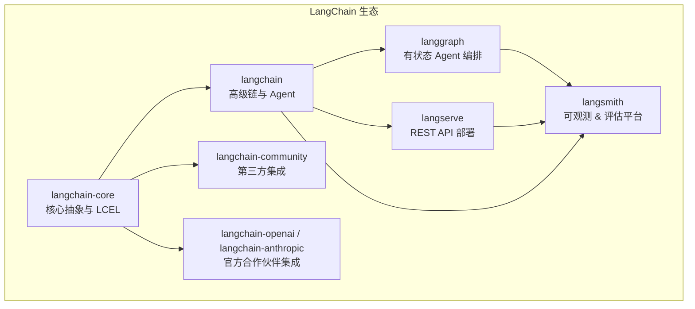
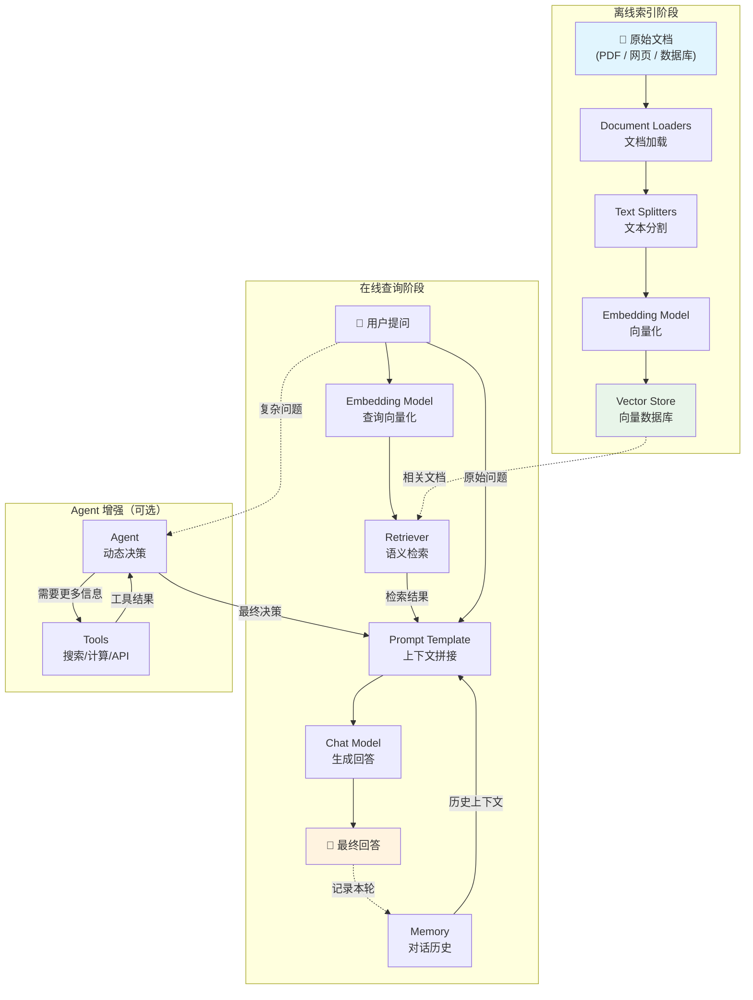

# LangChain 概述与核心架构

## 1 LangChain 是什么

### 1.1 一句话理解

> [!info] 概念解析
> **LangChain** 是一个用于构建**大语言模型（LLM）应用**的开源框架。它把调用模型、管理提示词、检索文档、调用外部工具等常见操作封装成标准化的"零件"，让开发者像搭**乐高积木**一样快速组装端到端的 AI 应用。

用费曼技巧来做一个生活类比——

想象你要开一家自动化餐厅：
- **LLM**（大语言模型）是厨师，能力很强但只会做菜，不会采购、不会端盘子。
- **Prompt** 是菜单/点单，告诉厨师该做什么。
- **Tool** 是各种厨房电器（烤箱、搅拌机），厨师需要借助它们完成更复杂的菜品。
- **Memory** 是厨师的小本本，记录客人说过什么偏好。
- **Retrieval** 是后厨的食谱库，厨师可以随时翻阅。
- **Chain / Agent** 是整条流水线的管理者，把上述环节串起来运转。

LangChain 就是帮你搭建这家餐厅的**施工框架**：它不提供厨师（模型由 OpenAI、Anthropic 等提供），但它提供标准化的厨房布局和管线，让你快速开业。

### 1.2 核心痛点：为什么不直接调 API？

直接调用 LLM API（如 OpenAI 的 `chat.completions.create`）虽然可行，但在实际项目中会遇到以下问题：

| 痛点 | 说明 |
|------|------|
| **提示词管理混乱** | 硬编码在业务逻辑里，难以复用和版本管理 |
| **上下文窗口有限** | 长对话或大文档无法一次性塞进 prompt |
| **无法调用外部工具** | 原生 API 不能搜索网页、查数据库、执行代码 |
| **缺少对话记忆** | 每次请求独立，无法自动维护多轮对话状态 |
| **切换模型成本高** | 从 OpenAI 换到 Anthropic 需要重写大量代码 |
| **可观测性差** | 链路长了之后难以调试和监控 |

> [!tip] 学习提示
> LangChain 的价值不在于替代 LLM API，而在于提供**标准化的抽象层**，让你在不同模型、不同工具、不同数据源之间自由切换，同时保持代码结构清晰。

### 1.3 框架发展历程

LangChain 由 **Harrison Chase** 于 2022 年 10 月开源，短短两年内经历了快速迭代：

```
2022.10  Harrison Chase 发布 LangChain 首个版本（Python）
2023.01  获得 Benchmark 种子轮融资
2023.05  TypeScript 版本（LangChain.js）正式发布
2023.07  LangSmith 可观测平台上线
2023.10  LCEL（LangChain Expression Language）成为推荐编排方式
2024.01  LangGraph 发布，支持有状态多步骤 Agent
2024.06  langchain-core 与 langchain 解耦，生态模块化重构
2025.02  LangGraph Platform 发布，支持生产级 Agent 部署
```

### 1.4 LangChain 生态全景图

LangChain 已经从一个单体库演变为一个**模块化生态**，各组件各司其职：



| 组件                      | 定位         | 说明                                                                   |
| ----------------------- | ---------- | -------------------------------------------------------------------- |
| **langchain-core**      | 基础抽象层      | 定义 `Runnable`、`BaseChatModel`、`BaseRetriever` 等核心接口，以及 LCEL[^1] 管道语法 |
| **langchain**           | 高级组合层      | 提供开箱即用的 Chain、Agent、Retrieval 策略等                                    |
| **langchain-community** | 社区集成       | 数百个第三方连接器（向量数据库、文档加载器、工具等）                                           |
| **Partner Packages**    | 官方合作伙伴包    | 如 `langchain-openai`、`langchain-anthropic`，由 LangChain 团队与模型厂商联合维护   |
| **LangGraph**           | Agent 编排引擎 | 用**有向图**定义 Agent 的状态转移与分支逻辑，支持循环、人机协作等复杂流程 → [[02_LangChain底层原理]]    |
| **LangServe**           | 部署层        | 一键将 Chain / Agent 发布为 REST API（基于 FastAPI）                           |
| **LangSmith**           | 可观测平台      | 追踪调用链路、评估模型输出、管理数据集 → [[03_开发环境与LangSmith监控]]                        |

> [!warning] 易错避坑
> 很多教程仍然使用 `from langchain.chat_models import ChatOpenAI` 这种旧写法。自 2024 年模块化重构后，正确写法是 `from langchain_openai import ChatOpenAI`。旧路径虽然暂时兼容，但会触发废弃警告，新项目务必使用新路径。

---

## 2 六大核心模块

LangChain 的核心能力可以拆解为六大模块。下面逐一深入讲解。

### 2.1 Models（模型）

#### 概念说明

**Models** 模块是 LangChain 与底层 LLM 交互的桥梁。LangChain 将模型抽象为三类：

| 类型 | 接口 | 输入 → 输出 | 典型实现 |
|------|------|-------------|----------|
| **Chat Models** | `BaseChatModel` | `List[Message]` → `AIMessage` | `ChatOpenAI`, `ChatAnthropic` |
| **LLMs**（旧式） | `BaseLLM` | `str` → `str` | `OpenAI`（补全模式） |
| **Embedding Models** | `Embeddings` | `List[str]` → `List[List[float]]` | `OpenAIEmbeddings`, `HuggingFaceEmbeddings` |

> [!info] 概念解析
> **Chat Models** 是当前主流，它以"消息列表"作为输入，支持 System / Human / AI 等角色区分。旧式 **LLMs** 接受纯文本输入，已逐渐被 Chat Models 取代。**Embedding Models** 专门用于将文本转为向量，服务于语义检索场景。

#### 生活类比

- **Chat Model** = 能看懂对话上下文的客服代表
- **LLM** = 只看你最后一句话的自动回复机
- **Embedding Model** = 图书管理员，把每本书贴上分类标签（向量），方便后续查找

#### 代码示例

```python
import micropip
await micropip.install("langchain_openai")
await micropip.install("langchain_core")

from langchain_openai import ChatOpenAI, OpenAIEmbeddings
from langchain_core.messages import HumanMessage, SystemMessage

# --- Chat Model ---
chat_model = ChatOpenAI(model="gpt-4o", temperature=0.7)

messages = [
    SystemMessage(content="你是一位 Python 专家。"),
    HumanMessage(content="请解释什么是装饰器。"),
]
response = chat_model.invoke(messages)
print(response.content)

# --- Embedding Model ---
embeddings = OpenAIEmbeddings(model="text-embedding-3-small")
vectors = embeddings.embed_documents(["LangChain 是什么", "如何使用向量数据库"])
print(f"向量维度: {len(vectors[0])}")  # 1536
```

#### 工业应用场景

- **Chat Models**：智能客服、代码助手、内容生成
- **Embedding Models**：文档语义搜索、推荐系统、重复内容检测

---

### 2.2 Prompts（提示词）

#### 概念说明

**Prompts** 模块负责构建和管理发送给模型的输入。LangChain 提供多种模板类，将提示词从业务逻辑中解耦出来，支持变量注入、格式化和复用。

核心模板类型：

- **PromptTemplate**：简单字符串模板，适用于旧式 LLM
- **ChatPromptTemplate**：消息列表模板，适用于 Chat Model（推荐）
- **FewShotPromptTemplate**：内含示例的模板，用于 Few-Shot Learning[^2]

#### 生活类比

提示词模板就像**填空题试卷**——结构已经定好，你只需要把关键变量填进去。比如："请将以下 {source_lang} 文本翻译为 {target_lang}：{text}"。

#### 代码示例

```python
import subprocess
subprocess.check_call(["pip", "install", "langchain", "langchain-openai"])

from langchain_core.prompts import ChatPromptTemplate, FewShotChatMessagePromptTemplate

# --- 基础 ChatPromptTemplate ---
prompt = ChatPromptTemplate.from_messages([
    ("system", "你是一位专业的{role}。"),
    ("human", "{question}"),
])

# 渲染结果
formatted = prompt.format_messages(role="数据分析师", question="什么是 A/B 测试？")
print(formatted)

# --- Few-Shot 示例模板 ---
examples = [
    {"input": "高兴", "output": "happy"},
    {"input": "悲伤", "output": "sad"},
]

example_prompt = ChatPromptTemplate.from_messages([
    ("human", "{input}"),
    ("ai", "{output}"),
])

few_shot_prompt = FewShotChatMessagePromptTemplate(
    example_prompt=example_prompt,
    examples=examples,
)

final_prompt = ChatPromptTemplate.from_messages([
    ("system", "你是一位中英翻译专家，请将中文词汇翻译为英文。"),
    few_shot_prompt,
    ("human", "{input}"),
])

print(final_prompt.format_messages(input="愤怒"))
```

#### 工业应用场景

- **ChatPromptTemplate**：绝大多数 LLM 应用的标准模板方式
- **FewShotPromptTemplate**：分类任务、格式化输出、风格模仿
- **提示词版本管理**：结合 LangSmith Hub 进行团队协作和 A/B 测试

> [!tip] 学习提示
> LCEL 管道中，Prompt 通常是链的第一个环节：`prompt | model | output_parser`。掌握好模板设计是写好 LangChain 应用的第一步。

---

### 2.3 Chains（链）

#### 概念说明

**Chain** 是 LangChain 的核心编排单元，负责将多个步骤串联成一条处理流水线。

LangChain 的 Chain 经历了两代范式：

| 代际           | 代表                                     | 特点                                          |
| ------------ | -------------------------------------- | ------------------------------------------- |
| **旧式 Chain** | `LLMChain`, `SequentialChain`          | 基于类继承，灵活性有限，已被标记为 Legacy                    |
| **LCEL（推荐）** | `RunnableSequence`, `RunnableParallel` | 基于 `Runnable` 协议[^3]，用 \| 管道符组合，支持流式、异步、批处理 |

> [!info] 概念解析
> **LCEL（LangChain Expression Language）** 是 LangChain 当前推荐的编排方式。它的核心思想是：每个组件都实现 `Runnable` 接口（包含 `invoke(单次同步调用)` / `stream(流式同步输出)` / `batch(批量同步调用)` / `ainvoke(流式异步调用)` 等方法），通过 `|` 运算符像 Unix 管道一样串联。

#### 生活类比

Chain 就像工厂的**流水线**：原材料（用户输入）依次经过多个工位（Prompt → Model → OutputParser），最终产出成品（结构化结果）。LCEL 的 `|` 管道符就像传送带，把上一个工位的产出自动送到下一个工位。

#### 代码示例

```python
import subprocess
subprocess.check_call(["pip", "install", "langchain", "langchain-openai"])

from langchain_openai import ChatOpenAI
from langchain_core.prompts import ChatPromptTemplate
from langchain_core.output_parsers import StrOutputParser

# --- LCEL 管道（推荐写法） ---
prompt = ChatPromptTemplate.from_messages([
    ("system", "你是一位技术博客作者。"),
    ("human", "请用 200 字概括：{topic}"),
])

model = ChatOpenAI(model="gpt-4o", temperature=0.5)
output_parser = StrOutputParser()

# 用 | 管道符组合
chain = prompt | model | output_parser

# 调用
result = chain.invoke({"topic": "Transformer 架构的核心原理"})
print(result)

# 流式输出
for chunk in chain.stream({"topic": "什么是注意力机制"}):
    print(chunk, end="", flush=True)
```

```python
import subprocess
subprocess.check_call(["pip", "install", "langchain", "langchain-openai"])

from langchain_core.runnables import RunnableParallel, RunnablePassthrough

# --- 并行链 ---
parallel_chain = RunnableParallel(
    summary=prompt | model | output_parser,
    original_input=RunnablePassthrough(),
)

result = parallel_chain.invoke({"topic": "微服务架构"})
print(result["summary"])
print(result["original_input"])
```

#### 工业应用场景

- **翻译流水线**：输入检测 → 翻译 → 质量评估 → 输出
- **RAG 检索增强**：查询改写 → 文档检索 → 上下文拼接 → 生成回答
- **多路并行**：同时调用多个模型，取最佳结果

> [!warning] 易错避坑
> 旧式 `LLMChain` 在 LangChain 0.2+ 中已被标记为 **Legacy**。新项目请直接使用 LCEL 管道语法，不要再使用 `from langchain.chains import LLMChain`。

---

### 2.4 Agents（代理）

#### 概念说明

**Agent** 是 LangChain 中最强大也最复杂的模块。与 Chain 的"固定流水线"不同，Agent 能**动态决策**下一步做什么——它让 LLM 充当"大脑"，根据当前状态选择调用哪些工具，直到任务完成。

两种主流 Agent 范式：

| 范式                     | 原理                                                    | 适用场景              |
| ---------------------- | ----------------------------------------------------- | ----------------- |
| **ReAct**[^4]          | 交替执行 **Re**asoning（推理）和 **Act**ion（行动），每一步先思考再行动      | 通用任务、调试友好         |
| **Tool Calling Agent** | 利用模型原生的 Function Calling / Tool Use 能力，由模型直接输出结构化工具调用 | 需要并行调用多个工具、生产环境推荐 |

> [!info] 概念解析
> Agent 的核心循环是：**观察（Observation）→ 思考（Thought）→ 行动（Action）→ 观察结果 → 再思考...**，如此往复直到得出最终答案。LangGraph 将这一循环建模为**有向图**，提供更精细的状态控制。

#### 生活类比

Agent 就像一位**项目经理**：接到需求后，他不会按固定脚本执行，而是会思考"我需要先查什么资料？要不要请设计师帮忙？测试通过了吗？"，动态调配资源完成任务。

#### 代码示例

```python
import subprocess
subprocess.check_call(["pip", "install", "langchain", "langchain-openai", "langchain-community"])

from langchain_openai import ChatOpenAI
from langchain_core.tools import tool
from langchain.agents import create_tool_calling_agent, AgentExecutor
from langchain_core.prompts import ChatPromptTemplate

# 定义工具
@tool
def search_weather(city: str) -> str:
    """查询指定城市的天气信息。"""
    # 模拟天气查询
    weather_data = {"北京": "晴，25°C", "上海": "多云，22°C", "深圳": "阵雨，28°C"}
    return weather_data.get(city, f"未找到 {city} 的天气信息")

@tool
def calculate(expression: str) -> str:
    """计算数学表达式的结果。"""
    try:
        return str(eval(expression))
    except Exception as e:
        return f"计算错误: {e}"

# 创建 Agent
llm = ChatOpenAI(model="gpt-4o", temperature=0)
tools = [search_weather, calculate]

prompt = ChatPromptTemplate.from_messages([
    ("system", "你是一个有用的助手，可以查询天气和进行数学计算。"),
    ("human", "{input}"),
    ("placeholder", "{agent_scratchpad}"),
])

agent = create_tool_calling_agent(llm, tools, prompt)
agent_executor = AgentExecutor(agent=agent, tools=tools, verbose=True)

# 运行
result = agent_executor.invoke({"input": "北京今天天气怎么样？另外帮我算一下 1024 * 768"})
print(result["output"])
```

#### 工业应用场景

- **智能客服**：根据用户问题自动选择查询订单、转接人工、查 FAQ 等操作
- **数据分析助手**：自动编写 SQL → 执行查询 → 可视化结果
- **自动化运维**：监控告警 → 诊断问题 → 执行修复脚本

> [!tip] 学习提示
> 对于复杂的 Agent 应用（多步骤、需要人机协作、有条件分支），推荐使用 **LangGraph** 而非传统 AgentExecutor。LangGraph 以有向图的形式定义 Agent 逻辑，支持持久化状态、断点恢复等生产级特性。→ [[04_Agent与工具使用]]

---

### 2.5 Memory（记忆）

#### 概念说明

**Memory** 模块让 LLM 应用具备"记住过去对话"的能力。由于 LLM 本身是无状态的（每次调用互相独立），Memory 负责在多轮对话间维护和注入历史上下文。

常用 Memory 类型：

| 类型 | 策略 | 优点 | 缺点 |
|------|------|------|------|
| **ConversationBufferMemory** | 完整保存所有对话历史 | 信息无损 | Token 消耗随对话增长线性增加 |
| **ConversationBufferWindowMemory** | 只保留最近 K 轮对话 | 控制 Token 用量 | 早期信息丢失 |
| **ConversationSummaryMemory** | 用 LLM 对历史进行摘要压缩 | 长对话也能保持低 Token | 摘要过程本身消耗 Token，可能丢失细节 |
| **ConversationSummaryBufferMemory** | 近期保留原文，早期做摘要 | 兼顾精确度与效率 | 实现复杂度较高 |

> [!info] 概念解析
> 在 LangChain 的新架构中，Memory 的推荐实现方式已从旧式的 `ConversationBufferMemory` 类转向在 **LangGraph** 中使用 **State** 来管理对话历史。旧式 Memory 类仍可使用，但新项目建议采用 LangGraph 的状态管理机制。

#### 生活类比

- **BufferMemory** = 全程录音的录音笔，一字不漏但磁带很快用完
- **WindowMemory** = 只记最近几页的便签本
- **SummaryMemory** = 会议纪要，把冗长的讨论浓缩成要点

#### 代码示例

```python
import subprocess
subprocess.check_call(["pip", "install", "langchain", "langchain-openai"])

from langchain_openai import ChatOpenAI
from langchain_core.prompts import ChatPromptTemplate, MessagesPlaceholder
from langchain_core.chat_history import InMemoryChatMessageHistory
from langchain_core.runnables.history import RunnableWithMessageHistory

# 基于 RunnableWithMessageHistory 的推荐方式
llm = ChatOpenAI(model="gpt-4o", temperature=0.7)

prompt = ChatPromptTemplate.from_messages([
    ("system", "你是一个友好的助手。"),
    MessagesPlaceholder(variable_name="history"),
    ("human", "{input}"),
])

chain = prompt | llm

# 存储会话历史（按 session_id 隔离）
store = {}

def get_session_history(session_id: str):
    if session_id not in store:
        store[session_id] = InMemoryChatMessageHistory()
    return store[session_id]

chain_with_history = RunnableWithMessageHistory(
    chain,
    get_session_history,
    input_messages_key="input",
    history_messages_key="history",
)

# 多轮对话
config = {"configurable": {"session_id": "user_123"}}

response1 = chain_with_history.invoke({"input": "我叫小明"}, config=config)
print(response1.content)

response2 = chain_with_history.invoke({"input": "我叫什么名字？"}, config=config)
print(response2.content)  # 模型会记住"小明"
```

#### 工业应用场景

- **多轮客服对话**：记住用户之前的问题和偏好
- **个性化助手**：长期记忆用户习惯
- **教学辅导系统**：跟踪学生学习进度

> [!warning] 易错避坑
> 旧式 `ConversationBufferMemory` 等类在 LangChain 0.3+ 中已被标记为废弃（deprecated）。新项目请使用 `RunnableWithMessageHistory` 或 LangGraph 的状态管理来实现对话记忆。不要再写 `memory = ConversationBufferMemory()` 这种代码。

---

### 2.6 Retrieval（检索）

#### 概念说明

**Retrieval** 模块是构建 **RAG（Retrieval-Augmented Generation）**[^5] 应用的核心。它解决了一个根本问题：LLM 的训练数据有截止日期，也不包含你的私有数据。通过检索，你可以在生成回答前先从外部知识库中找到相关信息，注入到 Prompt 中，让模型"带着参考资料回答问题"。

RAG 的标准流水线包含五个环节：

```
文档加载 → 文本分割 → 向量化 → 存入向量数据库 → 检索
(Loaders)   (Splitters)  (Embeddings) (Vector Stores) (Retrievers)
```

各环节详解：

#### 1) Document Loaders（文档加载器）

从各种数据源加载原始文档：PDF、网页、数据库、Notion、GitHub 等。

```python
import subprocess
subprocess.check_call(["pip", "install", "langchain", "langchain-community"])

from langchain_community.document_loaders import (
    PyPDFLoader,
    WebBaseLoader,
    TextLoader,
)

# 加载 PDF
pdf_loader = PyPDFLoader("knowledge_base.pdf")
pdf_docs = pdf_loader.load()

# 加载网页
web_loader = WebBaseLoader("https://python.langchain.com/docs/introduction/")
web_docs = web_loader.load()

# 每个 Document 包含 page_content（文本）和 metadata（来源、页码等）
print(pdf_docs[0].page_content[:200])
print(pdf_docs[0].metadata)
```

#### 2) Text Splitters（文本分割器）

将长文档切分为适合模型上下文窗口的小块（chunks）。

```python
import subprocess
subprocess.check_call(["pip", "install", "langchain"])

from langchain_text_splitters import RecursiveCharacterTextSplitter

splitter = RecursiveCharacterTextSplitter(
    chunk_size=500,        # 每块最大字符数
    chunk_overlap=50,      # 相邻块重叠字符数，防止语义被截断
    separators=["\n\n", "\n", "。", "，", " "],  # 中文友好的分隔符
)

chunks = splitter.split_documents(pdf_docs)
print(f"原始文档数: {len(pdf_docs)}, 分割后: {len(chunks)}")
```

> [!tip] 学习提示
> `chunk_size` 和 `chunk_overlap` 的选择直接影响检索质量。太大则噪声多，太小则语义不完整。通常 500-1000 字符是一个好的起点，需根据具体场景调优。

#### 3) Embeddings（向量化）

将文本块转化为高维向量，使得语义相似的文本在向量空间中距离相近。

```python
import subprocess
subprocess.check_call(["pip", "install", "langchain-openai"])

from langchain_openai import OpenAIEmbeddings

embeddings = OpenAIEmbeddings(model="text-embedding-3-small")

# 单条文本向量化
vector = embeddings.embed_query("什么是 LangChain？")
print(f"维度: {len(vector)}")  # 1536
```

#### 4) Vector Stores（向量数据库）

存储向量并提供高效的近似最近邻（ANN）[^6] 搜索。

```python
import subprocess
subprocess.check_call(["pip", "install", "langchain-openai", "langchain-community", "faiss-cpu"])

from langchain_community.vectorstores import FAISS
from langchain_openai import OpenAIEmbeddings

embeddings = OpenAIEmbeddings(model="text-embedding-3-small")

# 从文档块创建向量数据库
vectorstore = FAISS.from_documents(chunks, embeddings)

# 相似度搜索
results = vectorstore.similarity_search("LangChain 的核心模块有哪些？", k=3)
for doc in results:
    print(doc.page_content[:100])
    print("---")
```

常见向量数据库对比：

| 向量数据库 | 特点 | 适用场景 |
|-----------|------|----------|
| **FAISS** | Meta 开源，纯本地，速度极快 | 原型开发、中小规模 |
| **Chroma** | 轻量嵌入式，API 简洁 | 本地开发、教学 |
| **Pinecone** | 全托管云服务，开箱即用 | 生产环境、免运维 |
| **Milvus** | 分布式架构，支持十亿级向量 | 大规模生产 |
| **Weaviate** | 支持混合搜索（向量 + 关键词） | 需要精确匹配的场景 |

#### 5) Retrievers（检索器）

Retriever 是向量数据库之上的抽象层，统一了不同检索后端的接口。

```python
# 从 vectorstore 获取 retriever
retriever = vectorstore.as_retriever(
    search_type="similarity",  # 也可用 "mmr"（最大边际相关性）
    search_kwargs={"k": 4},
)

# 检索相关文档
docs = retriever.invoke("LangChain 支持哪些向量数据库？")
```

#### 生活类比

整个 Retrieval 流水线就像**图书馆的运作流程**：
1. **Document Loaders** = 采购员，从各个出版社搬来书籍
2. **Text Splitters** = 编目员，把厚书拆成一章一章
3. **Embeddings** = 给每章贴上"语义指纹"标签
4. **Vector Store** = 智能书架，按语义相似度摆放
5. **Retriever** = 图书管理员，你一提问他就知道该去哪个书架找

#### 工业应用场景

- **企业知识库问答**：将内部文档向量化，员工用自然语言提问
- **智能法律助手**：检索法条、案例，辅助律师分析
- **技术文档搜索**：从 API 文档中精准定位用户需要的信息
- **客服知识库**：自动检索 FAQ 并生成个性化回答

---

## 3 模块协作关系

### 3.1 RAG 应用全链路

以下 Mermaid 图展示了六大模块如何协作构成一个完整的 **RAG 问答应用**：



### 3.2 LCEL 完整 RAG 链示例

将上述流程用代码实现：

```python
import subprocess
subprocess.check_call(["pip", "install", "langchain", "langchain-openai", "langchain-community", "faiss-cpu"])

from langchain_openai import ChatOpenAI, OpenAIEmbeddings
from langchain_community.vectorstores import FAISS
from langchain_core.prompts import ChatPromptTemplate
from langchain_core.output_parsers import StrOutputParser
from langchain_core.runnables import RunnablePassthrough

# 1. 准备向量数据库（假设已有文档 chunks）
embeddings = OpenAIEmbeddings(model="text-embedding-3-small")
vectorstore = FAISS.from_texts(
    texts=[
        "LangChain 是一个用于构建 LLM 应用的开源框架。",
        "LangChain 的六大核心模块包括 Models、Prompts、Chains、Agents、Memory、Retrieval。",
        "LCEL 是 LangChain Expression Language 的缩写，是推荐的链式编排方式。",
        "LangGraph 用于构建有状态的多步骤 Agent。",
        "LangSmith 是 LangChain 的可观测性和评估平台。",
    ],
    embedding=embeddings,
)
retriever = vectorstore.as_retriever(search_kwargs={"k": 2})

# 2. 构建 Prompt
prompt = ChatPromptTemplate.from_messages([
    ("system", "基于以下参考资料回答用户问题。如果资料中没有答案，请如实说明。\n\n参考资料：\n{context}"),
    ("human", "{question}"),
])

# 3. 构建 LCEL 链
llm = ChatOpenAI(model="gpt-4o", temperature=0)

def format_docs(docs):
    return "\n\n".join(doc.page_content for doc in docs)

rag_chain = (
    {
        "context": retriever | format_docs,
        "question": RunnablePassthrough(),
    }
    | prompt
    | llm
    | StrOutputParser()
)

# 4. 执行
answer = rag_chain.invoke("LangChain 有哪些核心模块？")
print(answer)
```

> [!tip] 学习提示
> 上面这条 LCEL 链可以用一句话概括：**检索相关文档 → 拼接到 Prompt → 调用模型 → 解析输出**。这就是 RAG 的核心模式。理解了这条链，你就掌握了 LangChain 80% 的实用场景。→ [[05_RAG检索增强生成]]

---

## 4 总结与学习路径

### 4.1 核心要点回顾

| 模块 | 核心职责 | 一句话总结 |
|------|----------|-----------|
| **Models** | 对接 LLM | 统一不同模型的调用接口 |
| **Prompts** | 管理输入 | 将提示词模板化，支持变量注入和复用 |
| **Chains** | 编排流程 | 用 LCEL 管道串联多个步骤 |
| **Agents** | 动态决策 | 让 LLM 自主选择工具和执行路径 |
| **Memory** | 维护状态 | 在多轮对话间保持上下文连贯 |
| **Retrieval** | 外部知识 | 从文档库中检索相关信息注入 Prompt |

### 4.2 推荐学习路径

>[!tips] 
>1. 搭建开发环境         → [[03_开发环境与LangSmith监控]]
>2. 掌握 LCEL 管道       → [[02_LangChain底层原理]]
>3. 构建第一个 RAG 应用   → [[05_RAG检索增强生成]]
>4. 学习 Agent 与工具调用  → [[04_Agent与工具使用]]
>5. 使用 LangGraph 构建
 >  复杂 Agent            → [[06_LangGraph入门]]
>6. 部署与监控            → [[07_LangServe部署与生产实践]]

---

## 脚注

[^1]: **LCEL（LangChain Expression Language）**：LangChain 推出的声明式编排语法，基于 `Runnable` 协议，使用 `|` 管道符串联组件，支持同步/异步/流式/批处理四种调用模式。

[^2]: **Few-Shot Learning（少样本学习）**：在 Prompt 中提供少量示例，引导模型按照期望的格式和风格进行输出，无需微调模型参数。

[^3]: **Runnable 协议**：LangChain 的核心接口协议，所有组件（Prompt、Model、Parser、Retriever 等）都实现该接口，提供 `invoke()`、`stream()`、`batch()`、`ainvoke()` 等统一方法。

[^4]: **ReAct（Reasoning + Acting）**：由 Yao et al. 于 2022 年提出的 Agent 范式，交替进行推理（生成思考过程）和行动（调用工具），每一步的观察结果作为下一步推理的输入。

[^5]: **RAG（Retrieval-Augmented Generation，检索增强生成）**：在生成回答之前，先从外部知识库中检索相关文档，将其作为上下文注入 Prompt，从而让模型基于最新和专有数据生成准确回答。

[^6]: **ANN（Approximate Nearest Neighbor，近似最近邻）**：一种高效的向量搜索算法，牺牲少量精度换取数量级的速度提升，是向量数据库的核心技术。

