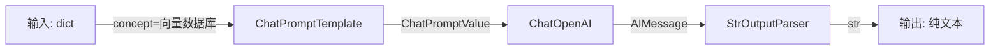
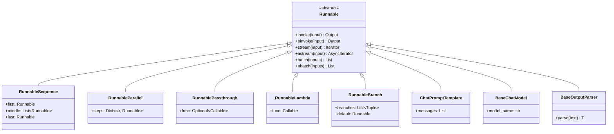
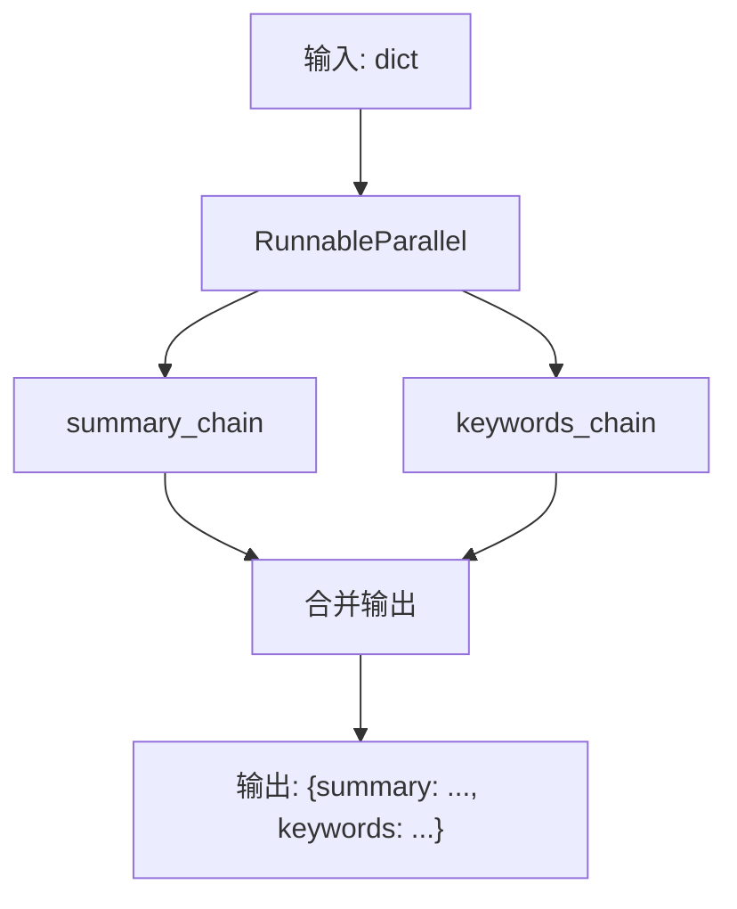
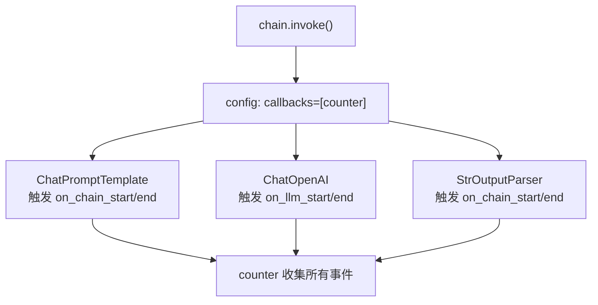
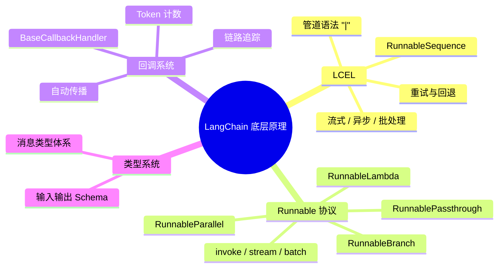

# LangChain 底层原理

> 本篇是 [[01_LangChain概述与核心架构]] 的延续，将深入 LangChain 框架的三大基石：**LCEL 表达式语言**、**Runnable 协议**与**回调系统**。掌握这些底层机制后，你将具备调试复杂链、自定义组件、以及进行性能优化的能力。

---

## 1 为什么需要理解底层原理

> [!tip] 类比：会开车 vs 懂发动机
> 你可以只学 API 调用来"开车上路"，但当链路报错、Token 消耗异常、流式输出卡顿时，只有**理解底层管道和协议**的人才能快速定位问题。就像赛车手不只会踩油门，还要理解引擎的工作方式。

理解底层原理带来的具体收益：

| 场景 | 只会用 API | 理解底层原理 |
|---|---|---|
| **调试** | 看到报错一头雾水 | 能沿着 Runnable 链路逐步定位 |
| **性能优化** | 不知道瓶颈在哪 | 能用回调系统精确测量每一步耗时与 Token 消耗 |
| **自定义扩展** | 只能用现成组件 | 能实现自定义 Runnable，无缝接入管道 |
| **流式输出** | 不理解为什么某些链不支持流式 | 理解 `stream` 协议的传播机制 |
| **异步并发** | 不敢用 `ainvoke` | 理解同步/异步双轨设计，放心使用高并发模式 |

---

## 2 LCEL（LangChain Expression Language）

### 2.1 什么是 LCEL

**LCEL（LangChain Expression Language）** 是 LangChain 0.3+ 中构建链（Chain）的声明式语法。它的核心理念借鉴了 **Unix 管道**：

> [!info] 类比：Unix 管道
> 在 Shell 中你可以写 `cat file.txt | grep "error" | wc -l`，数据从左到右依次流经每个命令。LCEL 做的事情完全一样——用 Python 的 `|` 运算符把多个组件串联起来，上一个组件的输出自动成为下一个组件的输入。

```
Prompt → Model → OutputParser
  ↓        ↓         ↓
构造提示词  调用LLM   解析输出
```

### 2.2 LCEL 的设计动机

在 LangChain 早期版本（0.1 之前），构建链需要继承 `Chain` 基类并重写大量方法。这带来了几个痛点：

1. **代码冗长**：自定义一个简单链也要写几十行样板代码
2. **流式支持困难**：每个 Chain 子类需要单独实现流式逻辑
3. **异步支持不统一**：有些 Chain 支持异步，有些不支持
4. **组合性差**：把两个 Chain 串联需要手动处理输入输出映射

LCEL 通过**统一的 Runnable 协议**解决了这些问题——任何实现了 Runnable 接口的组件都自动获得 `invoke`、`stream`、`batch`、`ainvoke`、`astream`、`abatch` 等全套能力。

> [!warning] 版本提示
> LangChain 0.3+ 已经完全拥抱 LCEL，旧的 `LLMChain`、`SequentialChain` 等类已被标记为 **Legacy**。新项目应始终使用 LCEL 构建链。

### 2.3 管道操作符 `|` 的工作原理

Python 中 `|` 运算符的行为由 `__or__` 和 `__ror__` 魔术方法定义。LangChain 在 `Runnable` 基类中重写了这两个方法：

```python
# 伪代码：Runnable 中 | 的实现原理
class Runnable:
    def __or__(self, other):
        return RunnableSequence(self, other)

    def __ror__(self, other):
        return RunnableSequence(coerce_to_runnable(other), self)
```

当你写 `prompt | model | parser` 时，实际发生的是：

1. `prompt | model` → 返回 `RunnableSequence([prompt, model])`
2. `RunnableSequence([prompt, model]) | parser` → 返回 `RunnableSequence([prompt, model, parser])`

最终得到一个包含三个步骤的 **RunnableSequence** 对象。调用它的 `invoke` 方法时，数据会依次流经每个步骤。

### 2.4 完整示例：构建一个管道

```python
# pip install langchain langchain-openai

from langchain_core.prompts import ChatPromptTemplate
from langchain_core.output_parsers import StrOutputParser
from langchain_openai import ChatOpenAI

# 1. 定义提示模板
prompt = ChatPromptTemplate.from_messages([
    ("system", "你是一位专业的技术写作助手。"),
    ("human", "请用一段话解释什么是 {concept}。")
])

# 2. 定义模型
model = ChatOpenAI(model="gpt-4o-mini", temperature=0.3)

# 3. 定义输出解析器
parser = StrOutputParser()

# 4. 用 LCEL 管道串联
chain = prompt | model | parser

# 5. 调用
result = chain.invoke({"concept": "向量数据库"})
print(result)
```

这段代码的数据流：



### 2.5 LCEL 的核心优势

#### 流式输出（Streaming）

```python
# 流式输出 —— 逐 token 打印
for chunk in chain.stream({"concept": "向量数据库"}):
    print(chunk, end="", flush=True)
```

LCEL 链中的每个 Runnable 都实现了 `stream` 方法。当你调用链的 `stream` 时，数据会以**流式管道**的方式传播：模型每产出一个 token，`StrOutputParser` 就立即解析并 yield 出来，无需等待完整响应。

#### 异步支持（Async）

```python
import asyncio

async def main():
    result = await chain.ainvoke({"concept": "向量数据库"})
    print(result)

asyncio.run(main())
```

每个 Runnable 都同时提供同步和异步接口。在 Web 服务（如 FastAPI）中使用异步接口可以显著提升并发性能。

#### 批处理（Batch）

```python
# 批量调用 —— 自动并行
results = chain.batch([
    {"concept": "向量数据库"},
    {"concept": "注意力机制"},
    {"concept": "RAG"},
], config={"max_concurrency": 3})
```

`batch` 方法接收一个输入列表，内部会自动使用线程池（同步）或 `asyncio.gather`（异步）并行执行，`max_concurrency` 控制最大并发数。

#### 重试与回退（Retry & Fallback）

```python
from langchain_openai import ChatOpenAI

# 主模型
primary = ChatOpenAI(model="gpt-4o")

# 回退模型
fallback = ChatOpenAI(model="gpt-4o-mini")

# 当 primary 失败时自动切换到 fallback
robust_model = primary.with_fallbacks([fallback])

# 带重试的链
chain_with_retry = (prompt | robust_model | parser).with_retry(
    stop_after_attempt=3
)
```

> [!tip] 实际场景
> 在生产环境中，模型 API 可能因为限流、超时而失败。`with_fallbacks` 和 `with_retry` 让你不用写一行 try-except 就能实现高可用。

---

## 3 Runnable 协议

**Runnable 协议**是 LCEL 的基石。LangChain 中几乎所有组件——Prompt、Model、Parser、Retriever——都实现了这个协议。

### 3.1 核心方法一览

| 方法 | 说明 | 输入 | 输出 |
|---|---|---|---|
| `invoke(input)` | 同步调用，处理单个输入 | `Input` | `Output` |
| `ainvoke(input)` | 异步调用，处理单个输入 | `Input` | `Output` |
| `stream(input)` | 同步流式输出 | `Input` | `Iterator[Output]` |
| `astream(input)` | 异步流式输出 | `Input` | `AsyncIterator[Output]` |
| `batch(inputs)` | 同步批量调用 | `List[Input]` | `List[Output]` |
| `abatch(inputs)` | 异步批量调用 | `List[Input]` | `List[Output]` |
| `astream_events(input)` | 异步流式事件（包含中间步骤） | `Input` | `AsyncIterator[StreamEvent]` |

> [!info] 同步 / 异步双轨设计
> 每个同步方法都有对应的异步版本（前缀 `a`）。如果子类只实现了同步版本，异步版本会自动通过线程池代理调用；反之亦然。这保证了**所有 Runnable 都天然支持异步**。

### 3.2 Runnable 继承体系



### 3.3 RunnablePassthrough —— 数据透传

**RunnablePassthrough** 将输入原封不动地传递给下一步，常用于在 `RunnableParallel` 中保留原始输入。

```python
# pip install langchain langchain-openai

from langchain_core.runnables import RunnablePassthrough, RunnableParallel
from langchain_core.prompts import ChatPromptTemplate
from langchain_core.output_parsers import StrOutputParser
from langchain_openai import ChatOpenAI

prompt = ChatPromptTemplate.from_template(
    "根据以下上下文回答问题。\n上下文: {context}\n问题: {question}"
)
model = ChatOpenAI(model="gpt-4o-mini")

# 模拟检索函数
def fake_retriever(input_dict):
    return "LangChain 是一个用于构建 LLM 应用的框架。"

# RunnablePassthrough.assign() 可以在透传的同时附加新字段
chain = (
    RunnablePassthrough.assign(context=lambda x: fake_retriever(x))
    | prompt
    | model
    | StrOutputParser()
)

result = chain.invoke({"question": "什么是 LangChain？"})
print(result)
```

> [!tip] 应用场景
> 在 RAG（检索增强生成）管道中，`RunnablePassthrough` 极为常用——你需要同时把用户问题和检索到的文档传给 Prompt，而 `assign()` 方法可以在透传原始输入的同时注入检索结果。

### 3.4 RunnableParallel —— 并行执行

**RunnableParallel** 接收一个输入，同时传给多个 Runnable 并行执行，最终将各分支的输出合并为一个字典。

```python
# pip install langchain langchain-openai

from langchain_core.runnables import RunnableParallel
from langchain_core.prompts import ChatPromptTemplate
from langchain_core.output_parsers import StrOutputParser
from langchain_openai import ChatOpenAI

model = ChatOpenAI(model="gpt-4o-mini")

# 两个不同的处理分支
summary_chain = (
    ChatPromptTemplate.from_template("用一句话总结: {text}")
    | model
    | StrOutputParser()
)

keywords_chain = (
    ChatPromptTemplate.from_template("提取3个关键词（逗号分隔）: {text}")
    | model
    | StrOutputParser()
)

# 并行执行两个分支
parallel_chain = RunnableParallel(
    summary=summary_chain,
    keywords=keywords_chain
)

result = parallel_chain.invoke({
    "text": "LangChain 是一个用于构建大语言模型应用的开源框架，"
            "提供了模块化的组件和丰富的集成。"
})

print(result)
# 输出: {"summary": "...", "keywords": "..."}
```



### 3.5 RunnableLambda —— 自定义函数包装

**RunnableLambda** 将任意 Python 函数包装成 Runnable，使其可以无缝插入 LCEL 管道。

```python
# pip install langchain

from langchain_core.runnables import RunnableLambda

# 普通 Python 函数
def word_count(text: str) -> dict:
    words = text.split()
    return {"text": text, "word_count": len(words)}

# 包装为 Runnable
word_counter = RunnableLambda(word_count)

# 支持完整的 Runnable 协议
result = word_counter.invoke("LangChain 是一个强大的框架")
print(result)  # {"text": "LangChain 是一个强大的框架", "word_count": 5}

# 也支持批量调用
results = word_counter.batch(["你好世界", "Hello World LangChain"])
print(results)
```

> [!info] 异步函数支持
> `RunnableLambda` 同时接受同步和异步函数。如果你传入 `async def` 定义的协程函数，`ainvoke` 会直接调用它，无需线程池代理。
>
> ```python
> async def async_process(text: str) -> str:
>     # 模拟异步 I/O 操作
>     return text.upper()
>
> async_runnable = RunnableLambda(async_process)
> result = await async_runnable.ainvoke("hello")
> ```

### 3.6 RunnableBranch —— 条件路由

**RunnableBranch** 根据条件将输入路由到不同的处理分支，类似于 `if-elif-else` 逻辑。

```python
# pip install langchain langchain-openai

from langchain_core.runnables import RunnableBranch, RunnableLambda
from langchain_core.prompts import ChatPromptTemplate
from langchain_core.output_parsers import StrOutputParser
from langchain_openai import ChatOpenAI

model = ChatOpenAI(model="gpt-4o-mini")

# 定义不同话题的处理链
tech_chain = (
    ChatPromptTemplate.from_template("你是技术专家。请回答: {question}")
    | model | StrOutputParser()
)

general_chain = (
    ChatPromptTemplate.from_template("你是通用助手。请回答: {question}")
    | model | StrOutputParser()
)

# 话题分类函数
def is_tech_question(input_dict: dict) -> bool:
    tech_keywords = ["代码", "编程", "API", "框架", "数据库", "算法"]
    return any(kw in input_dict["question"] for kw in tech_keywords)

# 构建条件路由
branch = RunnableBranch(
    (is_tech_question, tech_chain),   # 条件为 True 时走技术链
    general_chain                      # 默认走通用链
)

print(branch.invoke({"question": "如何优化数据库查询？"}))
# → 技术专家回答

print(branch.invoke({"question": "今天天气怎么样？"}))
# → 通用助手回答
```

> [!warning] RunnableBranch vs Router
> `RunnableBranch` 适合简单的条件路由。如果你的路由逻辑需要基于 LLM 判断（语义路由），建议使用 LangChain 的 `RouterRunnable` 或自定义一个 LLM 分类器作为路由层。

---

## 4 回调系统（Callbacks）

### 4.1 回调的作用

回调系统是 LangChain 的**可观测性基础设施**。每当 Runnable 执行关键操作时，会触发对应的回调事件，你可以通过注册回调处理器（Callback Handler）来监听这些事件。

常见用途：

- **日志记录**：记录每一步的输入输出
- **性能监控**：测量每个组件的执行耗时
- **Token 计数**：统计 LLM 调用的 Token 消耗和费用
- **链路追踪**：与 [[03_开发环境与LangSmith监控|LangSmith]] 等平台集成
- **自定义 Hook**：在特定事件发生时执行自定义逻辑（如发送通知、写入数据库）

### 4.2 BaseCallbackHandler 的关键方法

所有回调处理器都继承自 `BaseCallbackHandler`，它定义了一组生命周期钩子：

| 方法 | 触发时机 |
|---|---|
| `on_llm_start` | LLM 调用开始 |
| `on_llm_new_token` | LLM 产出新 token（流式时） |
| `on_llm_end` | LLM 调用结束 |
| `on_llm_error` | LLM 调用出错 |
| `on_chain_start` | Chain / Runnable 执行开始 |
| `on_chain_end` | Chain / Runnable 执行结束 |
| `on_chain_error` | Chain / Runnable 执行出错 |
| `on_tool_start` | Tool 调用开始 |
| `on_tool_end` | Tool 调用结束 |
| `on_retriever_start` | Retriever 检索开始 |
| `on_retriever_end` | Retriever 检索结束 |

> [!info] 异步回调
> 如果你的回调处理器需要执行异步操作（如写入异步数据库），可以继承 `AsyncCallbackHandler` 并实现以 `a` 开头的异步版本方法。

### 4.3 内置回调 vs 自定义回调

LangChain 提供了几个开箱即用的回调处理器：

| 内置回调 | 用途 |
|---|---|
| `StdOutCallbackHandler` | 将事件打印到标准输出，适合开发调试 |
| `StreamingStdOutCallbackHandler` | 流式打印 LLM 输出的每个 token |
| `LangChainTracer` | 将链路追踪数据发送到 LangSmith |

```python
# pip install langchain langchain-openai

from langchain_openai import ChatOpenAI
from langchain_core.callbacks import StdOutCallbackHandler

model = ChatOpenAI(model="gpt-4o-mini")

# 方式 1：在 invoke 时传入回调
result = model.invoke(
    "你好",
    config={"callbacks": [StdOutCallbackHandler()]}
)

# 方式 2：在构造时绑定回调
model_with_cb = ChatOpenAI(
    model="gpt-4o-mini",
    callbacks=[StdOutCallbackHandler()]
)
```

### 4.4 实战：自定义 Token 计数回调

下面的示例实现一个自定义回调，用于在每次 LLM 调用后统计 Token 消耗：

```python
# pip install langchain langchain-openai

from langchain_core.callbacks import BaseCallbackHandler
from langchain_core.outputs import LLMResult
from langchain_openai import ChatOpenAI
from typing import Any


class TokenCounterCallback(BaseCallbackHandler):
    """自定义回调：统计 Token 消耗"""

    def __init__(self):
        self.total_prompt_tokens = 0
        self.total_completion_tokens = 0
        self.total_cost = 0.0
        self.call_count = 0

    def on_llm_end(self, response: LLMResult, **kwargs: Any) -> None:
        """LLM 调用结束时触发"""
        self.call_count += 1

        # 从 response 中提取 token 使用信息
        if response.llm_output:
            token_usage = response.llm_output.get("token_usage", {})
            prompt_tokens = token_usage.get("prompt_tokens", 0)
            completion_tokens = token_usage.get("completion_tokens", 0)

            self.total_prompt_tokens += prompt_tokens
            self.total_completion_tokens += completion_tokens

            print(f"\n--- 第 {self.call_count} 次调用 ---")
            print(f"  Prompt tokens:     {prompt_tokens}")
            print(f"  Completion tokens: {completion_tokens}")
            print(f"  Total tokens:      {prompt_tokens + completion_tokens}")

    def report(self) -> str:
        """打印累计统计报告"""
        total = self.total_prompt_tokens + self.total_completion_tokens
        return (
            f"\n===== Token 使用统计 =====\n"
            f"总调用次数:       {self.call_count}\n"
            f"总 Prompt tokens:  {self.total_prompt_tokens}\n"
            f"总 Completion tokens: {self.total_completion_tokens}\n"
            f"总 Token 数:       {total}\n"
        )


# 使用示例
counter = TokenCounterCallback()
model = ChatOpenAI(model="gpt-4o-mini")

# 多次调用
model.invoke("什么是 LCEL？", config={"callbacks": [counter]})
model.invoke("什么是 Runnable？", config={"callbacks": [counter]})

# 打印累计报告
print(counter.report())
```

> [!tip] 生产建议
> 在生产环境中，建议将 Token 计数持久化到数据库或监控平台（如 Prometheus），并结合各模型的计费标准自动计算成本。LangSmith 自身也提供了完善的 Token 追踪功能，详见 [[03_开发环境与LangSmith监控]]。

### 4.5 回调的传播机制

回调在 LCEL 链中是**自动传播**的。当你在链的 `invoke` 调用中传入 `callbacks` 参数时，链内部的每个 Runnable 都会接收到这些回调：

```python
# pip install langchain langchain-openai

from langchain_core.prompts import ChatPromptTemplate
from langchain_core.output_parsers import StrOutputParser
from langchain_openai import ChatOpenAI

chain = (
    ChatPromptTemplate.from_template("解释 {topic}")
    | ChatOpenAI(model="gpt-4o-mini")
    | StrOutputParser()
)

# counter 会收到链中每个步骤的事件
counter = TokenCounterCallback()
chain.invoke({"topic": "Transformer"}, config={"callbacks": [counter]})
```



---

## 5 类型系统与序列化

### 5.1 消息类型体系

LangChain 使用统一的消息类型来表示对话中的不同角色。这些类型定义在 `langchain_core.messages` 中：

| 消息类型 | 说明 | 对应角色 |
|---|---|---|
| `SystemMessage` | 系统指令，设定模型行为 | system |
| `HumanMessage` | 用户输入 | user |
| `AIMessage` | 模型回复 | assistant |
| `ToolMessage` | 工具调用的返回结果 | tool |
| `FunctionMessage` | 函数调用结果（Legacy，建议用 ToolMessage） | function |

```python
# pip install langchain-core

from langchain_core.messages import (
    SystemMessage,
    HumanMessage,
    AIMessage,
    ToolMessage,
)

messages = [
    SystemMessage(content="你是一个有帮助的助手。"),
    HumanMessage(content="北京今天天气怎么样？"),
    AIMessage(
        content="",
        additional_kwargs={
            "tool_calls": [{
                "id": "call_abc123",
                "type": "function",
                "function": {
                    "name": "get_weather",
                    "arguments": '{"city": "北京"}'
                }
            }]
        }
    ),
    ToolMessage(
        content='{"temp": 22, "condition": "晴"}',
        tool_call_id="call_abc123"
    ),
    AIMessage(content="北京今天天气晴朗，气温约 22 度。"),
]
```

> [!info] 消息的可序列化性
> 所有消息类型都继承自 `BaseMessage`，支持 `dict()` / `json()` 序列化，方便持久化到数据库或通过 API 传输。

### 5.2 Runnable 的输入输出类型推断

每个 Runnable 都声明了自己的输入类型（`InputType`）和输出类型（`OutputType`）。当多个 Runnable 通过 `|` 组合成 `RunnableSequence` 时，LangChain 会自动推断整条链的输入输出类型：

```python
# pip install langchain langchain-openai

from langchain_core.prompts import ChatPromptTemplate
from langchain_core.output_parsers import StrOutputParser
from langchain_openai import ChatOpenAI

chain = (
    ChatPromptTemplate.from_template("翻译成英文: {text}")
    | ChatOpenAI(model="gpt-4o-mini")
    | StrOutputParser()
)

# 查看链的输入输出 Schema
print(chain.input_schema.model_json_schema())
# {'properties': {'text': {'title': 'Text', 'type': 'string'}},
#  'required': ['text'], 'title': 'PromptInput', 'type': 'object'}

print(chain.output_schema.model_json_schema())
# {'title': 'StrOutputParserOutput', 'type': 'string'}
```

这种类型推断能力意味着：
- **IDE 可以提供类型提示**：配合 Pydantic 模型，开发体验更好
- **LangServe 可以自动生成 API 文档**：基于 Schema 生成 OpenAPI spec
- **错误可以提前发现**：类型不匹配时在构建阶段就能报错，而不是运行时才崩溃

---

## 6 总结与知识图谱



> [!tip] 下一步
> 理解了底层原理后，下一篇 [[03_开发环境与LangSmith监控]] 将带你搭建完整的开发环境，并使用 LangSmith 对链路进行可视化追踪——把本篇学到的回调系统落地为实际的监控方案。

---

**相关笔记**
- 前置：[[01_LangChain概述与核心架构]]
- 后续：[[03_开发环境与LangSmith监控]]

