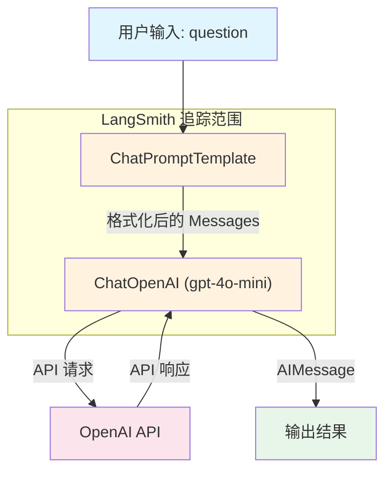

# 开发环境与 LangSmith 监控

> [!info] 本节定位
> 在理解了 [[01_LangChain概述与核心架构]] 的模块全景和 [[02_LangChain底层原理]] 的 LCEL/Runnable 机制之后，本节解决"怎么把环境跑起来"以及"跑起来之后怎么观测"两个实操问题。

---

## 1 开发环境搭建

### 1.1 Python 版本要求

LangChain 从 **0.2** 版本开始要求 **Python >= 3.9**，推荐使用 **3.11 / 3.12**，兼顾兼容性与性能（3.11 带来了约 25% 的 CPython 提速）。

> [!warning] 注意
> Python 3.8 已于 2024-10 到达 EOL，LangChain 不再保证对其的兼容性。如果你的项目仍在使用 3.8，请先升级 Python。

### 1.2 虚拟环境管理

| 工具 | 优点 | 缺点 | 推荐场景 |
|------|------|------|----------|
| `venv` | 标准库自带，零依赖 | 不管理 Python 版本本身 | 轻量脚本、CI/CD |
| `conda` | 可管理 Python 版本 + 非 Python 依赖（如 CUDA） | 体积大，解析慢 | 需要 GPU / 科学计算依赖 |
| `uv` | Rust 实现，速度极快，可替代 pip + venv | 生态较新 | **日常 LangChain 开发首选** |

> [!tip] 推荐：uv
> `uv` 由 Astral（ruff 团队）开发，安装依赖速度比 pip 快 10-100 倍，且内置虚拟环境管理。对于 LangChain 项目，`uv` 是当前最高效的选择。

```bash
# pip install uv  (如果尚未安装)

# 创建虚拟环境
uv venv .venv --python 3.12

# 激活环境（Linux/macOS）
source .venv/bin/activate

# 激活环境（Windows PowerShell）
.venv\Scripts\Activate.ps1
```

### 1.3 LangChain 依赖结构解析

LangChain 从 **v0.2** 开始拆分为多个独立包，按需安装是官方推荐的方式。

```
langchain-core          ← 基础抽象：Runnable、PromptTemplate、OutputParser 等
langchain               ← 编排层：链（Chain）、Agent 框架
langchain-openai        ← OpenAI / Azure OpenAI 集成
langchain-anthropic     ← Anthropic Claude 集成
langchain-community     ← 社区维护的第三方集成（向量数据库、工具等）
langgraph               ← 基于图的 Agent 编排框架
langserve               ← 将 Chain 部署为 REST API
```

> [!info] 核心原则：按需安装
> `langchain-core` 是所有包的底层依赖，安装任何上层包时会自动安装。你 **不需要** 手动安装 `langchain-core`，除非你只想使用最底层的抽象。

### 1.4 pip install 最佳实践

**按需安装（推荐）**：只安装你实际用到的集成包。

```bash
# pip install langchain langchain-openai

# 如果还需要使用向量数据库（如 Chroma）
# pip install langchain-chroma

# 如果需要构建 Agent 图
# pip install langgraph
```

**一把梭安装（不推荐）**：

```bash
# 不推荐：会引入大量你用不到的依赖
# pip install langchain[all]
```

> [!warning] 避免 `langchain[all]`
> 全量安装会拉入数十个第三方库，增加依赖冲突风险和环境体积。LangChain 官方文档也建议按需安装。

### 1.5 环境变量管理

使用 **python-dotenv** 从 `.env` 文件加载环境变量，是 LangChain 项目的标准做法。

```bash
# pip install python-dotenv
```

`.env` 文件规范：

```env
# === LLM Provider ===
OPENAI_API_KEY=sk-xxxxxxxxxxxxxxxxxxxxxxxx
ANTHROPIC_API_KEY=sk-ant-xxxxxxxxxxxxxxxx

# === LangSmith（可选） ===
LANGSMITH_API_KEY=lsv2_pt_xxxxxxxxxxxxxxxx
LANGCHAIN_TRACING_V2=true
LANGCHAIN_PROJECT=my-langchain-project

# === 其他 ===
# TAVILY_API_KEY=tvly-xxxxxxxx   # 搜索工具
```

> [!warning] 安全红线
> `.env` 文件 **绝对不能** 提交到版本控制。务必在 `.gitignore` 中加入 `.env`。

### 1.6 从零创建一个 LangChain 项目结构

```bash
# 1. 创建项目目录
mkdir my-langchain-app && cd my-langchain-app

# 2. 初始化虚拟环境
uv venv .venv --python 3.12
source .venv/bin/activate  # Windows: .venv\Scripts\Activate.ps1

# 3. 安装核心依赖
# pip install langchain langchain-openai python-dotenv

# 4. 创建项目文件
touch .env .gitignore main.py
```

项目初始文件内容：

```python
# main.py
from dotenv import load_dotenv
load_dotenv()  # 从 .env 加载环境变量

from langchain_openai import ChatOpenAI

llm = ChatOpenAI(model="gpt-4o-mini", temperature=0)
response = llm.invoke("你好，请用一句话介绍 LangChain。")
print(response.content)
```

---

## 2 API Key 管理

### 2.1 各大模型平台 API Key 获取

| 平台 | 获取地址 | Key 前缀 | 对应 LangChain 包 |
|------|----------|----------|-------------------|
| OpenAI | `platform.openai.com/api-keys` | `sk-` | `langchain-openai` |
| Anthropic | `console.anthropic.com` | `sk-ant-` | `langchain-anthropic` |
| Google | `aistudio.google.com` | `AI...` | `langchain-google-genai` |
| 智谱 AI | `open.bigmodel.cn` | — | `langchain-community` |
| DeepSeek | `platform.deepseek.com` | `sk-` | `langchain-openai`（兼容接口） |

> [!tip] DeepSeek 等 OpenAI 兼容平台
> 许多国产模型提供 OpenAI 兼容 API，可直接使用 `langchain-openai` 的 `ChatOpenAI`，只需修改 `base_url` 参数即可。

### 2.2 安全存储方案

**第一步**：创建 `.env` 文件存放密钥（参见 1.5 节）。

**第二步**：确保 `.gitignore` 包含以下内容：

```gitignore
# 环境变量文件
.env
.env.local
.env.*.local

# 虚拟环境
.venv/
venv/

# IDE
.idea/
.vscode/

# Python 缓存
__pycache__/
*.pyc
```

### 2.3 安全对比

| 方式 | 安全性 | 说明 |
|------|--------|------|
| 代码硬编码 | **极差** | Key 进入版本控制，一旦推到 GitHub 即泄露 |
| `.env` + dotenv | **良好** | 配合 `.gitignore` 可有效隔离 |
| 系统环境变量 | **良好** | 适合生产环境、CI/CD |
| Secret Manager | **最佳** | AWS SSM / GCP Secret Manager / HashiCorp Vault |

> [!warning] 真实案例
> GitHub 上每天有大量 API Key 因硬编码而泄露。OpenAI 已与 GitHub 合作，检测到暴露的 Key 会自动吊销。**永远不要在代码中硬编码密钥。**

### 2.4 安全加载 API Key 代码示例

```python
# pip install python-dotenv langchain-openai

import os
from dotenv import load_dotenv

# 加载 .env 文件（会自动查找项目根目录的 .env）
load_dotenv()

# 方式一：LangChain 自动读取环境变量（推荐）
# ChatOpenAI 默认从 OPENAI_API_KEY 环境变量获取 Key
from langchain_openai import ChatOpenAI
llm = ChatOpenAI(model="gpt-4o-mini")

# 方式二：显式传入（适用于多 Key 切换场景）
api_key = os.getenv("OPENAI_API_KEY")
if not api_key:
    raise ValueError("OPENAI_API_KEY 未设置，请检查 .env 文件")

llm = ChatOpenAI(model="gpt-4o-mini", api_key=api_key)
```

> [!tip] LangChain 的环境变量约定
> LangChain 的各集成包遵循统一的环境变量命名约定。例如 `langchain-openai` 读取 `OPENAI_API_KEY`，`langchain-anthropic` 读取 `ANTHROPIC_API_KEY`。只要在 `.env` 中正确设置，**无需在代码中显式传递 Key**。

---

## 3 LangSmith 监控与调试

### 3.1 什么是 LangSmith

> [!info] 通俗类比
> 如果 LangChain 是你的"LLM 应用工厂"，那 **LangSmith** 就是这座工厂的 **"X 光机"** —— 它能透视每一次 LLM 调用的完整链路，让你看清每个环节的输入/输出、耗时、Token 用量和错误信息。

**LangSmith** 是 LangChain 团队推出的 **LLM 应用可观测性平台**，提供从开发到生产的全生命周期监控能力。它不是 LangChain 框架的一部分，而是一个独立的 SaaS 服务（也有自托管方案），但与 LangChain 深度集成。

### 3.2 LangSmith 核心功能

#### Tracing（追踪）

- 记录 Chain / Agent 每一步的 **输入、输出、耗时**
- 自动展开嵌套调用，形成树状追踪视图
- 支持手动添加自定义 metadata 和 tag

#### Evaluation（评估）

- 基于 **Dataset** 批量运行 Chain，对比不同版本的输出质量
- 内置和自定义评估器（Evaluator）
- 支持人工标注 + LLM-as-Judge 评估

#### Monitoring（监控）

- 生产环境的实时仪表盘
- 追踪 **Token 用量、P50/P99 延迟、错误率、成本**
- 按 Project / Tag 维度聚合分析

#### Datasets（数据集）

- 收集真实用户输入作为测试集
- 从 Trace 中一键导出到 Dataset
- 用于回归测试和持续评估

### 3.3 注册与配置流程

**第一步**：访问 [smith.langchain.com](https://smith.langchain.com) 注册账号（支持 GitHub 登录）。

**第二步**：在 LangSmith 控制台中创建 **API Key**。

**第三步**：在 `.env` 文件中添加以下变量：

```env
LANGCHAIN_TRACING_V2=true
LANGCHAIN_API_KEY=lsv2_pt_xxxxxxxxxxxxxxxx
LANGCHAIN_PROJECT=my-project-name
```

| 环境变量 | 说明 | 是否必须 |
|----------|------|----------|
| `LANGCHAIN_TRACING_V2` | 设为 `true` 开启追踪 | 是 |
| `LANGCHAIN_API_KEY` | LangSmith 的 API Key | 是 |
| `LANGCHAIN_PROJECT` | 项目名称（用于分组） | 否（默认 `default`） |
| `LANGCHAIN_ENDPOINT` | API 端点（自托管时使用） | 否 |

> [!tip] 零侵入集成
> 只要设置好环境变量，**不需要修改任何业务代码**，LangChain 会自动将所有 Runnable 调用上报到 LangSmith。这是通过 LangChain 内置的 **回调机制（Callback）** 实现的。

### 3.4 开启 LangSmith 追踪代码示例

```python
# pip install langchain langchain-openai python-dotenv

from dotenv import load_dotenv
load_dotenv()  # 加载 LANGCHAIN_TRACING_V2、LANGCHAIN_API_KEY 等

from langchain_openai import ChatOpenAI
from langchain_core.prompts import ChatPromptTemplate

# 定义 Prompt 模板
prompt = ChatPromptTemplate.from_messages([
    ("system", "你是一个专业的技术助手，回答简洁准确。"),
    ("human", "{question}")
])

# 初始化模型
llm = ChatOpenAI(model="gpt-4o-mini", temperature=0)

# 使用 LCEL 组合为 Chain
chain = prompt | llm

# 调用 —— 这次调用会自动出现在 LangSmith 面板中
response = chain.invoke({"question": "什么是 RAG？"})
print(response.content)
```

运行后，打开 LangSmith 控制台，在对应 Project 下即可看到完整的追踪记录。

### 3.5 LangSmith 面板分析要点

在 LangSmith 的 Trace 详情页中，你可以分析以下关键指标：

| 指标 | 含义 | 关注场景 |
|------|------|----------|
| **Total Tokens** | 本次调用消耗的总 Token 数 | 成本控制 |
| **Prompt Tokens / Completion Tokens** | 输入/输出 Token 分别计数 | 优化 Prompt 长度 |
| **Latency** | 端到端延迟（含网络） | 性能调优 |
| **First Token Time** | 首 Token 响应时间（流式场景） | 用户体验优化 |
| **Status** | 成功 / 失败 | 错误排查 |
| **Cost** | 基于模型定价估算的费用 | 预算管理 |

### 3.6 一次 LLM 调用的完整追踪链路



> [!info] 追踪粒度
> LangSmith 会为 Chain 中的每一个 **Runnable** 节点创建独立的 Span。在上图中，`ChatPromptTemplate` 和 `ChatOpenAI` 各自对应一个 Span，嵌套在整条 Chain 的父 Span 之下。你可以在面板中展开查看每个节点的输入/输出详情。

---

## 4 本地调试技巧

### 4.1 verbose 模式

设置 `verbose=True` 可以在终端打印 Chain 每一步的输入和输出，适合快速调试。

```python
# pip install langchain langchain-openai

from langchain_openai import ChatOpenAI
from langchain_core.prompts import ChatPromptTemplate

prompt = ChatPromptTemplate.from_messages([
    ("system", "你是一个翻译助手。"),
    ("human", "将以下内容翻译为英文：{text}")
])

llm = ChatOpenAI(model="gpt-4o-mini", temperature=0)

# 在 Chain 上设置 verbose
chain = prompt | llm
chain_with_verbose = chain.with_config({"verbose": True})

response = chain_with_verbose.invoke({"text": "你好世界"})
```

### 4.2 set_debug(True) 全局调试

`set_debug(True)` 会打印 **所有** LangChain 组件的详细日志，信息量比 `verbose` 更大。

```python
# pip install langchain

from langchain.globals import set_debug
set_debug(True)  # 开启全局调试模式

# 之后所有 LangChain 调用都会输出详细日志
# 包括：Prompt 的完整文本、模型返回的原始响应、解析过程等
```

> [!warning] 生产环境关闭调试
> `set_debug(True)` 会输出大量日志，**严重影响性能**，并可能泄露敏感信息（如完整 Prompt 内容）。务必在生产环境中关闭。

### 4.3 常见报错与排查思路

#### AuthenticationError：API Key 错误

```
openai.AuthenticationError: Incorrect API key provided: sk-xxxx...
```

**排查步骤**：
1. 检查 `.env` 文件中的 Key 是否正确（注意有无多余空格或换行）
2. 确认 `load_dotenv()` 在使用 Key 之前被调用
3. 确认环境变量名称正确（如 `OPENAI_API_KEY` 而非 `OPENAI_KEY`）

#### NotFoundError：模型不存在

```
openai.NotFoundError: The model 'gpt-5-turbo' does not exist...
```

**排查步骤**：
1. 检查模型名称拼写（如 `gpt-4o-mini` 而非 `gpt4o-mini`）
2. 确认你的 API Key 有权限访问该模型
3. 查阅对应平台的模型列表文档

#### Timeout：请求超时

```
openai.APITimeoutError: Request timed out.
```

**排查步骤**：
1. 检查网络连接是否正常
2. 如果在国内直连 OpenAI，考虑配置代理
3. 增加超时时间：`ChatOpenAI(request_timeout=60)`
4. 检查输入是否过长导致处理时间过长

#### RateLimitError：速率限制

```
openai.RateLimitError: Rate limit reached for gpt-4o-mini...
```

**排查步骤**：
1. 降低并发请求数
2. 使用 `chain.batch()` 时配置 `max_concurrency` 参数
3. 升级 API 套餐以获取更高配额

> [!tip] 调试优先级
> 建议优先使用 **LangSmith**，其次 `set_debug(True)`，最后 `verbose`。LangSmith 的可视化界面能大幅提升调试效率，尤其在多步 Chain 和 Agent 场景中。

---

## 5 项目结构最佳实践

### 5.1 推荐目录结构

```
my-langchain-app/
├── .env                    # 环境变量（不提交到 Git）
├── .env.example            # 环境变量模板（提交到 Git，不含真实 Key）
├── .gitignore
├── pyproject.toml          # 项目配置与依赖声明
├── README.md
│
├── app/                    # 应用主代码
│   ├── __init__.py
│   ├── main.py             # 入口文件
│   ├── chains/             # Chain 定义
│   │   ├── __init__.py
│   │   └── qa_chain.py
│   ├── prompts/            # Prompt 模板
│   │   ├── __init__.py
│   │   └── templates.py
│   ├── tools/              # 自定义 Tool
│   │   ├── __init__.py
│   │   └── search.py
│   └── utils/              # 工具函数
│       ├── __init__.py
│       └── config.py
│
├── data/                   # 数据文件（向量化文档等）
│   └── docs/
│
├── tests/                  # 测试
│   ├── __init__.py
│   └── test_chains.py
│
└── notebooks/              # 实验性 Jupyter Notebook
    └── exploration.ipynb
```

### 5.2 配置文件组织

**`pyproject.toml`** —— 统一管理项目元数据与依赖：

```toml
[project]
name = "my-langchain-app"
version = "0.1.0"
requires-python = ">=3.9"
dependencies = [
    "langchain>=0.3",
    "langchain-openai>=0.2",
    "python-dotenv>=1.0",
]

[project.optional-dependencies]
dev = [
    "pytest>=8.0",
    "ipykernel>=6.0",
]
```

**`app/utils/config.py`** —— 集中管理配置加载逻辑：

```python
# pip install python-dotenv

import os
from dotenv import load_dotenv

load_dotenv()

class Settings:
    """应用配置集中管理"""
    OPENAI_API_KEY: str = os.getenv("OPENAI_API_KEY", "")
    OPENAI_MODEL: str = os.getenv("OPENAI_MODEL", "gpt-4o-mini")
    LANGCHAIN_TRACING: bool = os.getenv("LANGCHAIN_TRACING_V2", "false").lower() == "true"

    @classmethod
    def validate(cls):
        """启动时校验必要配置"""
        if not cls.OPENAI_API_KEY:
            raise ValueError("OPENAI_API_KEY 未配置，请检查 .env 文件")

settings = Settings()
```

**`.env.example`** —— 作为模板提交到 Git，方便团队协作：

```env
# 复制此文件为 .env 并填入真实值
OPENAI_API_KEY=sk-your-key-here
LANGCHAIN_TRACING_V2=true
LANGCHAIN_API_KEY=lsv2_pt_your-key-here
LANGCHAIN_PROJECT=my-project
```

---

## 小结

| 主题 | 关键要点 |
|------|----------|
| Python 版本 | >= 3.9，推荐 3.11 / 3.12 |
| 虚拟环境 | 推荐 `uv`，速度快、体验好 |
| 依赖安装 | 按需安装，拒绝 `langchain[all]` |
| API Key | `.env` + `.gitignore`，绝不硬编码 |
| LangSmith | 设置 3 个环境变量即可零侵入接入 |
| 调试 | 优先 LangSmith > `set_debug` > `verbose` |
| 项目结构 | `app/` 分层 + `pyproject.toml` 管理依赖 |

> [!tip] 下一步
> 环境就绪后，可以进入下一章学习 **Model I/O** —— 了解如何与不同的 LLM 进行交互、管理 Prompt 模板和解析模型输出。

