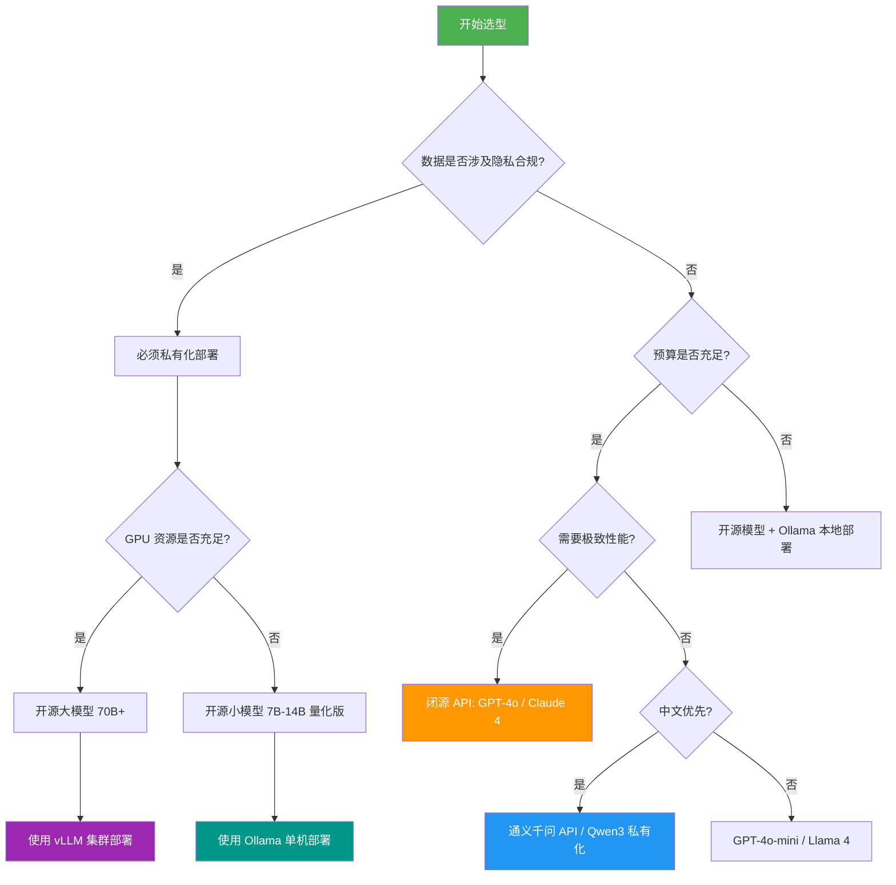
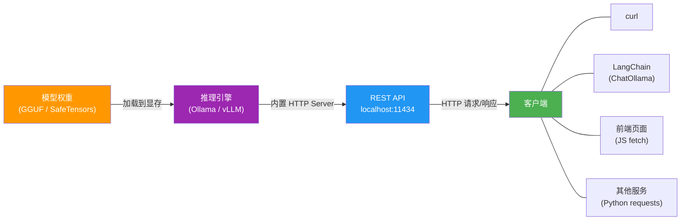
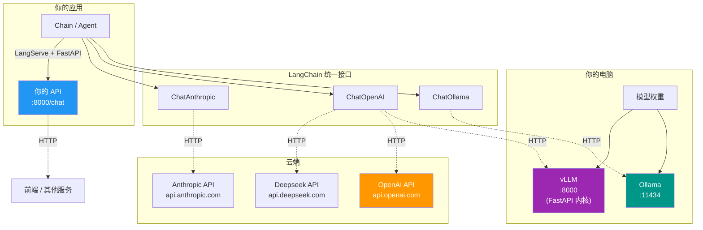
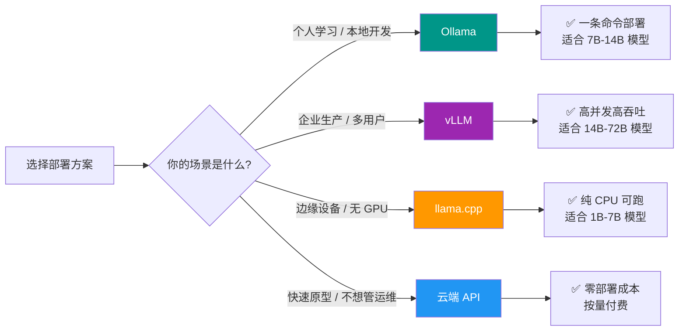

# 大模型选择与私有化部署

> 在 LangChain 应用中，模型是一切的起点。选对模型、部好模型，后续的 Prompt 工程和链式调用才有意义。本篇从**选型决策**出发，覆盖 Ollama / vLLM 两种私有化部署方案，并以 Qwen3 和 Deepseek-R1-0528 为例完成端到端实战。

---

## 1. 大模型选型指南

### 1.1 选模型的核心维度

选择大模型并非简单的"选最大的"或"选最新的"，而是在多个维度之间做 **平衡取舍**。

| 维度 | 说明 | 典型考量 |
|------|------|----------|
| **性能（质量）** | 模型在目标任务上的表现 | MMLU、HumanEval、数学推理等 Benchmark |
| **成本** | 推理费用 / 硬件投入 | Token 单价、GPU 显存需求 |
| **隐私合规** | 数据是否出境、是否可控 | 金融/医疗/政务场景刚需 |
| **延迟** | 首 Token 时间 & 每秒 Token 数 | 实时对话 vs 离线批处理 |
| **上下文长度** | 单次可处理的最大 Token 数 | 长文档摘要需 128K+ |
| **多语言能力** | 中文、代码、小语种支持 | 国内业务优先看中文质量 |
| **工具调用能力** | Function Calling / Tool Use 支持 | Agent 场景必须考虑 |

> [!tip] 费曼类比：选模型就像选车
> - **城市通勤**（简单问答、客服）→ 选经济型轿车（7B 小模型，低成本高效率）
> - **长途越野**（复杂推理、代码生成）→ 选 SUV（70B+ 大模型或顶级闭源 API）
> - **赛道竞速**（极致性能）→ 选跑车（GPT-4o / Claude 4 Sonnet，不计成本）
> - **商用运输**（高并发生产环境）→ 选卡车（vLLM 集群部署开源模型）

### 1.2 开源 vs 闭源：适用场景对比

| 对比项 | 闭源模型（API 调用） | 开源模型（私有化部署） |
|--------|----------------------|----------------------|
| **部署难度** | 零部署，即开即用 | 需要 GPU 服务器、运维能力 |
| **数据隐私** | 数据经过第三方 | 数据完全可控 |
| **定制能力** | 有限（Prompt / Fine-tune API） | 完全可控（微调、量化、蒸馏） |
| **成本模式** | 按 Token 付费，用量大时昂贵 | 一次性硬件投入，边际成本低 |
| **性能上限** | 通常更高（更大模型 + 更多训练数据） | 追赶中，部分任务已持平 |
| **可用性** | 受网络和供应商政策影响 | 本地可控，不依赖外部 |
| **适合场景** | 快速原型、中小规模、非敏感数据 | 企业生产、隐私合规、大规模推理 |

### 1.3 当前主流模型概览（截至 2026 年初）

#### 闭源模型

| 模型 | 厂商 | 亮点 |
|------|------|------|
| **GPT-4o** | OpenAI | 多模态一体、速度快、生态成熟 |
| **Claude 4 Sonnet** | Anthropic | 长上下文（200K）、代码能力强、安全性好 |
| **Gemini 2.0** | Google | 原生多模态、与 Google 生态深度整合 |
| **通义千问 Max** | 阿里 | 中文优势、国内合规、价格友好 |

#### 开源模型

| 模型 | 机构 | 参数规模 | 亮点 |
|------|------|----------|------|
| **Qwen3** | 阿里 | 0.6B ~ 235B | 中英双语顶级、支持 MoE、工具调用优秀 |
| **Deepseek-R1** | Deepseek | 1.5B ~ 671B | 推理增强、思维链、数学/代码能力突出 |
| **Llama 4** | Meta | Scout / Maverick | 原生多模态、超长上下文 |
| **Mistral** | Mistral AI | 7B ~ MoE | 欧洲合规、小模型效率高 |

### 1.4 选型决策流程图



---

## 2. Ollama：最简单的本地部署方案

### 2.1 什么是 Ollama

> [!info] 通俗解释
> **Ollama** 就是大模型界的 **Docker**——它帮你下载模型、管理模型、启动推理服务，你只需要一条命令就能在自己的电脑上运行各种开源大模型。不需要手动下载权重、配置 CUDA、写推理脚本。

Ollama 的核心价值：
- **极简部署**：`ollama run qwen3` 一条命令搞定
- **统一接口**：提供兼容 OpenAI 格式的 REST API
- **模型管理**：类似 Docker 的 `pull / run / list / rm` 操作
- **跨平台**：支持 Windows、macOS、Linux
- **自动量化**：内置 GGUF 格式，自动适配硬件

### 2.2 安装流程

#### Windows

```bash
# 方法一：从官网下载安装包
# 访问 https://ollama.com/download 下载 OllamaSetup.exe
# 双击安装，自动配置环境变量和系统服务

# 方法二：使用 winget
winget install Ollama.Ollama

# 验证安装
ollama --version
```

#### macOS

```bash
# 方法一：从官网下载 .dmg 安装包

# 方法二：使用 Homebrew
brew install ollama

# 验证安装
ollama --version
```

#### Linux

```bash
# 一键安装脚本
curl -fsSL https://ollama.com/install.sh | sh

# 验证安装
ollama --version

# 启动服务（如未自动启动）
sudo systemctl start ollama
sudo systemctl enable ollama
```

### 2.3 常用命令

```bash
# 拉取模型（仅下载，不运行）
ollama pull qwen3:14b

# 运行模型（如未下载会自动拉取）
ollama run qwen3:14b

# 查看已下载的模型列表
ollama list

# 查看正在运行的模型
ollama ps

# 删除模型
ollama rm qwen3:14b

# 启动 API 服务（默认端口 11434）
ollama serve

# 复制模型（创建别名）
ollama cp qwen3:14b my-qwen3

# 查看模型详细信息
ollama show qwen3:14b
```

### 2.4 硬件要求与显存估算

> [!warning] 显存是最关键的瓶颈
> 大模型推理的核心瓶颈是 **GPU 显存（VRAM）**。显存不足时 Ollama 会自动回退到 CPU 推理，速度将慢 10-50 倍。

**显存估算公式（经验值）**：

```
所需显存(GB) ≈ 模型参数量(B) × 量化位数 / 8 + 2GB（overhead）
```

| 模型规模 | FP16（16 位） | Q8（8 位量化） | Q4（4 位量化） |
|----------|---------------|---------------|---------------|
| 7B | ~14 GB | ~8 GB | ~5 GB |
| 14B | ~28 GB | ~16 GB | ~10 GB |
| 32B | ~64 GB | ~34 GB | ~20 GB |
| 72B | ~144 GB | ~74 GB | ~42 GB |

> [!tip] 个人开发推荐配置
> - **入门**：RTX 4060 (8 GB) → 可跑 7B Q4 模型
> - **主力**：RTX 4090 (24 GB) → 可跑 14B Q8 或 32B Q4 模型
> - **专业**：双卡 4090 或 A6000 (48 GB) → 可跑 72B Q4 模型

### 2.5 Ollama API 接口

Ollama 启动后默认在 `http://localhost:11434` 提供 REST API，兼容 OpenAI 格式。

```bash
# 对话请求
curl http://localhost:11434/api/chat -d '{
  "model": "qwen3:14b",
  "messages": [
    {"role": "user", "content": "解释什么是 RAG"}
  ],
  "stream": false
}'

# 生成请求（非对话）
curl http://localhost:11434/api/generate -d '{
  "model": "qwen3:14b",
  "prompt": "用 Python 写一个快速排序",
  "stream": false
}'

# 兼容 OpenAI 格式的端点
curl http://localhost:11434/v1/chat/completions -d '{
  "model": "qwen3:14b",
  "messages": [
    {"role": "user", "content": "你好"}
  ]
}'
```

### 2.6 本地模型的服务化原理：从权重到 API

很多初学者会困惑：为什么 Ollama 跑起来之后用 `curl` 就能调？`ChatOllama` 底层在干什么？FastAPI 又是什么角色？这些概念的关系其实很清晰——它们是同一条链路上的不同环节。

> [!info] 费曼类比：餐厅的前后端
> 把大模型想象成一个**大厨**（只会做菜，不会接单）：
> - **模型权重** = 大厨的手艺（存在脑子里的技能）
> - **推理引擎**（Ollama / vLLM） = 厨房（提供锅灶、食材管理，让大厨能工作）
> - **HTTP Server / REST API** = 服务员 + 菜单（把厨房的能力暴露给外界，客人按菜单点菜）
> - **客户端**（LangChain / curl / 前端页面） = 客人（按菜单格式下单，等着上菜）
>
> 大厨不直接面对客人，服务员不需要会做菜——**各司其职，通过标准化的"菜单"（API 协议）连接**。

#### 完整链路图



#### 各环节的职责

| 环节 | 代表 | 职责 | 类比 |
|------|------|------|------|
| **模型权重** | `.gguf` / `.safetensors` 文件 | 存储模型参数，本身不能运行 | 菜谱（纸上谈兵） |
| **推理引擎** | Ollama、vLLM、llama.cpp | 加载权重、执行推理计算、管理显存 | 厨房 |
| **HTTP Server** | 引擎内置（或 FastAPI 自建） | 监听端口、接收请求、返回响应 | 服务窗口 |
| **REST API** | `/api/chat`、`/v1/chat/completions` | 定义请求/响应的 JSON 格式（协议） | 菜单格式 |
| **客户端** | LangChain、curl、浏览器 | 按 API 格式构造请求、解析响应 | 客人 |

> [!tip] 为什么说"本地模型"和"云端 API"本质一样？
> 对客户端来说，调用本地 Ollama 和调用 OpenAI API **完全一样**——都是向一个 URL 发 HTTP POST 请求，拿回 JSON 响应。唯一的区别是 URL 不同：
> - 本地 Ollama：`http://localhost:11434/v1/chat/completions`
> - OpenAI 官方：`https://api.openai.com/v1/chat/completions`
>
> 这就是为什么 LangChain 用 `ChatOpenAI(base_url=...)` 就能无缝切换本地和云端模型。

#### REST API 到底是什么

**REST API** 不是某个具体的软件，而是一套**通信规范**——规定了客户端和服务器之间如何"对话"：

```
客户端 → POST /v1/chat/completions HTTP/1.1
         Content-Type: application/json
         {"model": "qwen3", "messages": [...]}

服务器 → 200 OK
         {"choices": [{"message": {"content": "..."}}]}
```

核心约定：
- 用 **HTTP 方法**（GET / POST / PUT / DELETE）表示操作类型
- 用 **URL 路径**（`/api/chat`）标识资源
- 用 **JSON** 格式传输数据
- **无状态**：每次请求独立，服务器不记住上一次请求

#### FastAPI 在哪里登场

**FastAPI** 是一个 Python Web 框架，用来**快速搭建 REST API 服务**。在大模型生态中它有两个典型用途：

**用途一：推理引擎的 HTTP 外壳**

vLLM 的 API Server 底层就是 FastAPI 实现的。当你运行 `python -m vllm.entrypoints.openai.api_server` 时，vLLM 启动了一个 FastAPI 应用来暴露 OpenAI 兼容的端点。

**用途二：LangServe 部署 Chain**

当你用 LangChain 构建好一个 Chain / Agent 后，想让别人也能调用它（比如给前端用），**LangServe** 就是基于 FastAPI 一键发布你的 Chain 为 REST API：

```python
# pip install langserve fastapi uvicorn langchain langchain-ollama

from fastapi import FastAPI
from langserve import add_routes
from langchain_ollama import ChatOllama
from langchain_core.prompts import ChatPromptTemplate
from langchain_core.output_parsers import StrOutputParser

# 1. 构建 Chain
llm = ChatOllama(model="qwen3:14b")
prompt = ChatPromptTemplate.from_messages([("human", "{question}")])
chain = prompt | llm | StrOutputParser()

# 2. 用 FastAPI + LangServe 发布为 API
app = FastAPI(title="My LLM API")
add_routes(app, chain, path="/chat")

# 3. 启动：uvicorn main:app --host 0.0.0.0 --port 8000
# 之后任何人都可以 POST http://yourserver:8000/chat/invoke 来调用
```

#### 整体架构俯瞰



> [!warning] 常见误区
> - **"Ollama 是一个模型"** ✗ → Ollama 是推理引擎/模型管理器，模型是它下载运行的对象
> - **"FastAPI 是用来跑模型的"** ✗ → FastAPI 只负责 HTTP 通信，推理计算由 Ollama/vLLM 完成
> - **"本地模型不需要 API"** ✗ → 即使在本地，程序间通信也是通过 REST API（HTTP）进行的
> - **"REST API 和 SDK 是两回事"** △ → LangChain 的 `ChatOllama` 本质是一个**HTTP 客户端封装**，底层就是在调 REST API

---

## 3. Qwen3 私有化部署实战

### 3.1 Qwen3 模型家族介绍

**Qwen3**（通义千问第三代）是阿里云开源的大语言模型系列，在中英文双语能力上处于开源模型第一梯队。

| 模型版本 | 参数量 | 类型 | 特点 |
|----------|--------|------|------|
| Qwen3-0.6B | 0.6B | Dense | 极轻量，适合端侧设备 |
| Qwen3-1.7B | 1.7B | Dense | 轻量级，入门部署 |
| Qwen3-4B | 4B | Dense | 性价比高，适合简单任务 |
| Qwen3-8B | 8B | Dense | 均衡之选，覆盖大部分场景 |
| Qwen3-14B | 14B | Dense | 中等规模，推理质量优秀 |
| Qwen3-32B | 32B | Dense | 大规模，复杂推理能力强 |
| Qwen3-30B-A3B | 30B (3B active) | MoE | 30B 总参数，仅 3B 激活，效率极高 |
| Qwen3-235B-A22B | 235B (22B active) | MoE | 旗舰 MoE 模型，性能对标闭源 |

> [!info] Dense vs MoE
> - **Dense（稠密）模型**：每次推理所有参数都参与计算，质量稳定但资源消耗大
> - **MoE（混合专家）模型**：每次推理只激活部分"专家"网络，用大参数量换取高质量的同时保持较低计算开销。例如 Qwen3-30B-A3B 总参数 30B 但每次只激活 3B，推理速度接近 3B 模型

Qwen3 的核心亮点：
- **思考模式切换**：支持"深度思考"和"快速回答"两种模式
- **原生工具调用**：内置 Function Calling 能力，适合 LangChain Agent
- **超长上下文**：支持 32K 原生上下文，扩展可达 128K
- **中文能力**：中文训练数据占比高，中文理解与生成质量领先

### 3.2 使用 Ollama 部署 Qwen3 全流程

#### 第一步：拉取模型

```bash
# 推荐从 14B 版本开始（质量与资源的平衡点）
ollama pull qwen3:14b

# 如果显存有限，选择 8B 版本
ollama pull qwen3:8b

# 如果想体验 MoE 架构的高效推理
ollama pull qwen3:30b-a3b
```

> [!tip] 模型标签说明
> Ollama 中的模型标签格式为 `模型名:参数规模`。默认标签（如 `qwen3`）通常指向最新的推荐版本。可以通过 `ollama show qwen3:14b` 查看模型具体信息（量化方式、参数量等）。

#### 第二步：启动并测试

```bash
# 直接运行（交互式对话）
ollama run qwen3:14b

# 进入交互式界面后，可以直接输入问题：
# >>> 请解释 Transformer 架构中 Self-Attention 的工作原理
# >>> /bye  （退出对话）
```

#### 第三步：验证 API 服务

```bash
# 确认 Ollama 服务正在运行
curl http://localhost:11434/api/tags

# 发送一个测试请求
curl http://localhost:11434/api/chat -d '{
  "model": "qwen3:14b",
  "messages": [{"role": "user", "content": "你是谁？你的参数规模是多少？"}],
  "stream": false
}'
```

### 3.3 使用 LangChain 连接本地 Ollama Qwen3

```python
# pip install langchain langchain-ollama

from langchain_ollama import ChatOllama

# 创建模型实例，连接本地 Ollama 服务
llm = ChatOllama(
    model="qwen3:14b",
    base_url="http://localhost:11434",  # 默认值，可省略
    temperature=0.7,
    num_predict=1024,  # 最大输出 Token 数
)

# 简单调用
response = llm.invoke("用一句话解释什么是 LangChain")
print(response.content)
```

进阶用法——结合 Prompt Template 和 Chain：

```python
# pip install langchain langchain-ollama langchain-core

from langchain_ollama import ChatOllama
from langchain_core.prompts import ChatPromptTemplate
from langchain_core.output_parsers import StrOutputParser

# 构建模型
llm = ChatOllama(model="qwen3:14b", temperature=0.7)

# 构建 Prompt 模板
prompt = ChatPromptTemplate.from_messages([
    ("system", "你是一位资深的技术专家，善于用通俗易懂的语言解释复杂概念。"),
    ("human", "请解释以下概念：{concept}"),
])

# 构建 LCEL Chain（参考 [[01_LangChain概述与核心架构]]）
chain = prompt | llm | StrOutputParser()

# 调用 Chain
result = chain.invoke({"concept": "向量数据库在 RAG 中的作用"})
print(result)
```

流式输出（提升用户体验）：

```python
# pip install langchain langchain-ollama langchain-core

from langchain_ollama import ChatOllama
from langchain_core.prompts import ChatPromptTemplate
from langchain_core.output_parsers import StrOutputParser

llm = ChatOllama(model="qwen3:14b", temperature=0.7)

prompt = ChatPromptTemplate.from_messages([
    ("human", "{question}"),
])

chain = prompt | llm | StrOutputParser()

# 流式输出
for chunk in chain.stream({"question": "Python 异步编程的核心概念有哪些？"}):
    print(chunk, end="", flush=True)
```

### 3.4 Qwen3 思考模式控制

Qwen3 支持两种推理模式，可通过特殊标记切换：

```python
# pip install langchain langchain-ollama langchain-core

from langchain_ollama import ChatOllama
from langchain_core.messages import HumanMessage

# 启用深度思考模式（模型会先推理再回答）
llm = ChatOllama(model="qwen3:14b", temperature=0.7)

# 方法一：通过 Prompt 引导思考
response = llm.invoke("请一步一步思考：如果一个水池有两个进水管和一个出水管，"
                       "进水管每小时分别注入 3 吨和 5 吨水，出水管每小时排出 2 吨水，"
                       "水池容量为 48 吨，多久能装满？")
print(response.content)

# 方法二：通过 /no_think 关闭思考（快速回答模式）
response = llm.invoke("/no_think 今天星期几？")
print(response.content)
```

> [!info] 思考模式的适用场景
> - **开启思考**：数学推理、逻辑分析、代码调试等需要多步推理的任务
> - **关闭思考**：简单问答、翻译、摘要等对速度要求高的任务

### 3.5 常见问题排查

| 问题现象 | 可能原因 | 解决方案 |
|----------|----------|----------|
| 模型下载速度慢 | 网络问题 | 配置镜像源或使用代理 |
| 推理速度很慢 | 显存不足，回退到 CPU | 换用更小模型或量化版本 |
| 中文输出乱码 | 终端编码问题 | 设置终端编码为 UTF-8 |
| `connection refused` | Ollama 服务未启动 | 运行 `ollama serve` 启动服务 |
| 显存 OOM | 模型太大 | 使用更低量化（Q4）或更小模型 |
| 输出截断 | `num_predict` 太小 | 增大 `num_predict` 参数 |

```bash
# 查看 Ollama 日志（排查启动问题）
# Windows: 查看 %LOCALAPPDATA%\Ollama\logs
# Linux/macOS:
journalctl -u ollama -f

# 查看 GPU 使用情况
nvidia-smi

# 监控 GPU 显存变化
watch -n 1 nvidia-smi
```

---

## 4. Deepseek-R1-0528 部署实战

### 4.1 Deepseek-R1 的特点

**Deepseek-R1** 是深度求索（Deepseek）推出的**推理增强大模型**，其最大特色是内置了强大的**思维链（Chain of Thought）**能力——模型会先展开详细的推理过程，再给出最终答案。

Deepseek-R1 的核心特性：
- **原生推理增强**：无需特殊 Prompt 引导，模型自动进行多步推理
- **思维链可见**：推理过程通过 `<think>...</think>` 标记呈现，便于调试和审查
- **数学/代码能力突出**：在 AIME、Codeforces 等评测中表现优异
- **MoE 架构**：Deepseek-R1 全量版采用 671B MoE（37B 激活），蒸馏版提供 1.5B-70B Dense 模型
- **0528 版本改进**：相比初版提升了指令遵循能力，减少了"废话"输出

> [!info] R1 的"R"代表什么
> R 代表 **Reasoning**（推理）。Deepseek-R1 专门针对推理场景优化，与通用对话模型（如 Deepseek-V3）形成互补。在需要深度分析、数学证明、代码调试的场景中，R1 的表现显著优于同规模通用模型。

### 4.2 Ollama 部署 Deepseek-R1 流程

```bash
# 拉取蒸馏版模型（推荐 14B 版本作为起步）
ollama pull deepseek-r1:14b

# 如果资源充足，可以使用 32B 版本获得更好效果
ollama pull deepseek-r1:32b

# 如果资源有限，7B 版本也能体验推理能力
ollama pull deepseek-r1:7b

# 运行模型
ollama run deepseek-r1:14b
```

API 调用测试：

```bash
curl http://localhost:11434/api/chat -d '{
  "model": "deepseek-r1:14b",
  "messages": [
    {"role": "user", "content": "一个农场里有鸡和兔，总共 35 个头，94 只脚，问鸡和兔各有多少只？"}
  ],
  "stream": false
}'
```

> [!tip] 观察思维链
> Deepseek-R1 的响应中会包含 `<think>` 标记包裹的推理过程。这部分内容展示了模型的"思考"步骤，有助于理解模型如何得出答案，也方便在生产中做质量审查。

### 4.3 LangChain 调用本地 Deepseek-R1

```python
# pip install langchain langchain-ollama langchain-core

from langchain_ollama import ChatOllama
from langchain_core.prompts import ChatPromptTemplate
from langchain_core.output_parsers import StrOutputParser

# 创建 Deepseek-R1 模型实例
llm = ChatOllama(
    model="deepseek-r1:14b",
    temperature=0.6,  # 推理任务建议稍低温度
    num_predict=2048,  # 推理过程可能较长，需要更多输出空间
)

# 数学推理测试
prompt = ChatPromptTemplate.from_messages([
    ("human", "{question}"),
])

chain = prompt | llm | StrOutputParser()

result = chain.invoke({
    "question": "证明：对于任意正整数 n，n^3 - n 能被 6 整除。"
})
print(result)
```

解析思维链内容（将推理过程与最终答案分离）：

```python
# pip install langchain langchain-ollama langchain-core

import re
from langchain_ollama import ChatOllama
from langchain_core.output_parsers import StrOutputParser

llm = ChatOllama(model="deepseek-r1:14b", temperature=0.6)

response = llm.invoke("一个骰子掷两次，两次点数之和为 7 的概率是多少？")
content = response.content

# 分离思维链和最终答案
think_match = re.search(r"<think>(.*?)</think>", content, re.DOTALL)
if think_match:
    thinking = think_match.group(1).strip()
    answer = content[think_match.end():].strip()
    print("=== 推理过程 ===")
    print(thinking)
    print("\n=== 最终答案 ===")
    print(answer)
else:
    print(content)
```

### 4.4 Qwen3 vs Deepseek-R1 对比测试

| 对比维度 | Qwen3-14B | Deepseek-R1-14B |
|----------|-----------|-----------------|
| **架构** | Dense Transformer | Dense（蒸馏自 MoE） |
| **推理速度** | 较快 | 较慢（包含思考过程） |
| **中文对话** | 优秀，流畅自然 | 良好，偶有格式问题 |
| **数学推理** | 良好 | 优秀，步骤详细 |
| **代码生成** | 优秀 | 优秀，逻辑严谨 |
| **工具调用** | 原生支持，效果好 | 支持但不如 Qwen3 稳定 |
| **思维链** | 可选开启 | 默认开启 |
| **适合场景** | 通用对话、Agent、工具调用 | 推理密集型、数学、逻辑分析 |

> [!tip] 搭配使用的建议
> 在实际项目中，可以根据任务类型**动态路由**到不同模型：
> - 简单问答 / 工具调用 → Qwen3（快速、稳定）
> - 复杂推理 / 数学计算 → Deepseek-R1（准确、可解释）
>
> LangChain 的 `RunnableBranch` 可以轻松实现这种路由策略。

```python
# pip install langchain langchain-ollama langchain-core

from langchain_ollama import ChatOllama
from langchain_core.prompts import ChatPromptTemplate
from langchain_core.output_parsers import StrOutputParser
from langchain_core.runnables import RunnableBranch, RunnableLambda

# 初始化两个模型
qwen = ChatOllama(model="qwen3:14b", temperature=0.7)
deepseek = ChatOllama(model="deepseek-r1:14b", temperature=0.6)

prompt = ChatPromptTemplate.from_messages([("human", "{question}")])

# 简单分类函数：判断是否是推理密集型任务
def is_reasoning_task(input_dict: dict) -> bool:
    keywords = ["证明", "计算", "推导", "为什么", "分析原因", "数学", "概率"]
    return any(kw in input_dict["question"] for kw in keywords)

# 构建路由 Chain
chain = prompt | RunnableBranch(
    (RunnableLambda(is_reasoning_task), deepseek),
    qwen,  # 默认分支
) | StrOutputParser()

# 测试
print(chain.invoke({"question": "你好，介绍一下你自己"}))  # → Qwen3
print(chain.invoke({"question": "证明勾股定理"}))  # → Deepseek-R1
```

---

## 5. vLLM 高性能部署（进阶）

### 5.1 什么是 vLLM

**vLLM** 是加州大学伯克利分校开源的高性能大模型推理引擎。如果说 Ollama 是"个人电脑上的便捷工具"，那么 vLLM 就是"生产服务器上的高性能引擎"。

vLLM 的核心技术：
- **PagedAttention**：借鉴操作系统的虚拟内存分页机制管理 KV Cache，显著降低显存浪费
- **Continuous Batching**：连续批处理，动态合并不同请求，最大化 GPU 利用率
- **Tensor Parallelism**：支持多卡张量并行，单模型跨多 GPU 部署

### 5.2 vLLM vs Ollama：何时选谁

| 特性 | Ollama | vLLM |
|------|--------|------|
| **目标用户** | 个人开发者、学习研究 | 企业生产环境 |
| **并发支持** | 低，主要单用户 | 高，支持数百并发 |
| **吞吐量** | 一般 | 极高（PagedAttention 加持） |
| **部署复杂度** | 极低（一条命令） | 中等（需 Python 环境 + CUDA） |
| **模型格式** | GGUF（CPU 友好） | HuggingFace 原生格式（GPU 优先） |
| **量化支持** | Q4/Q8 等多种 GGUF 量化 | AWQ / GPTQ / FP8 |
| **API 兼容** | OpenAI 兼容 | OpenAI 兼容 |

### 5.3 vLLM 简要部署流程

> [!warning] 前置要求
> - Linux 系统（推荐 Ubuntu 22.04+）
> - NVIDIA GPU（Compute Capability >= 7.0，即 V100 及以上）
> - CUDA 12.1+
> - Python 3.9+

```bash
# 安装 vLLM
pip install vllm

# 启动 API 服务（以 Qwen3-14B 为例）
python -m vllm.entrypoints.openai.api_server \
    --model Qwen/Qwen3-14B \
    --host 0.0.0.0 \
    --port 8000 \
    --tensor-parallel-size 1 \
    --max-model-len 8192 \
    --gpu-memory-utilization 0.9

# 多卡部署（2 张 GPU）
python -m vllm.entrypoints.openai.api_server \
    --model Qwen/Qwen3-14B \
    --tensor-parallel-size 2 \
    --port 8000
```

使用 LangChain 连接 vLLM 服务：

```python
# pip install langchain langchain-openai

from langchain_openai import ChatOpenAI

# vLLM 提供 OpenAI 兼容接口，直接使用 ChatOpenAI 连接
llm = ChatOpenAI(
    base_url="http://localhost:8000/v1",
    api_key="not-needed",  # vLLM 本地部署无需 API Key
    model="Qwen/Qwen3-14B",
    temperature=0.7,
)

response = llm.invoke("用 Python 实现二分查找")
print(response.content)
```

> [!tip] 与 Ollama 的 LangChain 集成区别
> - Ollama 使用 `langchain-ollama` 包的 `ChatOllama`
> - vLLM 使用 `langchain-openai` 包的 `ChatOpenAI`（因为 vLLM 完全兼容 OpenAI API 格式）
>
> 这意味着从 vLLM 迁移到 OpenAI API 几乎零成本——只需修改 `base_url` 和 `api_key`。

---

## 6. 部署方案对比总结

### 6.1 三大方案对比

| 对比项 | Ollama | vLLM | llama.cpp |
|--------|--------|------|-----------|
| **定位** | 个人开发利器 | 生产级推理引擎 | 极致轻量推理 |
| **语言** | Go | Python | C/C++ |
| **模型格式** | GGUF | HuggingFace / SafeTensors | GGUF |
| **量化** | Q2 ~ Q8（GGUF） | AWQ / GPTQ / FP8 | Q2 ~ Q8（GGUF） |
| **GPU 支持** | CUDA / Metal / ROCm | CUDA（主要） | CUDA / Metal / Vulkan |
| **CPU 推理** | 支持（自动回退） | 不支持 | 支持（核心优势） |
| **并发能力** | 低 | 高（Continuous Batching） | 低 |
| **API 格式** | OpenAI 兼容 | OpenAI 兼容 | OpenAI 兼容（通过 server） |
| **部署难度** | 极低 | 中等 | 中等 |
| **适合场景** | 本地开发、学习、原型验证 | 企业生产、多用户并发 | 边缘设备、纯 CPU 环境 |

### 6.2 场景推荐



> [!info] 部署不是终点
> 模型部署完成后，下一步是通过统一的 API 接口在 LangChain 中调用它们。无论使用 Ollama、vLLM 还是云端 API，LangChain 都提供了标准化的接入方式。详见 [[02_国内外大模型API调用]]。

---

## 本篇小结

| 知识点 | 掌握程度自检 |
|--------|-------------|
| 模型选型的核心维度与决策流程 | 能根据场景选出合适的模型 |
| Ollama 的安装与常用命令 | 能独立完成本地部署 |
| 本地模型的服务化链路（权重→引擎→API→客户端） | 理解各环节职责与 REST API / FastAPI 的角色 |
| Qwen3 模型家族与部署 | 能使用 Ollama 部署并通过 LangChain 调用 |
| Deepseek-R1 的特点与部署 | 能部署 R1 并解析思维链输出 |
| vLLM 的定位与基本用法 | 了解何时选用 vLLM |
| 三种部署方案的区别与适用场景 | 能根据需求选择合适的部署方案 |

**下一篇**：[[02_国内外大模型API调用]] — 学习如何通过 LangChain 统一接入 OpenAI、Anthropic、通义千问等各大模型 API。

