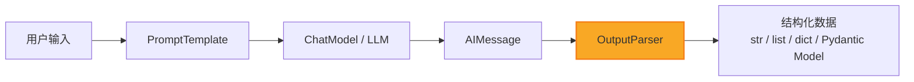
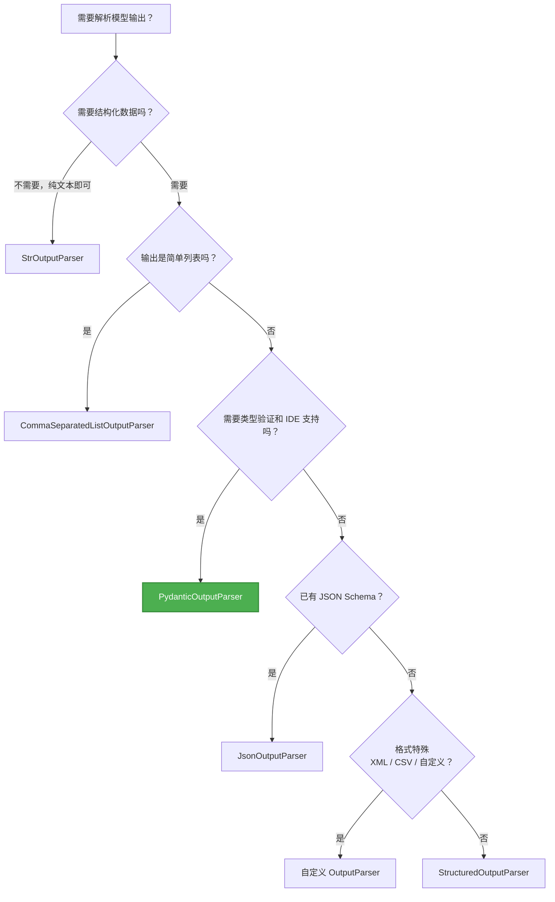

# 输出解析与结构化

> 大模型能写诗、能写代码，但它返回的终究是一串文本。要让程序真正"理解"并使用这些输出，我们需要 **OutputParser**——LangChain 中连接"自然语言世界"和"程序世界"的桥梁。

本篇整合输出解析与结构化的三个核心知识点，从最简单的 `StrOutputParser` 到最强大的 `PydanticOutputParser`，逐层深入，最终给出选型决策指南。

---

## 一、为什么需要输出解析

### 1.1 痛点：自由文本无法被程序直接消费

当我们调用大模型时，得到的返回值通常是这样的：

```
这部电影的评分是 8.5 分，导演是克里斯托弗·诺兰，主演包括莱昂纳多·迪卡普里奥……
```

作为人类，我们一眼就能提取关键信息。但对程序来说，这段话和"乱码"没有本质区别——**它无法直接取出 `score=8.5`、`director="克里斯托弗·诺兰"` 这样的结构化字段**。

常见的痛点包括：

| 痛点 | 描述 |
|------|------|
| **格式不可控** | 同一个 prompt，模型可能返回 JSON，也可能返回自然语言 |
| **类型不安全** | 字符串形式的 "8.5" 和浮点数 `8.5` 是两码事 |
| **下游集成困难** | 数据库写入、API 调用、前端渲染都需要确定的数据结构 |
| **错误难定位** | 格式错误发生在调用后，排查成本高 |

> [!tip] 类比：速记员
> 把大模型想象成一位**口语化的领域专家**——他知道一切答案，但只会"说话"，不会填表。
>
> **OutputParser 就是速记员**：它坐在专家旁边，把专家的口述实时整理成标准表格，让后续的程序（会计、审计、数据库）可以直接使用。
>
> 不同的速记员擅长不同的表格格式：有的只记纯文本（`StrOutputParser`），有的记 JSON（`JsonOutputParser`），有的直接填写严格定义的合同（`PydanticOutputParser`）。

### 1.2 输出解析在 LCEL 管道中的位置

在 LangChain Expression Language（LCEL）中，输出解析器是管道的**最后一环**，负责将模型返回的 `AIMessage` 转换为应用层需要的数据结构。



用 LCEL 管道语法表达就是：

```python
chain = prompt | model | output_parser
```

> [!info] 关键理解
> `OutputParser` 实现了 `Runnable` 接口，因此可以无缝接入 LCEL 的管道操作符 `|`。它同时提供 `parse()` 方法和 `get_format_instructions()` 方法——后者用于在 Prompt 中告诉模型"请按这个格式回答"。详见 [[02_LangChain底层原理]]。

---

## 二、StrOutputParser

### 2.1 最简单的解析器

`StrOutputParser` 是所有 OutputParser 中最简单的一个。它的全部工作就是：**把 `AIMessage` 对象中的 `.content` 字段提取出来，返回纯字符串**。

听起来很"没用"？其实不然。在 LCEL 管道中，模型的输出是一个 `AIMessage` 对象（包含 `content`、`response_metadata` 等多个字段），如果不经过解析器，下游拿到的是整个对象而不是文本本身。

### 2.2 使用场景

- 纯文本对话
- 文本摘要
- 翻译任务
- 任何不需要结构化输出的场景

### 2.3 代码示例

```python
# pip install langchain langchain-openai

from langchain_openai import ChatOpenAI
from langchain_core.prompts import ChatPromptTemplate
from langchain_core.output_parsers import StrOutputParser

# 创建模型
model = ChatOpenAI(model="gpt-4o-mini", temperature=0)

# 创建 prompt
prompt = ChatPromptTemplate.from_messages([
    ("system", "你是一位专业的翻译助手。"),
    ("human", "请将以下中文翻译为英文：{text}")
])

# 构建 LCEL 管道 —— StrOutputParser 提取纯文本
chain = prompt | model | StrOutputParser()

# 调用
result = chain.invoke({"text": "大语言模型正在改变软件开发的方式。"})
print(result)
# 输出: "Large language models are changing the way software is developed."
print(type(result))
# 输出: <class 'str'>
```

> [!tip] 对比：不使用 StrOutputParser
> 如果管道中去掉 `StrOutputParser()`，`result` 将是一个 `AIMessage` 对象，你需要手动访问 `result.content` 才能获取文本。虽然只是一步之差，但在长链路管道中，保持类型一致性至关重要。

---

## 三、CommaSeparatedListOutputParser

### 3.1 将输出解析为 Python 列表

`CommaSeparatedListOutputParser` 让模型返回一组逗号分隔的值，然后自动将其解析为 Python `list`。

### 3.2 使用场景

- 列举型任务（"列出5种编程语言"）
- 标签生成（"给这篇文章打标签"）
- 候选项枚举

### 3.3 代码示例

```python
# pip install langchain langchain-openai

from langchain_openai import ChatOpenAI
from langchain_core.prompts import ChatPromptTemplate
from langchain_core.output_parsers import CommaSeparatedListOutputParser

# 创建解析器
parser = CommaSeparatedListOutputParser()

# 获取格式指令 —— 这将被注入到 prompt 中
format_instructions = parser.get_format_instructions()
print(format_instructions)
# 输出: "Your response should be a list of comma separated values, eg: `foo, bar, baz`"

# 创建 prompt，注入格式指令
prompt = ChatPromptTemplate.from_template(
    "列出 {count} 种常见的 {subject}。\n{format_instructions}"
)

model = ChatOpenAI(model="gpt-4o-mini", temperature=0)

# 构建管道
chain = prompt | model | parser

# 调用
result = chain.invoke({
    "count": "5",
    "subject": "排序算法",
    "format_instructions": format_instructions
})

print(result)
# 输出: ['冒泡排序', '快速排序', '归并排序', '堆排序', '插入排序']
print(type(result))
# 输出: <class 'list'>
```

> [!warning] 注意
> `CommaSeparatedListOutputParser` 依赖模型严格遵守逗号分隔格式。如果模型返回了带有编号的列表（"1. 冒泡排序 2. 快速排序 ..."），解析将出错。因此 `get_format_instructions()` 的注入非常关键。

---

## 四、JsonOutputParser

### 4.1 将输出解析为 JSON 对象

`JsonOutputParser` 将模型的输出解析为 Python 字典（`dict`），适用于需要多个字段的结构化场景。

### 4.2 format_instructions 的原理

`JsonOutputParser` 最重要的机制是 **`get_format_instructions()`**。它的工作原理如下：

1. 根据你提供的 Pydantic 模型（可选）或 JSON schema，生成一段自然语言描述
2. 这段描述被注入到 Prompt 中，**明确告诉模型："请严格按照以下 JSON 格式返回"**
3. 模型"读懂"这段指令后，会尽量按照指定格式生成输出
4. `JsonOutputParser` 在收到输出后，调用 `json.loads()` 进行解析

> [!info] 本质理解
> 输出解析器并不是在"强制"模型输出某种格式——它只是在 prompt 中"请求"模型这样做，然后在输出端进行验证和解析。这就是为什么偶尔会解析失败：模型并不总是完美遵循指令。

### 4.3 代码示例：指定 JSON Schema

```python
# pip install langchain langchain-openai pydantic

from langchain_openai import ChatOpenAI
from langchain_core.prompts import ChatPromptTemplate
from langchain_core.output_parsers import JsonOutputParser
from pydantic import BaseModel, Field

# 定义期望的 JSON 结构（通过 Pydantic 模型）
class MovieReview(BaseModel):
    title: str = Field(description="电影名称")
    rating: float = Field(description="评分，1-10 的浮点数")
    summary: str = Field(description="一句话影评")
    recommend: bool = Field(description="是否推荐")

# 创建解析器，传入 Pydantic 模型来约束 JSON 结构
parser = JsonOutputParser(pydantic_object=MovieReview)

prompt = ChatPromptTemplate.from_template(
    "请对电影《{movie}》进行评价。\n{format_instructions}"
)

model = ChatOpenAI(model="gpt-4o-mini", temperature=0)

chain = prompt | model | parser

result = chain.invoke({
    "movie": "盗梦空间",
    "format_instructions": parser.get_format_instructions()
})

print(result)
# 输出: {'title': '盗梦空间', 'rating': 9.2, 'summary': '...', 'recommend': True}
print(type(result))
# 输出: <class 'dict'>
```

### 4.4 流式输出中的 Partial JSON 解析

`JsonOutputParser` 支持**流式场景**下的增量 JSON 解析。当模型以流式方式逐 token 返回时，完整的 JSON 字符串是逐步构建的。`JsonOutputParser` 会尝试在每个 chunk 上进行部分解析（partial parsing），让你可以在 JSON 还没完全生成时就获取已解析的字段。

```python
# 流式调用示例
async for chunk in chain.astream({"movie": "星际穿越", "format_instructions": parser.get_format_instructions()}):
    print(chunk)
    # 逐步输出:
    # {}
    # {'title': ''}
    # {'title': '星际'}
    # {'title': '星际穿越'}
    # {'title': '星际穿越', 'rating': 9.5}
    # ...
```

> [!tip] 流式 Partial JSON 的实用价值
> 在前端实时展示场景中，partial JSON 允许 UI 在 LLM 生成过程中就开始渲染已确定的字段，大幅提升用户体验。

---

## 五、PydanticOutputParser（重点）

`PydanticOutputParser` 是 LangChain 中**最强大、最常用**的输出解析器。它将模型输出直接解析为 **Pydantic 模型实例**，提供完整的类型验证和数据校验。

### 5.1 什么是 Pydantic

> [!info] 通俗解释：Python 的"数据合同"
> Pydantic 是 Python 生态中最流行的数据验证库。你可以把它想象成一份**数据合同**：
>
> - 合同规定了有哪些字段（名称）
> - 每个字段是什么类型（`str`、`int`、`float`、`bool`）
> - 每个字段的约束条件（最大值、最小值、长度限制）
> - 如果数据不符合合同，**立刻报错**，而不是让错误悄悄传播
>
> 这和大模型的输出解析完美契合：我们用 Pydantic 模型定义"期望的数据格式"，然后让解析器去验证模型输出是否符合这份"合同"。

```python
# Pydantic 基础示例
from pydantic import BaseModel, Field

class Book(BaseModel):
    title: str = Field(description="书名")
    author: str = Field(description="作者")
    pages: int = Field(description="页数", gt=0)
    rating: float = Field(description="评分", ge=0, le=10)

# 合法数据 —— 通过验证
book = Book(title="Python 编程", author="Guido", pages=500, rating=9.0)

# 非法数据 —— 抛出 ValidationError
# Book(title="Python 编程", author="Guido", pages=-1, rating=11.0)
```

### 5.2 PydanticOutputParser 的工作原理

`PydanticOutputParser` 的工作流程分为**两个阶段**：

**阶段一：Prompt 注入（调用前）**

```
get_format_instructions() → 生成格式指令 → 注入到 PromptTemplate → 发送给模型
```

格式指令的内容类似于：

```
The output should be formatted as a JSON instance that conforms to the JSON schema below.
Here is the output schema:
{"properties": {"title": {"description": "书名", "type": "string"}, ...}, "required": [...]}
```

**阶段二：输出解析（调用后）**

```
模型返回文本 → 提取 JSON 部分 → json.loads() → Pydantic 模型验证 → 返回模型实例
```

### 5.3 详细代码示例

下面通过一个完整的例子，演示 `PydanticOutputParser` 的标准用法：

```python
# pip install langchain langchain-openai pydantic

from langchain_openai import ChatOpenAI
from langchain_core.prompts import ChatPromptTemplate
from langchain_core.output_parsers import PydanticOutputParser
from pydantic import BaseModel, Field
from typing import List

# ===== 第一步：定义 Pydantic 模型 =====
class TechArticle(BaseModel):
    """科技文章的结构化摘要"""
    title: str = Field(description="文章标题")
    author: str = Field(description="作者姓名")
    summary: str = Field(description="200 字以内的摘要")
    key_points: List[str] = Field(description="3-5 个核心要点")
    tech_stack: List[str] = Field(description="涉及的技术栈")
    difficulty: str = Field(description="难度等级：入门/中级/高级")

# ===== 第二步：创建 Parser =====
parser = PydanticOutputParser(pydantic_object=TechArticle)

# ===== 第三步：注入 Prompt =====
prompt = ChatPromptTemplate.from_template(
    """请根据以下文章内容，生成结构化摘要。

文章内容：
{article_text}

{format_instructions}"""
)

# ===== 第四步：构建管道并调用 =====
model = ChatOpenAI(model="gpt-4o-mini", temperature=0)
chain = prompt | model | parser

result = chain.invoke({
    "article_text": "（这里放入文章内容）",
    "format_instructions": parser.get_format_instructions()
})

# ===== 第五步：使用解析结果 =====
print(type(result))       # <class 'TechArticle'>
print(result.title)        # 直接通过属性访问
print(result.key_points)   # 列表类型，可直接遍历
print(result.model_dump()) # 转为字典
```

> [!tip] 为什么 PydanticOutputParser 比 JsonOutputParser 更好？
> - `JsonOutputParser` 返回的是 `dict`，你需要手动用 `result["title"]` 访问字段，拼写错误只有运行时才会发现
> - `PydanticOutputParser` 返回的是**模型实例**，IDE 自动补全、类型检查、数据验证一步到位

### 5.4 Field 描述的重要性

`Field(description=...)` 不是"可有可无"的注释——它是**格式指令的核心组成部分**。`get_format_instructions()` 会读取每个 Field 的 `description`，将其转化为自然语言告诉模型"这个字段应该填什么"。

```python
# 不好的做法 —— 模型不知道字段含义
class Bad(BaseModel):
    d: str
    s: float

# 好的做法 —— 描述清晰，模型准确率更高
class Good(BaseModel):
    difficulty: str = Field(description="难度等级，取值为 '入门'、'中级' 或 '高级' 之一")
    score: float = Field(description="综合评分，范围 0.0 到 10.0")
```

> [!warning] 经验法则
> **Field 描述越详细，模型的输出质量越高**。特别是对于枚举值、范围约束、格式要求，务必在 `description` 中明确说明。

### 5.5 嵌套模型的处理

Pydantic 天然支持模型嵌套，`PydanticOutputParser` 也完美支持这一特性：

```python
# pip install langchain langchain-openai pydantic

from pydantic import BaseModel, Field
from typing import List, Optional
from langchain_core.output_parsers import PydanticOutputParser

class Address(BaseModel):
    """地址信息"""
    city: str = Field(description="城市")
    district: str = Field(description="区/县")
    street: str = Field(description="街道地址")

class ContactInfo(BaseModel):
    """联系方式"""
    phone: str = Field(description="电话号码")
    email: Optional[str] = Field(default=None, description="电子邮箱，可选")

class Company(BaseModel):
    """公司信息 —— 嵌套结构"""
    name: str = Field(description="公司名称")
    industry: str = Field(description="所属行业")
    employee_count: int = Field(description="员工人数")
    address: Address = Field(description="公司地址")
    contact: ContactInfo = Field(description="联系方式")
    products: List[str] = Field(description="主要产品列表")

parser = PydanticOutputParser(pydantic_object=Company)
print(parser.get_format_instructions())
# 输出的 JSON schema 会自动展开嵌套结构
```

### 5.6 错误处理：OutputFixingParser 自动修复

即使有格式指令的引导，模型偶尔还是会返回不合规的 JSON。`OutputFixingParser` 提供了一种**自动修复**机制：当解析失败时，它会把**错误信息和原始输出**一起发送给 LLM，让 LLM "修正"自己的输出。

```python
# pip install langchain langchain-openai pydantic

from langchain_openai import ChatOpenAI
from langchain_core.output_parsers import PydanticOutputParser
from langchain.output_parsers import OutputFixingParser
from pydantic import BaseModel, Field

class Person(BaseModel):
    name: str = Field(description="姓名")
    age: int = Field(description="年龄")

base_parser = PydanticOutputParser(pydantic_object=Person)
fix_model = ChatOpenAI(model="gpt-4o-mini", temperature=0)

# 用 OutputFixingParser 包装原始解析器
fixing_parser = OutputFixingParser.from_llm(
    parser=base_parser,
    llm=fix_model
)

# 模拟一个格式错误的输出
bad_output = '{"name": "张三", "age": "二十五"}'  # age 应为 int

# 普通 parser 会报错，fixing_parser 会自动修复
result = fixing_parser.parse(bad_output)
print(result)
# 输出: name='张三' age=25
```

> [!warning] 性能提醒
> `OutputFixingParser` 在修复时会**额外调用一次 LLM**，这意味着双倍的延迟和 token 消耗。建议仅在容错要求高的场景使用，且搭配低成本模型（如 `gpt-4o-mini`）进行修复。

---

## 六、StructuredOutputParser

### 6.1 使用 ResponseSchema 定义输出结构

`StructuredOutputParser` 是 LangChain 早期提供的结构化输出方案。它使用 `ResponseSchema` 来定义输出字段，不依赖 Pydantic。

```python
# pip install langchain langchain-openai

from langchain_openai import ChatOpenAI
from langchain_core.prompts import ChatPromptTemplate
from langchain.output_parsers import StructuredOutputParser, ResponseSchema

# 定义输出结构
response_schemas = [
    ResponseSchema(name="answer", description="回答用户问题的内容"),
    ResponseSchema(name="confidence", description="对答案的置信度，取值 high/medium/low"),
    ResponseSchema(name="source", description="信息来源，如果不确定则填写 '未知'"),
]

# 创建解析器
parser = StructuredOutputParser.from_response_schemas(response_schemas)

# 查看生成的格式指令
format_instructions = parser.get_format_instructions()

prompt = ChatPromptTemplate.from_template(
    "请回答以下问题：\n{question}\n\n{format_instructions}"
)

model = ChatOpenAI(model="gpt-4o-mini", temperature=0)
chain = prompt | model | parser

result = chain.invoke({
    "question": "Python 的 GIL 是什么？",
    "format_instructions": format_instructions
})

print(result)
# 输出: {'answer': '...', 'confidence': 'high', 'source': '...'}
print(type(result))
# 输出: <class 'dict'>
```

### 6.2 与 PydanticOutputParser 的对比

| 维度 | StructuredOutputParser | PydanticOutputParser |
|------|----------------------|---------------------|
| **定义方式** | `ResponseSchema` 列表 | Pydantic `BaseModel` 类 |
| **返回类型** | `dict` | Pydantic 模型实例 |
| **类型验证** | 无（全部为字符串） | 完整类型验证 |
| **嵌套结构** | 不支持 | 原生支持 |
| **IDE 支持** | 无自动补全 | 完整自动补全 |
| **复杂度** | 低 | 中 |
| **推荐程度** | 简单场景可用 | **优先推荐** |

> [!tip] 选型建议
> 如果你的项目已经使用了 Pydantic（FastAPI 项目几乎一定在用），**直接使用 `PydanticOutputParser`**，不要再引入 `StructuredOutputParser`。后者更适合快速原型或简单脚本场景。

---

## 七、自定义 OutputParser

### 7.1 继承 BaseOutputParser 实现自定义逻辑

当内置解析器无法满足需求时，你可以继承 `BaseOutputParser` 来实现自定义解析逻辑。

需要实现的核心方法：

- **`parse(text: str) -> T`**：解析模型输出文本，返回目标类型
- **`get_format_instructions() -> str`**（可选）：返回格式指令字符串
- **`_type` 属性**（可选）：返回解析器类型标识

### 7.2 使用场景

- 解析 XML 格式输出
- 解析自定义分隔符格式（`|`、`\t` 等）
- 从 Markdown 表格中提取数据
- 解析模型返回的代码块

### 7.3 代码示例：自定义 XML 解析器

```python
# pip install langchain langchain-openai

from langchain_core.output_parsers import BaseOutputParser
from langchain_openai import ChatOpenAI
from langchain_core.prompts import ChatPromptTemplate
from typing import Dict
import re

class XMLOutputParser(BaseOutputParser[Dict[str, str]]):
    """将模型输出的 XML 格式解析为字典"""

    fields: list[str] = []  # 期望的字段列表

    @property
    def _type(self) -> str:
        return "xml"

    def get_format_instructions(self) -> str:
        field_tags = "\n".join(
            [f"  <{f}>值</{f}>" for f in self.fields]
        )
        return f"请严格按照以下 XML 格式输出：\n<output>\n{field_tags}\n</output>"

    def parse(self, text: str) -> Dict[str, str]:
        result = {}
        for field in self.fields:
            pattern = f"<{field}>(.*?)</{field}>"
            match = re.search(pattern, text, re.DOTALL)
            if match:
                result[field] = match.group(1).strip()
            else:
                result[field] = ""
        return result

# 使用自定义解析器
parser = XMLOutputParser(fields=["sentiment", "reason", "score"])

prompt = ChatPromptTemplate.from_template(
    "分析以下文本的情感：\n{text}\n\n{format_instructions}"
)

model = ChatOpenAI(model="gpt-4o-mini", temperature=0)
chain = prompt | model | parser

result = chain.invoke({
    "text": "这家餐厅的菜品非常美味，服务也很周到！",
    "format_instructions": parser.get_format_instructions()
})

print(result)
# 输出: {'sentiment': '积极', 'reason': '...', 'score': '9'}
```

### 7.4 代码示例：带类型转换的自定义解析器

```python
# pip install langchain

from langchain_core.output_parsers import BaseOutputParser
from typing import List

class NumberListParser(BaseOutputParser[List[float]]):
    """解析模型输出的数字列表（每行一个数字）"""

    @property
    def _type(self) -> str:
        return "number_list"

    def get_format_instructions(self) -> str:
        return "请每行输出一个数字，不要包含其他文本。"

    def parse(self, text: str) -> List[float]:
        lines = text.strip().split("\n")
        numbers = []
        for line in lines:
            cleaned = line.strip().strip(".-_ ")
            # 提取行中的数字部分
            import re
            match = re.search(r"[-+]?\d*\.?\d+", cleaned)
            if match:
                numbers.append(float(match.group()))
        return numbers
```

> [!info] 实现建议
> 自定义 OutputParser 时，`parse()` 方法应尽量**容错**——模型不会每次都完美遵循格式指令。对于关键业务场景，可以配合 `OutputFixingParser` 实现自动修复。

---

## 八、解析器选型指南

### 8.1 对比总览

| 解析器 | 返回类型 | 类型安全 | 嵌套支持 | 流式支持 | 复杂度 | 适用场景 |
|--------|---------|---------|---------|---------|-------|---------|
| **StrOutputParser** | `str` | - | - | 是 | 极低 | 纯文本对话、翻译、摘要 |
| **CommaSeparatedListOutputParser** | `List[str]` | 低 | 否 | 否 | 低 | 标签、列表枚举 |
| **JsonOutputParser** | `dict` | 中 | 是 | 是（partial） | 中 | 灵活的 JSON 场景 |
| **PydanticOutputParser** | Pydantic Model | **高** | **是** | 是 | 中高 | **生产环境首选** |
| **StructuredOutputParser** | `dict` | 低 | 否 | 否 | 低 | 快速原型、简单脚本 |
| **自定义 OutputParser** | 自定义 | 自定义 | 自定义 | 自定义 | 高 | 特殊格式（XML、CSV 等） |

### 8.2 决策流程图



> [!tip] 一句话总结
> **不知道选什么？用 `PydanticOutputParser`。** 它覆盖了绝大多数场景，类型安全、IDE 友好、支持嵌套和验证。只有在明确不需要结构化输出时才回退到 `StrOutputParser`。

---

## 九、延伸阅读

- [[02_结构化输出总结与多模态案例]] — 了解 `with_structured_output()` 方法，这是 LangChain 0.3+ 推荐的更高级的结构化输出方案，底层直接利用模型的 function calling / tool calling 能力，比 OutputParser 更可靠
- [[02_LangChain底层原理]] — 深入理解 LCEL 管道和 Runnable 协议，明白 OutputParser 为何能用 `|` 操作符串联
- [[01_LangChain概述与核心架构]] — 回顾 LangChain 六大核心模块，理解 OutputParser 在整体架构中的位置

> [!info] 版本说明
> 本文基于 **LangChain 0.3+** 版本编写。在 0.3 版本中，许多解析器已从 `langchain.output_parsers` 迁移到 `langchain_core.output_parsers`（如 `StrOutputParser`、`JsonOutputParser`、`PydanticOutputParser`）。部分早期解析器（如 `CommaSeparatedListOutputParser`、`StructuredOutputParser`）仍在 `langchain.output_parsers` 中。请注意导入路径的区别。

