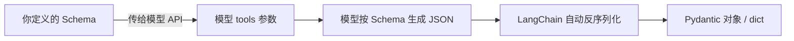
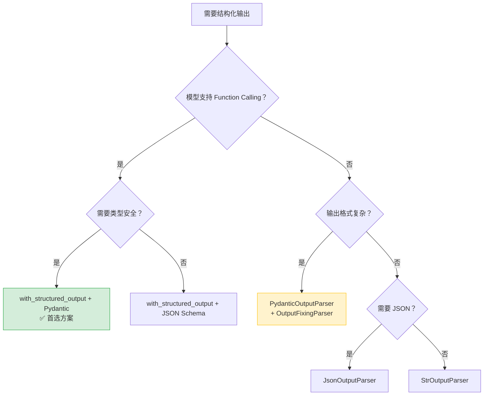

# 结构化输出总结与多模态案例

> [!info] 本文定位
> 本文是 [[01_输出解析与结构化]] 的进阶篇。前篇介绍了 OutputParser 体系（StrOutputParser、JsonOutputParser、PydanticOutputParser 等），本篇将聚焦 LangChain 推荐的 **统一结构化输出方案** `with_structured_output`，并以一个 **多模态机器人实战项目** 收尾，串联前面学到的所有知识。

---

## 1. with_structured_output：结构化输出的终极方案

### 1.1 为什么需要新方案？

在 [[01_输出解析与结构化]] 中，我们学习了多种 OutputParser，它们的工作流程都是：`模型生成自由文本 -> OutputParser 解析文本 -> 得到结构化数据`。这种 **"事后解析"** 模式有几个固有缺陷：

| 问题 | 说明 |
|------|------|
| **格式不稳定** | 模型可能不遵循 prompt 中的格式指令，导致解析失败 |
| **Prompt 侵入** | 需要在 prompt 中注入大段格式说明，占用上下文窗口 |
| **错误恢复成本高** | 解析失败后只能重试或用 `OutputFixingParser` 二次修复 |
| **类型不安全** | `JsonOutputParser` 返回 `dict`，缺乏编译期类型检查 |

### 1.2 设计理念

`with_structured_output` 的核心思路是：**不再让模型"生成文本后翻译"，而是让模型直接"说结构化的语言"**。

> [!tip] 通俗类比
> - **OutputParser** = 翻译官模式：对方说中文，你找个翻译帮你转成英文，翻译可能出错。
> - **with_structured_output** = 直接说对方的语言：对方本身就用英文回答你，省去翻译环节。

### 1.3 底层原理：Function Calling / Tool Use

`with_structured_output` 利用了现代大模型提供的 **结构化生成能力**：

- **OpenAI** → Function Calling（`tools` 参数）
- **Anthropic** → Tool Use（`tools` 参数）
- **通义千问 / Google Gemini** → Function Call



模型在生成时就被 **约束在 Schema 内**，从根本上提高输出的可靠性。

### 1.4 支持的模型

> [!warning] 并非所有模型都支持
> `with_structured_output` 依赖模型的 Function Calling / Tool Use 能力，不支持的模型需回退到 OutputParser。

| 模型提供商 | 对应 LangChain 包 | 支持情况 |
|------------|-------------------|----------|
| OpenAI (GPT-4o, GPT-4) | `langchain-openai` | 完全支持 |
| Anthropic (Claude 4 Sonnet 等) | `langchain-anthropic` | 完全支持 |
| Google Gemini | `langchain-google-genai` | 完全支持 |
| 通义千问 (Qwen) | `langchain-community` | 支持 |
| Ollama（本地部署） | `langchain-ollama` | 部分支持 |

---

## 2. with_structured_output 实战

### 2.1 方式一：传入 Pydantic 模型（推荐）

这是最常用也是 **最推荐** 的方式，兼具类型安全与开发体验。

```python
# pip install langchain langchain-openai pydantic

from langchain_openai import ChatOpenAI
from pydantic import BaseModel, Field

# 1. 定义 Pydantic 模型
class BookInfo(BaseModel):
    """从用户描述中提取书籍信息。"""
    title: str = Field(description="书名")
    author: str = Field(description="作者")
    year: int = Field(description="出版年份")
    genre: str = Field(description="书籍类型，如：小说、科幻、历史等")

# 2. 用 with_structured_output 绑定 Schema
llm = ChatOpenAI(model="gpt-4o", temperature=0)
structured_llm = llm.with_structured_output(BookInfo)

# 3. 直接调用，返回值就是 Pydantic 对象
result = structured_llm.invoke("刘慈欣的《三体》是2008年出版的科幻小说")

print(type(result))    # <class '__main__.BookInfo'>
print(result.title)    # 三体
print(result.author)   # 刘慈欣
print(result.year)     # 2008
print(result.genre)    # 科幻
```

> [!tip] 返回值类型分析
> 当传入 Pydantic 模型时，返回值就是该模型的 **实例**，可以直接用 `.` 访问属性，享受 IDE 的自动补全和类型检查。这与 `PydanticOutputParser` 类似，但不需要在 prompt 中注入格式指令。

### 2.2 方式二：传入 JSON Schema

如果不想引入 Pydantic，可以直接传入符合 JSON Schema 规范的字典。

```python
# pip install langchain langchain-openai

from langchain_openai import ChatOpenAI

json_schema = {
    "title": "BookInfo",
    "description": "从用户描述中提取书籍信息",
    "type": "object",
    "properties": {
        "title": {"type": "string", "description": "书名"},
        "author": {"type": "string", "description": "作者"},
        "year": {"type": "integer", "description": "出版年份"},
        "genre": {"type": "string", "description": "书籍类型"},
    },
    "required": ["title", "author", "year", "genre"],
}

llm = ChatOpenAI(model="gpt-4o", temperature=0)
structured_llm = llm.with_structured_output(json_schema)
result = structured_llm.invoke("刘慈欣的《三体》是2008年出版的科幻小说")
print(type(result))  # <class 'dict'>
print(result)        # {'title': '三体', 'author': '刘慈欣', 'year': 2008, 'genre': '科幻'}
```

> [!warning] 注意
> 传入 JSON Schema 时，返回值是普通 `dict`，没有类型安全保障。通常只在动态 Schema 场景（如 Schema 来自数据库配置）下使用。

### 2.3 方式三：传入 TypedDict（Python 原生类型）

从 LangChain v0.2 开始，还支持 Python 标准库的 `TypedDict`，不依赖 Pydantic。

```python
# pip install langchain langchain-openai

from typing import TypedDict, Annotated
from langchain_openai import ChatOpenAI

class BookInfo(TypedDict):
    """从用户描述中提取书籍信息。"""
    title: Annotated[str, ..., "书名"]
    author: Annotated[str, ..., "作者"]
    year: Annotated[int, ..., "出版年份"]
    genre: Annotated[str, ..., "书籍类型"]

llm = ChatOpenAI(model="gpt-4o", temperature=0)
structured_llm = llm.with_structured_output(BookInfo)
result = structured_llm.invoke("刘慈欣的《三体》是2008年出版的科幻小说")
print(type(result))  # <class 'dict'>
```

### 2.4 include_raw=True：获取原始输出

有时你需要同时看到模型的 **原始响应** 和解析结果（用于调试或日志）。

```python
# pip install langchain langchain-openai pydantic

from langchain_openai import ChatOpenAI
from pydantic import BaseModel, Field

class BookInfo(BaseModel):
    title: str = Field(description="书名")
    author: str = Field(description="作者")

llm = ChatOpenAI(model="gpt-4o", temperature=0)
structured_llm = llm.with_structured_output(BookInfo, include_raw=True)
result = structured_llm.invoke("三体是刘慈欣写的")

print(result["raw"])            # AIMessage 原始响应对象
print(result["parsed"])         # BookInfo(title='三体', author='刘慈欣')
print(result["parsing_error"])  # None（解析成功时）
```

### 2.5 在 LCEL 管道中使用

`with_structured_output` 返回的是一个 **Runnable**，完美兼容 LCEL 管道（详见 [[02_LangChain底层原理]]）。

```python
# pip install langchain langchain-openai pydantic langchain-core

from langchain_openai import ChatOpenAI
from langchain_core.prompts import ChatPromptTemplate
from pydantic import BaseModel, Field

class Sentiment(BaseModel):
    """情感分析结果。"""
    text: str = Field(description="原始文本")
    sentiment: str = Field(description="情感倾向：positive / negative / neutral")
    confidence: float = Field(description="置信度，0-1 之间")

prompt = ChatPromptTemplate.from_messages([
    ("system", "你是一个情感分析专家。"),
    ("human", "请分析以下文本的情感：{text}"),
])
llm = ChatOpenAI(model="gpt-4o", temperature=0)

# 构建 LCEL 管道：Prompt → 结构化 LLM
chain = prompt | llm.with_structured_output(Sentiment)
result = chain.invoke({"text": "这家餐厅的菜太好吃了，下次还来！"})
# Sentiment(text='...', sentiment='positive', confidence=0.95)
```

---

## 3. 结构化输出方案总结与对比

### 3.1 方案全景对比

| 方案 | 类型安全 | 流式支持 | 模型要求 | 使用复杂度 | 推荐场景 |
|------|:--------:|:--------:|----------|:----------:|----------|
| `StrOutputParser` | -- | 原生支持 | 任意模型 | 极低 | 只需要纯文本输出 |
| `JsonOutputParser` | -- | 支持 | 任意模型 | 低 | 需要 JSON 但 Schema 简单 |
| `PydanticOutputParser` | 强 | 不支持 | 任意模型 | 中 | 模型不支持 Function Calling |
| `with_structured_output` (Pydantic) | **强** | **支持** | 需 Function Calling | **低** | **大多数场景首选** |
| `with_structured_output` (JSON Schema) | -- | 支持 | 需 Function Calling | 低 | 动态 Schema |
| `with_structured_output` (TypedDict) | 中 | 支持 | 需 Function Calling | 低 | 不想依赖 Pydantic |

### 3.2 选型建议

> [!tip] 一句话选型
> **模型支持 Function Calling → `with_structured_output` + Pydantic；不支持 → `PydanticOutputParser`。**

- **OutputParser 系列**：不依赖模型能力，任何能生成文本的模型都能用。适合开源小模型、旧版 API。
- **with_structured_output**：可靠性高、代码简洁、支持流式。适合 GPT-4o / Claude / Qwen 等主流商用模型。

### 3.3 决策流程图



---

## 4. 实战项目：多模态机器人

### 4.1 项目需求

构建一个 **多模态智能助手**，能够接收 **文本 + 图片** 混合输入、理解图片内容并用自然语言回答、将分析结果以 **结构化格式** 输出。

> [!info] 什么是多模态？
> **多模态 (Multimodal)** 指模型能同时处理多种类型的数据输入——文本、图片、音频、视频等。GPT-4o、Claude 4 Sonnet、Qwen-VL 等模型都支持图文多模态。

### 4.2 多模态在 LangChain 中的实现原理

在 LangChain 中，多模态输入通过 `HumanMessage` 的 **content 列表** 实现。`content` 不仅可以是字符串，还可以是包含 `text` 和 `image_url` 类型元素的列表：

```python
from langchain_core.messages import HumanMessage

msg = HumanMessage(content=[
    {"type": "text", "text": "请描述这张图片"},
    {"type": "image_url", "image_url": {"url": "https://example.com/cat.jpg"}},
])
```

### 4.3 支持多模态的模型

| 模型 | LangChain 包 | 备注 |
|------|-------------|------|
| GPT-4o / GPT-4o-mini | `langchain-openai` | 最主流的多模态模型 |
| Claude 4 Sonnet / Claude 3.5 Sonnet | `langchain-anthropic` | 图片理解能力强 |
| Gemini 1.5 / Gemini 2 | `langchain-google-genai` | 支持超长上下文 |
| Qwen-VL | `langchain-community` | 国内可用方案 |

### 4.4 完整代码实现

#### 4.4.1 图片编码工具函数

```python
# pip install langchain langchain-openai pydantic Pillow requests

import base64
from pathlib import Path

def encode_image_to_base64(image_path: str) -> str:
    """将本地图片文件编码为 base64 字符串。"""
    path = Path(image_path)
    if not path.exists():
        raise FileNotFoundError(f"图片不存在：{image_path}")
    with open(path, "rb") as f:
        return base64.standard_b64encode(f.read()).decode("utf-8")

def get_image_media_type(image_path: str) -> str:
    """根据文件后缀推断 MIME 类型。"""
    suffix = Path(image_path).suffix.lower()
    mime_map = {".jpg": "image/jpeg", ".jpeg": "image/jpeg",
                ".png": "image/png", ".gif": "image/gif", ".webp": "image/webp"}
    return mime_map.get(suffix, "image/jpeg")
```

#### 4.4.2 构建多模态消息

```python
from langchain_core.messages import HumanMessage, SystemMessage

def build_multimodal_message(
    text: str,
    image_path: str | None = None,
    image_url: str | None = None,
) -> HumanMessage:
    """构建一条包含文本和图片的多模态消息。"""
    content = [{"type": "text", "text": text}]

    if image_path:
        b64 = encode_image_to_base64(image_path)
        media_type = get_image_media_type(image_path)
        content.append({
            "type": "image_url",
            "image_url": {"url": f"data:{media_type};base64,{b64}"},
        })
    elif image_url:
        content.append({
            "type": "image_url",
            "image_url": {"url": image_url},
        })

    return HumanMessage(content=content)
```

#### 4.4.3 调用模型处理图文

```python
from langchain_openai import ChatOpenAI

llm = ChatOpenAI(model="gpt-4o", temperature=0)

# 方式 A：本地图片 / 方式 B：在线 URL
msg = build_multimodal_message(
    text="请描述这张图片的内容",
    image_path="./photos/landscape.jpg",
    # image_url="https://example.com/photo.jpg",  # 或使用 URL
)

response = llm.invoke([
    SystemMessage(content="你是一个多模态图片分析助手，请用中文回答。"),
    msg,
])
print(response.content)
```

#### 4.4.4 结构化输出解析图片内容

将 **多模态 + 结构化输出** 结合，这是本章知识的综合运用。

```python
# pip install langchain langchain-openai pydantic

from langchain_openai import ChatOpenAI
from langchain_core.messages import HumanMessage, SystemMessage
from pydantic import BaseModel, Field

class ImageAnalysis(BaseModel):
    """图片分析结果的结构化输出。"""
    description: str = Field(description="图片的整体描述，1-3句话")
    objects: list[str] = Field(description="图片中识别到的主要物体列表")
    scene: str = Field(description="场景类型：室内/室外/自然/城市/其他")
    dominant_colors: list[str] = Field(description="图片的主要颜色")
    mood: str = Field(description="图片传达的氛围或情绪")

llm = ChatOpenAI(model="gpt-4o", temperature=0)
structured_llm = llm.with_structured_output(ImageAnalysis)

msg = build_multimodal_message(
    text="请仔细分析这张图片，提取关键信息。",
    image_path="./photos/landscape.jpg",
)

result = structured_llm.invoke([
    SystemMessage(content="你是一个专业的图片分析 AI 助手。"),
    msg,
])

print(f"描述：{result.description}")
print(f"物体：{result.objects}")
print(f"场景：{result.scene}")
print(f"主色调：{result.dominant_colors}")
print(f"氛围：{result.mood}")
```

输出示例：

```
描述：一幅宁静的山间湖泊风景照，湖面倒映着远处的雪山和蓝天。
物体：['湖泊', '雪山', '松树', '蓝天', '白云']
场景：自然 | 主色调：['蓝色', '白色', '绿色'] | 氛围：宁静祥和
```

### 4.5 图片 URL vs base64 编码对比

| 特性 | URL 输入 | base64 编码 |
|------|----------|------------|
| **适用场景** | 图片在公开服务器上 | 本地图片或私有网络图片 |
| **传输效率** | 高（模型端直接拉取） | 低（体积约增大 33%） |
| **隐私性** | 需 URL 公开可访问 | 数据嵌入请求，更安全 |
| **可靠性** | 受网络波动影响 | 不受外部网络影响 |

> [!tip] 推荐策略
> **开发调试 / 用户上传** 场景用 base64；**已有公开图片** 用 URL 以减少传输开销。

### 4.6 错误处理与边界情况

在生产环境中，需要妥善处理异常场景：

```python
# pip install langchain langchain-openai pydantic

from pathlib import Path
from langchain_openai import ChatOpenAI
from pydantic import BaseModel, Field

class ImageAnalysis(BaseModel):
    description: str = Field(description="图片描述")
    objects: list[str] = Field(description="识别到的物体")

def safe_analyze_image(image_path: str, text: str = "请分析这张图片") -> dict:
    """带错误处理的图片分析函数。"""
    path = Path(image_path)
    if not path.exists():
        return {"error": f"文件不存在：{image_path}"}

    size_mb = path.stat().st_size / (1024 * 1024)
    if size_mb > 20:
        return {"error": f"图片过大：{size_mb:.1f}MB，上限为 20MB"}

    valid_extensions = {".jpg", ".jpeg", ".png", ".gif", ".webp"}
    if path.suffix.lower() not in valid_extensions:
        return {"error": f"不支持的格式：{path.suffix}"}

    try:
        llm = ChatOpenAI(model="gpt-4o", temperature=0)
        structured_llm = llm.with_structured_output(ImageAnalysis, include_raw=True)
        msg = build_multimodal_message(text=text, image_path=image_path)
        result = structured_llm.invoke([msg])

        if result["parsing_error"]:
            return {"error": f"解析失败：{result['parsing_error']}"}
        return {"data": result["parsed"]}
    except Exception as e:
        return {"error": f"模型调用失败：{str(e)}"}
```

> [!warning] 常见错误
> 1. **图片格式不支持**：确保使用 JPEG、PNG、GIF 或 WebP 格式。
> 2. **图片过大**：OpenAI 限制单张图片最大 20MB，建议预处理压缩。
> 3. **模型不支持多模态**：纯文本模型（如 GPT-3.5-turbo）无法处理图片输入。
> 4. **API 限流**：多模态请求消耗更多 Token，注意速率限制。

---

## 5. 项目扩展思路

### 5.1 加入 Memory 实现多轮图文对话

当前实现是 **单轮** 问答。加入对话记忆后，机器人可以记住之前分析过的图片、支持追问和跨图片比较。

```python
# pip install langchain langchain-openai langchain-core

from langchain_core.chat_history import InMemoryChatMessageHistory
from langchain_core.runnables.history import RunnableWithMessageHistory

store = {}
def get_session_history(session_id: str):
    if session_id not in store:
        store[session_id] = InMemoryChatMessageHistory()
    return store[session_id]

chain_with_memory = RunnableWithMessageHistory(chain, get_session_history)
```

### 5.2 结合 RAG 做图文检索

将图片分析结果写入向量数据库，实现 **基于语义的图片检索**：批量分析图片获取结构化描述 -> 描述文本向量化存入 ChromaDB / FAISS -> 用户自然语言查询检索最相关的图片。这将在后续章节 [[RAG 检索增强生成]] 中详细展开。

### 5.3 部署为 API 服务

使用 **LangServe** 可以将 Chain 快速部署为 REST API，前端通过 HTTP POST 发送图文数据即可获取结构化分析结果。

```python
# pip install langserve fastapi uvicorn

from fastapi import FastAPI
from langserve import add_routes

app = FastAPI(title="多模态分析 API")
add_routes(app, chain, path="/analyze")
# 启动：uvicorn main:app --reload
```

---

## 小结

本文覆盖了两大核心主题：**`with_structured_output`** 是 LangChain 推荐的结构化输出方案，通过 Function Calling 直接生成结构化数据，比 OutputParser 更可靠简洁；**多模态机器人** 展示了如何在 LangChain 中处理图文混合输入并结合结构化输出分析图片。

结合 [[01_输出解析与结构化]] 的 OutputParser 基础和本文的进阶方案，你已掌握 LangChain 中结构化输出的完整知识体系。接下来可以进入更复杂的应用场景：Chain 编排、Agent 工具调用、RAG 检索增强等（参见 [[01_LangChain概述与核心架构]] 中的模块全景图）。

