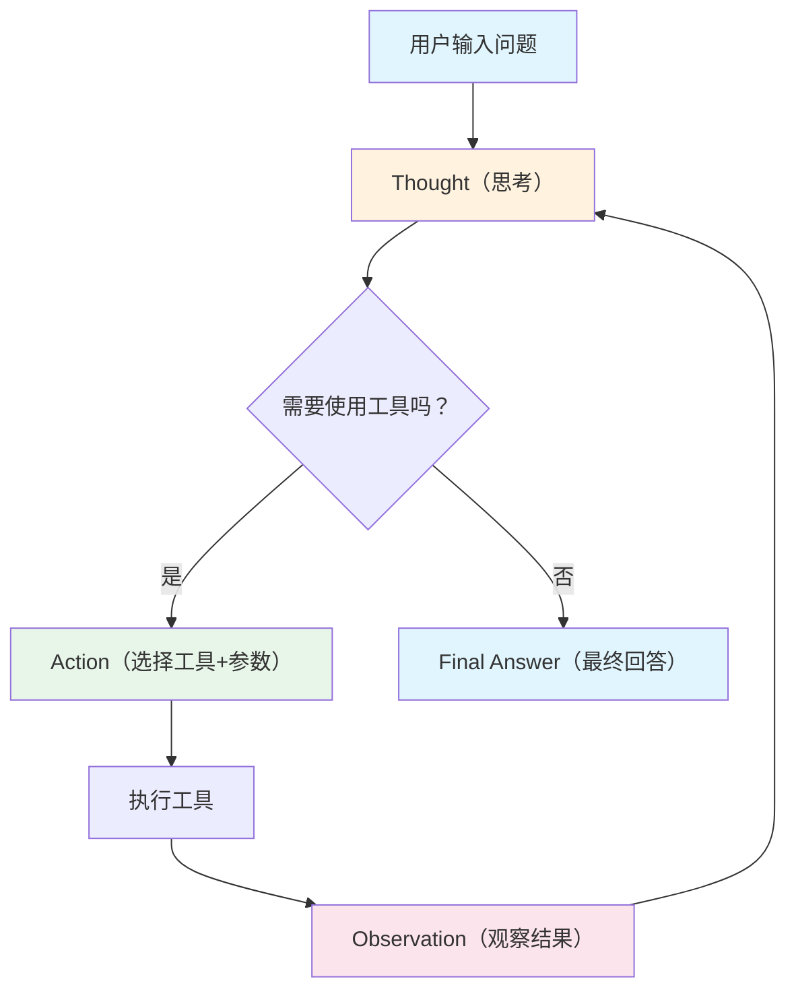
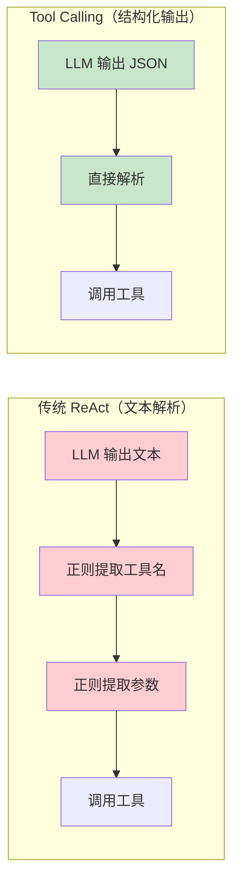
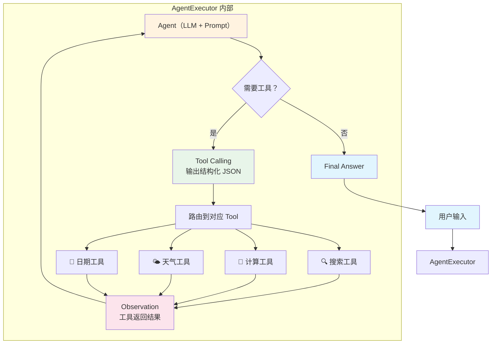

> 本篇是 [[01_工具系统]] 的续篇，假设你已了解 Tool 的定义方式。

## 三、ReAct 推理循环

### 3.1 什么是 ReAct

> [!info] 核心概念
> **ReAct** = **Re**asoning（推理）+ **Act**ing（行动）
>
> 这是 Yao et al. (2022) 提出的一种将推理和行动交织进行的范式。LLM 不再只是"想完再做"或"做完再想"，而是**想一步、做一步、看一步**，循环往复直到得出最终答案。

### 3.2 循环流程

ReAct 的核心是一个 **Thought-Action-Observation 循环**：



每个阶段的含义：

| 阶段 | 角色 | 说明 |
|------|------|------|
| **Thought** | LLM | 分析当前状态，决定下一步该做什么 |
| **Action** | LLM | 选择一个工具，并给出调用参数 |
| **Observation** | 工具 | 工具执行后返回的结果 |
| **Final Answer** | LLM | 当信息足够时，给出最终回答 |

### 3.3 与 Chain-of-Thought 的区别

ReAct 常被拿来与 Chain-of-Thought（CoT）对比，二者的关键差异在于：

| 维度 | Chain-of-Thought (CoT) | ReAct |
|------|------------------------|-------|
| **核心思想** | 让 LLM 一步步推理 | 推理 + 外部行动交替 |
| **是否调用工具** | 否，纯文本推理 | 是，主动调用外部工具 |
| **信息来源** | 仅依赖模型内部知识 | 模型知识 + 外部工具返回 |
| **适用场景** | 数学推理、逻辑推断 | 需要外部信息的复杂任务 |
| **幻觉风险** | 较高（纯靠记忆） | 较低（有外部事实校验） |

### 3.4 完整 ReAct 推理过程示例

下面展示一个 Agent 回答"2024 年诺贝尔物理学奖得主是谁？他们的代表作是什么？"的完整推理过程：

```
用户问题：2024 年诺贝尔物理学奖得主是谁？他们的代表作是什么？

━━━━━━ 第 1 轮 ━━━━━━

Thought: 用户问的是 2024 年的诺贝尔物理学奖，这是我训练数据截止日期之后
的事件，我需要搜索最新信息。

Action: search_web("2024年诺贝尔物理学奖得主")

Observation: 2024 年诺贝尔物理学奖授予 John Hopfield 和 Geoffrey Hinton，
以表彰他们在利用人工神经网络实现机器学习的基础性发现和发明方面的贡献。

━━━━━━ 第 2 轮 ━━━━━━

Thought: 我已经知道得主是 Hopfield 和 Hinton。现在需要查找他们的代表作。
让我搜索一下。

Action: search_web("John Hopfield Geoffrey Hinton 代表作 论文")

Observation: John Hopfield 的代表作是 1982 年提出的 Hopfield 网络
(联想记忆模型)。Geoffrey Hinton 的代表作包括反向传播算法的推广应用、
玻尔兹曼机、以及深度学习的奠基工作。

━━━━━━ 第 3 轮 ━━━━━━

Thought: 现在我有了完整的信息，可以回答用户的问题了。

Final Answer: 2024 年诺贝尔物理学奖授予了 John Hopfield 和 Geoffrey Hinton，
以表彰他们在人工神经网络与机器学习领域的基础性贡献。
- John Hopfield 的代表作是 1982 年提出的 **Hopfield 网络**（联想记忆模型）
- Geoffrey Hinton 的代表作包括**反向传播算法**的推广、**玻尔兹曼机**以及
  深度学习的一系列奠基性工作
```

> [!tip] 观察要点
> 注意 Agent 在第 1 轮搜索后，**主动判断**信息不完整（缺少代表作），于是在第 2 轮发起了第二次搜索。这种"根据中间结果动态调整"的能力正是 Agent 区别于 Chain 的核心优势。

---

## 四、Tool Calling Agent（推荐方式）

### 4.1 什么是 Tool Calling / Function Calling

传统 ReAct Agent 依赖**文本解析**——LLM 以纯文本格式输出"Action: xxx"，框架再用正则表达式提取工具名和参数。这种方式容易出错（格式不严格、参数解析失败等）。

**Tool Calling**（也叫 Function Calling）是一种更可靠的方式：LLM 直接以**结构化 JSON** 格式输出要调用的工具和参数，而不是靠文本解析。



### 4.2 两种方式的对比

| 维度 | 传统 ReAct（文本解析） | Tool Calling（推荐） |
|------|------------------------|----------------------|
| **输出格式** | 自由文本 | 结构化 JSON |
| **解析方式** | 正则表达式 | 原生 JSON 解析 |
| **可靠性** | 较低（格式错误频发） | 高（模型原生支持） |
| **模型要求** | 任意 LLM | 需要支持 Tool Calling 的模型 |
| **支持的模型** | 全部 | GPT-4/3.5、Claude 3+、Gemini 等 |
| **多工具并行** | 不支持 | 部分模型支持 |

> [!info] 推荐
> 如果你使用的模型支持 Tool Calling（目前主流商业模型和许多开源模型都已支持），**强烈建议使用 Tool Calling Agent** 而非传统 ReAct Agent。

### 4.3 `create_tool_calling_agent` 完整示例

下面是构建一个 Tool Calling Agent 的完整代码：

```python
# pip install langchain langchain-openai

from langchain_openai import ChatOpenAI
from langchain_core.tools import tool
from langchain_core.prompts import ChatPromptTemplate, MessagesPlaceholder
from langchain.agents import create_tool_calling_agent, AgentExecutor

# ── 1. 定义工具 ──────────────────────────────────
@tool
def add(a: float, b: float) -> float:
    """将两个数字相加。当用户需要计算加法时使用。"""
    return a + b

@tool
def multiply(a: float, b: float) -> float:
    """将两个数字相乘。当用户需要计算乘法时使用。"""
    return a * b

tools = [add, multiply]

# ── 2. 创建 Prompt ───────────────────────────────
# 必须包含 "agent_scratchpad" 占位符，用于存放推理中间过程
prompt = ChatPromptTemplate.from_messages([
    ("system", "你是一个有用的助手，可以使用工具来帮助用户解决问题。"),
    ("human", "{input}"),
    MessagesPlaceholder(variable_name="agent_scratchpad"),
])

# ── 3. 初始化 LLM ────────────────────────────────
llm = ChatOpenAI(model="gpt-4o", temperature=0)

# ── 4. 创建 Agent ────────────────────────────────
agent = create_tool_calling_agent(llm, tools, prompt)

# ── 5. 用 AgentExecutor 包装 ─────────────────────
agent_executor = AgentExecutor(
    agent=agent,
    tools=tools,
    verbose=True,  # 打印推理过程
)

# ── 6. 运行 ──────────────────────────────────────
result = agent_executor.invoke({"input": "请计算 (3 + 5) * 12 的结果"})
print(result["output"])
```

### 4.4 AgentExecutor 详解

`AgentExecutor` 是驱动 Agent 推理循环的"引擎"。它负责反复调用 Agent，将工具执行结果反馈给 Agent，直到 Agent 给出最终回答或达到迭代上限。

```python
agent_executor = AgentExecutor(
    agent=agent,           # Agent 实例
    tools=tools,           # 工具列表
    verbose=True,          # 是否打印每一步的推理过程
    max_iterations=10,     # 最大迭代次数，防止死循环
    max_execution_time=60, # 最大执行时间（秒）
    handle_parsing_errors=True,  # 解析错误时自动重试而非崩溃
    return_intermediate_steps=False,  # 是否在结果中返回中间步骤
)
```

核心参数说明：

| 参数 | 默认值 | 说明 |
|------|--------|------|
| `verbose` | `False` | 设为 `True` 可在控制台看到完整推理链路 |
| `max_iterations` | `15` | 超过此次数自动停止，防止 Agent 陷入死循环 |
| `max_execution_time` | `None` | 超时秒数，到达后强制停止 |
| `handle_parsing_errors` | `False` | 设为 `True` 后，工具调用格式错误时自动将错误信息反馈给 LLM 重试 |
| `return_intermediate_steps` | `False` | 设为 `True` 可获取每一步的 `(AgentAction, Observation)` 元组 |

> [!warning] 必须设置 `max_iterations`
> 在生产环境中一定要设置合理的 `max_iterations`（建议 5-15）。如果 Agent 推理出错陷入循环，没有上限会持续消耗 Token，造成不必要的费用。

### 4.5 端到端示例：搜索 + 计算 Agent

下面构建一个同时具备搜索和计算能力的 Agent：

```python
# pip install langchain langchain-openai langchain-community tavily-python

import os
from langchain_openai import ChatOpenAI
from langchain_core.tools import tool
from langchain_core.prompts import ChatPromptTemplate, MessagesPlaceholder
from langchain.agents import create_tool_calling_agent, AgentExecutor
from langchain_community.tools.tavily_search import TavilySearchResults

# ── 环境变量 ─────────────────────────────────────
# os.environ["OPENAI_API_KEY"] = "your-key"
# os.environ["TAVILY_API_KEY"] = "your-key"

# ── 工具定义 ─────────────────────────────────────
search = TavilySearchResults(
    max_results=3,
    description="搜索互联网获取实时信息。当用户询问最新事件、新闻、实时数据时使用。"
)

@tool
def calculator(expression: str) -> str:
    """计算数学表达式的结果。当用户需要进行数值计算时使用。

    Args:
        expression: 数学表达式，如 '2 + 3 * 4' 或 '100 / 7'
    """
    try:
        # 安全计算：只允许数学运算
        allowed_names = {"__builtins__": {}}
        result = eval(expression, allowed_names)
        return str(result)
    except Exception as e:
        return f"计算出错: {e}"

tools = [search, calculator]

# ── Prompt ───────────────────────────────────────
prompt = ChatPromptTemplate.from_messages([
    ("system",
     "你是一个有用的助手，擅长搜索信息和数学计算。"
     "回答问题时，如果需要最新信息请先搜索，如果需要计算请使用计算器。"
     "请用中文回答。"),
    ("human", "{input}"),
    MessagesPlaceholder(variable_name="agent_scratchpad"),
])

# ── 组装 Agent ───────────────────────────────────
llm = ChatOpenAI(model="gpt-4o", temperature=0)
agent = create_tool_calling_agent(llm, tools, prompt)
agent_executor = AgentExecutor(
    agent=agent,
    tools=tools,
    verbose=True,
    max_iterations=10,
    handle_parsing_errors=True,
)

# ── 运行示例 ─────────────────────────────────────
response = agent_executor.invoke({
    "input": "特斯拉目前的股价是多少？如果我持有 150 股，总价值是多少？"
})
print(response["output"])
```

运行后你将在控制台看到类似以下的推理过程：

```
> Entering new AgentExecutor chain...

Invoking: `tavily_search_results_json` with {'query': '特斯拉 当前股价'}
[搜索结果: 特斯拉 (TSLA) 当前股价约 $248.50...]

Invoking: `calculator` with {'expression': '248.50 * 150'}
37275.0

特斯拉 (TSLA) 当前股价约为 $248.50。
如果你持有 150 股，总价值约为 **$37,275.00**。

> Finished chain.
```

---

## 五、自定义工具实战

### 5.1 实战：天气查询 + 日期计算的多工具 Agent

下面我们构建一个更贴近实际的 Agent，它能查询天气并进行日期计算：

```python
# pip install langchain langchain-openai httpx

from datetime import datetime, timedelta
from langchain_openai import ChatOpenAI
from langchain_core.tools import tool
from langchain_core.prompts import ChatPromptTemplate, MessagesPlaceholder
from langchain.agents import create_tool_calling_agent, AgentExecutor

# ── 工具 1：天气查询 ─────────────────────────────
@tool
def get_weather(city: str) -> str:
    """查询指定城市的当前天气。当用户询问天气相关问题时使用。

    Args:
        city: 城市名称，如 '北京'、'上海'、'New York'
    """
    # 实际应用中，这里调用天气 API（如 OpenWeatherMap）
    # 这里用模拟数据演示
    weather_data = {
        "北京": {"temp": 22, "condition": "晴", "humidity": 35},
        "上海": {"temp": 26, "condition": "多云", "humidity": 70},
        "广州": {"temp": 30, "condition": "雷阵雨", "humidity": 85},
    }
    data = weather_data.get(city)
    if data:
        return (
            f"{city}当前天气：{data['condition']}，"
            f"温度 {data['temp']}°C，湿度 {data['humidity']}%"
        )
    return f"抱歉，暂不支持查询 {city} 的天气"

# ── 工具 2：日期计算 ─────────────────────────────
@tool
def date_calculator(operation: str, days: int) -> str:
    """进行日期计算。当用户需要计算几天前/后的日期，或者两个日期之间的天数时使用。

    Args:
        operation: 操作类型，可选 'add'（加天数）、'subtract'（减天数）、'today'（获取今天日期）
        days: 天数。operation 为 'today' 时此参数无效，传 0 即可
    """
    today = datetime.now()
    if operation == "today":
        return f"今天是 {today.strftime('%Y-%m-%d')}（{today.strftime('%A')}）"
    elif operation == "add":
        target = today + timedelta(days=days)
        return f"从今天起 {days} 天后是 {target.strftime('%Y-%m-%d')}（{target.strftime('%A')}）"
    elif operation == "subtract":
        target = today - timedelta(days=days)
        return f"从今天起 {days} 天前是 {target.strftime('%Y-%m-%d')}（{target.strftime('%A')}）"
    else:
        return f"不支持的操作: {operation}，请使用 'add'、'subtract' 或 'today'"

# ── 工具 3：温度转换 ─────────────────────────────
@tool
def convert_temperature(value: float, from_unit: str, to_unit: str) -> str:
    """转换温度单位。当用户需要在摄氏度和华氏度之间转换时使用。

    Args:
        value: 温度数值
        from_unit: 源单位，'C'（摄氏度）或 'F'（华氏度）
        to_unit: 目标单位，'C'（摄氏度）或 'F'（华氏度）
    """
    if from_unit == "C" and to_unit == "F":
        result = value * 9 / 5 + 32
        return f"{value}°C = {result:.1f}°F"
    elif from_unit == "F" and to_unit == "C":
        result = (value - 32) * 5 / 9
        return f"{value}°F = {result:.1f}°C"
    elif from_unit == to_unit:
        return f"{value}°{from_unit}（无需转换）"
    else:
        return f"不支持的单位转换: {from_unit} -> {to_unit}"

# ── 组装 Agent ───────────────────────────────────
tools = [get_weather, date_calculator, convert_temperature]

prompt = ChatPromptTemplate.from_messages([
    ("system",
     "你是一个实用的生活助手，可以查询天气、计算日期和转换温度。"
     "回答时请简洁清晰，用中文回答。"),
    ("human", "{input}"),
    MessagesPlaceholder(variable_name="agent_scratchpad"),
])

llm = ChatOpenAI(model="gpt-4o", temperature=0)
agent = create_tool_calling_agent(llm, tools, prompt)
agent_executor = AgentExecutor(
    agent=agent,
    tools=tools,
    verbose=True,
    max_iterations=8,
    handle_parsing_errors=True,
)

# ── 测试多工具协作 ───────────────────────────────
response = agent_executor.invoke({
    "input": "北京今天天气怎么样？温度换算成华氏度是多少？另外，30天后是几号？"
})
print(response["output"])
```

> [!tip] 多工具协作
> 注意这个问题需要 Agent **依次调用三个工具**：先查天气，再用返回的温度做华氏度转换，最后计算日期。Agent 会自动规划调用顺序并串联结果。支持 Tool Calling 的模型（如 GPT-4o）甚至可以**并行调用**多个独立工具以提高效率。

### 5.2 工具错误处理

工具在执行过程中可能会遇到各种错误。良好的错误处理能让 Agent 优雅地应对异常情况：

```python
# pip install langchain langchain-openai httpx

import httpx
from langchain_core.tools import tool
from langchain_core.tools import ToolException

@tool
def fetch_stock_price(symbol: str) -> str:
    """查询股票的当前价格。

    Args:
        symbol: 股票代码，如 'AAPL'、'TSLA'、'GOOGL'
    """
    try:
        # 模拟 API 调用
        if not symbol.isalpha():
            raise ToolException(f"无效的股票代码: {symbol}")

        # 实际场景中调用股票 API
        prices = {"AAPL": 185.50, "TSLA": 248.50, "GOOGL": 175.20}
        price = prices.get(symbol.upper())
        if price is None:
            return f"未找到股票代码 {symbol} 的价格信息，请确认代码是否正确"
        return f"{symbol.upper()} 当前股价: ${price}"

    except ToolException:
        raise  # ToolException 直接抛出，交给 AgentExecutor 处理
    except httpx.TimeoutException:
        return "查询超时，请稍后重试"
    except Exception as e:
        return f"查询出错: {str(e)}"

# 自定义错误处理函数
def handle_tool_error(error: ToolException) -> str:
    """将工具异常转换为对 Agent 友好的错误消息。"""
    return f"工具执行出错: {error.args[0]}。请检查输入参数后重试。"

# 设置错误处理
fetch_stock_price.handle_tool_error = handle_tool_error
```

> [!info] 错误处理策略
> - **可恢复错误**（如网络超时）：在工具内部捕获，返回提示性文本让 Agent 知道发生了什么
> - **参数错误**：抛出 `ToolException`，配合 `handle_tool_error` 让 Agent 收到明确的错误信息并可能修正参数重试
> - **配合 `handle_parsing_errors=True`**：AgentExecutor 层面自动处理解析异常

### 5.3 工具返回值格式化

工具返回值的格式直接影响 Agent 的推理质量。结构化、清晰的返回值能帮助 Agent 更准确地理解信息：

```python
# pip install langchain

import json
from langchain_core.tools import tool

@tool
def search_products(keyword: str, category: str = "all") -> str:
    """在商品库中搜索商品。当用户需要查找商品信息时使用。

    Args:
        keyword: 搜索关键词
        category: 商品类别，可选 'all'、'electronics'、'books'、'clothing'
    """
    # 模拟搜索结果
    results = [
        {"name": "Python 编程入门", "price": 59.9, "rating": 4.8, "stock": 120},
        {"name": "Python 数据分析", "price": 79.9, "rating": 4.6, "stock": 85},
    ]

    if not results:
        return "未找到匹配的商品。"

    # 格式化为 Agent 容易理解的结构化文本
    output_lines = [f"找到 {len(results)} 个相关商品：\n"]
    for i, item in enumerate(results, 1):
        output_lines.append(
            f"{i}. {item['name']}\n"
            f"   价格: ¥{item['price']}\n"
            f"   评分: {item['rating']}/5.0\n"
            f"   库存: {item['stock']} 件"
        )
    return "\n".join(output_lines)
```

> [!tip] 返回值最佳实践
> - 返回**结构化文本**而非原始 JSON（Agent 更容易理解自然语言格式）
> - 包含关键数值的**单位**（¥、$、°C、件）
> - 没有结果时返回明确的"未找到"提示，而非空字符串
> - 控制返回长度，避免超长输出浪费 Token

---

## 六、Agent 调试与最佳实践

### 6.1 verbose 模式查看推理过程

`verbose=True` 是调试 Agent 最直接的方式。开启后，每一步的 Thought、Action、Observation 都会打印到控制台。

```python
# pip install langchain langchain-openai

from langchain.agents import AgentExecutor

# 方式 1：在 AgentExecutor 中开启
agent_executor = AgentExecutor(
    agent=agent,
    tools=tools,
    verbose=True,  # 打印完整推理过程
)

# 方式 2：使用 LangChain 全局调试模式
from langchain.globals import set_debug, set_verbose
set_debug(True)    # 最详细：打印所有内部调用
set_verbose(True)  # 中等详细度：打印关键步骤
```

> [!tip] 调试分级
> - **`verbose=True`**：看 Agent 的 Thought/Action/Observation 循环，适合日常开发
> - **`set_verbose(True)`**：看 Chain 级别的输入输出
> - **`set_debug(True)`**：看所有 LangChain 内部调用（含 Prompt 原文），适合排查疑难问题
> - **LangSmith**：生产级可观测性平台，推荐在正式项目中使用（参见 [[03_开发环境与LangSmith监控]]）

### 6.2 `max_iterations` 防止死循环

Agent 可能因为以下原因陷入死循环：
- 工具返回了 Agent 无法理解的结果
- Agent 反复调用同一个工具但参数略有不同
- 工具持续返回错误，Agent 不断重试

```python
# pip install langchain langchain-openai

agent_executor = AgentExecutor(
    agent=agent,
    tools=tools,
    max_iterations=8,      # 最多迭代 8 次
    max_execution_time=30, # 最多运行 30 秒

    # 达到上限时的行为：
    # early_stopping_method="force"  —— 强制返回当前已有信息（默认）
    # early_stopping_method="generate" —— 让 LLM 基于已有信息生成最终回答
)
```

### 6.3 常见问题排查表

| 问题 | 可能原因 | 解决方案 |
|------|----------|----------|
| Agent 不调用任何工具 | 工具 description 描述不清，LLM 不知道该用 | 优化工具描述，明确说明使用场景 |
| Agent 调用了错误的工具 | 多个工具描述相似，LLM 混淆 | 让每个工具的描述更具区分度 |
| Agent 陷入死循环 | 工具返回格式不合理/错误信息不明确 | 检查工具返回值，设置 `max_iterations` |
| 工具参数解析失败 | 类型注解缺失或不准确 | 确保所有参数都有明确的类型注解和 Field 描述 |
| Agent 回答不完整 | `max_iterations` 设置过低 | 适当增大迭代上限 |
| Token 消耗过高 | 工具返回值过长/迭代次数过多 | 精简工具返回值，优化 Prompt，设置合理上限 |
| Agent 产生幻觉 | 未使用搜索工具，依赖内部知识回答 | 在 system prompt 中强调"不确定时必须搜索" |
| 异步调用报错 | 在同步上下文中调用了 `ainvoke` | 使用 `invoke` 或确保在 async 上下文中运行 |

### 6.4 Agent 选型建议表

不同场景适合不同的方案。以下是选型指南：

| 场景 | 推荐方案 | 理由 |
|------|----------|------|
| 流程固定（翻译、摘要、格式转换） | **LCEL Chain** | 可预测、省 Token、调试简单 |
| 需要 1-2 个工具、流程相对简单 | **Tool Calling Agent** | 灵活且可靠 |
| 需要多个工具、多步推理 | **Tool Calling Agent** + 合理 `max_iterations` | 动态决策，自主推理 |
| 需要人工确认/审批环节 | **LangGraph** | 支持人机交互节点 |
| 多 Agent 协作 | **LangGraph** | 支持多智能体编排 |
| 复杂状态管理（购物车、表单） | **LangGraph** | 支持有状态图 |
| 需要条件分支 + 循环 + 并行 | **LangGraph** | 图结构天然支持 |

> [!info] 趋势提示
> LangChain 团队已明确表示，**LangGraph 是 Agent 的未来方向**。`AgentExecutor` 适合入门和简单场景，但复杂的 Agent 应用建议使用 LangGraph 构建。详见 [[06_LangGraph入门]]。

---

## 七、完整架构图

将本篇的所有概念串联成一张全景图：



---

## 八、总结与延伸

### 8.1 本章知识点自检表

完成本章学习后，检查自己是否能回答以下问题：

| # | 自检问题 | 对应章节 |
|---|----------|----------|
| 1 | Agent 与 Chain 的本质区别是什么？ | 一 |
| 2 | Tool 的三个核心组成部分是什么？ | 二 |
| 3 | `@tool` 装饰器自动提取了哪些信息？ | 二 |
| 4 | 为什么工具的 `description` 如此重要？ | 二 |
| 5 | ReAct 的三个阶段分别是什么？ | 三 |
| 6 | ReAct 与 Chain-of-Thought 有什么区别？ | 三 |
| 7 | Tool Calling 相比传统文本解析有哪些优势？ | 四 |
| 8 | `AgentExecutor` 的 `max_iterations` 为什么必须设置？ | 四 / 六 |
| 9 | 工具出错时有哪些处理策略？ | 五 |
| 10 | 何时应该用 Agent，何时应该用 Chain 或 LangGraph？ | 六 |

### 8.2 核心概念速记

```
Agent = LLM（思考） + Tool（行动） + 推理循环（协调）

ReAct 循环：Thought → Action → Observation → ... → Final Answer

Tool = name + description + function
       ↑ description 决定 LLM 是否会选择这个工具

Tool Calling > 文本解析  （结构化 JSON vs 正则提取）

AgentExecutor 三板斧：verbose + max_iterations + handle_parsing_errors
```

### 8.3 延伸阅读

- **更复杂的 Agent 场景**：当你需要多 Agent 协作、人工审批节点、复杂状态管理时，请学习 [[06_LangGraph入门]]
- **底层原理回顾**：Tool Calling 本质上是 LLM 的结构化输出能力，可回顾 [[02_LangChain底层原理]] 中的 Runnable 接口设计
- **输出解析**：Agent 内部也需要解析 LLM 的输出来决定下一步动作，可参考 [[01_输出解析与结构化]]
- **生产部署**：将 Agent 部署为 API 服务，参见 [[07_LangServe部署与生产实践]]

---

> [!quote] 一句话总结
> Agent 让 LLM 从"被动回答者"变成"主动执行者"——它能思考该用什么工具、用完看结果、再决定下一步，直到任务完成。这种"边想边做"的能力，是构建真正智能应用的关键一步。
