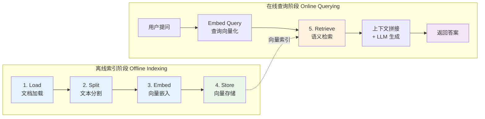

# 文档索引构建

## 1 为什么需要 RAG

### 1.1 LLM 的知识局限性

大语言模型虽然强大，但存在三个根本性的局限：

| 局限 | 说明 | 实际影响 |
|------|------|----------|
| **训练数据截止** | 模型只知道训练时的数据，之后发生的事一无所知 | 问"2026 年最新政策"可能得到过时甚至错误的答案 |
| **无法访问私有数据** | 模型未见过你的公司文档、内部 Wiki、客户数据 | 无法回答企业内部知识相关的问题 |
| **幻觉问题（Hallucination）** | 模型在不确定时会"一本正经地胡说八道" | 生成看似合理但完全虚构的法条、论文引用、API 参数 |

> [!warning] 易错避坑
> 幻觉问题是 LLM 在生产环境中最危险的缺陷。模型不会说"我不知道"，而是会编造一个听起来可信的答案。RAG 通过提供真实的参考资料，能显著降低幻觉发生的概率。

### 1.2 RAG 的核心思想

**RAG（Retrieval-Augmented Generation，检索增强生成）** 的核心思想只有一句话：**先检索、再生成**。

在让 LLM 回答问题之前，先从外部知识库中检索出与问题相关的文档片段，然后将这些片段作为上下文注入到 Prompt 中，让模型"带着参考资料"来回答。

#### 费曼类比：开卷考试

想象 LLM 是一位考生：

- **不用 RAG** = 闭卷考试。考生只能凭记忆答题，记不清的只好瞎编（幻觉）。
- **使用 RAG** = 开卷考试。考生可以翻书找答案再作答，答案更准确、更有依据。
- **知识库** = 考场上允许携带的参考书。书的质量和相关性决定了考生能答多好。
- **检索器** = 考生的"翻书能力"。能不能快速找到正确的章节是关键。

> [!info] 概念解析
> RAG 由 Meta（Facebook）的 Lewis et al. 于 2020 年在论文 *"Retrieval-Augmented Generation for Knowledge-Intensive NLP Tasks"* 中首次提出。它将**参数化知识**（模型权重中存储的知识）与**非参数化知识**（外部文档库中的知识）结合，取长补短。

### 1.3 RAG vs Fine-tuning 对比

在让 LLM 获取新知识时，RAG 和 Fine-tuning（微调）是两条最常见的路径。以下是详细对比：

| 维度 | RAG（检索增强生成） | Fine-tuning（微调） |
|------|---------------------|---------------------|
| **核心方式** | 运行时从外部知识库检索相关文档 | 用新数据重新训练模型参数 |
| **知识更新** | 实时更新，替换文档即可 | 需要重新训练，周期长 |
| **成本** | 低——只需维护向量数据库 | 高——GPU 算力 + 训练时间 |
| **幻觉控制** | 强——答案可溯源到具体文档 | 弱——仍可能编造内容 |
| **私有数据** | 天然支持，文档不离开你的环境 | 数据需要参与训练，有泄露风险 |
| **技能习得** | 不擅长——无法改变模型的推理方式 | 擅长——可以教模型新的输出风格、语言、格式 |
| **适用场景** | 知识问答、文档搜索、客服 | 风格迁移、领域适配、格式控制 |
| **实施难度** | 中等——搭建检索流水线 | 较高——需要数据标注 + 训练经验 |

> [!tip] 学习提示
> RAG 和 Fine-tuning 并不互斥。在实际项目中，常见的做法是：先用 **Fine-tuning 调整模型的输出风格和格式**，再用 **RAG 注入最新的领域知识**。两者结合往往能获得最佳效果。

---

## 2 RAG 五步流水线总览

### 2.1 流水线全景

RAG 的工作流程可以拆分为五个标准步骤，分属两个阶段：



### 2.2 离线索引 vs 在线查询

| 阶段 | 步骤 | 频率 | 目标 |
|------|------|------|------|
| **离线索引** | Load → Split → Embed → Store | 数据更新时执行一次 | 将原始文档转化为可检索的向量索引 |
| **在线查询** | 用户提问 → Embed Query → Retrieve → Generate | 每次用户提问时执行 | 基于检索结果实时生成回答 |

> [!info] 概念解析
> 离线索引是一次性的准备工作（或在文档更新时增量执行），计算量较大但不影响用户体验。在线查询则要求低延迟，检索和生成都需要高效执行。

### 2.3 各步骤使用的 LangChain 组件

| 步骤 | 对应组件 | 核心类 | 所在包 |
|------|----------|--------|--------|
| **Load** | Document Loaders | `TextLoader`, `PyPDFLoader`, `WebBaseLoader` | `langchain-community` |
| **Split** | Text Splitters | `RecursiveCharacterTextSplitter` | `langchain-text-splitters` |
| **Embed** | Embedding Models | `OpenAIEmbeddings`, `HuggingFaceEmbeddings` | `langchain-openai`, `langchain-huggingface` |
| **Store** | Vector Stores | `FAISS`, `Chroma` | `langchain-community`, `langchain-chroma` |
| **Retrieve** | Retrievers | `VectorStoreRetriever`, `MultiQueryRetriever` | `langchain-core`, `langchain` |

---

## 3 Document Loaders（文档加载）

### 3.1 核心概念

Document Loader 负责从各种数据源加载原始数据，并将其统一转换为 LangChain 的 `Document` 对象。

#### Document 对象结构

每个 `Document` 包含两个核心字段：

```python
# pip install langchain-core
from langchain_core.documents import Document

doc = Document(
    page_content="这是文档的实际文本内容...",  # 文本内容
    metadata={                                  # 元信息
        "source": "knowledge_base.pdf",         # 来源文件
        "page": 0,                              # 页码
        "author": "张三",                       # 自定义元数据
    }
)
```

> [!info] 概念解析
> `metadata` 中的信息在检索阶段非常有用——你可以根据来源、日期、标签等进行过滤，也可以在生成回答时引用来源，实现**答案溯源**。

### 3.2 常用 Loader 详解

```python
# pip install langchain-community pypdf beautifulsoup4
from langchain_community.document_loaders import (
    TextLoader, PyPDFLoader, CSVLoader, WebBaseLoader, DirectoryLoader,
)

# --- TextLoader：纯文本文件 ---
loader = TextLoader("./docs/readme.txt", encoding="utf-8")
documents = loader.load()  # 整个文件 = 1 个 Document

# --- PyPDFLoader：PDF 文件（每页 = 1 个 Document） ---
loader = PyPDFLoader("./docs/report.pdf")
documents = loader.load()
print(f"PDF 共 {len(documents)} 页, 元信息: {documents[0].metadata}")
# 输出: {'source': './docs/report.pdf', 'page': 0}

# --- CSVLoader：CSV 文件（每行 = 1 个 Document） ---
loader = CSVLoader("./docs/products.csv", encoding="utf-8")
documents = loader.load()

# --- WebBaseLoader：网页抓取 ---
loader = WebBaseLoader("https://python.langchain.com/docs/introduction/")
documents = loader.load()

# --- DirectoryLoader：批量加载整个目录 ---
loader = DirectoryLoader(
    "./docs/", glob="**/*.txt",
    loader_cls=TextLoader,
    loader_kwargs={"encoding": "utf-8"},
    show_progress=True,
)
documents = loader.load()
print(f"共加载 {len(documents)} 个文档")
```

### 3.3 Loader 选型速查表

| Loader | 数据源 | 返回粒度 | 安装依赖 |
|--------|--------|----------|----------|
| `TextLoader` | `.txt` 文本文件 | 整个文件 = 1 个 Document | — |
| `PyPDFLoader` | `.pdf` 文件 | 每页 = 1 个 Document | `pypdf` |
| `CSVLoader` | `.csv` 文件 | 每行 = 1 个 Document | — |
| `WebBaseLoader` | 网页 URL | 整个页面 = 1 个 Document | `beautifulsoup4` |
| `DirectoryLoader` | 文件夹 | 取决于子 Loader | — |
| `UnstructuredMarkdownLoader` | `.md` 文件 | 按元素分割 | `unstructured` |
| `JSONLoader` | `.json` 文件 | 可自定义 jq 表达式 | `jq` |
| `NotionDirectoryLoader` | Notion 导出 | 每个页面 = 1 个 Document | — |

---

## 4 Text Splitters（文本分割）

### 4.1 为什么要分割

加载完文档后，通常需要将长文档切分为较小的块（chunks），原因有二：

1. **上下文窗口限制**：LLM 的上下文窗口有限（如 GPT-4o 为 128K tokens），无法一次性塞入所有文档。即使窗口足够大，塞入过多无关内容也会降低回答质量。
2. **检索精度**：短而聚焦的文本块比长文档更容易被精确匹配。如果一个 Document 包含 10 页内容，即使只有半页与问题相关，整个 Document 都会被检索出来，噪声很大。

> [!tip] 学习提示
> 分块的目标是让每个 chunk 既**足够完整**（包含一个完整的语义单元），又**足够聚焦**（不包含过多无关内容）。这是一个需要根据具体场景调优的平衡点。

### 4.2 RecursiveCharacterTextSplitter（推荐）

这是 LangChain 中最常用、最推荐的分割器。它按照一组**分隔符优先级**递归地分割文本，尽量保持语义完整性。

#### 工作原理

1. 按第一个分隔符（默认 `\n\n`，即段落）尝试分割
2. 如果分割后的块仍然太大，则按第二个分隔符（`\n`，即换行）继续分割
3. 依此类推，直到每个块的大小不超过 `chunk_size`

```python
# pip install langchain-text-splitters
from langchain_text_splitters import RecursiveCharacterTextSplitter

splitter = RecursiveCharacterTextSplitter(
    chunk_size=500,          # 每块最大字符数
    chunk_overlap=50,        # 相邻块之间的重叠字符数
    separators=[             # 分隔符优先级（从高到低）
        "\n\n",              # 段落
        "\n",                # 换行
        "。",                # 中文句号
        "！",                # 中文感叹号
        "？",                # 中文问号
        "；",                # 中文分号
        "，",                # 中文逗号
        " ",                 # 空格
        "",                  # 单字符兜底
    ],
    length_function=len,     # 长度计算函数
)

# 分割纯文本
text = "这是一段很长的文档内容..." * 100
chunks = splitter.split_text(text)
print(f"分割为 {len(chunks)} 个块")

# 分割 Document 对象（保留 metadata）
from langchain_core.documents import Document
docs = [Document(page_content=text, metadata={"source": "test.txt"})]
split_docs = splitter.split_documents(docs)
print(f"每个块仍保留原始 metadata: {split_docs[0].metadata}")
```

#### 参数详解

| 参数 | 说明 | 推荐值 |
|------|------|--------|
| `chunk_size` | 每块的最大字符数 | 500-1000（中文），1000-2000（英文） |
| `chunk_overlap` | 相邻块重叠的字符数，防止语义被截断 | chunk_size 的 10%-20% |
| `separators` | 分隔符列表，按优先级从高到低排列 | 中文场景需加入中文标点 |
| `length_function` | 计算文本长度的函数 | `len`（按字符）或自定义 token 计数函数 |

### 4.3 chunk_size 和 chunk_overlap 的选择策略

这是 RAG 调优中最重要的超参数之一。选择不当会直接影响检索质量。

```
chunk_size 太小                      chunk_size 太大
┌──────────────┐                    ┌──────────────────────────────┐
│ 语义不完整   │                    │ 噪声多，不够聚焦             │
│ 上下文缺失   │                    │ 浪费上下文窗口 Token         │
│ 检索结果碎片化│                    │ 嵌入向量被稀释               │
└──────────────┘                    └──────────────────────────────┘
               \                  /
                \    推荐区间    /
                 \  500 - 1000 /
                  \  (中文)   /
                   ──────────
```

| 场景 | 推荐 chunk_size | 推荐 chunk_overlap | 说明 |
|------|----------------|-------------------|------|
| **FAQ / 短文档** | 200-500 | 20-50 | 每条 FAQ 本身就是一个完整语义单元 |
| **技术文档** | 500-1000 | 50-100 | 需要包含完整的代码块或概念解释 |
| **法律/合同文本** | 800-1500 | 100-200 | 条款通常较长，需要完整保留 |
| **学术论文** | 500-1000 | 50-100 | 按段落/小节分割 |
| **聊天记录** | 200-500 | 50 | 每段对话较短 |

> [!warning] 易错避坑
> `chunk_overlap` 设置为 0 时，分割点恰好位于句子中间的情况很常见，导致上下文丢失。至少设置 10% 的重叠量。但 overlap 也不宜过大，否则同一段文本会在多个 chunk 中重复出现，浪费存储和计算资源。

### 4.4 其他常用分割器

#### MarkdownHeaderTextSplitter — 按 Markdown 标题分割

```python
# pip install langchain-text-splitters
from langchain_text_splitters import MarkdownHeaderTextSplitter

markdown_text = """
# 第一章 简介

这是简介内容。

## 1.1 背景

这是背景说明。

## 1.2 目标

这是目标描述。

# 第二章 实现

这是实现细节。
"""

headers_to_split_on = [
    ("#", "h1"),
    ("##", "h2"),
]

splitter = MarkdownHeaderTextSplitter(headers_to_split_on=headers_to_split_on)
splits = splitter.split_text(markdown_text)

for split in splits:
    print(f"内容: {split.page_content[:50]}")
    print(f"标题层级: {split.metadata}")
    print("---")
# 每个块的 metadata 中会包含对应的标题层级信息
```

#### TokenTextSplitter — 按 Token 精确分割

```python
# pip install langchain-text-splitters tiktoken
from langchain_text_splitters import TokenTextSplitter

splitter = TokenTextSplitter(
    chunk_size=200,       # 按 token 数量切割
    chunk_overlap=20,
    encoding_name="cl100k_base",  # GPT-4 使用的编码
)

chunks = splitter.split_text("这是一段需要按 Token 分割的长文本..." * 50)
print(f"分割为 {len(chunks)} 个块")
```

> [!tip] 学习提示
> 对于大多数场景，`RecursiveCharacterTextSplitter` 就够用了。只有在需要严格控制 Token 数量时才用 `TokenTextSplitter`，在处理 Markdown 文档时用 `MarkdownHeaderTextSplitter` 可以获得更好的语义边界。

---

## 5 Embeddings（向量嵌入）

### 5.1 什么是 Embedding

**Embedding（嵌入）** 是将文本映射为高维数值向量的过程。关键特性是：**语义相近的文本，其向量在空间中的距离也相近**。

#### 直观理解

```
文本空间 (人类可读)          向量空间 (机器可算)
──────────────────          ──────────────────
"猫喜欢吃鱼"          →    [0.12, -0.34, 0.56, ...]
"小猫爱吃鱼"          →    [0.13, -0.33, 0.55, ...]  ← 距离近！
"今天天气不错"        →    [0.89, 0.23, -0.67, ...]  ← 距���远
```

Embedding 模型的作用就是将自然语言"翻译"成计算机能进行数学运算的向量，使得语义检索成为可能。

#### 费曼类比

把 Embedding 想象成给每本书贴一个**多维标签**：
- "烹饪书" → 标签是 (食物=高, 技术=低, 文学=低)
- "Python 教程" → 标签是 (食物=低, 技术=高, 文学=低)
- "Python 数据分析" → 标签是 (食物=低, 技术=高, 文学=低) ← 和 Python 教程"距离"近

只不过真实的 Embedding 向量不是 3 维，而是 **768 或 1536 甚至 3072 维**。

### 5.2 常用 Embedding 模型

| 模型 | 提供方 | 维度 | 特点 | 安装包 |
|------|--------|------|------|--------|
| `text-embedding-3-small` | OpenAI | 1536 | 性价比高，速度快 | `langchain-openai` |
| `text-embedding-3-large` | OpenAI | 3072 | 精度更高，成本更高 | `langchain-openai` |
| `nomic-embed-text` | Ollama (本地) | 768 | 完全免费，无需 API Key | `langchain-ollama` |
| `bge-large-zh-v1.5` | HuggingFace (本地) | 1024 | 中文效果出色 | `langchain-huggingface` |
| `all-MiniLM-L6-v2` | HuggingFace (本地) | 384 | 轻量快速，适合原型 | `langchain-huggingface` |

#### OpenAIEmbeddings

```python
# pip install langchain-openai
from langchain_openai import OpenAIEmbeddings

embeddings = OpenAIEmbeddings(model="text-embedding-3-small")

# 对单个查询文本做嵌入
query_vector = embeddings.embed_query("什么是 RAG？")
print(f"向量维度: {len(query_vector)}")  # 1536

# 对多个文档文本做嵌入
doc_vectors = embeddings.embed_documents([
    "RAG 是检索增强生成的缩写",
    "LangChain 是一个 LLM 开发框架",
    "向量数据库用于存储和检索向量",
])
print(f"文档数量: {len(doc_vectors)}, 每个维度: {len(doc_vectors[0])}")
```

#### OllamaEmbeddings（本地免费）

```python
# pip install langchain-ollama
# 前置条件：已安装 Ollama 并拉取模型 ollama pull nomic-embed-text
from langchain_ollama import OllamaEmbeddings

embeddings = OllamaEmbeddings(model="nomic-embed-text")

vector = embeddings.embed_query("本地嵌入模型，无需 API Key")
print(f"向量维度: {len(vector)}")  # 768
```

#### HuggingFaceEmbeddings（本地运行）

```python
# pip install langchain-huggingface sentence-transformers
from langchain_huggingface import HuggingFaceEmbeddings

embeddings = HuggingFaceEmbeddings(
    model_name="BAAI/bge-large-zh-v1.5",  # 中文效果优秀
    model_kwargs={"device": "cpu"},        # 或 "cuda"
    encode_kwargs={"normalize_embeddings": True},  # 归一化，利于余弦相似度计算
)

vector = embeddings.embed_query("BAAI 的中文嵌入模型效果很好")
print(f"向量维度: {len(vector)}")  # 1024
```

### 5.3 相似度计算演示

理解 Embedding 的关键在于理解**向量相似度**。以下示例展示余弦相似度如何反映语义关系：

```python
# pip install langchain-openai numpy
import numpy as np
from langchain_openai import OpenAIEmbeddings

embeddings = OpenAIEmbeddings(model="text-embedding-3-small")

# 准备三个语义不同的句子
texts = [
    "Python 是一种编程语言",      # 文本 A
    "Python 是流行的开发语言",     # 文本 B（与 A 语义相近）
    "今天的天气非常晴朗",          # 文本 C（与 A/B 语义无关）
]

vectors = embeddings.embed_documents(texts)

# 计算余弦相似度
def cosine_similarity(v1, v2):
    return np.dot(v1, v2) / (np.linalg.norm(v1) * np.linalg.norm(v2))

sim_ab = cosine_similarity(vectors[0], vectors[1])
sim_ac = cosine_similarity(vectors[0], vectors[2])
sim_bc = cosine_similarity(vectors[1], vectors[2])

print(f"A vs B (语义相近): {sim_ab:.4f}")  # ≈ 0.92
print(f"A vs C (语义无关): {sim_ac:.4f}")  # ≈ 0.65
print(f"B vs C (语义无关): {sim_bc:.4f}")  # ≈ 0.63
# A 和 B 的相似度远高于 A/C 和 B/C
```

> [!info] 概念解析
> **余弦相似度**衡量两个向量方向的一致性，取值范围为 [-1, 1]。1 表示方向完全相同（语义完全一致），0 表示正交（无关），-1 表示方向完全相反。在文本嵌入场景中，相似度通常落在 [0.5, 1.0] 区间。

---

## 6 VectorStores（向量存储）

### 6.1 什么是向量数据库

向量数据库是专门为存储和检索高维向量设计的数据库。它的核心能力是**近似最近邻搜索（ANN）**——给定一个查询向量，快速找到数据库中与之最相似的 K 个向量。

传统数据库 vs 向量数据库：

| 特性 | 传统数据库（如 MySQL） | 向量数据库（如 FAISS） |
|------|------------------------|------------------------|
| **存储内容** | 结构化数据（表、行、列） | 高维向量 + 原始文本 + 元数据 |
| **查询方式** | 精确匹配（SQL WHERE） | 相似度搜索（距离计算） |
| **适用场景** | "找 id=123 的订单" | "找和这段话语义最像的文档" |
| **索引结构** | B-Tree, Hash | HNSW, IVF, PQ |

### 6.2 FAISS（本地轻量）

**FAISS**（Facebook AI Similarity Search）是 Meta 开源的向量相似度搜索库，纯本地运行，速度极快，非常适合原型开发和中小规模场景。

```python
# pip install langchain-openai langchain-community faiss-cpu
from langchain_openai import OpenAIEmbeddings
from langchain_community.vectorstores import FAISS
from langchain_core.documents import Document

embeddings = OpenAIEmbeddings(model="text-embedding-3-small")

documents = [
    Document(page_content="LangChain 是构建 LLM 应用的框架。", metadata={"source": "intro.md"}),
    Document(page_content="RAG 通过检索外部文档增强生成。", metadata={"source": "rag.md"}),
    Document(page_content="FAISS 是 Meta 开源的向量搜索库。", metadata={"source": "vectordb.md"}),
]

# 创建向量数据库 + 相似度搜索
vectorstore = FAISS.from_documents(documents, embeddings)
results = vectorstore.similarity_search("什么是检索增强生成？", k=2)
for doc in results:
    print(f"[{doc.metadata['source']}] {doc.page_content}")

# 带分数的搜索（L2 距离，分数越低越相似）
results_with_scores = vectorstore.similarity_search_with_score("LLM 框架", k=2)

# 保存 / 加载
vectorstore.save_local("./faiss_index")
loaded_vectorstore = FAISS.load_local(
    "./faiss_index", embeddings, allow_dangerous_deserialization=True,
)
```

### 6.3 Chroma（本地持久化）

**Chroma** 是一个轻量级的嵌入式向量数据库，API 简洁，支持持久化存储，非常适合本地开发和中小项目。

```python
# pip install langchain-chroma langchain-openai
from langchain_openai import OpenAIEmbeddings
from langchain_chroma import Chroma
from langchain_core.documents import Document

embeddings = OpenAIEmbeddings(model="text-embedding-3-small")
documents = [
    Document(page_content="Python 是一种通用编程语言。", metadata={"lang": "zh"}),
    Document(page_content="Go 语言适合编写高并发服务。", metadata={"lang": "zh"}),
]

# 创建并持久化
vectorstore = Chroma.from_documents(
    documents, embeddings,
    persist_directory="./chroma_db",
    collection_name="programming_langs",
)

# 相似度搜索 + 元数据过滤
results = vectorstore.similarity_search("后端开发", k=2, filter={"lang": "zh"})

# 重新加载 + 增量添加
loaded_vs = Chroma(
    persist_directory="./chroma_db",
    embedding_function=embeddings,
    collection_name="programming_langs",
)
loaded_vs.add_documents([
    Document(page_content="Rust 以内存安全著称。", metadata={"lang": "zh"}),
])
```

### 6.4 向量数据库选型表

| 数据库 | 类型 | 持久化 | 分布式 | 元数据过滤 | 适用场景 | 学习成本 |
|--------|------|--------|--------|------------|----------|----------|
| **FAISS** | 库（非数据库） | 手动保存/加载 | 否 | 否 | 原型开发、离线批量检索 | 低 |
| **Chroma** | 嵌入式数据库 | 自动 | 否 | 是 | 本地开发、中小项目 | 低 |
| **Milvus** | 独立服务 | 是 | 是 | 是 | 大规模生产、十亿级向量 | 中 |
| **Pinecone** | 全托管云服务 | 是 | 是 | 是 | 生产环境、免运维 | 低 |
| **Weaviate** | 独立服务 | 是 | 是 | 是 | 混合搜索（向量 + 关键词） | 中 |
| **Qdrant** | 独立服务 | 是 | 是 | 是 | 高性能生产、丰富的过滤 | 中 |
| **PGVector** | PostgreSQL 扩展 | 是 | 依赖 PG | 是（SQL） | 已有 PG 基础设施的团队 | 低 |

> [!tip] 学习提示
> 入门学习推荐 **FAISS**（零配置、速度快）或 **Chroma**（API 友好、支持持久化）。生产环境根据规模选择 **Milvus**（自建）或 **Pinecone**（托管）。如果团队已经在用 PostgreSQL，**PGVector** 是最省事的选择。

---


> 索引构建完成后，下一步是检索与生成。详见 [[02_检索链与RAG实战]]。
