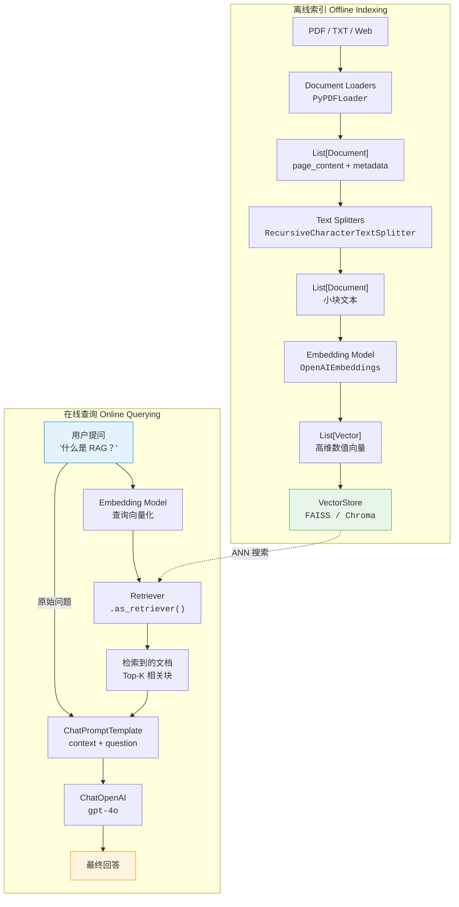

> 本篇是 [[01_文档索引构建]] 的续篇，假设你已完成向量索引的构建。

## 7 Retriever 与 RAG Chain

### 7.1 VectorStore → Retriever 转换

`Retriever` 是 LangChain 中定义的统一检索接口，所有向量数据库都可以通过 `.as_retriever()` 方法转换为 Retriever：

```python
# pip install langchain-openai langchain-community faiss-cpu
from langchain_openai import OpenAIEmbeddings
from langchain_community.vectorstores import FAISS

embeddings = OpenAIEmbeddings(model="text-embedding-3-small")
vectorstore = FAISS.from_texts(
    ["LangChain 是 LLM 框架", "RAG 是检索增强生成", "Agent 可以使用工具"],
    embeddings,
)

# 转换为 Retriever
retriever = vectorstore.as_retriever(
    search_type="similarity",     # 搜索类型
    search_kwargs={"k": 3},       # 返回 top-k 个结果
)

# 使用 Retriever 检索
docs = retriever.invoke("什么是 RAG？")
for doc in docs:
    print(doc.page_content)
```

#### 检索参数详解

| 参数 | 说明 | 可选值 |
|------|------|--------|
| `search_type` | 搜索策略 | `"similarity"` — 纯相似度<br/>`"mmr"` — 最大边际相关性（兼顾相关性和多样性）<br/>`"similarity_score_threshold"` — 带分数阈值 |
| `search_kwargs["k"]` | 返回结果数量 | 通常 3-5，太多会引入噪声 |
| `search_kwargs["score_threshold"]` | 相似度阈值（仅 threshold 模式） | 0.0-1.0，低于阈值的结果被过滤 |
| `search_kwargs["fetch_k"]` | MMR 模式下的候选数量 | 通常为 k 的 2-4 倍 |
| `search_kwargs["lambda_mult"]` | MMR 多样性控制 | 0-1，越小越多样 |

> [!info] 概念解析
> **MMR（Maximal Marginal Relevance，最大边际相关性）** 是一种平衡相关性和多样性的检索策略。它不仅考虑文档与查询的相似度，还会避免返回内容高度重复的文档。当你的知识库中有很多相似内容时，MMR 特别有用。

### 7.2 使用 LCEL 构建完整 RAG Chain

下面用 LCEL（LangChain Expression Language）管道语法手动搭建一条 RAG Chain：

```python
# pip install langchain langchain-openai langchain-community faiss-cpu
from langchain_openai import ChatOpenAI, OpenAIEmbeddings
from langchain_community.vectorstores import FAISS
from langchain_core.prompts import ChatPromptTemplate
from langchain_core.output_parsers import StrOutputParser
from langchain_core.runnables import RunnablePassthrough

# ---- 1. 构建向量数据库 ----
embeddings = OpenAIEmbeddings(model="text-embedding-3-small")
vectorstore = FAISS.from_texts(
    [
        "LangChain 由 Harrison Chase 于 2022 年 10 月开源。",
        "LCEL 使用管道符 | 来串联组件，是推荐的编排方式。",
        "LangGraph 用于构建有状态的 Agent 工作流。",
        "RAG 的核心思想是先检索、再生成。",
        "向量数据库通过 ANN 算法实现高效的相似度搜索。",
    ],
    embeddings,
)
retriever = vectorstore.as_retriever(search_kwargs={"k": 2})

# ---- 2. 定义 Prompt ----
prompt = ChatPromptTemplate.from_messages([
    ("system",
     "你是一个知识库助手。请根据以下参考资料回答用户的问题。"
     "如果参考资料中没有相关信息，请如实说明'根据已有资料无法回答'。\n\n"
     "参考资料：\n{context}"),
    ("human", "{question}"),
])

# ---- 3. 辅助函数：将 Document 列表格式化为文本 ----
def format_docs(docs):
    return "\n\n".join(
        f"[来源: {doc.metadata.get('source', '未知')}]\n{doc.page_content}"
        for doc in docs
    )

# ---- 4. 用 LCEL 组装 RAG Chain ----
llm = ChatOpenAI(model="gpt-4o", temperature=0)

rag_chain = (
    {
        "context": retriever | format_docs,   # 检索 + 格式化
        "question": RunnablePassthrough(),      # 直接传递用户问题
    }
    | prompt        # 拼接 Prompt
    | llm           # 调用 LLM
    | StrOutputParser()  # 提取文本
)

# ---- 5. 执行 ----
answer = rag_chain.invoke("LangChain 是什么时候开源的？")
print(answer)

# 流式输出
for chunk in rag_chain.stream("LCEL 是什么？"):
    print(chunk, end="", flush=True)
```

### 7.3 使用 create_retrieval_chain（高级封装）

LangChain 提供了更高层的封装，自动处理文档拼接和来源追踪：

```python
# pip install langchain langchain-openai langchain-community faiss-cpu
from langchain_openai import ChatOpenAI, OpenAIEmbeddings
from langchain_community.vectorstores import FAISS
from langchain_core.prompts import ChatPromptTemplate
from langchain.chains.combine_documents import create_stuff_documents_chain
from langchain.chains.retrieval import create_retrieval_chain

# ---- 1. 准备向量数据库和检索器 ----
embeddings = OpenAIEmbeddings(model="text-embedding-3-small")
vectorstore = FAISS.from_texts(
    [
        "Python 3.12 引入了类型参数语法（PEP 695）。",
        "Python 的 GIL 在 3.13 中可以被禁用（PEP 703）。",
        "asyncio 是 Python 的异步编程标准库。",
        "FastAPI 是基于 Starlette 和 Pydantic 的高性能 Web 框架。",
    ],
    embeddings,
)
retriever = vectorstore.as_retriever(search_kwargs={"k": 2})

# ---- 2. 创建文档链 ----
llm = ChatOpenAI(model="gpt-4o", temperature=0)

system_prompt = (
    "你是一个技术问答助手。请基于以下参考资料回答问题。\n\n"
    "参考资料：\n{context}"
)

prompt = ChatPromptTemplate.from_messages([
    ("system", system_prompt),
    ("human", "{input}"),
])

# create_stuff_documents_chain: 将检索到的文档"塞入"Prompt
document_chain = create_stuff_documents_chain(llm, prompt)

# ---- 3. 创建检索链 ----
# create_retrieval_chain: 自动执行 检索 → 文档拼接 → 生成
retrieval_chain = create_retrieval_chain(retriever, document_chain)

# ---- 4. 执行 ----
result = retrieval_chain.invoke({"input": "Python 3.13 有什么重要变化？"})

print("回答:", result["answer"])                  # LLM 的回答
print("参考文档数:", len(result["context"]))      # 检索到的原始文档
print("来源:", result["context"][0].page_content)  # 可以追溯来源
```

> [!tip] 学习提示
> `create_stuff_documents_chain` 的 "stuff" 是指把所有检索到的文档"塞入"一个 Prompt 里。当文档太多时，这种方式可能超出上下文窗口。LangChain 还提供了 `map_reduce`、`refine` 等策略来处理大量文档，但 "stuff" 是最常用和最简单的。

### 7.4 完整端到端示例：基于本地文档的问答系统

以下是一个从加载文档到问答的完整 RAG 应用：

```python
# pip install langchain langchain-openai langchain-community langchain-text-splitters faiss-cpu pypdf
from langchain_openai import ChatOpenAI, OpenAIEmbeddings
from langchain_community.document_loaders import DirectoryLoader, PyPDFLoader
from langchain_text_splitters import RecursiveCharacterTextSplitter
from langchain_community.vectorstores import FAISS
from langchain_core.prompts import ChatPromptTemplate
from langchain.chains.combine_documents import create_stuff_documents_chain
from langchain.chains.retrieval import create_retrieval_chain

# ========== 阶段一：离线索引（只需执行一次） ==========

# 1. 加载 → 2. 分割 → 3. 向量化 → 4. 存储
loader = DirectoryLoader("./knowledge_base/", glob="**/*.pdf",
                         loader_cls=PyPDFLoader, show_progress=True)
raw_docs = loader.load()

splitter = RecursiveCharacterTextSplitter(
    chunk_size=800, chunk_overlap=80,
    separators=["\n\n", "\n", "。", "！", "？", "；", "，", " ", ""],
)
chunks = splitter.split_documents(raw_docs)

embeddings = OpenAIEmbeddings(model="text-embedding-3-small")
vectorstore = FAISS.from_documents(chunks, embeddings)
vectorstore.save_local("./faiss_knowledge_base")  # 持久化

# ========== 阶段二：在线查询（每次提问时执行） ==========

vectorstore = FAISS.load_local(
    "./faiss_knowledge_base", embeddings, allow_dangerous_deserialization=True,
)
retriever = vectorstore.as_retriever(
    search_type="mmr", search_kwargs={"k": 4, "fetch_k": 10},
)

llm = ChatOpenAI(model="gpt-4o", temperature=0)
prompt = ChatPromptTemplate.from_messages([
    ("system",
     "你是知识库助手。请严格根据参考资料回答，无答案请说明。\n\n"
     "参考资料：\n{context}"),
    ("human", "{input}"),
])

rag_chain = create_retrieval_chain(
    retriever, create_stuff_documents_chain(llm, prompt),
)

result = rag_chain.invoke({"input": "文档中关于 XX 的说明是什么？"})
print("回答:", result["answer"])
print("来源:", [doc.metadata.get("source") for doc in result["context"]])
```

### 7.5 RAG 数据流全景图



---

## 8 RAG 优化策略

### 8.1 分块策略优化

分块质量是 RAG 性能的基础。以下是几种进阶策略：

| 策略 | 说明 | 适用场景 |
|------|------|----------|
| **语义分块** | 基于语义相似度而非固定字符数来确定分块边界 | 文档段落长度差异大 |
| **父子分块** | 用小块检索、返回大块上下文（Parent Document Retriever） | 需要精确检索但需要更多上下文 |
| **重叠分块** | 增大 chunk_overlap 确保关键信息不在边界丢失 | 信息密度高的文档 |
| **结构化分块** | 按 Markdown 标题、HTML 标签等结构分割 | 格式规范的文档 |

#### Parent Document Retriever 示例

```python
# pip install langchain langchain-openai langchain-community faiss-cpu
from langchain.retrievers import ParentDocumentRetriever
from langchain_text_splitters import RecursiveCharacterTextSplitter
from langchain_community.vectorstores import FAISS
from langchain_openai import OpenAIEmbeddings
from langchain.storage import InMemoryStore

embeddings = OpenAIEmbeddings(model="text-embedding-3-small")

# 子分块器（用于检索，块小 → 精准匹配）
child_splitter = RecursiveCharacterTextSplitter(chunk_size=200, chunk_overlap=20)

# 父分块器（用于返回，块大 → 上下文完整）
parent_splitter = RecursiveCharacterTextSplitter(chunk_size=1000, chunk_overlap=100)

vectorstore = FAISS.from_texts(["初始化"], embeddings)  # 初始化空 vectorstore
store = InMemoryStore()  # 存储父文档

retriever = ParentDocumentRetriever(
    vectorstore=vectorstore,
    docstore=store,
    child_splitter=child_splitter,
    parent_splitter=parent_splitter,
)

# 添加文档（自动执行父子分割）
retriever.add_documents(raw_documents)

# 检索时：用子块匹配，返回对应的父块
results = retriever.invoke("查询内容")
# 返回的是大块（父文档），但匹配精度来自小块（子文档）
```

### 8.2 多查询检索（MultiQueryRetriever）

用户的问题可能措辞不佳或角度单一，导致检索不全面。`MultiQueryRetriever` 让 LLM 将一个问题改写为多个不同角度的查询，分别检索后合并结果：

```python
# pip install langchain langchain-openai langchain-community faiss-cpu
from langchain.retrievers.multi_query import MultiQueryRetriever
from langchain_openai import ChatOpenAI, OpenAIEmbeddings
from langchain_community.vectorstores import FAISS

embeddings = OpenAIEmbeddings(model="text-embedding-3-small")
vectorstore = FAISS.from_texts(
    ["向量数据库使用 ANN 算法进行高效搜索。",
     "FAISS 支持 L2 距离和内积两种度量方式。",
     "HNSW 是一种高效的近似最近邻搜索算法。"],
    embeddings,
)

llm = ChatOpenAI(model="gpt-4o", temperature=0)
multi_retriever = MultiQueryRetriever.from_llm(
    retriever=vectorstore.as_retriever(search_kwargs={"k": 3}),
    llm=llm,
)

# LLM 会自动将问题改写为多个角度的查询，分别检索后合并去重
results = multi_retriever.invoke("向量搜索是怎么工作的？")
print(f"检索到 {len(results)} 个相关文档")
```

### 8.3 重排序（Reranker）

初始检索返回的结果按向量相似度排序，但向量相似度并不总是等于"语义相关度"。重排序（Rerank）使用更精确的模型对初始结果进行二次排序：

```python
# pip install langchain langchain-openai langchain-community faiss-cpu langchain-cohere
from langchain.retrievers import ContextualCompressionRetriever
from langchain_cohere import CohereRerank
from langchain_openai import OpenAIEmbeddings
from langchain_community.vectorstores import FAISS

# 初始检索器（召回较多候选）
embeddings = OpenAIEmbeddings(model="text-embedding-3-small")
vectorstore = FAISS.from_texts(
    [
        "Python 是一种解释型编程语言。",
        "Python 的创造者是 Guido van Rossum。",
        "蟒蛇（Python）是一种大型无毒蛇类。",      # 语义干扰项
        "Python 3.12 引入了更好的错误消息。",
        "PyPI 是 Python 的包管理仓库。",
    ],
    embeddings,
)
base_retriever = vectorstore.as_retriever(search_kwargs={"k": 5})

# 重排序器
reranker = CohereRerank(
    model="rerank-v3.5",
    top_n=3,  # 重排后只保留 top 3
)

# 组合：初始检索 + 重排序
compression_retriever = ContextualCompressionRetriever(
    base_compressor=reranker,
    base_retriever=base_retriever,
)

results = compression_retriever.invoke("Python 编程语言的特点")
# 重排序后，"蟒蛇"相关的干扰结果会被排到后面
for doc in results:
    print(doc.page_content)
```

> [!warning] 易错避坑
> 重排序会增加额外的 API 调用延迟和成本（Cohere Rerank 是付费 API）。对于延迟敏感的场景，需要权衡精度提升和延迟增加之间的 trade-off。对于大多数场景，先优化分块策略和 Prompt，效果不佳时再考虑加入 Reranker。

### 8.4 常见问题排查表

| 问题现象 | 可能原因 | 解决方案 |
|----------|----------|----------|
| 检索结果与问题无关 | chunk_size 太大，嵌入被稀释 | 减小 chunk_size，通常 500-800 |
| 检索结果遗漏关键信息 | chunk_overlap 为 0，信息在分块边界丢失 | 增大 chunk_overlap 至 chunk_size 的 10-20% |
| 返回多条重复内容 | 知识库中有大量相似文档 | 使用 `search_type="mmr"` 增加多样性 |
| 回答不够详细 | 检索的 k 值太小 | 增大 k 值（如从 3 增到 5） |
| 回答包含无关信息 | 检索的 k 值太大，噪声太多 | 减小 k 值，或使用 `score_threshold` 过滤 |
| 回答出现幻觉 | Prompt 没有约束模型只使用参考资料 | 在 system prompt 中明确要求"仅基于参考资料回答" |
| 中文检索效果差 | 分隔符未包含中文标点 | 在 separators 中加入 `"。"`, `"，"` 等 |
| 向量搜索速度慢 | 文档量过大，FAISS 使用暴力搜索 | 使用 `IndexIVFFlat` 索引或切换到 Milvus |
| Embedding 维度不匹配 | 索引和查询使用了不同的 Embedding 模型 | 确保索引和查询使用完全相同的模型和参数 |

---

## 9 总结

### 9.1 知识点自检表

完成本章学习后，请检查你是否能回答以下问题：

| 序号 | 自检问题 | 对应章节 |
|------|----------|----------|
| 1 | RAG 的核心思想是什么？与 Fine-tuning 有什么区别？ | 1.2, 1.3 |
| 2 | RAG 五步流水线的每一步分别做什么？ | 2.1 |
| 3 | Document 对象包含哪两个核心字段？ | 3.1 |
| 4 | `RecursiveCharacterTextSplitter` 的工作原理是什么？ | 4.2 |
| 5 | 如何选择 `chunk_size` 和 `chunk_overlap`？ | 4.3 |
| 6 | Embedding 是什么？为什么语义相近的文本向量距离近？ | 5.1 |
| 7 | FAISS 和 Chroma 各自的优缺点是什么？ | 6.2, 6.3, 6.4 |
| 8 | `similarity` 和 `mmr` 两种搜索类型有什么区别？ | 7.1 |
| 9 | 如何用 LCEL 手动搭建一条 RAG Chain？ | 7.2 |
| 10 | `create_retrieval_chain` 和手写 LCEL 链有什么区别？ | 7.3 |
| 11 | MultiQueryRetriever 解决了什么问题？ | 8.2 |
| 12 | 检索效果不好时，应该按什么顺序排查？ | 8.4 |

### 9.2 核心要点回顾

| 概念 | 一句话总结 |
|------|-----------|
| **RAG** | 先从知识库中检索相关文档，再让 LLM 基于文档生成回答 |
| **Document Loader** | 统一接口加载 PDF、网页、CSV 等数据源为 `Document` 对象 |
| **Text Splitter** | 将长文档按语义边界切分为适合检索的小块 |
| **Embedding** | 将文本转化为高维向量，使语义相似的文本在向量空间中距离相近 |
| **VectorStore** | 存储向量并提供高效的 ANN 近似最近邻搜索 |
| **Retriever** | 向量数据库之上的统一检索接口，通过 `.as_retriever()` 转换 |
| **RAG Chain** | 用 LCEL 将检索 → Prompt → LLM → 输出串联成端到端的问答流水线 |

### 9.3 下一步学习

> [!tip] 学习提示
> - 本章介绍的 RAG 是"独立工作"的模式。在实际项目中，RAG 经常与 **Agent** 结合使用——Agent 根据用户问题动态决定是否需要检索、检索什么内容。详见 → [[04_Agent与工具使用]]
> - 想回顾 LangChain 整体架构中 Retrieval 模块的定位？→ [[01_LangChain概述与核心架构]]
> - 更复杂的 RAG 场景（多步推理、自适应检索、人机协作）可以用 **LangGraph** 编排 → [[06_LangGraph入门]]

---

## 脚注

[^1]: **RAG（Retrieval-Augmented Generation）**：由 Meta 的 Lewis et al. 于 2020 年提出，核心思想是在生成回答前先从外部知识库检索相关文档，将参数化知识与非参数化知识结合。

[^2]: **ANN（Approximate Nearest Neighbor，近似最近邻）**：一类高效的向量搜索算法，通过构建索引结构（如 HNSW、IVF）在大规模向量集合中快速找到与查询向量最相似的结果，牺牲少量精度换取数量级的速度提升。

[^3]: **MMR（Maximal Marginal Relevance，最大边际相关性）**：一种检索策略，在选择结果时同时考虑与查询的相关性和与已选结果的差异性，避免返回高度重复的文档。

[^4]: **Cosine Similarity（余弦相似度）**：衡量两个向量方向一致性的指标，取值范围 [-1, 1]，常用于文本语义相似度计算。公式为：cos(θ) = (A · B) / (||A|| × ||B||)。

[^5]: **HNSW（Hierarchical Navigable Small World）**：一种高效的 ANN 索引算法，通过构建多层图结构实现对数级别的搜索复杂度，被 FAISS、Milvus、Qdrant 等广泛采用。
