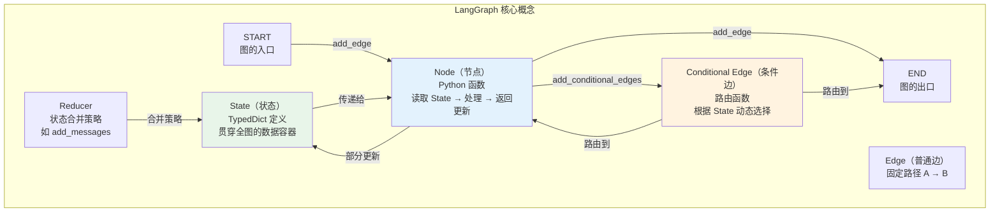
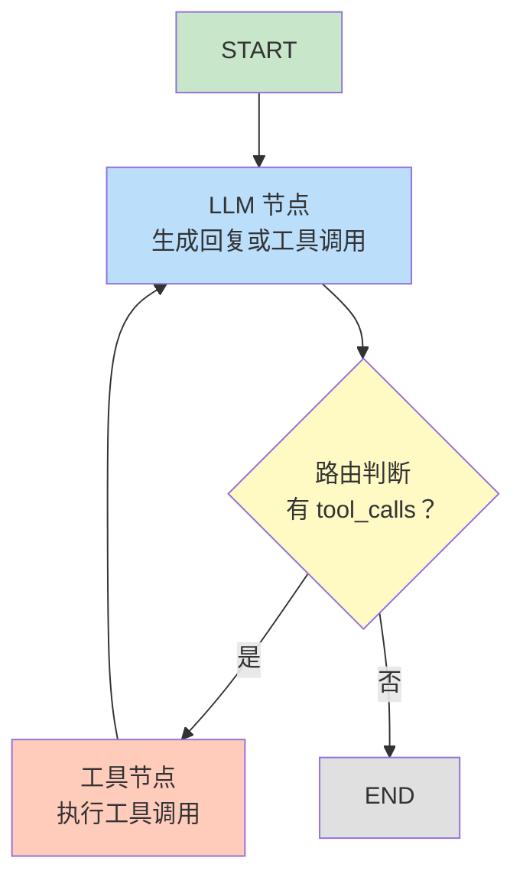
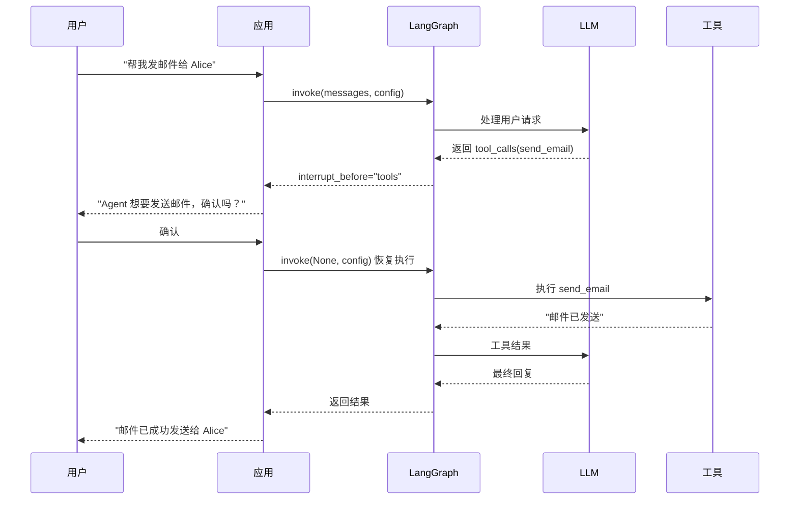

# LangGraph 入门

## 1 为什么需要 LangGraph

### 1.1 AgentExecutor 的局限性

在 [[01_LangChain概述与核心架构]] 中我们了解了 Agent 的基本概念，也在 [[04_Agent与工具使用]] 中使用 `AgentExecutor` 构建了工具调用 Agent。`AgentExecutor` 简单易用，但在真实生产场景中很快会暴露以下问题：

| 局限 | 说明 |
|------|------|
| **线性循环** | 内部只有一个固定的 LLM → Tool → LLM 循环，无法表达分支和并行逻辑 |
| **流程不可控** | 无法在循环中间插入自定义检查点、审批环节或条件跳转 |
| **无法持久化** | 循环状态全部保存在内存中，进程重启后一切丢失 |
| **调试困难** | 循环内部对开发者几乎是黑盒 |
| **人机协作缺失** | 无法在关键步骤暂停、等待人工审批后再继续 |

> [!warning] 易错避坑
> 很多教程仍在教 `AgentExecutor`，它适合快速原型验证，但**不适合生产环境**的复杂 Agent。LangChain 官方已明确推荐使用 **LangGraph** 作为下一代 Agent 编排框架。

### 1.2 LangGraph 的设计理念

**LangGraph** 的核心思想是：用**有向图（Directed Graph）** 来定义 Agent 的逻辑流程。图中的每个**节点（Node）** 是一个处理函数，每条**边（Edge）** 定义了数据流转的路径。图可以包含**循环**（不仅仅是 DAG），这正是 Agent "思考 → 行动 → 再思考" 反复推理所需要的。

这种设计带来了几个关键优势：

- **可视化**：整个 Agent 的逻辑可以用 Mermaid 图直观展示
- **可控性**：每个节点、每条边都由开发者显式定义，没有黑盒
- **可持久化**：图的运行状态可以随时保存和恢复
- **人机协作**：可以在任意节点前后插入"暂停"，等待人工干预

### 1.3 费曼类比

想象你要从家出发去一个陌生城市办事：

- **AgentExecutor** 像一辆**只能走直线的自动驾驶汽车**。它沿着一条固定路线不断前进：遇到障碍就绕一下，然后继续往前。它不会根据路况选择高速还是省道，不会在加油站停下来等你确认是否继续，也不会保存行程记录——如果车子熄火了，你只能从头再来。
- **LangGraph** 像一辆**装了 GPS 导航的汽车**。你提前在地图上规划好了所有可能的路线（节点和边），导航系统会根据实时路况（状态）选择最优路径（条件路由）。你可以在任何服务区停车休息（人机协作），GPS 会记住你的位置（持久化），下次启动时从断点继续。

### 1.4 AgentExecutor vs LangGraph 对比表

| 维度 | AgentExecutor | LangGraph |
|------|---------------|-----------|
| **流程定义** | 内置固定循环 | 开发者用有向图自由定义 |
| **分支逻辑** | 不支持 | 支持条件边（Conditional Edge） |
| **循环控制** | 固定的 LLM↔Tool 循环 | 任意节点间可建立循环 |
| **人机协作** | 不支持 | 原生支持 `interrupt_before` / `interrupt_after` |
| **状态持久化** | 不支持 | 内置 Checkpointer 机制 |
| **可视化** | 无 | 可自动生成 Mermaid 图 |
| **官方态度** | Legacy，逐步废弃 | 推荐使用 |

> [!tip] 学习提示
> 如果你的 Agent 只需要"给 LLM 几个工具让它自己调"，`AgentExecutor` 足够了。但只��你需要条件分支、人工审批、断点恢复中的任意一项，就应该使用 LangGraph。

---

## 2 核心概念

### 2.1 State（状态）

**State** 是贯穿整个图的**数据容器**，每个节点都能读取和更新它。通常用 `TypedDict` 定义：

```python
# pip install langgraph
from typing import TypedDict, Annotated
from langgraph.graph.message import add_messages

class AgentState(TypedDict):
    """Agent 的全局状态"""
    messages: Annotated[list, add_messages]  # 对话消息列表（自动追加）
    next_action: str                          # 下一步要执行的动作
```

> [!info] 概念解析
> `Annotated[list, add_messages]` 中的 `add_messages` 是一个 **Reducer 函数**。当节点返回新的 messages 时，Reducer 决定如何合并——`add_messages` 会将新消息**追加**到列表末尾，而不是覆盖。这是 LangGraph 状态管理的核心机制。

State 就像一块**共享白板**——所有参与讨论的人（节点）都能看到白板上的内容，也可以在上面写新信息，下一个人看到的是最新版本。

### 2.2 Node（节点）

**Node** 是图中的处理单元，本质上就是一个 Python 函数。它接收当前 State 作为输入，返回对 State 的**部分更新**：

```python
# pip install langgraph langchain-openai
from langchain_openai import ChatOpenAI

llm = ChatOpenAI(model="gpt-4o", temperature=0)

def chatbot_node(state: AgentState) -> dict:
    """聊天机器人节点：调用 LLM 生成回复"""
    response = llm.invoke(state["messages"])
    return {"messages": [response]}  # 返回部分更新，Reducer 会自动追加
```

> [!info] 概念解析
> 节点函数只需要返回需要**更新**的字段，而不是完整的 State。LangGraph 会自动将返回值与当前 State 合并（通过 Reducer 函数），节点之间天然解耦。

### 2.3 Edge（边）与 Conditional Edge（条件边）

**Edge** 是连接两个节点的固定路径。**Conditional Edge** 则根据当前 State 的内容**动态选择**下一个节点：

```python
# pip install langgraph
from langgraph.graph import StateGraph, START, END

graph = StateGraph(AgentState)
graph.add_node("chatbot", chatbot_node)

# 固定边
graph.add_edge(START, "chatbot")
graph.add_edge("chatbot", END)

# 条件边示例
def should_continue(state: AgentState) -> str:
    last_message = state["messages"][-1]
    if last_message.tool_calls:
        return "tools"
    return "end"

graph.add_conditional_edges(
    "chatbot",              # 从哪个节点出发
    should_continue,        # 路由函数
    {"tools": "tool_node", "end": END},  # 路由映射表
)
```

### 2.4 START 与 END

- **START**：图的入口点，用户输入首先流入 START 连接的第一个节点
- **END**：图的出口点，到达 END 时图的运行结束并返回最终 State

### 2.5 核心概念关系图



---

## 3 第一个 LangGraph 应用

### 3.1 最简示例：两节点对话图

```python
# pip install langgraph langchain-openai langchain-core
from typing import TypedDict, Annotated
from langgraph.graph import StateGraph, START, END
from langgraph.graph.message import add_messages
from langchain_openai import ChatOpenAI
from langchain_core.messages import HumanMessage

# ---- 1. 定义 State ----
class ChatState(TypedDict):
    messages: Annotated[list, add_messages]

# ---- 2. 定义节点函数 ----
llm = ChatOpenAI(model="gpt-4o", temperature=0.7)

def chatbot(state: ChatState) -> dict:
    response = llm.invoke(state["messages"])
    return {"messages": [response]}

# ---- 3. 构建图 ----
graph_builder = StateGraph(ChatState)
graph_builder.add_node("chatbot", chatbot)
graph_builder.add_edge(START, "chatbot")
graph_builder.add_edge("chatbot", END)

# ---- 4. 编译图 ----
graph = graph_builder.compile()

# ---- 5. 运行 ----
result = graph.invoke({
    "messages": [HumanMessage(content="你好！请用一句话介绍 LangGraph。")]
})
print(result["messages"][-1].content)
```

### 3.2 五步标准流程

| 步骤 | 操作 | 代码 |
|------|------|------|
| 1. 定义 State | 用 `TypedDict` 声明状态字段 | `class ChatState(TypedDict): ...` |
| 2. 定义 Node | 编写处理函数 | `def chatbot(state): ...` |
| 3. 构建 Graph | 创建 `StateGraph`，添加节点和边 | `graph_builder.add_node(...)` |
| 4. 编译 | 调用 `compile()` 生成可执行图 | `graph = graph_builder.compile()` |
| 5. 运行 | 调用 `invoke()` / `stream()` | `graph.invoke({...})` |

> [!tip] 学习提示
> `compile()` 会校验图的结构是否合法（例如是否有孤立节点、START 是否有出边等），并生成优化后的执行计划。编译后的图是不可变的，可以安全地在多线程环境中共享。

### 3.3 流式输出

```python
# pip install langgraph langchain-openai langchain-core
from langchain_core.messages import HumanMessage

for event in graph.stream(
    {"messages": [HumanMessage(content="请解释什么是状态机。")]},
    stream_mode="updates",
):
    for node_name, state_update in event.items():
        print(f"--- 节点: {node_name} ---")
        if "messages" in state_update:
            print(state_update["messages"][-1].content)
```

---

## 4 条件路由与循环

### 4.1 真正的 Agent：LLM + 工具循环

上面的两节点图只能"一问一答"，还不是真正的 Agent。真正的 Agent 需要**循环推理**：LLM 判断是否需要调用工具 → 调用工具 → 结果返回给 LLM → 再次判断... 直到给出最终答案。

### 4.2 循环推理流程



> [!info] 概念解析
> 注意从 **工具节点** 回到 **LLM 节点** 的边——这形成了一个**循环**。这是 LangGraph 与普通 DAG 的本质区别：它允许节点之间形成环路，实现 Agent 的反复推理过程。

### 4.3 完整代码示例

```python
# pip install langgraph langchain-openai langchain-core
from typing import TypedDict, Annotated
from langgraph.graph import StateGraph, START, END
from langgraph.graph.message import add_messages
from langgraph.prebuilt import ToolNode
from langchain_openai import ChatOpenAI
from langchain_core.tools import tool
from langchain_core.messages import HumanMessage

# ---- 1. 定义工具 ----
@tool
def search_weather(city: str) -> str:
    """查询指定城市的当前天气信息。"""
    weather_db = {
        "北京": "晴天，25°C，湿度 30%",
        "上海": "多云，22°C，湿度 65%",
        "深圳": "雷阵雨，28°C，湿度 85%",
    }
    return weather_db.get(city, f"抱歉，未找到 {city} 的天气数据。")

@tool
def calculate(expression: str) -> str:
    """计算数学表达式，返回结果。"""
    try:
        return f"计算结果: {eval(expression)}"
    except Exception as e:
        return f"计算错误: {e}"

tools = [search_weather, calculate]

# ---- 2. 定义 State ----
class AgentState(TypedDict):
    messages: Annotated[list, add_messages]

# ---- 3. 定义节点 ----
llm = ChatOpenAI(model="gpt-4o", temperature=0)
llm_with_tools = llm.bind_tools(tools)

def llm_node(state: AgentState) -> dict:
    """LLM 节点：生成回复或工具调用请求"""
    response = llm_with_tools.invoke(state["messages"])
    return {"messages": [response]}

tool_node = ToolNode(tools)

# ---- 4. 定义路由函数 ----
def should_continue(state: AgentState) -> str:
    last_message = state["messages"][-1]
    if last_message.tool_calls:
        return "tools"
    return "end"

# ---- 5. 构建图 ----
graph_builder = StateGraph(AgentState)
graph_builder.add_node("llm", llm_node)
graph_builder.add_node("tools", tool_node)

graph_builder.add_edge(START, "llm")
graph_builder.add_conditional_edges(
    "llm", should_continue, {"tools": "tools", "end": END},
)
graph_builder.add_edge("tools", "llm")  # 工具 → 回到 LLM（形成循环）

# ---- 6. 编译并运行 ----
graph = graph_builder.compile()

result = graph.invoke({
    "messages": [HumanMessage(
        content="北京今天天气怎么样？另外帮我算一下 1024 * 768 等于多少。"
    )]
})
print(result["messages"][-1].content)
```

执行流程：LLM 识别需要调用工具 → 路由到工具节点 → 工具节点执行并返回 `ToolMessage` → 回到 LLM 综合结果 → 无更多 `tool_calls` → 路由到 END。

> [!tip] 学习提示
> `ToolNode` 是 LangGraph 预置节点（`langgraph.prebuilt`），自动解析 `tool_calls`、调用工具函数、将结果包装为 `ToolMessage`。如果 LLM 一次返回多个 `tool_calls`，`ToolNode` 会并行执行它们。

---

## 5 Human-in-the-loop（人机协作）

### 5.1 什么场景需要人工介入

- **敏感操作审批**：删除数据、发送邮件、执行转账等不可逆操作
- **信息确认**：Agent 不确定用户意图时，需要人工澄清
- **合规要求**：金融、医疗等行业要求关键决策必须有人工参与

### 5.2 interrupt 机制

| 机制 | 时机 | 典型用途 |
|------|------|----------|
| `interrupt_before=["node"]` | 在**执行节点之前**暂停 | 审批即将执行的操作 |
| `interrupt_after=["node"]` | 在**执行节点之后**暂停 | 审核节点的输出结果 |

中断后，图的状态保存到 **Checkpointer** 中。人工确认后，传入相同的 `thread_id` 恢复执行。

### 5.3 代码示例：需要人工确认后才执行工具

```python
# pip install langgraph langchain-openai langchain-core
from typing import TypedDict, Annotated
from langgraph.graph import StateGraph, START, END
from langgraph.graph.message import add_messages
from langgraph.prebuilt import ToolNode
from langgraph.checkpoint.memory import MemorySaver
from langchain_openai import ChatOpenAI
from langchain_core.tools import tool
from langchain_core.messages import HumanMessage

@tool
def send_email(to: str, subject: str, body: str) -> str:
    """发送电子邮件。敏感操作，需要人工确认。"""
    return f"邮件已成功发送至 {to}，主题：{subject}"

tools = [send_email]

class State(TypedDict):
    messages: Annotated[list, add_messages]

llm = ChatOpenAI(model="gpt-4o", temperature=0)
llm_with_tools = llm.bind_tools(tools)

def assistant(state: State) -> dict:
    return {"messages": [llm_with_tools.invoke(state["messages"])]}

def route(state: State) -> str:
    if state["messages"][-1].tool_calls:
        return "tools"
    return "end"

# 构建图（注意 interrupt_before）
graph_builder = StateGraph(State)
graph_builder.add_node("assistant", assistant)
graph_builder.add_node("tools", ToolNode(tools))
graph_builder.add_edge(START, "assistant")
graph_builder.add_conditional_edges("assistant", route, {"tools": "tools", "end": END})
graph_builder.add_edge("tools", "assistant")

memory = MemorySaver()
graph = graph_builder.compile(
    checkpointer=memory,
    interrupt_before=["tools"],  # 在执行工具节点之前暂停！
)

# ---- 第一次运行：Agent 在工具节点前暂停 ----
config = {"configurable": {"thread_id": "email-thread-001"}}
result = graph.invoke(
    {"messages": [HumanMessage(content="帮我发邮件给 alice@example.com，主题是会议通知")]},
    config=config,
)

print("=== Agent 想要执行以下操作 ===")
for tc in result["messages"][-1].tool_calls:
    print(f"工具: {tc['name']}, 参数: {tc['args']}")

# ---- 人工确认后继续执行 ----
final_result = graph.invoke(None, config=config)  # None = 从暂停点继续
print(final_result["messages"][-1].content)
```

> [!info] 概念解析
> 关键在于 `compile(interrupt_before=["tools"])`。它告诉 LangGraph："每当即将进入 `tools` 节点时，暂停并保存状态。" 之后用 `graph.invoke(None, config)` 恢复执行——`None` 表示不注入新输入，直接从暂停点继续。

### 5.4 人机协作流程图



---

## 6 状态持久化（Checkpointer）

### 6.1 为什么需要持久化

- **断点恢复**：服务重启后能从上次暂停的地方继续执行
- **对话历史**：多轮对话的上下文需要跨请求保存
- **人机协作**：`interrupt` 机制依赖 Checkpointer 保存暂停时的状态
- **多用户隔离**：通过 `thread_id` 区分不同用户/会话的状态

### 6.2 内置 Checkpointer 类型

| Checkpointer | 存储位置 | 适用场景 |
|--------------|----------|----------|
| **MemorySaver** | 内存（Python dict） | 开发调试、单元测试 |
| **SqliteSaver** | SQLite 文件 | 单机部署、轻量生产 |
| **PostgresSaver** | PostgreSQL 数据库 | 分布式生产环境 |

> [!warning] 易错避坑
> `MemorySaver` 只存在于进程内存中，进程重启后数据全部丢失。**生产环境务必使用** `SqliteSaver` 或 `PostgresSaver`。

### 6.3 thread_id 的概念

`thread_id` 是 LangGraph 用来**隔离不同执行线程**的标识符。相同的 `thread_id` 共享同一份状态（对话历史、执行进度等），不同的 `thread_id` 彼此隔离。可以将它理解为 Web 应用中的 **Session ID**。

### 6.4 代码示例：使用 SqliteSaver 实现对话记忆

```python
# pip install langgraph langchain-openai langchain-core aiosqlite
from typing import TypedDict, Annotated
from langgraph.graph import StateGraph, START, END
from langgraph.graph.message import add_messages
from langgraph.checkpoint.sqlite import SqliteSaver
from langchain_openai import ChatOpenAI
from langchain_core.messages import HumanMessage

class ChatState(TypedDict):
    messages: Annotated[list, add_messages]

llm = ChatOpenAI(model="gpt-4o", temperature=0.7)

def chatbot(state: ChatState) -> dict:
    return {"messages": [llm.invoke(state["messages"])]}

graph_builder = StateGraph(ChatState)
graph_builder.add_node("chatbot", chatbot)
graph_builder.add_edge(START, "chatbot")
graph_builder.add_edge("chatbot", END)

with SqliteSaver.from_conn_string("checkpoint.db") as checkpointer:
    graph = graph_builder.compile(checkpointer=checkpointer)
    config = {"configurable": {"thread_id": "user-alice-001"}}

    # 第一轮对话
    result1 = graph.invoke(
        {"messages": [HumanMessage(content="我叫 Alice，我是一名数据工程师。")]},
        config=config,
    )
    print("第一轮:", result1["messages"][-1].content)

    # 第二轮对话（同一个 thread_id，自动携带历史）
    result2 = graph.invoke(
        {"messages": [HumanMessage(content="你还记得我的名字和职业吗？")]},
        config=config,
    )
    print("第二轮:", result2["messages"][-1].content)
    # 模型会回答："你叫 Alice，你是一名数据工程师。"

    # 不同的 thread_id，互不影响
    config_bob = {"configurable": {"thread_id": "user-bob-002"}}
    result3 = graph.invoke(
        {"messages": [HumanMessage(content="你知道我叫什么吗？")]},
        config=config_bob,
    )
    print("Bob 的对话:", result3["messages"][-1].content)
    # 模型不知道 Bob 的信息，因为这是一个全新的 thread
```

### 6.5 查看历史状态快照

```python
# pip install langgraph
for state_snapshot in graph.get_state_history(config):
    print(f"时间: {state_snapshot.created_at}")
    print(f"消息数: {len(state_snapshot.values.get('messages', []))}")
    print(f"下一步: {state_snapshot.next}")
    print("---")
```

---

## 7 与 AgentExecutor 的迁移对比

### 7.1 AgentExecutor 实现（旧方式）

```python
# pip install langchain langchain-openai langchain-core
from langchain_openai import ChatOpenAI
from langchain_core.tools import tool
from langchain.agents import create_tool_calling_agent, AgentExecutor
from langchain_core.prompts import ChatPromptTemplate

@tool
def get_weather(city: str) -> str:
    """查询天气"""
    return f"{city}: 晴天，25°C"

llm = ChatOpenAI(model="gpt-4o", temperature=0)
prompt = ChatPromptTemplate.from_messages([
    ("system", "你是一个天气助手。"),
    ("human", "{input}"),
    ("placeholder", "{agent_scratchpad}"),
])

agent = create_tool_calling_agent(llm, [get_weather], prompt)
executor = AgentExecutor(agent=agent, tools=[get_weather], verbose=True)
result = executor.invoke({"input": "北京天气如何？"})
print(result["output"])
```

### 7.2 LangGraph 实现（推荐方式）

```python
# pip install langgraph langchain-openai langchain-core
from typing import TypedDict, Annotated
from langgraph.graph import StateGraph, START, END
from langgraph.graph.message import add_messages
from langgraph.prebuilt import ToolNode
from langgraph.checkpoint.memory import MemorySaver
from langchain_openai import ChatOpenAI
from langchain_core.tools import tool
from langchain_core.messages import HumanMessage, SystemMessage

@tool
def get_weather(city: str) -> str:
    """查询天气"""
    return f"{city}: 晴天，25°C"

class State(TypedDict):
    messages: Annotated[list, add_messages]

llm = ChatOpenAI(model="gpt-4o", temperature=0)
llm_with_tools = llm.bind_tools([get_weather])

def assistant(state: State) -> dict:
    messages = [SystemMessage(content="你是一个天气助手。")] + state["messages"]
    return {"messages": [llm_with_tools.invoke(messages)]}

def route(state: State) -> str:
    if state["messages"][-1].tool_calls:
        return "tools"
    return "end"

builder = StateGraph(State)
builder.add_node("assistant", assistant)
builder.add_node("tools", ToolNode([get_weather]))
builder.add_edge(START, "assistant")
builder.add_conditional_edges("assistant", route, {"tools": "tools", "end": END})
builder.add_edge("tools", "assistant")

graph = builder.compile(checkpointer=MemorySaver())

config = {"configurable": {"thread_id": "weather-001"}}
result = graph.invoke(
    {"messages": [HumanMessage(content="北京天气如何？")]}, config=config,
)
print(result["messages"][-1].content)
```

### 7.3 对比要点

| 对比维度 | AgentExecutor | LangGraph |
|----------|---------------|-----------|
| **代码量** | 更少（约 15 行） | 更多（约 30 行） |
| **流程透明度** | 黑盒循环 | 每个节点和边都显式定义 |
| **持久化** | 需要自己实现 | 编译时传入 Checkpointer 即可 |
| **人机协作** | 需要自己实现 | 编译时设置 `interrupt_before` 即可 |
| **多轮对话** | 需要额外配置 Memory | `thread_id` + Checkpointer 自动支持 |
| **可测试性** | 难以对单个步骤测试 | 每个节点都是独立函数，易于测试 |

### 7.4 何时该迁移到 LangGraph

```
你的 Agent 需要...
├── 只是简单的工具调用？ → AgentExecutor 足够
├── 条件分支？ → 迁移到 LangGraph
├── 人工审批 / 确认？ → 迁移到 LangGraph
├── 断点恢复 / 状态持久化？ → 迁移到 LangGraph
├── 多 Agent 协作？ → 迁移到 LangGraph
└── 生产部署？ → 迁移到 LangGraph
```

### 7.5 使用预置 ReAct Agent 快速迁移

如果你只想要一个"开箱即用"的 Agent 同时享受 LangGraph 特性，可以使用 `create_react_agent`——它是 AgentExecutor 的 LangGraph 直接替代品：

```python
# pip install langgraph langchain-openai langchain-core
from langgraph.prebuilt import create_react_agent
from langgraph.checkpoint.memory import MemorySaver
from langchain_openai import ChatOpenAI
from langchain_core.tools import tool
from langchain_core.messages import HumanMessage

@tool
def get_weather(city: str) -> str:
    """查询天气"""
    return f"{city}: 晴天，25°C"

# 一行代码创建 Agent
agent = create_react_agent(
    ChatOpenAI(model="gpt-4o", temperature=0),
    tools=[get_weather],
    checkpointer=MemorySaver(),
)

config = {"configurable": {"thread_id": "react-001"}}
result = agent.invoke(
    {"messages": [HumanMessage(content="上海天气如何？")]}, config=config,
)
print(result["messages"][-1].content)
```

> [!info] 概念解析
> `create_react_agent` 内部用 `StateGraph` 构建了标准的 "LLM → 条件路由 → 工具 → LLM" 循环图，自动支持持久化、流式输出和人机协作。当需要更复杂的自定义流程时，再手动构建 `StateGraph`。

---

## 8 总结

### 8.1 知识点自检表

| # | 检查项 | 掌握？ |
|---|--------|--------|
| 1 | AgentExecutor 的三大局限是什么？ | ☐ |
| 2 | LangGraph 的设计理念如何解决这些局限？ | ☐ |
| 3 | State、Node、Edge、Conditional Edge 各自的作用？ | ☐ |
| 4 | `add_messages` Reducer 的作用是什么？ | ☐ |
| 5 | 如何用 `add_conditional_edges` 实现 LLM ↔ 工具的循环推理？ | ☐ |
| 6 | `interrupt_before` 和 `interrupt_after` 的区别？ | ☐ |
| 7 | `MemorySaver` 和 `SqliteSaver` 的适用场景？ | ☐ |
| 8 | `thread_id` 的作用和使用方法？ | ☐ |
| 9 | 何时应该从 AgentExecutor 迁移到 LangGraph？ | ☐ |
| 10 | `create_react_agent` 与手动构建 `StateGraph` 的关系？ | ☐ |

### 8.2 核心概念速查

```
LangGraph 核心公式：

StateGraph(State)           # 创建图
  .add_node(name, func)     # 添加节点
  .add_edge(A, B)           # 添加固定边
  .add_conditional_edges(   # 添加条件边
      source,               #   从哪个节点出发
      router_func,          #   路由函数
      path_map              #   路由映射表
  )
  .compile(                 # 编译
      checkpointer=...,     #   持久化后端
      interrupt_before=..., #   暂停点
  )
  .invoke(input, config)    # 运行
```

### 8.3 相关笔记

- 前置知识：[[04_Agent与工具使用]] — Agent 与工具调用的基础概念
- 后续学习：[[07_LangServe部署与生产实践]] — 将 LangGraph Agent 部署为 REST API

---

## 脚注

[^1]: **StateGraph**：LangGraph 的核心类，用于定义有状态的有向图。以 `TypedDict` 作为状态模式，通过 `add_node` 和 `add_edge` 构建图结构，最终通过 `compile()` 生成可执行的图。

[^2]: **Reducer**：定义状态字段合并策略的函数。通过 `Annotated[type, reducer_func]` 语法指定。例如 `add_messages` 会将新消息追加到列表末尾，而非覆盖。

[^3]: **Checkpointer**：LangGraph 的状态持久化机制，在每个节点执行后保存图的完整状态快照。支持内存、SQLite 和 PostgreSQL 等后端。

[^4]: **ToolNode**：LangGraph 预置的工具执行节点（`langgraph.prebuilt.ToolNode`），自动解析 `tool_calls`，调用对应工具函数，将结果包装为 `ToolMessage` 返回。

[^5]: **interrupt_before / interrupt_after**：LangGraph 的人机协作机制。在 `compile()` 时指定需要中断的节点名称，图执行到该节点前或后会自动暂停，等待外部信号恢复。
