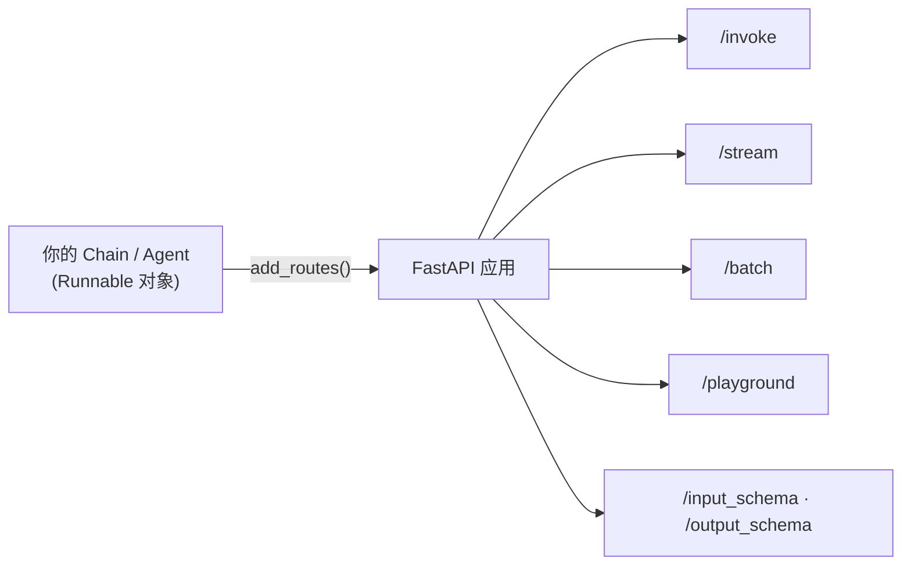
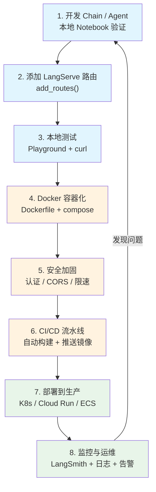

# LangServe 部署与生产实践

## 1 为什么需要部署

### 1.1 从脚本到服务

当你在 Jupyter Notebook 或本地 `.py` 文件里写好了一个 Chain，它只是一个**本地脚本**——只有你自己能运行。要让前端页面、移动端 App、其他微服务都能使用这个 Chain，你需要把它**发布为一个网络服务**（通常是 REST API）。这个过程就是**部署（Deployment）**。

> [!info] 生活类比
> 你在家做了一道好菜（写好了一个 Chain），但这道菜只有你自己能吃到。**LangServe** 就是帮你把这道菜变成一家**餐厅**的工具：
> - **菜单** = 自动生成的 OpenAPI 文档，客人（调用方）知道有哪些接口
> - **服务窗口** = `/invoke`、`/stream`、`/batch` 端点，客人按需下单
> - **接待多位客人** = 异步并发处理多个请求
> - **试菜区** = `/playground` 调试界面，上线前先自己尝一口
>
> 从此，你的好菜不再是私房菜，而是能对外营业的标准化餐厅。

### 1.2 部署方案概览

| 方案 | 适用场景 | 优势 | 劣势 |
|------|----------|------|------|
| **LangServe** | 快速将 Chain/Agent 发布为 API | 一行代码发布；自动 Playground 和文档；内置流式 | 仅适用于 LangChain Runnable |
| **原生 FastAPI** | 完全自定义接口逻辑 | 最大灵活性 | 需手动实现流式、序列化等 |
| **Docker + vLLM** | 自托管模型推理服务 | 高性能推理；GPU 复用 | 运维复杂；仅解决推理层 |
| **LangGraph Platform** | 生产级有状态 Agent | 原生状态管理、人机协作 | 生态较新 |

> [!tip] 学习提示
> 本章以 **LangServe** 为主线，兼顾 FastAPI 集成与 Docker 容器化。部署有状态多步 Agent 请参考 [[06_LangGraph入门]]。

---

## 2 LangServe 核心用法

### 2.1 什么是 LangServe

**LangServe** 是 LangChain 官方的部署库，基于 **FastAPI** 构建。核心能力：**一行代码把任何 `Runnable` 变成 REST API**。



LangServe 自动处理：**序列化/反序列化**、**SSE 流式输出**、**Playground 调试界面**、**OpenAPI 文档**、**Pydantic Schema 推导**。

```bash
# 安装 LangServe（服务端 + 客户端）
pip install "langserve[all]"
# 或分开安装：pip install "langserve[server]"  /  pip install "langserve[client]"
```

### 2.2 add_routes 核心函数

| 参数 | 类型 | 说明 |
|------|------|------|
| `app` | `FastAPI` | FastAPI 应用实例 |
| `runnable` | `Runnable` | 要发布的 Chain / Agent |
| `path` | `str` | 路径前缀，如 `"/translate"` → `/translate/invoke` |
| `input_type` | `Type` | 可选，覆盖自动推导的输入 Schema |
| `output_type` | `Type` | 可选，覆盖自动推导的输出 Schema |
| `config_keys` | `List[str]` | 允许客户端传递的 `RunnableConfig` 键 |
| `per_req_config_modifier` | `Callable` | 每次请求动态修改配置的回调 |
| `enabled_endpoints` | `List[str]` | 启用的端点列表 |

### 2.3 最简示例：发布一个翻译 Chain

```python
# pip install "langserve[all]" langchain-openai langchain-core

from fastapi import FastAPI
from langchain_openai import ChatOpenAI
from langchain_core.prompts import ChatPromptTemplate
from langchain_core.output_parsers import StrOutputParser
from langserve import add_routes

# 1. 构建 Chain
prompt = ChatPromptTemplate.from_messages([
    ("system", "你是一位专业翻译，请将用户输入的文本翻译成{target_language}。只输出翻译结果。"),
    ("human", "{text}"),
])
chain = prompt | ChatOpenAI(model="gpt-4o-mini", temperature=0) | StrOutputParser()

# 2. 创建 FastAPI 应用并一行发布
app = FastAPI(title="翻译服务", version="1.0")
add_routes(app, chain, path="/translate")

if __name__ == "__main__":
    import uvicorn
    uvicorn.run(app, host="0.0.0.0", port=8000)
```

启动后自动生成以下端点：

| 端点 | 方法 | 用途 |
|------|------|------|
| `/translate/invoke` | POST | 同步调用，等待完整输出 |
| `/translate/batch` | POST | 批量并行处理 |
| `/translate/stream` | POST | SSE 逐 token 流式返回 |
| `/translate/stream_log` | POST | 流式返回含中间步骤的运行日志 |
| `/translate/playground` | GET | 可视化调试界面 |
| `/translate/input_schema` | GET | 输入 JSON Schema |
| `/translate/output_schema` | GET | 输出 JSON Schema |

> [!tip] 学习提示
> Playground 是 LangServe 最实用的功能之一。开发阶段可以快速测试 Chain，团队协作中也可以让非技术同事直接试用。

---

## 3 请求与响应格式

### 3.1 invoke 端点

```bash
curl -X POST http://localhost:8000/translate/invoke \
  -H "Content-Type: application/json" \
  -d '{"input": {"text": "LangChain is a framework for LLM apps.", "target_language": "中文"}, "config": {}}'
```

```json
{
  "output": "LangChain 是一个用于构建大语言模型应用的框架。",
  "metadata": { "run_id": "a1b2c3d4-..." }
}
```

> [!info] 概念解析
> 所有端点的请求体都遵循 `input` + `config` + `kwargs` 三字段结构。`input` 格式与 Chain 的 `input_schema` 一致，`config` 用于传递 `tags`、`metadata` 等。

### 3.2 stream 端点（SSE）

流式调用使用 **Server-Sent Events** 协议，服务器逐步推送 token：

```
event: data
data: {"content": "LangChain"}

event: data
data: {"content": " 是一个框架。"}

event: end
```

客户端实时拼接即可实现**打字机效果**。

### 3.3 客户端调用：RemoteRunnable

`RemoteRunnable` 把远程 API 伪装成本地 `Runnable`，使用体验与本地 Chain 完全一致：

```python
# pip install "langserve[client]"

from langserve import RemoteRunnable

translate = RemoteRunnable("http://localhost:8000/translate")

# 同步调用
result = translate.invoke({"text": "Hello world", "target_language": "中文"})

# 流式调用
for chunk in translate.stream({"text": "Hello", "target_language": "日语"}):
    print(chunk, end="", flush=True)

# 批量调用
results = translate.batch([
    {"text": "Hello", "target_language": "法语"},
    {"text": "Goodbye", "target_language": "法语"},
])

# 异步调用
result = await translate.ainvoke({"text": "Hi", "target_language": "中文"})
```

> [!tip] 学习提示
> `RemoteRunnable` 的最大好处是**透明性**——调用方无需知道 Chain 内部实现，也无需安装其依赖包，天然适合微服务架构。

---

## 4 FastAPI 深度集成

### 4.1 添加自定义中间件（CORS、认证）

```python
# pip install "langserve[all]"

from fastapi import FastAPI, Request, HTTPException
from fastapi.middleware.cors import CORSMiddleware
from starlette.middleware.base import BaseHTTPMiddleware

app = FastAPI()

# CORS —— 生产环境务必指定具体域名
app.add_middleware(
    CORSMiddleware,
    allow_origins=["https://your-frontend.com"],
    allow_credentials=True,
    allow_methods=["*"],
    allow_headers=["*"],
)

# API Key 认证
API_KEYS = {"sk-abc123", "sk-def456"}

class APIKeyMiddleware(BaseHTTPMiddleware):
    async def dispatch(self, request: Request, call_next):
        if request.url.path.endswith("/playground") or request.url.path == "/docs":
            return await call_next(request)
        if request.headers.get("X-API-Key") not in API_KEYS:
            raise HTTPException(status_code=403, detail="Invalid API Key")
        return await call_next(request)

app.add_middleware(APIKeyMiddleware)
```

> [!warning] 易错避坑
> `allow_origins=["*"]` 在开发阶段方便，但**生产环境必须指定具体域名**，否则任何网站都能调用你的 API。

### 4.2 多 Chain 部署 + 自定义路由

```python
# pip install "langserve[all]" langchain-openai langchain-core

from fastapi import FastAPI
from langserve import add_routes

app = FastAPI(title="AI 工具集")

# 自定义路由
@app.get("/health")
async def health_check():
    return {"status": "healthy"}

# 多个 Chain 挂载到不同路径
add_routes(app, translate_chain, path="/translate")
add_routes(app, summarize_chain, path="/summarize")
add_routes(app, explain_chain, path="/explain-code")
```

### 4.3 依赖注入：per_req_config_modifier

在多租户场景中，可以根据请求信息动态注入配置：

```python
# pip install "langserve[all]"

from fastapi import Request
from langchain_core.runnables import RunnableConfig

def modify_config(config: RunnableConfig, request: Request) -> RunnableConfig:
    user_id = request.headers.get("X-User-Id", "anonymous")
    config["metadata"] = {**config.get("metadata", {}), "user_id": user_id}
    config["configurable"] = {**config.get("configurable", {}), "user_id": user_id}
    return config

add_routes(app, my_chain, path="/chat", per_req_config_modifier=modify_config)
```

> [!info] 概念解析
> `per_req_config_modifier` 的典型用途：**多租户隔离**（按用户切换 API Key）、**追踪溯源**（将用户 ID 注入 LangSmith metadata）、**动态配置**（按请求切换模型版本）。

---

## 5 Docker 容器化部署

### 5.1 Dockerfile（多阶段构建）

```dockerfile
# ============ 阶段 1：构建依赖 ============
FROM python:3.11-slim AS builder
WORKDIR /app
COPY requirements.txt .
RUN pip install --no-cache-dir --prefix=/install -r requirements.txt

# ============ 阶段 2：运行时 ============
FROM python:3.11-slim AS runtime
WORKDIR /app
COPY --from=builder /install /usr/local
COPY . .
RUN adduser --disabled-password --gecos '' appuser
USER appuser
EXPOSE 8000

HEALTHCHECK --interval=30s --timeout=5s --start-period=10s --retries=3 \
    CMD python -c "import urllib.request; urllib.request.urlopen('http://localhost:8000/health')" || exit 1

CMD ["uvicorn", "server:app", "--host", "0.0.0.0", "--port", "8000"]
```

### 5.2 docker-compose.yml（LangServe + Chroma + Ollama）

```yaml
version: "3.9"
services:
  langserve:
    build: .
    ports: ["8000:8000"]
    environment:
      - OPENAI_API_KEY=${OPENAI_API_KEY}
      - LANGSMITH_API_KEY=${LANGSMITH_API_KEY}
      - LANGSMITH_TRACING=true
      - LANGSMITH_PROJECT=my-langserve-app
      - CHROMA_HOST=chroma
      - OLLAMA_BASE_URL=http://ollama:11434
    depends_on:
      chroma: { condition: service_healthy }
    restart: unless-stopped
    healthcheck:
      test: ["CMD", "python", "-c",
             "import urllib.request; urllib.request.urlopen('http://localhost:8000/health')"]
      interval: 30s
      timeout: 5s
      retries: 3

  chroma:
    image: chromadb/chroma:0.5.23
    ports: ["8001:8000"]
    volumes: [chroma_data:/chroma/chroma]
    healthcheck:
      test: ["CMD", "curl", "-f", "http://localhost:8000/api/v1/heartbeat"]
      interval: 10s
      timeout: 5s
      retries: 5

  ollama:
    image: ollama/ollama:latest
    ports: ["11434:11434"]
    volumes: [ollama_data:/root/.ollama]
    deploy:
      resources:
        reservations:
          devices: [{ driver: nvidia, count: all, capabilities: [gpu] }]

volumes:
  chroma_data:
  ollama_data:
```

### 5.3 环境变量与密钥管理

> [!warning] 易错避坑
> 绝对不要将 API Key 硬编码在代码或 Dockerfile 中！

| 方式 | 适用环境 | 做法 |
|------|----------|------|
| `.env` 文件 | 开发 | `docker compose --env-file .env up`（文件加入 `.gitignore`） |
| Docker Secrets | 生产 | `docker secret create` + 挂载到 `/run/secrets/` |
| 云密钥服务 | 生产 | AWS Secrets Manager / GCP Secret Manager |

---

## 6 生产环境最佳实践

### 6.1 Gunicorn + Uvicorn Workers

```bash
# pip install gunicorn uvicorn
# workers 经验公式：(2 × CPU 核心数) + 1
gunicorn server:app \
    --workers 4 \
    --worker-class uvicorn.workers.UvicornWorker \
    --bind 0.0.0.0:8000 \
    --timeout 120 \
    --access-logfile -
```

### 6.2 LangSmith 生产监控

参考 [[03_开发环境与LangSmith监控]] 获取基础配置教程。

```python
# pip install langsmith
import os
os.environ["LANGSMITH_TRACING"] = "true"
os.environ["LANGSMITH_API_KEY"] = "lsv2_your-key-here"
os.environ["LANGSMITH_PROJECT"] = "production-translate-service"
```

| 指标 | 说明 | 告警阈值建议 |
|------|------|-------------|
| **延迟** | 端到端响应时间 | P95 > 10s |
| **Token 用量** | prompt + completion tokens | 日消耗超预算 |
| **错误率** | 调用失败比例 | > 5% |
| **费用** | 基于 token 的 API 费用 | 日费用超阈值 |

### 6.3 错误处理与重试

```python
# pip install "langserve[all]" langchain-openai

# Runnable 内置容错：with_retry + with_fallbacks
chain_with_retry = chain.with_retry(
    retry_if_exception_type=(TimeoutError, ConnectionError),
    stop_after_attempt=3,
    wait_exponential_jitter=True,
)

fallback_chain = prompt | ChatOpenAI(model="gpt-4o-mini") | StrOutputParser()
chain_safe = chain_with_retry.with_fallbacks([fallback_chain])

add_routes(app, chain_safe, path="/translate")
```

> [!info] 概念解析
> - **with_retry**：同一 Chain 重试，适合暂时性错误（网络超时）
> - **with_fallbacks**：主 Chain 失败后切换备用 Chain，适合模型服务不可用

### 6.4 日志配置

```python
# pip install python-json-logger
import logging, sys
from pythonjsonlogger import jsonlogger

handler = logging.StreamHandler(sys.stdout)
handler.setFormatter(jsonlogger.JsonFormatter(
    fmt="%(asctime)s %(name)s %(levelname)s %(message)s"
))
logging.getLogger().addHandler(handler)
logging.getLogger().setLevel(logging.INFO)
```

### 6.5 安全清单

| 安全措施 | 重要性 | 说明 |
|----------|--------|------|
| **HTTPS** | 必须 | Nginx/Traefik 反向代理或云 HTTPS 终端 |
| **API Key 认证** | 必须 | 中间件或依赖注入验证身份 |
| **CORS 白名单** | 必须 | 限制允许的前端域名 |
| **速率限制** | 强烈推荐 | `slowapi` 库，防止滥用 |
| **输入验证** | 强烈推荐 | Pydantic `input_type` 限制长度和格式 |
| **非 root 运行** | 推荐 | Docker 中创建专用用户 |
| **日志脱敏** | 推荐 | 不记录完整用户输入和 API Key |
| **网络隔离** | 推荐 | 内部服务不暴露公网 |

```python
# pip install slowapi pydantic "langserve[all]"

# 速率限制示例
from slowapi import Limiter
from slowapi.util import get_remote_address
limiter = Limiter(key_func=get_remote_address)

# 输入验证示例
from pydantic import BaseModel, Field, field_validator
class TranslateInput(BaseModel):
    text: str = Field(..., min_length=1, max_length=10000)
    target_language: str

    @field_validator("target_language")
    @classmethod
    def check_lang(cls, v):
        allowed = {"中文", "英文", "日语", "法语", "德语", "韩语"}
        if v not in allowed:
            raise ValueError(f"不支持: {v}，可选: {allowed}")
        return v

add_routes(app, chain, path="/translate", input_type=TranslateInput)
```

---

## 7 总结

### 7.1 从开发到上线完整流程



### 7.2 知识点自检表

- [ ] 能说出 LangServe 自动生成的端点及其用途
- [ ] 能独立编写 `add_routes` 将 Chain 发布为 API
- [ ] 理解 `/invoke`、`/stream`、`/batch` 的区别
- [ ] 会使用 `RemoteRunnable` 调用远程 Chain
- [ ] 能编写 `per_req_config_modifier` 实现动态配置注入
- [ ] 理解多阶段构建 Dockerfile 的作用
- [ ] 能编写含健康检查的 `docker-compose.yml`
- [ ] 知道如何安全管理 API Key
- [ ] 能配置 Gunicorn + Uvicorn workers
- [ ] 理解 `with_retry` 和 `with_fallbacks` 的使用场景
- [ ] 能列出至少 5 项生产安全措施

### 7.3 相关笔记

- [[01_LangChain概述与核心架构]] — LangChain 生态全景，LangServe 在生态中的定位
- [[06_LangGraph入门]] — 有状态 Agent 的编排与部署
- [[01_大模型选择与私有化部署]] — 底层推理服务的部署方案
- [[03_开发环境与LangSmith监控]] — LangSmith 基础配置与监控实践

---

[^1]: LCEL 即 LangChain Expression Language，使用 `|` 管道符连接组件。详见 [[01_LangChain概述与核心架构]]。
