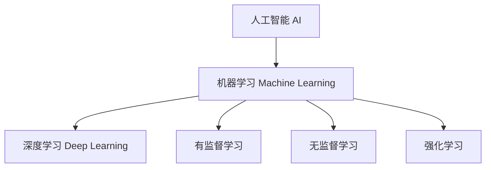

# 机器学习与深度学习概览

## 1. 三者关系

> **类比**：AI 是目标（让机器像人一样思考），机器学习是实现路径（让机器从数据中学习规律），深度学习是其中最强大的工具（用多层神经网络提取特征）。

---

## 2. 机器学习 (Machine Learning)

**核心思想**：不显式编写规则，而是让算法从数据中自动发现规律。

| 类型    | 特点     | 典型算法                |
| ----- | ------ | ------------------- |
| 有监督学习 | 有标签数据  | 线性回归、SVM[^1]、决策树    |
| 无监督学习 | 无标签数据  | K-Means[^2]、PCA[^3] |
| 强化学习  | 奖惩信号驱动 | Q-Learning、PPO[^4]  |

---

## 3. 深度学习 (Deep Learning)

**核心思想**：通过多层神经网络（深层结构）自动学习数据的层次化特征表示。

- **优势**：特征自动提取，无需人工特征工程；在图像、语音、NLP 领域效果显著
- **代价**：需要大量数据和算力；模型可解释性差

### 典型架构

| 架构 | 适用场景 |
|------|----------|
| CNN[^5] | 图像识别、目标检测 |
| RNN/LSTM[^6] | 时序数据、文本 |
| Transformer[^7] | NLP[^8]、多模态 |

---

## 4. 工业界视角

- 大多数业务场景（结构化数据、小数据集）仍以传统 ML 为主
- 深度学习在非结构化数据（图像/文本/音频）上占主导
- **LLM（大语言模型）** 是深度学习中基于 Transformer 架构的代表性应用

[^1]: **SVM（支持向量机）**：一种分类算法，核心思想是找到一条"最宽的分界线"，让两类数据离这条线都尽可能远，从而泛化能力更强。
[^2]: **K-Means**：一种聚类算法。给定 K 个"中心点"，把每个数据点归到离它最近的中心，然后反复更新中心位置，直到稳定。就像把一堆糖果按颜色分成 K 堆。
[^3]: **PCA（主成分分析）**：一种降维算法，把高维数据投影到"信息量最大"的几个方向上，用更少的维度保留尽可能多的原始信息。详见降维笔记。
[^4]: **PPO（近端策略优化）**：强化学习中的一种主流算法，通过限制每次策略更新的幅度来保证训练稳定性。ChatGPT 的 RLHF 训练阶段就用了 PPO。
[^5]: **CNN（卷积神经网络）**：专为图像设计的神经网络。用"滑动窗口"扫描图片，自动学习边缘、纹理、形状等局部特征，再逐层组合成高级语义。
[^6]: **RNN/LSTM**：处理序列数据（文字、时间序列）的神经网络。RNN 有"记忆"，能把前面的信息传递给后面；LSTM 是改进版，解决了 RNN 记不住太久之前信息的问题。
[^7]: **Transformer**：目前最主流的深度学习架构，核心机制是"注意力（Attention）"——让模型在处理每个词时，都能同时关注句子中所有其他词的关系，而不是像 RNN 那样逐个处理。GPT、BERT 都基于此。
[^8]: **NLP（自然语言处理）**：让计算机理解和生成人类语言的技术领域，包括翻译、摘要、问答、情感分析等任务。
