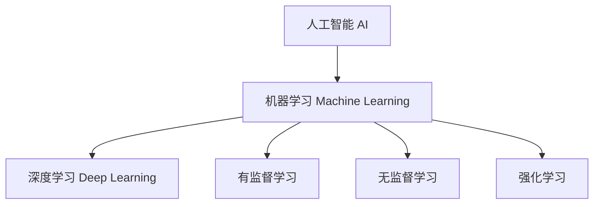

# 机器学习与深度学习概览

## 1. 三者关系

> **类比**：AI 是目标（让机器像人一样思考），机器学习是实现路径（让机器从数据中学习规律），深度学习是其中最强大的工具（用多层神经网络提取特征）。

---

## 2. 机器学习 (Machine Learning)

**核心思想**：不显式编写规则，而是让算法从数据中自动发现规律。

| 类型 | 特点 | 典型算法 |
|------|------|----------|
| 有监督学习 | 有标签数据 | 线性回归、SVM、决策树 |
| 无监督学习 | 无标签数据 | K-Means、PCA |
| 强化学习 | 奖惩信号驱动 | Q-Learning、PPO |

---

## 3. 深度学习 (Deep Learning)

**核心思想**：通过多层神经网络（深层结构）自动学习数据的层次化特征表示。

- **优势**：特征自动提取，无需人工特征工程；在图像、语音、NLP 领域效果显著
- **代价**：需要大量数据和算力；模型可解释性差

### 典型架构

| 架构 | 适用场景 |
|------|----------|
| CNN | 图像识别、目标检测 |
| RNN/LSTM | 时序数据、文本 |
| Transformer | NLP、多模态 |

---

## 4. 工业界视角

- 大多数业务场景（结构化数据、小数据集）仍以传统 ML 为主
- 深度学习在非结构化数据（图像/文本/音频）上占主导
- **LLM（大语言模型）** 是深度学习 Transformer 架构的极致应用
