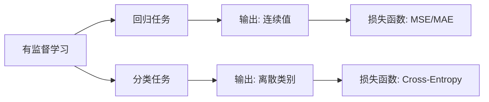

# 有监督学习：回归与分类 (Supervised Learning)

## 1. 什么是有监督学习？

- **直观类比**：就像老师批改作业——给你一批“题目 + 标准答案”（带标签的训练数据），让你学会解题规律，然后去解新题（预测新数据）。
    
- **核心要素**：
    
    - **输入特征 $X$ (Features)**：题目本身（已知属性）。
        
    - **标签 $y$ (Labels)**：标准答案（预测目标）。
        
    - **学习目标**：找到一个最优的映射函数 $f$，使得 $f(X) \approx y$。
        
- **数据划分 (Data Splitting)**：为了防止模型“死记硬背”，训练数据通常会被划分为三部分：
    
    - **训练集 (Training Set)**：用来训练模型（日常做题）。
        
    - **验证集 (Validation Set)**：用来调整模型参数（模拟考，发现弱点）。
        
    - **测试集 (Test Set)**：用来评估最终模型的真实能力（期末考，仅用一次）。
        

---

## 2. 回归任务 (Regression)

- **目标与输出**：预测**连续的数值**。
    
- **典型场景**：
    
    - 房价预测（输出：具体价格）
        
    - 气温预测（输出：具体温度）
        
    - 股票价格/用户生命周期价值 (LTV) 预测
        
- **常用算法**：线性回归 (Linear Regression)、多项式回归[^8]、支持向量回归 (SVR)[^1]、随机森林回归[^2]、梯度提升树 (GBDT/XGBoost)[^3]。
    
- **评估指标 (Evaluation Metrics)**：
    

| **指标**           | **公式**                                                      | **说明**                                            |
| ---------------- | ----------------------------------------------------------- | ------------------------------------------------- |
| **MAE** (平均绝对误差) | $\frac{1}{n}\sum \\y_i - \hat{y}_i$                         | 预测值与真实值误差绝对值的平均，直观反映实际误差大小。                       |
| **MSE** (均方误差)   | $\frac{1}{n}\sum (y_i - \hat{y}_i)^2$                       | 误差的平方和平均。**对异常值（大误差）极其敏感**（惩罚力度大）。                |
| **RMSE** (均方根误差) | $\sqrt{MSE}$                                                | MSE 的平方根，使其量纲（单位）与原始目标值保持一致，更易解释。                 |
| **$R^2$** (决定系数) | $1 - \frac{\sum(y_i - \hat{y}_i)^2}{\sum(y_i - \bar{y})^2}$ | 衡量模型的拟合优度。取值通常在 $0 \sim 1$ 之间，**越接近 1 说明模型拟合越好**。 |

---

## 3. 分类任务 (Classification)

- **目标与输出**：预测**离散的类别标签**（可以是二分类，也可以是多分类）。
    
- **典型场景**：
    
    - 垃圾邮件识别（输出：是/否）
        
    - 图像识别（输出：猫/狗/鸟）
        
    - 疾病诊断（输出：阳性/阴性）
        
- **常用算法**：逻辑回归 (Logistic Regression)[^4]、支持向量机 (SVM)[^5]、决策树、K近邻 (KNN)[^6]、神经网络。
    
- **混淆矩阵 (Confusion Matrix) 与评估指标**：
    
    在分类中，真实值和预测值的组合会产生四种情况：**TP** (真阳性)、**FP** (假阳性/误报)、**FN** (假阴性/漏报)、**TN** (真阴性)。基于此，我们有以下指标：
    

|**指标**|**重点关注**|**说明**|
|---|---|---|
|**Accuracy** (准确率)|整体表现|预测正确的样本占总样本的比例。**【注意】在正负样本严重不均衡时（如罕见病诊断），准确率会产生误导。**|
|**Precision** (精确率)|宁缺毋滥|预测为“正”的样本中，真正为“正”的比例。（例如：被判定为垃圾邮件的，多少真的是垃圾邮件？）|
|**Recall** (召回率)|宁错杀不放过|真正为“正”的样本中，被成功预测出来的比例。（例如：所有真实癌症患者中，查出了多少个？）|
|**F1-Score**|综合考量|Precision 与 Recall 的调和平均数，用于在精确率和召回率之间寻找平衡。|

---

## 4. 监督学习的核心挑战

无论回归还是分类，模型训练都会面临以下两个核心问题：

- **欠拟合 (Underfitting)**：模型太简单，连训练集上的“日常作业”都做不好（高偏差）。
    
- **过拟合 (Overfitting)**：模型太复杂，“死记硬背”了训练集里的噪声和特例，导致在测试集上的“期末考”成绩极差（高方差）。
    
- **解决方案**：正则化 (Regularization)、增加数据量、交叉验证 (Cross-validation)[^7]、提前停止 (Early Stopping)。
    

---

## 5. 回归 vs 分类 知识图谱

[^1]: **SVR（支持向量回归）**：SVM 的回归版本。不是找"最宽分界线"，而是找一条"误差容忍带"，让尽可能多的数据点落在带内，对带外的点才计算损失。
[^2]: **随机森林**：同时训练很多棵决策树，每棵树用随机抽取的数据和特征训练，最终结果取所有树的平均（回归）或投票（分类）。"三个臭皮匠顶个诸葛亮"的集成思想。
[^3]: **GBDT/XGBoost（梯度提升树）**：也是集成多棵决策树，但不是并行训练，而是串行——每棵新树专门去拟合上一棵树犯的错误，逐步修正。XGBoost 是工业界结构化数据竞赛的常胜将军。
[^4]: **逻辑回归**：名字里有"回归"，但实际是分类算法。它在线性回归的输出上套一个 Sigmoid 函数，把结果压缩到 0~1 之间，表示"属于正类的概率"。
[^5]: **SVM（支持向量机）**：找到一个"间隔最大"的决策边界，让两类数据离边界都尽可能远。对小数据集效果好，高维数据也适用。
[^6]: **KNN（K近邻）**：最直觉的算法——预测一个新样本时，找训练集里离它最近的 K 个邻居，看邻居们属于哪个类别最多，就判为那个类。不需要训练，但预测时计算量大。
[^7]: **交叉验证**：把训练数据分成 K 份，轮流用其中 1 份做验证集、其余 K-1 份做训练集，重复 K 次取平均。比单次划分更可靠，能更准确地估计模型的真实泛化能力。

[^8]: 多项式回归: 当你可能**只有一个特征**，但这个特征和结果之间的关系**不是一条直的**，而是弯曲的时候使用。
