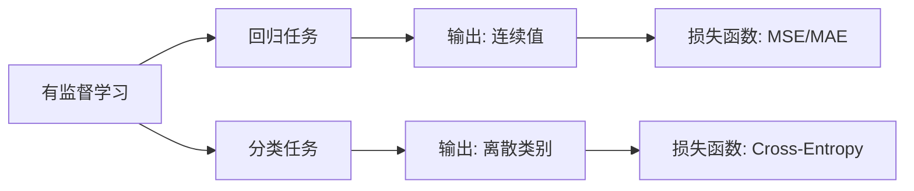

# 有监督学习：回归与分类

## 1. 什么是有监督学习？

> **类比**：就像老师批改作业——给你一批"题目+标准答案"（带标签的训练数据），让你学会解题规律，然后去解新题（预测新数据）。

**核心要素**：
- 输入特征 $X$（题目）
- 标签 $y$（答案）
- 学习目标：找到映射 $f: X \to y$

---

## 2. 回归任务 (Regression)

**输出**：连续数值

**典型场景**：
- 房价预测（输出：价格）
- 气温预测（输出：温度）
- 股票涨跌幅预测

**常用算法**：线性回归、多项式回归、SVR、随机森林回归

**评估指标**：

| 指标 | 公式 | 说明 |
|------|------|------|
| MAE | $\frac{1}{n}\sum|y_i - \hat{y}_i|$ | 平均绝对误差，直观 |
| MSE | $\frac{1}{n}\sum(y_i - \hat{y}_i)^2$ | 均方误差，对大误差敏感 |
| R² | $1 - \frac{SS_{res}}{SS_{tot}}$ | 拟合优度，越接近1越好 |

---

## 3. 分类任务 (Classification)

**输出**：离散类别标签

**典型场景**：
- 垃圾邮件识别（输出：是/否）
- 图像识别（输出：猫/狗/鸟）
- 疾病诊断（输出：阳性/阴性）

**常用算法**：逻辑回归、SVM、决策树、神经网络

**评估指标**：

| 指标 | 说明 |
|------|------|
| Accuracy | 整体正确率，类别不均衡时有误导性 |
| Precision | 预测为正中真正为正的比例 |
| Recall | 真正为正中被预测出来的比例 |
| F1-Score | Precision 与 Recall 的调和平均 |

---

## 4. 回归 vs 分类

