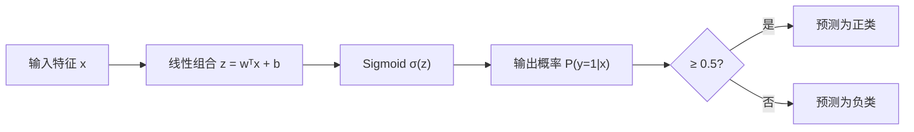
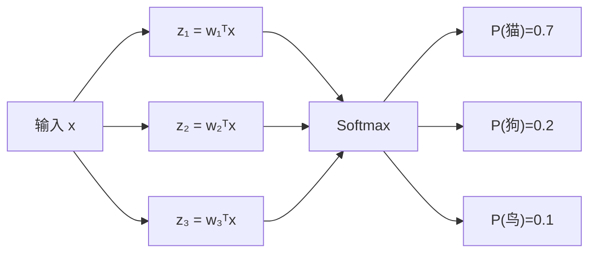

---
title: 逻辑回归、Softmax 回归与损失函数
published: 2026-04-20
description: 从线性回归到分类模型的跨越：逻辑回归、Softmax 与损失函数详解
tags:
  - 机器学习
  - 逻辑回归
  - Softmax
  - 损失函数
  - 分类
category: Machine Learning
draft: false
banner: Others/image/屏幕截图 2025-08-22 003906.png
banner-x: 51
banner-y: 24
---

# 逻辑回归、Softmax 回归与损失函数

## 1. 从回归到分类：为什么需要逻辑回归？

> **类比**：线性回归输出的是"温度计的读数"（连续值），但分类任务需要的是"红绿灯"（离散类别）。逻辑回归就是在线性回归外面套一个"转换器"，把任意实数压缩成 0~1 之间的概率。

线性回归直接用于分类有两个致命问题：
1. 输出值无界（可以是负数或大于1），无法解释为概率
2. 对离群点极度敏感，决策边界会被拉偏

---

## 2. 逻辑回归（二分类）

### 2.1 Sigmoid 函数

$$\sigma(z) = \frac{1}{1 + e^{-z}}, \quad z = \mathbf{w}^T\mathbf{x} + b$$

- 输入：任意实数 $z$
- 输出：$(0, 1)$ 之间的概率值
- **决策规则**：$\hat{y} = 1$ 若 $\sigma(z) \geq 0.5$，否则 $\hat{y} = 0$



### 2.2 损失函数：二元交叉熵[^1]

> 为什么不用 MSE？用 MSE 时 Sigmoid + MSE 组合会产生非凸损失曲面，梯度下降容易陷入局部最优。

$$L = -\frac{1}{m}\sum_{i=1}^{m}\left[y^{(i)}\log\hat{y}^{(i)} + (1-y^{(i)})\log(1-\hat{y}^{(i)})\right]$$

**直觉理解**：
- 若真实标签 $y=1$，预测 $\hat{y}$ 越接近 1，$-\log(\hat{y})$ 越接近 0（损失小）
- 若真实标签 $y=0$，预测 $\hat{y}$ 越接近 0，$-\log(1-\hat{y})$ 越接近 0（损失小）

```python
import micropip
await micropip.install("numpy")
import numpy as np

def binary_cross_entropy(y_true, y_pred):
    # 防止 log(0) 数值不稳定，加一个极小值 epsilon
    eps = 1e-9
    y_pred = np.clip(y_pred, eps, 1 - eps)
    return -np.mean(y_true * np.log(y_pred) + (1 - y_true) * np.log(1 - y_pred))

# 示例
y_true = np.array([1, 0, 1, 1])
y_pred = np.array([0.9, 0.1, 0.8, 0.3])
print(f"Loss: {binary_cross_entropy(y_true, y_pred):.4f}")  # 越小越好
```

---

## 3. Softmax 回归（多分类）

### 3.1 从二分类到多分类

> **类比**：逻辑回归是"二选一投票"，Softmax 是"多选一投票"——把所有候选类别的得分转换成概率分布，所有类别概率之和为 1。

$$P(y=k|\mathbf{x}) = \frac{e^{z_k}}{\sum_{j=1}^{K} e^{z_j}}, \quad z_k = \mathbf{w}_k^T\mathbf{x} + b_k$$

- $K$：类别总数
- $z_k$：第 $k$ 个类别的原始得分（logit[^2]）
- 输出：长度为 $K$ 的概率向量，所有元素之和为 1



### 3.2 损失函数：多类交叉熵

$$L = -\frac{1}{m}\sum_{i=1}^{m}\sum_{k=1}^{K} y_k^{(i)} \log \hat{y}_k^{(i)}$$

其中 $y_k^{(i)}$ 是 one-hot 编码[^3]，真实类别对应位置为 1，其余为 0。

```python
import micropip
await micropip.install("numpy")
import numpy as np

def softmax(z):
    # 减去最大值防止数值溢出（exp 爆炸）
    z = z - np.max(z, axis=1, keepdims=True)
    exp_z = np.exp(z)
    return exp_z / np.sum(exp_z, axis=1, keepdims=True)

# 示例：3个样本，4个类别的 logits
z = np.array([[2.0, 1.0, 0.1, 0.5],
              [0.5, 2.5, 0.3, 1.0],
              [1.0, 0.2, 3.0, 0.8]])

probs = softmax(z)
print("概率分布:\n", np.round(probs, 3))
print("预测类别:", np.argmax(probs, axis=1))
```

---

## 4. 损失函数总览

| 任务        | 模型         | 输出层激活           | 损失函数       |
| --------- | ---------- | --------------- | ---------- |
| 回归        | 线性回归       | 无（恒等）           | MSE / MAE  |
| 二分类       | 逻辑回归       | Sigmoid         | 二元交叉熵      |
| 多分类       | Softmax 回归 | Softmax         | 多类交叉熵      |
| 多标签分类[^4] | 神经网络       | Sigmoid（每个输出独立） | 二元交叉熵（逐元素） |
[[01_回归与分类#^4ad26c|回归损失函数详解]]
**分类损失函数**:

| 指标             | 核心特点与应用场景                                                                     | 数学公式                                                                                                                    |
| -------------- | ----------------------------------------------------------------------------- | ----------------------------------------------------------------------------------------------------------------------- |
| BCE(二元交叉熵)     | **二分类任务标配**（如逻辑回归、二分类神经网络）。惩罚“错得离谱还盲目自信”的预测。                                  | $\mathcal{L}_{BCE} = \mathbf{-} \frac{1}{N}\sum_{i=1}^N \left[ y_i \cdot \log(p_i) + (1-y_i) \cdot \log(1-p_i) \right]$ |
| Hinge(合页损失)    | **支持向量机 (SVM) 御用**。要求极其严苛：不仅方向要猜对，信心值（得分）还必须越过安全边界（大于1）才算不扣分。                 | $\mathcal{L}_{Hinge} = \max(0, 1 - y \cdot f(x))$                                                                       |
| CE(多类交叉熵损失)    | **多分类任务标配**（如图像识别分 1000 类）。它是 BCE 的进阶版，计算时只盯着“正确答案”对应的预测概率，给的概率越低，扣分越狠。       | $\mathcal{L}_{CE} = - \frac{1}{N}\sum_{i=1}^N \sum_{j=1}^M y_{ij} \cdot \log(f(x_{ij}))$                                |
| KL(KL散度 / 相对熵) | **高级分布拟合任务**（如大模型微调、蒸馏、生成模型 VAE）。它不在乎单道题的对错，而是衡量“你的预测概率分布形状”与“真实概率分布形状”有多大差异。 | $\mathcal{L}_{KL} = \sum_{i=1}^N y_i \cdot \log\left(\frac{y_i}{f(x_i)}\right)$                                         |

---

## 5. Sklearn 实现

```python
import micropip
await micropip.install(["numpy", "scikit-learn"])
import numpy as np
from sklearn.linear_model import LogisticRegression
from sklearn.datasets import load_iris
from sklearn.model_selection import train_test_split
from sklearn.metrics import accuracy_score

# 加载鸢尾花数据集（3分类）
X, y = load_iris(return_X_y=True)
X_train, X_test, y_train, y_test = train_test_split(X, y, test_size=0.2, random_state=42)

# multi_class='multinomial' 即 Softmax 回归
model = LogisticRegression(multi_class='multinomial', max_iter=200)
model.fit(X_train, y_train)

y_pred = model.predict(X_test)
print(f"Accuracy: {accuracy_score(y_test, y_pred):.4f}")
```

[^1]: **交叉熵（Cross-Entropy）**：衡量两个概率分布之间差异的指标。在分类任务中，用来衡量模型预测的概率分布与真实标签（one-hot 分布）之间的距离。预测越准，交叉熵越小。
[^2]: **Logit**：Softmax 输入的原始得分，也叫"对数几率"。可以是任意实数，经过 Softmax 后才变成概率。神经网络最后一层的输出通常就是 logits。
[^3]: **One-hot 编码**：把类别标签转换成向量的方式。比如共 3 类，类别 2 的 one-hot 编码是 `[0, 1, 0]`——只有对应位置是 1，其余全是 0。就像"举手表决"，只有一个人举手。
[^4]: **多标签分类**：一个样本可以同时属于多个类别（如一张图片里既有猫又有狗）。与多分类（只属于一个类别）不同，每个标签独立用 Sigmoid 判断是否存在。

