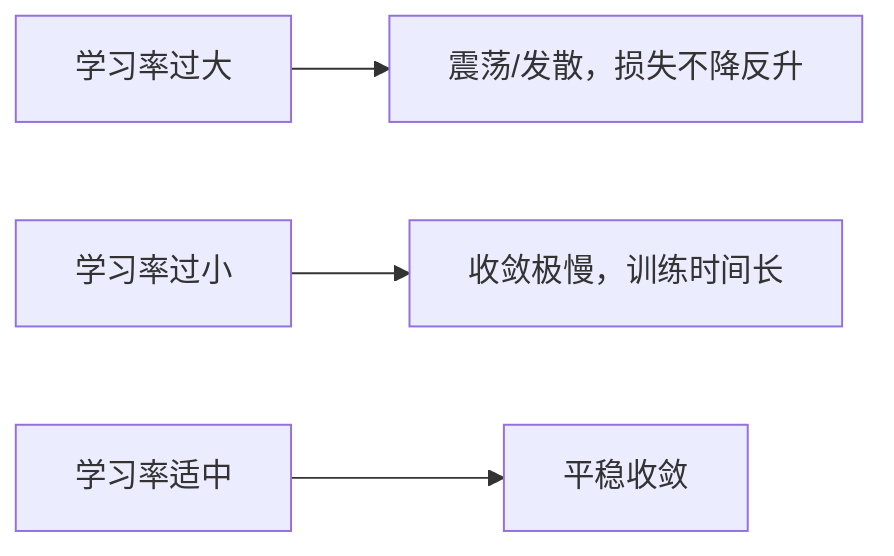
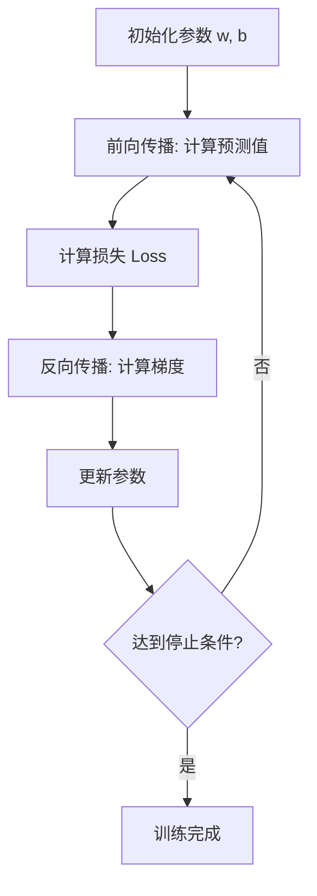

# 梯度下降法与模型训练

## 1. 核心思想

> **类比**：你站在山上，想走到最低点（损失最小）。每次看脚下坡度最陡的方向，迈一小步——这就是梯度下降。

**更新规则**：

$$w := w - \alpha \cdot \frac{\partial L}{\partial w}$$

- $\alpha$：学习率（步长大小）
- $\frac{\partial L}{\partial w}$：损失对参数的梯度（坡度方向）

---

## 2. 三种变体对比

| 变体 | 每次用数据量 | 优点 | 缺点 |
|------|------------|------|------|
| 批量梯度下降 (BGD) | 全部数据 | 稳定，收敛方向准 | 数据量大时极慢 |
| 随机梯度下降 (SGD) | 1 条样本 | 速度快，可跳出局部最优 | 震荡大，不稳定 |
| 小批量梯度下降 (Mini-batch) | batch_size 条 | 兼顾速度与稳定性 | 需调 batch_size |

> 工业界默认使用 **Mini-batch GD**，batch_size 通常取 32、64、128。

---

## 3. 学习率的影响



**实践技巧**：
- 使用学习率调度器（如余弦退火、ReduceLROnPlateau）
- Adam 优化器自适应调整每个参数的学习率，是目前最常用的优化器

---

## 4. 模型训练完整流程



---

## 5. 代码示例

```python
import numpy as np

def gradient_descent(X, y, lr=0.01, epochs=1000):
    m, n = X.shape
    w = np.zeros(n)
    b = 0

    for _ in range(epochs):
        y_pred = X @ w + b
        error = y_pred - y

        dw = (2/m) * X.T @ error
        db = (2/m) * np.sum(error)

        w -= lr * dw
        b -= lr * db

    return w, b
```
