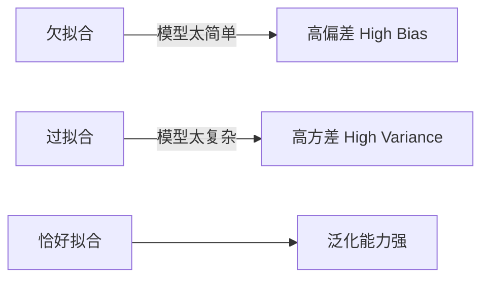
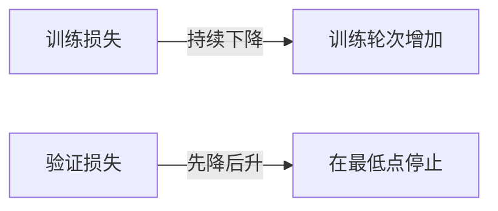

# 升维、降维与 Early Stopping

## 1. 欠拟合与过拟合



---

## 2. 升维（特征扩展）

**目的**：解决欠拟合，让线性模型拟合非线性关系。

**方法**：添加多项式特征

$$x_1, x_2 \to x_1, x_2, x_1^2, x_2^2, x_1x_2$$

```python
from sklearn.preprocessing import PolynomialFeatures

poly = PolynomialFeatures(degree=2)
X_poly = poly.fit_transform(X)  # 自动生成高次特征
```

> **注意**：升维会增加过拟合风险，通常需配合正则化使用。

---

## 3. 降维

**目的**：减少特征数量，缓解过拟合、降低计算成本、消除冗余。

### 主成分分析 (PCA)

将高维数据投影到方差最大的方向，保留最重要的信息。

```python
from sklearn.decomposition import PCA

pca = PCA(n_components=2)  # 降到2维
X_reduced = pca.fit_transform(X)
print("方差解释比:", pca.explained_variance_ratio_)
```

| 方法 | 原理 | 适用场景 |
|------|------|----------|
| PCA | 线性投影，最大化方差 | 数值型特征，去相关性 |
| t-SNE | 非线性，保留局部结构 | 可视化高维数据 |
| 特征选择 | 删除低重要性特征 | 有明确业务含义时 |

---

## 4. Early Stopping

**目的**：在验证集损失开始上升时提前终止训练，防止过拟合。



**实现示例（PyTorch）**：

```python
best_val_loss = float('inf')
patience, counter = 10, 0

for epoch in range(max_epochs):
    train(model)
    val_loss = evaluate(model)

    if val_loss < best_val_loss:
        best_val_loss = val_loss
        counter = 0
        torch.save(model.state_dict(), 'best_model.pt')
    else:
        counter += 1
        if counter >= patience:
            print(f"Early stopping at epoch {epoch}")
            break
```

> `patience` 参数控制容忍验证集损失不改善的轮数，通常设为 5~20。
