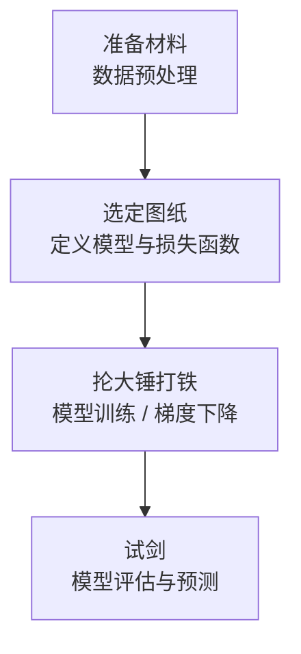
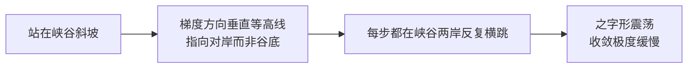
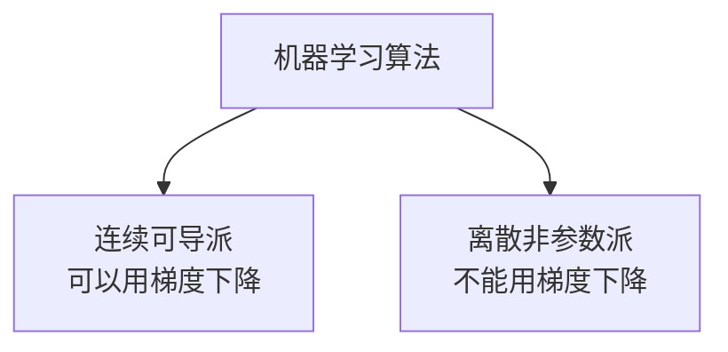
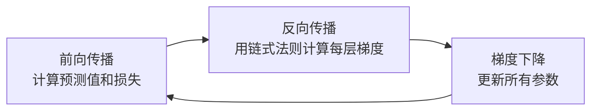

# ML 训练流水线与算法流派

## 1. 机器学习完整训练流水线

> **类比**：把训练模型比作"打造一把绝世宝剑"，整个流程分四步。

### Step 1 — 准备材料（数据预处理）

- 清洗数据、填补缺失值
- **标准化 / 归一化**：把所有特征拉到同一量纲，为梯度下降铺平道路
- 划分训练集 / 验证集 / 测试集

### Step 2 — 选定图纸（定义模型与损失函数）

- 选择模型结构：线性回归？神经网络？决策树？
- 定义损失函数[^1]：回归用 MSE，分类用 Cross-Entropy
- 此阶段只是"画图纸"，参数尚未优化

### Step 3 — 抡大锤打铁（模型训练）

**梯度下降法登场的核心环节。**

计算机根据图纸，千百次迭代更新权重参数 $w$ 和 $b$，每次都让损失 Loss 降低一点，直到收敛。

> 梯度下降不负责定义模型长什么样，只负责把参数调到最优。

### Step 4 — 试剑（模型评估）

- 在测试集上评估泛化能力
- 回归看 MAE/RMSE/R²，分类看 Accuracy/F1/AUC

---

## 2. 为什么特征量纲不一会导致梯度下降收敛慢？

这是面试高频考点，核心在于**损失函数的等高线形状**。

### 已标准化（量纲一致）

等高线是**正圆形**，梯度方向始终笔直指向圆心（最低点）。

$$\text{几步就能径直走到谷底}$$

### 未标准化（量纲悬殊）

假设 $x_1$ 是月薪（万级），$x_2$ 是房间数（个位数）：

- $x_1$ 权重稍微变动 → 损失剧烈波动
- $x_2$ 权重大幅变动 → 损失几乎不变

等高线被严重挤压成**极度狭长的椭圆（峡谷地形）**。

**解决方案**：训练前对特征做标准化（Z-Score）或归一化（Min-Max），把"峡谷"变回"圆碗"。

---

## 3. 算法流派：谁能用梯度下降，谁不能？

梯度下降的先决条件：**损失函数必须连续且可导**（能算出斜率）。

### 连续可导派（可以 / 必须用梯度下降）

| 算法 | 说明 |
|------|------|
| 线性回归 / 逻辑回归 | 损失函数平滑，梯度下降的教科书场景 |
| 神经网络（深度学习） | 几乎 100% 依赖梯度下降 + 反向传播更新参数 |
| SVM[^2] | 有不可导点，但可用次梯度[^3]或对偶优化求解 |

### 离散非参数派（不能用梯度下降）

| 算法 | 求解方式 | 为什么不用梯度下降 |
|------|----------|------------------|
| 决策树 / 随机森林 | 信息增益[^4] / 基尼系数[^5]，贪心切分 | 树的分裂是离散操作，无法求导 |
| KNN[^6] | 直接计算距离，无训练过程 | 根本没有参数需要优化 |
| 朴素贝叶斯[^7] | 统计概率，套用贝叶斯定理 | 直接算概率乘积，不涉及求最小值 |

> **一句话总结**：有参数要优化 + 损失函数可导 → 用梯度下降；基于规则/统计/距离 → 不用。

---

## 4. 梯度下降在深度学习中的地位

深度学习模型（神经网络）参数量可达数十亿，**不可能用正规方程求解析解**，只能靠梯度下降迭代逼近。

这个循环就是深度学习训练的本质，每转一圈叫做一个 **Epoch**[^8]。

[^1]: **损失函数**：衡量模型预测值与真实值之间差距的函数。损失越小，模型越准。梯度下降的目标就是最小化这个函数。
[^2]: **SVM（支持向量机）**：找到"间隔最大"的决策边界的分类算法。其优化问题可以转化为凸二次规划，通常用对偶形式（SMO 算法）求解，而非直接梯度下降。
[^3]: **次梯度（Subgradient）**：对于不可导点（如绝对值函数的顶点），次梯度是一种广义的"斜率"，允许梯度下降在不可导处继续工作。
[^4]: **信息增益**：决策树选择分裂特征的标准之一。衡量按某个特征切分后，数据的"混乱程度"（熵）减少了多少。减少越多，这个特征越有价值。
[^5]: **基尼系数**：另一种衡量数据"不纯度"的指标。基尼系数越低，说明切分后的子集越"纯"（同一类别的样本越集中）。CART 决策树默认使用基尼系数。
[^6]: **KNN（K近邻）**：预测时找训练集中最近的 K 个邻居，用它们的标签投票决定结果。没有显式的训练过程，所有计算都在预测时发生，因此也叫"懒惰学习"。
[^7]: **朴素贝叶斯**："朴素"指假设所有特征之间相互独立（现实中往往不成立，但效果依然不错）。基于贝叶斯定理：$P(类别|特征) \propto P(特征|类别) \times P(类别)$，直接统计概率即可，无需优化。
[^8]: **Epoch（轮次）**：模型把整个训练集完整过一遍，叫做一个 Epoch。训练通常需要几十到几百个 Epoch。
