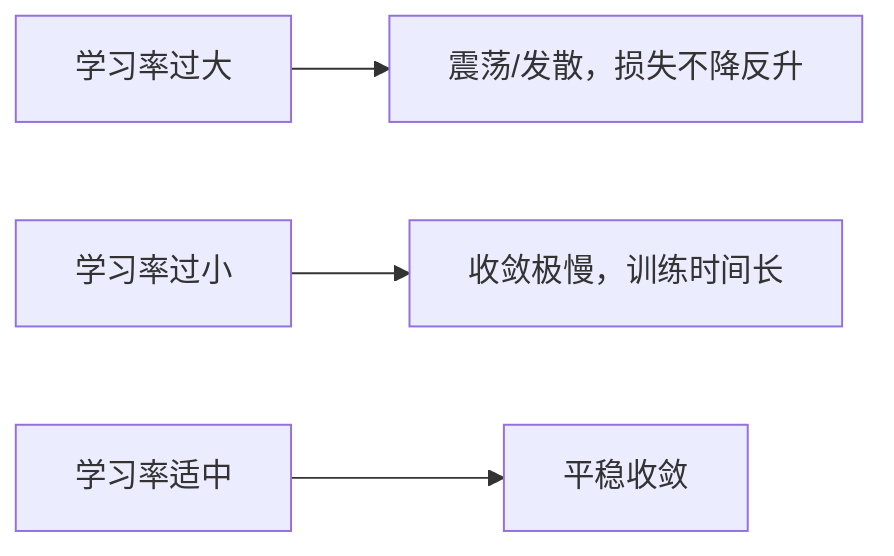
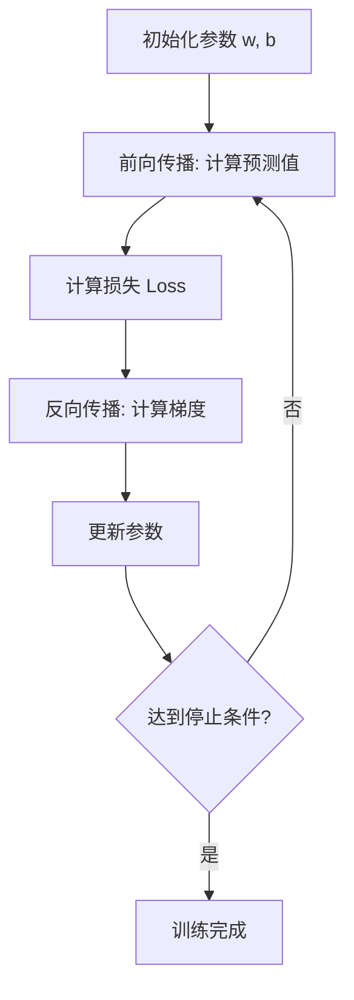

---
title: 梯度下降法与模型训练
published: 2026-04-20
description: 梯度下降的原理、变体与模型训练流程
tags:
  - 机器学习
  - 梯度下降
  - 优化
category: Machine Learning
draft: false
banner: Others/image/134308706_p0_master1200.jpg
banner-x: 49
banner-y: 55
---

# 梯度下降法与模型训练

## 1. 核心思想

> **类比**：你站在山上，想走到最低点（损失最小）。每次看脚下坡度最陡的方向，迈一小步——这就是梯度下降。

**更新规则**：

$$w := w - \alpha \cdot \frac{\partial L}{\partial w}$$

- $\alpha$：学习率（步长大小）
- $\frac{\partial L}{\partial w}$：损失对参数的梯度（坡度方向）

---

## 2. 三种变体对比

| 变体 | 每次用数据量 | 优点 | 缺点 |
|------|------------|------|------|
| 批量梯度下降 (BGD) | 全部数据 | 稳定，收敛方向准 | 数据量大时极慢 |
| 随机梯度下降 (SGD) | 1 条样本 | 速度快，可跳出局部最优 | 震荡大，不稳定 |
| 小批量梯度下降 (Mini-batch) | batch_size 条 | 兼顾速度与稳定性 | 需调 batch_size |

> 工业界默认使用 **Mini-batch GD**，batch_size 通常取 32、64、128。

---

## 3. 学习率的影响



**实践技巧**：
- 使用学习率调度器[^1]（如余弦退火[^2]、ReduceLROnPlateau[^3]）
- Adam 优化器[^4]自适应调整每个参数的学习率，是目前最常用的优化器
**可视化演示**：
> [!example]- 梯度下降等高线图 Python 源码
> ```python
> import micropip
> # 1. 确保安装了 numpy 和绘图用的 matplotlib
> await micropip.install(["numpy", "matplotlib"])
> 
> import numpy as np
> import matplotlib.pyplot as plt
> 
> # 2. 定义山谷的地形（损失函数）和梯度
> # --- 场景 A：未标准化（极度狭长） ---
> def loss_unscaled(x, y): return (x**2)/20 + 20*(y**2)
> def grad_unscaled(x, y): return np.array([x/10, 40*y])
> 
> # --- 场景 B：已标准化（正圆的碗） ---
> def loss_scaled(x, y): return x**2 + y**2
> def grad_scaled(x, y): return np.array([2*x, 2*y])
> 
> # 3. 梯度下降核心逻辑
> def gradient_descent(grad_func, start_pt, lr, steps):
>     path = [start_pt]
>     pt = start_pt
>     for _ in range(steps):
>         grad = grad_func(pt[0], pt[1])
>         pt = pt - lr * grad
>         path.append(pt)
>     return np.array(path)
> 
> # 4. 设定参数
> start_point = np.array([8.0, 8.0])
> steps = 20
> 
> # 获取轨迹
> path_unscaled = gradient_descent(grad_unscaled, start_point, lr=0.04, steps=steps)
> path_scaled = gradient_descent(grad_scaled, start_point, lr=0.1, steps=steps)
> 
> # 5. 绘图展示
> fig, (ax1, ax2) = plt.subplots(1, 2, figsize=(12, 5))
> x_grid, y_grid = np.meshgrid(np.linspace(-10, 10, 100), np.linspace(-10, 10, 100))
> 
> # 左图：未标准化 (Unscaled)
> Z_unscaled = loss_unscaled(x_grid, y_grid)
> ax1.contour(x_grid, y_grid, Z_unscaled, levels=20, cmap='RdYlBu_r')
> ax1.plot(path_unscaled[:, 0], path_unscaled[:, 1], 'r-o', color='red', markersize=4, label='Descent Path')
> ax1.plot(0, 0, 'g*', markersize=15, label='Minimum')
> ax1.set_title("Unscaled: Zig-Zag Oscillation")
> ax1.legend()
> 
> # 右图：已标准化 (Standardized)
> Z_scaled = loss_scaled(x_grid, y_grid)
> ax2.contour(x_grid, y_grid, Z_scaled, levels=20, cmap='RdYlBu_r')
> ax2.plot(path_scaled[:, 0], path_scaled[:, 1], 'r-o', color='red', markersize=4, label='Descent Path')
> ax2.plot(0, 0, 'g*', markersize=15, label='Minimum')
> ax2.set_title("Standardized: Direct Convergence")
> ax2.legend()
> 
> plt.tight_layout()
> plt.show()
> ```

---

## 4. 模型训练完整流程


 [^5]
 
---

## 5. 代码示例

```python
import micropip 
await micropip.install("numpy")
import numpy as np

def gradient_descent(X, y, lr=0.01, epochs=1000):
    m, n = X.shape
    w = np.zeros(n)
    b = 0

    for _ in range(epochs):
        y_pred = X @ w + b
        error = y_pred - y

        dw = (2/m) * X.T @ error
        db = (2/m) * np.sum(error)

        w -= lr * dw
        b -= lr * db

    return w, b
```

[^1]: **学习率调度器**：训练过程中动态调整学习率的策略。通常前期用大学习率快速逼近最优解，后期用小学习率精细调整，避免在最优点附近震荡。
[^2]: **余弦退火**：学习率按余弦曲线从大到小周期性变化。好处是偶尔"回升"的学习率能帮助模型跳出局部最优，最终在较低学习率时稳定收敛。
[^3]: **ReduceLROnPlateau**：监控验证集指标，当指标连续若干轮不再改善时，自动将学习率乘以一个缩减因子（如 0.1）。"高原上停滞了就降速"。
[^4]: **Adam 优化器**：结合了动量（记住历史梯度方向）和自适应学习率（为每个参数单独调整步长）两种思想。大多数情况下无需精细调参就能取得不错效果，是深度学习的默认首选优化器。
[^5]: **反向传播**：神经网络计算梯度的核心算法。从输出层的损失出发，利用链式法则逐层向前计算每个参数对损失的贡献（梯度），再用梯度下降更新参数。"正向算预测，反向算责任"。

