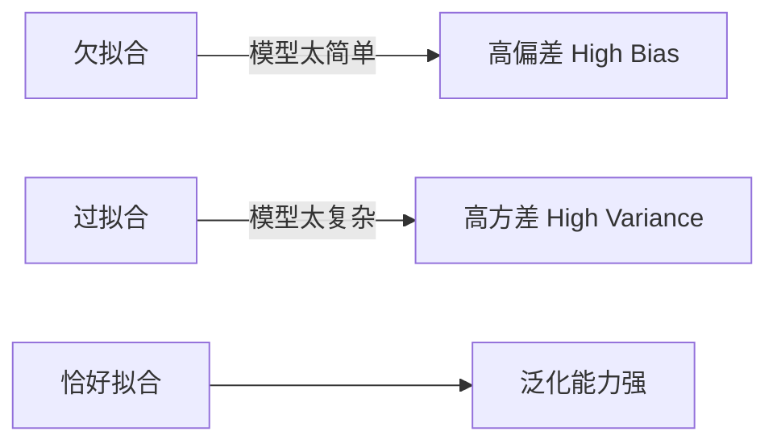
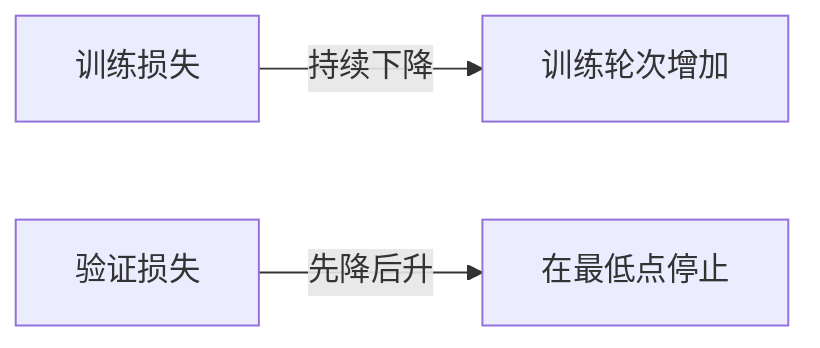

# 升维、降维、惩罚项与 Early Stopping

## 1. 欠拟合与过拟合



---

## 2. 升维（特征扩展）

**目的**：解决欠拟合，让线性模型拟合非线性关系。

**方法**：添加多项式特征

$$x_1, x_2 \to x_1, x_2, x_1^2, x_2^2, x_1x_2$$

```python
from sklearn.preprocessing import PolynomialFeatures

poly = PolynomialFeatures(degree=2)
X_poly = poly.fit_transform(X)  # 自动生成高次特征
```

> **注意**：升维会增加过拟合风险，通常需配合正则化使用。

---

## 3. 降维

**目的**：减少特征数量，缓解过拟合、降低计算成本、消除冗余。

### 主成分分析 (PCA)[^1]

将高维数据投影到方差最大的方向，保留最重要的信息。

```python
from sklearn.decomposition import PCA

pca = PCA(n_components=2)  # 降到2维
X_reduced = pca.fit_transform(X)
print("方差解释比:", pca.explained_variance_ratio_)
```
       
| 方法        | 原理         | 适用场景       |
| --------- | ---------- | ---------- |
| PCA       | 线性投影，最大化方差 | 数值型特征，去相关性 |
| t-SNE[^2] | 非线性，保留局部结构 | 可视化高维数据    |
| 特征选择      | 删除低重要性特征   | 有明确业务含义时   |
[[01_有监督学习_回归与分类#5. LDA（线性判别分析）|对比LDA]]

---

## 4. 惩罚项（Penalty Term）

**目的**：在经验损失之外增加“复杂度代价”，防止模型因为参数过大或过多而过拟合。

$$\text{Objective} = \text{Data Loss} + \lambda \Omega(w)$$

- $\text{Data Loss}$：模型在训练数据上的误差
- $\Omega(w)$：惩罚项，用来约束模型复杂度
- $\lambda$：权衡“拟合训练集”与“控制复杂度”的强度

常见形式：

- **L1 惩罚项**：$\Omega(w) = \sum |w_i|$，会产生稀疏权重，可用于特征选择
- **L2 惩罚项**：$\Omega(w) = \sum w_i^2$，会让权重整体变小，训练更平滑稳定

> 可以把它理解成“模型越复杂，额外成本越高”。升维负责增强表达能力，惩罚项负责抑制复杂度，Early Stopping 则是在训练过程中提前刹车。

更多细节见 [正则化与归一化](../05_Regularization_and_Generalization/01_正则化与归一化.md)。

---

## 5. Early Stopping

**目的**：在验证集损失开始上升时提前终止训练，防止过拟合。



**实现示例（PyTorch）**：

```python
import micropip 
await micropip.install("torch")
import torch

best_val_loss = float('inf')
patience, counter = 10, 0

for epoch in range(max_epochs):
    train(model)
    val_loss = evaluate(model)

    if val_loss < best_val_loss:
        best_val_loss = val_loss
        counter = 0
        torch.save(model.state_dict(), 'best_model.pt')
    else:
        counter += 1
        if counter >= patience:
            print(f"Early stopping at epoch {epoch}")
            break
```

> `patience` 参数控制容忍验证集损失不改善的轮数，通常设为 5~20。工程上通常还会在停止后恢复验证集表现最好的那版权重。

[^1]: **PCA（主成分分析）**：把高维数据"压扁"到低维的技术。核心思想是找到数据变化最大的方向（主成分），把数据投影过去，用更少的维度保留尽可能多的信息。就像把一个三维物体拍成二维照片，选最能体现形状的角度拍。
[^2]: **t-SNE**：一种专门用于可视化的非线性降维算法。它会尽量把原本在高维空间里"相近"的点，在二维/三维图上也画得相近。常用于把几百维的词向量或图像特征可视化成散点图，直观看出聚类结构。注意：t-SNE 结果不适合用于后续建模，仅供可视化。
