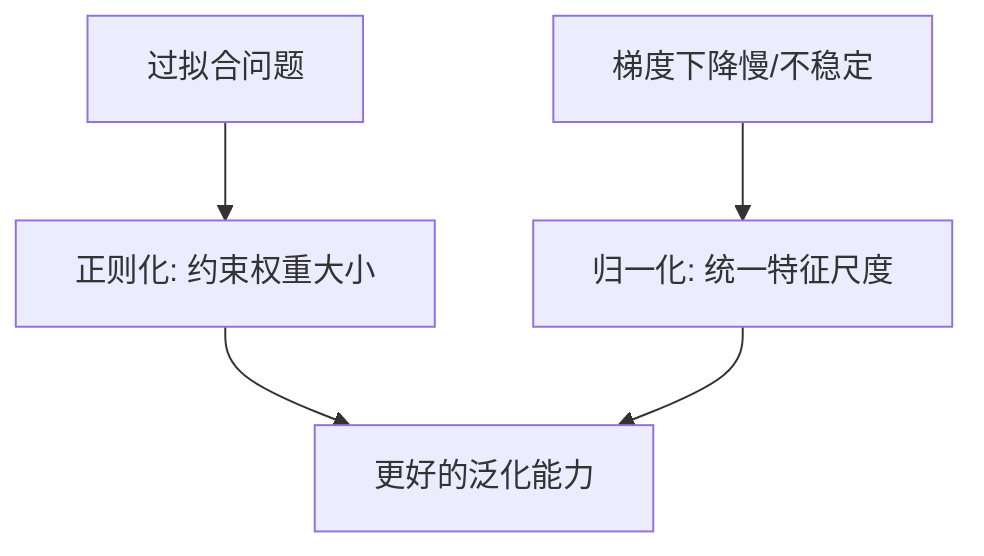

# 正则化与归一化

## 1. 正则化 (Regularization)

**目的**：通过在损失函数中添加惩罚项，限制模型复杂度，防止过拟合。

### 1.1 L2 正则化（岭回归 Ridge）

$$L = MSE + \lambda \sum w_i^2$$

- 惩罚大权重，使权重趋向于小但不为零
- **效果**：模型更平滑，适合特征间存在多重共线性

### 1.2 L1 正则化（Lasso）

$$L = MSE + \lambda \sum |w_i|$$

- 会将部分权重压缩为**精确的零**
- **效果**：自动特征选择，产生稀疏模型

### 1.3 对比

| 特性 | L1 (Lasso) | L2 (Ridge) |
|------|-----------|-----------|
| 权重结果 | 稀疏（部分为0） | 小但非零 |
| 特征选择 | 是 | 否 |
| 对异常值 | 较鲁棒 | 敏感 |
| 适用场景 | 高维稀疏特征 | 特征相关性高 |

> **ElasticNet** = L1 + L2，兼顾两者优点，是工业界常用选择。

```python
from sklearn.linear_model import Ridge, Lasso, ElasticNet

ridge = Ridge(alpha=1.0)    # alpha 即 λ
lasso = Lasso(alpha=0.1)
elastic = ElasticNet(alpha=0.1, l1_ratio=0.5)
```

---

## 2. 归一化 (Normalization / Standardization)

**目的**：消除特征量纲差异，加速梯度下降收敛，提升模型稳定性。

### 2.1 Min-Max 归一化

$$x' = \frac{x - x_{min}}{x_{max} - x_{min}} \in [0, 1]$$

- 适合数据分布已知、无明显离群点的场景

### 2.2 Z-Score 标准化

$$x' = \frac{x - \mu}{\sigma}$$

- 输出均值为0、标准差为1
- 对离群点更鲁棒，**工业界最常用**

```python
from sklearn.preprocessing import MinMaxScaler, StandardScaler

scaler = StandardScaler()
X_train_scaled = scaler.fit_transform(X_train)
X_test_scaled = scaler.transform(X_test)  # 注意：测试集只 transform，不 fit
```

> **重要**：归一化参数必须在训练集上 `fit`，再应用到测试集，防止数据泄露。

---

## 3. 正则化 vs 归一化



两者解决不同问题，实际项目中**通常同时使用**。
