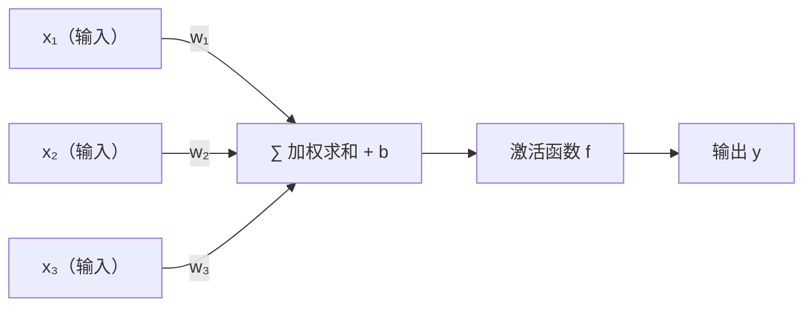
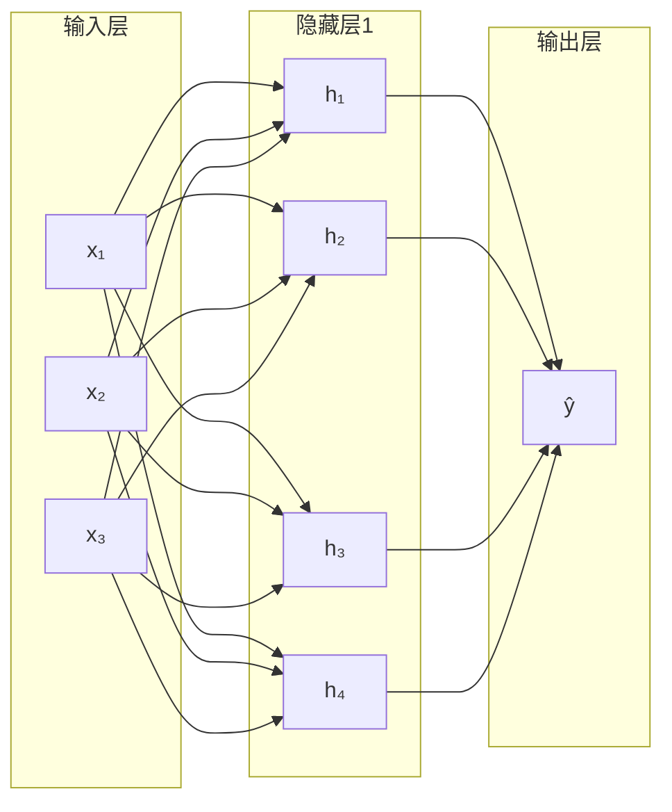

---
title: 什么是神经网络
published: 2026-04-20
description: 神经网络的结构、工作原理与前向传播详解
tags: [机器学习, 神经网络, 深度学习, 前向传播]
category: Machine Learning
draft: false
---
> **为什么要有神经网络?**
> 因为真实世界的数据太复杂、太非线性了。传统编程靠**“教做事”**，传统机器学习靠**“画重点”**，而神经网络实现了真正的**“给例子，自己悟”**。再加上近十年**算力（GPU）的爆发**和**海量数据**的喂养，这个沉寂了几十年的算法终于彻底爆发，统治了今天的 AI 时代。
# 什么是神经网络

## 1. 生物神经元 → 人工神经元

> **类比**：大脑里的神经元接收来自其他神经元的信号，当信号强度超过阈值时就"激活"并向下传递。人工神经元模仿了这个过程。



**单个神经元的计算**：

$$y = f\left(\sum_{i} w_i x_i + b\right) = f(\mathbf{w}^T\mathbf{x} + b)$$

- $w_i$：权重，决定每个输入的"重要程度"
- $b$：偏置，决定激活的"门槛"
- $f$：激活函数[^1]，引入非线性

---

## 2. 神经网络的结构

神经网络 = 多个神经元按层组织起来。



| 层 | 作用 |
|----|------|
| **输入层** | 接收原始特征，不做计算 |
| **隐藏层** | 逐层提取抽象特征，层数越多越"深" |
| **输出层** | 输出最终预测（回归用线性，分类用 Sigmoid/Softmax） |

> **深度学习** = 拥有多个隐藏层的神经网络。"深"指的就是层数多。

---

## 3. 激活函数

激活函数的核心作用：**引入非线性**。没有激活函数，无论多少层叠加，整个网络等价于一个线性模型。

| 激活函数 | 公式 | 特点 | 常用场景 |
|---------|------|------|---------|
| Sigmoid | $\frac{1}{1+e^{-z}}$ | 输出 (0,1)，梯度消失[^2]问题严重 | 二分类输出层 |
| Tanh | $\frac{e^z-e^{-z}}{e^z+e^{-z}}$ | 输出 (-1,1)，零中心化 | RNN 隐藏层 |
| **ReLU** | $\max(0, z)$ | 计算简单，缓解梯度消失，**最常用** | 隐藏层首选 |
| Softmax | $\frac{e^{z_k}}{\sum e^{z_j}}$ | 输出概率分布 | 多分类输出层 |

```python
import micropip
await micropip.install("numpy")
import numpy as np

# 常用激活函数实现
def sigmoid(z): return 1 / (1 + np.exp(-z))
def tanh(z): return np.tanh(z)
def relu(z): return np.maximum(0, z)

z = np.array([-2, -1, 0, 1, 2])
print("Sigmoid:", np.round(sigmoid(z), 3))
print("Tanh:   ", np.round(tanh(z), 3))
print("ReLU:   ", relu(z))
```

---

## 4. 前向传播（Forward Propagation）

前向传播 = 数据从输入层流向输出层，逐层计算的过程。

**以两层网络为例**：

$$\mathbf{a}^{[1]} = f^{[1]}(\mathbf{W}^{[1]}\mathbf{x} + \mathbf{b}^{[1]})$$
$$\hat{y} = f^{[2]}(\mathbf{W}^{[2]}\mathbf{a}^{[1]} + \mathbf{b}^{[2]})$$

```python
import micropip
await micropip.install("numpy")
import numpy as np

def forward(X, W1, b1, W2, b2):
    # 第一层：线性变换 + ReLU 激活
    Z1 = X @ W1.T + b1
    A1 = np.maximum(0, Z1)          # ReLU

    # 第二层（输出层）：线性变换 + Sigmoid
    Z2 = A1 @ W2.T + b2
    A2 = 1 / (1 + np.exp(-Z2))      # Sigmoid

    return A2, (Z1, A1, Z2)         # 返回预测值和中间值（反向传播需要）

# 随机初始化一个小网络：输入3维，隐藏层4个神经元，输出1个
np.random.seed(42)
X  = np.random.randn(5, 3)          # 5个样本，3个特征
W1 = np.random.randn(4, 3) * 0.01  # 隐藏层权重
b1 = np.zeros((1, 4))
W2 = np.random.randn(1, 4) * 0.01  # 输出层权重
b2 = np.zeros((1, 1))

output, cache = forward(X, W1, b1, W2, b2)
print("预测输出:\n", np.round(output, 4))
```

---

## 5. 为什么神经网络强大？

> **通用近似定理**：一个含有足够多神经元的单隐藏层网络，理论上可以近似任意连续函数。

- **浅层网络**：需要指数级神经元才能表达复杂函数
- **深层网络**：通过层次化组合，用更少参数表达更复杂的特征（边缘→纹理→形状→物体）

[^1]: **激活函数**：神经元的"开关"。如果没有激活函数，神经网络无论多少层，本质上都只是一个线性变换，无法学习非线性规律（比如图像识别、语音理解）。激活函数引入非线性，让网络具备拟合复杂函数的能力。
[^2]: **梯度消失**：在深层网络中，反向传播时梯度从输出层向输入层传递，每经过一层都要乘以激活函数的导数。Sigmoid 的导数最大只有 0.25，经过多层相乘后梯度趋近于零，导致靠近输入层的参数几乎无法更新。ReLU 的导数为 1（正区间），有效缓解了这个问题。

