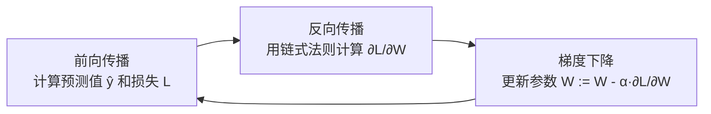
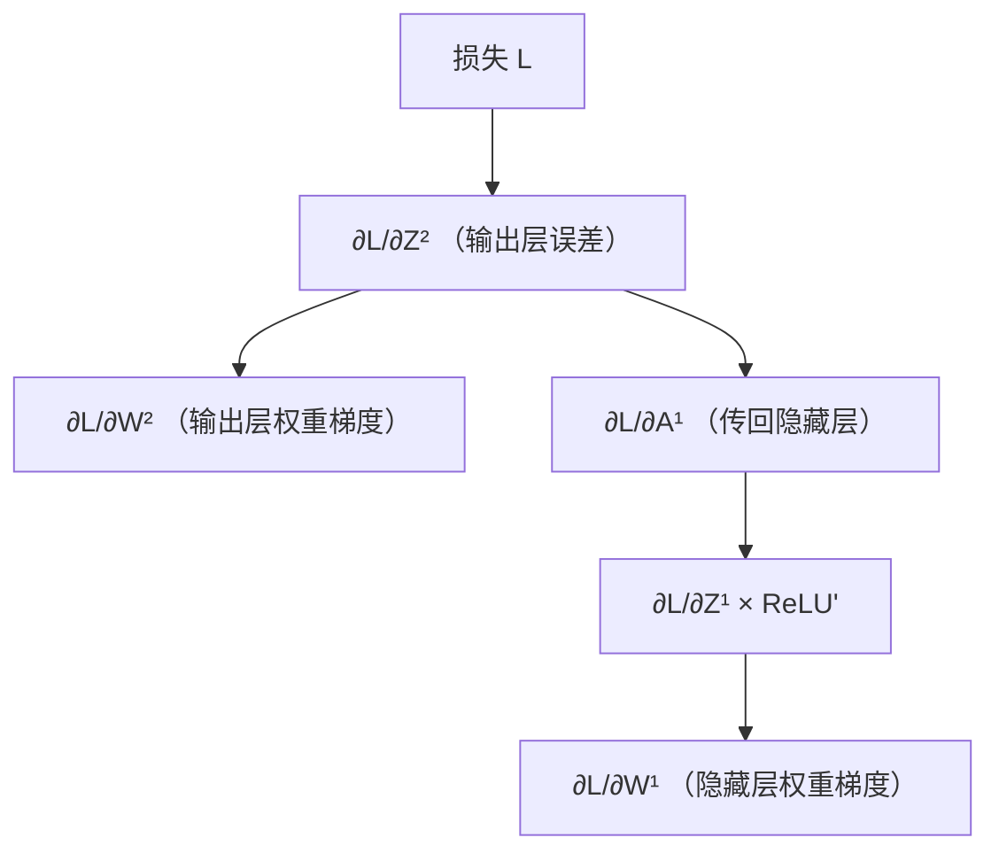

# 神经网络反向传播

## 1. 为什么需要反向传播？

> **类比**：考试考砸了，你要找出是哪道题出了问题，再追溯是哪个知识点没掌握好。反向传播就是从"最终损失"出发，逐层追溯每个参数对损失的"责任大小"（梯度）。

前向传播计算预测值，反向传播计算梯度，两者配合完成一次参数更新。



---

## 2. 核心工具：链式法则[^1]

若 $L$ 是 $z$ 的函数，$z$ 是 $w$ 的函数，则：

$$\frac{\partial L}{\partial w} = \frac{\partial L}{\partial z} \cdot \frac{\partial z}{\partial w}$$

**多层网络**中，梯度从输出层向输入层逐层相乘传递，这就是"反向传播"名字的由来。

---

## 3. 单层推导示例

以一个两层网络（隐藏层 ReLU + 输出层 Sigmoid + 二元交叉熵损失）为例：

**前向**：
$$Z^{[1]} = W^{[1]}X + b^{[1]}, \quad A^{[1]} = \text{ReLU}(Z^{[1]})$$
$$Z^{[2]} = W^{[2]}A^{[1]} + b^{[2]}, \quad \hat{y} = \sigma(Z^{[2]})$$

**反向**（从输出层往回推）：

$$\frac{\partial L}{\partial Z^{[2]}} = \hat{y} - y$$

$$\frac{\partial L}{\partial W^{[2]}} = \frac{1}{m}\frac{\partial L}{\partial Z^{[2]}} \cdot (A^{[1]})^T$$

$$\frac{\partial L}{\partial Z^{[1]}} = (W^{[2]})^T \frac{\partial L}{\partial Z^{[2]}} \odot \text{ReLU}'(Z^{[1]})$$

> $\odot$ 表示逐元素相乘（Hadamard 积[^2]）；$\text{ReLU}'(z) = 1$ 若 $z > 0$，否则为 $0$。

---

## 4. 完整代码实现

```python
import micropip
await micropip.install("numpy")
import numpy as np

# ── 激活函数 ──────────────────────────────────────────
def sigmoid(z):
    return 1 / (1 + np.exp(-z))

def relu(z):
    return np.maximum(0, z)

def relu_backward(dA, Z):
    # ReLU 导数：Z>0 处为1，否则为0
    dZ = dA.copy()
    dZ[Z <= 0] = 0
    return dZ

# ── 前向传播 ──────────────────────────────────────────
def forward(X, W1, b1, W2, b2):
    Z1 = X @ W1.T + b1
    A1 = relu(Z1)
    Z2 = A1 @ W2.T + b2
    A2 = sigmoid(Z2)
    cache = (Z1, A1, Z2, A2)
    return A2, cache

# ── 反向传播 ──────────────────────────────────────────
def backward(X, y, W2, cache):
    m = X.shape[0]
    Z1, A1, Z2, A2 = cache

    # 输出层梯度（Sigmoid + 交叉熵的组合导数化简为 ŷ - y）
    dZ2 = A2 - y                              # (m, 1)
    dW2 = (dZ2.T @ A1) / m                   # (1, n_h)
    db2 = np.mean(dZ2, axis=0, keepdims=True) # (1, 1)

    # 隐藏层梯度（链式法则 + ReLU 导数）
    dA1 = dZ2 @ W2                            # (m, n_h)
    dZ1 = relu_backward(dA1, Z1)             # (m, n_h)
    dW1 = (dZ1.T @ X) / m                    # (n_h, n_x)
    db1 = np.mean(dZ1, axis=0, keepdims=True) # (1, n_h)

    return dW1, db1, dW2, db2

# ── 训练循环 ──────────────────────────────────────────
np.random.seed(42)
X = np.random.randn(100, 3)                  # 100样本，3特征
y = (X[:, 0] + X[:, 1] > 0).astype(float).reshape(-1, 1)  # 简单二分类标签

# 初始化参数（小随机数，避免对称性问题[^3]）
W1 = np.random.randn(4, 3) * 0.01
b1 = np.zeros((1, 4))
W2 = np.random.randn(1, 4) * 0.01
b2 = np.zeros((1, 1))

lr = 0.1
for epoch in range(1000):
    # 前向
    A2, cache = forward(X, W1, b1, W2, b2)

    # 损失（二元交叉熵）
    loss = -np.mean(y * np.log(A2 + 1e-9) + (1 - y) * np.log(1 - A2 + 1e-9))

    # 反向
    dW1, db1, dW2, db2 = backward(X, y, W2, cache)

    # 参数更新
    W1 -= lr * dW1
    b1 -= lr * db1
    W2 -= lr * dW2
    b2 -= lr * db2

    if epoch % 200 == 0:
        print(f"Epoch {epoch:4d} | Loss: {loss:.4f}")
```

---

## 5. 反向传播的本质



> 现代深度学习框架（PyTorch、TensorFlow）通过**自动微分**[^4]自动完成反向传播，无需手动推导梯度。

[^1]: **链式法则**：微积分中复合函数求导的基本规则。$f(g(x))$ 的导数 = $f'(g(x)) \cdot g'(x)$。神经网络本质上是一个巨大的复合函数，链式法则让我们能从输出层一路把梯度"链"回输入层。
[^2]: **Hadamard 积**：两个形状相同的矩阵逐元素相乘，结果形状不变。区别于矩阵乘法（行列点积）。符号为 $\odot$，NumPy 中直接用 `*` 运算符即可。
[^3]: **对称性问题**：若所有权重初始化为相同值（如全零），每个神经元的梯度完全相同，网络退化为单个神经元，无法学习。用小随机数初始化可打破对称性，让每个神经元学习不同特征。
[^4]: **自动微分（Autograd）**：框架在前向传播时自动记录计算图，反向传播时沿计算图自动应用链式法则求梯度。PyTorch 中只需调用 `loss.backward()` 即可，无需手写任何梯度公式。
