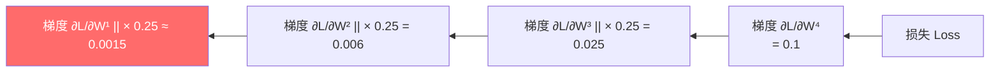
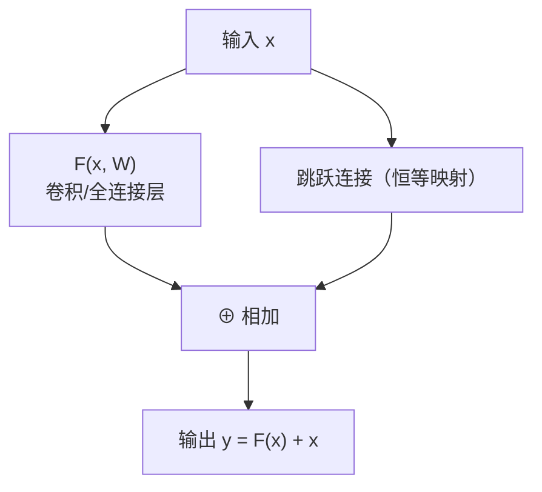
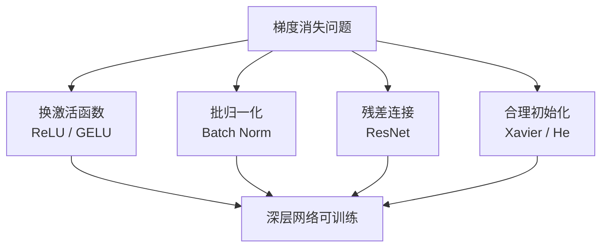

---
title: 梯度消失问题
published: 2026-04-21
description: 深度神经网络中梯度消失问题的成因、影响与解决方案
tags: [深度学习, 梯度消失, 神经网络, 反向传播]
category: Machine Learning
draft: false
---

# 梯度消失问题 (Vanishing Gradient Problem)

## 1. 什么是梯度消失？

> **类比**：想象你在传话游戏中，把一句话从最后一个人传回第一个人。每传一个人，声音就小一点。传了十几个人之后，第一个人几乎什么都听不到了——这就是梯度消失。

在深层神经网络的**反向传播**[^1]过程中，梯度从输出层向输入层逐层传递时，每经过一层都要乘以该层激活函数的导数。当这个导数持续小于 1 时，梯度会以指数级速度衰减，导致靠近输入层的参数几乎得不到有效更新。



---

## 2. 根本原因：Sigmoid 的导数

梯度消失最经典的根源是 **Sigmoid 激活函数**。

$$\sigma(z) = \frac{1}{1+e^{-z}}, \quad \sigma'(z) = \sigma(z)(1-\sigma(z))$$

Sigmoid 导数的最大值仅为 **0.25**（在 $z=0$ 时取得），且在两端趋近于 0。

```python
import micropip
await micropip.install(["numpy", "matplotlib"])
import numpy as np
import matplotlib.pyplot as plt

z = np.linspace(-6, 6, 200)

# Sigmoid 及其导数
sigmoid = 1 / (1 + np.exp(-z))
sigmoid_grad = sigmoid * (1 - sigmoid)

# ReLU 及其导数
relu = np.maximum(0, z)
relu_grad = (z > 0).astype(float)

fig, axes = plt.subplots(1, 2, figsize=(12, 4))

# 左图：函数本身
axes[0].plot(z, sigmoid, label='Sigmoid', color='blue')
axes[0].plot(z, relu, label='ReLU', color='orange')
axes[0].set_title('激活函数对比')
axes[0].legend()
axes[0].grid(True)

# 右图：导数（梯度大小）
axes[1].plot(z, sigmoid_grad, label="Sigmoid'（最大0.25）", color='blue')
axes[1].plot(z, relu_grad, label="ReLU'（正区间恒为1）", color='orange')
axes[1].axhline(y=0.25, color='blue', linestyle='--', alpha=0.5)
axes[1].set_title('导数对比（梯度大小）')
axes[1].legend()
axes[1].grid(True)

plt.tight_layout()
plt.show()
```

**多层叠加后的梯度衰减**：

| 层数 | 每层梯度系数 | 累积梯度（最坏情况） |
|------|------------|------------------|
| 1 层 | 0.25 | 0.25 |
| 5 层 | 0.25⁵ | ≈ 0.001 |
| 10 层 | 0.25¹⁰ | ≈ 0.000001 |
| 20 层 | 0.25²⁰ | ≈ 10⁻¹² |

> 这就是为什么早期深层网络（>5层）几乎无法训练的原因。

---

## 3. 梯度消失的症状

- 训练损失**长时间不下降**，尤其是网络较深时
- 靠近输入层的权重**几乎不变**（可用梯度范数监控）
- 网络表现与浅层网络相当，深度没有带来提升

```python
import micropip
await micropip.install("numpy")
import numpy as np

def sigmoid(z):
    return 1 / (1 + np.exp(-z))

def sigmoid_grad(z):
    s = sigmoid(z)
    return s * (1 - s)

# 模拟10层网络的梯度传播
np.random.seed(42)
gradient = 1.0  # 从输出层出发，初始梯度为1

print("各层梯度大小（Sigmoid激活）：")
for layer in range(1, 11):
    z = np.random.randn()          # 随机激活值
    local_grad = sigmoid_grad(z)   # 该层的局部梯度
    gradient *= local_grad         # 链式法则累乘
    print(f"  第{layer:2d}层: 局部梯度={local_grad:.4f}, 累积梯度={gradient:.2e}")
```

---

## 4. 解决方案

### 4.1 换用 ReLU 激活函数（最直接）

$$\text{ReLU}(z) = \max(0, z), \quad \text{ReLU}'(z) = \begin{cases} 1 & z > 0 \\ 0 & z \leq 0 \end{cases}$$

ReLU 在正区间导数恒为 **1**，梯度不会衰减。

> **代价**：ReLU 存在"神经元死亡"[^2]问题。改进版本：**Leaky ReLU**、**ELU**、**GELU**（Transformer 常用）。

| 激活函数 | 导数范围 | 梯度消失 | 神经元死亡 |
|---------|---------|---------|----------|
| Sigmoid | (0, 0.25] | 严重 | 无 |
| Tanh | (0, 1] | 较轻 | 无 |
| ReLU | {0, 1} | 无（正区间） | 有 |
| Leaky ReLU | {0.01, 1} | 无 | 无 |
| GELU | 近似平滑 | 极轻 | 无 |

### 4.2 批归一化（Batch Normalization）[^3]

在每层激活前对输入做归一化，将数据拉回激活函数的"敏感区间"，避免梯度在饱和区消失。

**完整前向过程**：

$$\hat{z} = \frac{z - \mu_B}{\sqrt{\sigma_B^2 + \epsilon}}, \qquad \tilde{z} = \gamma \hat{z} + \beta$$

- $\mu_B, \sigma_B^2$：当前 mini-batch 的均值和方差（训练时动态计算，推理时用全局统计量）
- $\gamma$（scale）：可学习的缩放参数，初始化为 1
- $\beta$（shift）：可学习的平移参数，初始化为 0
- **为什么需要 $\gamma, \beta$**：纯归一化会破坏网络已学到的特征分布（例如强制均值为0会抹去有意义的偏置）。$\gamma, \beta$ 让网络自行决定"需要多少归一化"，在极端情况下可以完全撤销归一化（$\gamma = \sigma_B, \beta = \mu_B$）。

```python
import micropip
await micropip.install("numpy")  # 仅适用于 Obsidian Code Emitter (Pyodide) 环境
import numpy as np

def batch_norm(Z, gamma, beta, eps=1e-8):
    """
    Z     : 当前层线性输出，形状 (batch_size, features)
    gamma : 可学习缩放，形状 (features,)，初始化为 1
    beta  : 可学习平移，形状 (features,)，初始化为 0
    """
    mu  = Z.mean(axis=0)
    var = Z.var(axis=0)
    Z_hat = (Z - mu) / np.sqrt(var + eps)   # 标准化
    return gamma * Z_hat + beta             # 仿射变换（恢复表达能力）

Z     = np.random.randn(32, 64) * 10
gamma = np.ones(64)    # 初始 scale = 1
beta  = np.zeros(64)   # 初始 shift = 0
Z_bn  = batch_norm(Z, gamma, beta)
print(f"归一化前: 均值={Z.mean():.2f}, 标准差={Z.std():.2f}")
print(f"归一化后: 均值={Z_bn.mean():.4f}, 标准差={Z_bn.std():.4f}")
```

### 4.3 残差连接（Residual Connection）[^4]

ResNet 的核心思想：让梯度有一条"高速公路"直接跳过若干层传回去，绕过可能消失的路径。

$$\mathbf{y} = F(\mathbf{x}, W) + \mathbf{x}$$



**为什么有效——梯度视角**：

对损失 $L$ 求 $\mathbf{x}$ 的梯度：

$$\frac{\partial L}{\partial \mathbf{x}} = \frac{\partial L}{\partial \mathbf{y}} \cdot \frac{\partial \mathbf{y}}{\partial \mathbf{x}} = \frac{\partial L}{\partial \mathbf{y}} \left(1 + \frac{\partial F}{\partial \mathbf{x}}\right)$$

加法中的常数项 **1** 保证了梯度始终有一条不衰减的通路直达浅层，无论 $\frac{\partial F}{\partial \mathbf{x}}$ 多小。

**维度不匹配时**：若 $F(\mathbf{x})$ 与 $\mathbf{x}$ 维度不同（如通道数变化），用 $1\times1$ 卷积对跳跃连接做线性投影：

$$\mathbf{y} = F(\mathbf{x}, W) + W_s\mathbf{x}$$

> ResNet-152（152层）正是靠残差连接实现的。Transformer 中每个子层后的 Add & Norm 也是同一机制。

### 4.4 权重初始化策略

不合理的初始化会在训练开始就引发梯度消失。

| 初始化方法           | 适用激活函数         | 公式                                                                                                 |
| --------------- | -------------- | -------------------------------------------------------------------------------------------------- |
| Xavier / Glorot | Sigmoid / Tanh | $W \sim \mathcal{U}\left(-\sqrt{\frac{6}{n_{in}+n_{out}}}, \sqrt{\frac{6}{n_{in}+n_{out}}}\right)$ |
| He 初始化          | ReLU 系列        | $W \sim \mathcal{N}\left(0, \sqrt{\frac{2}{n_{in}}}\right)$                                        |

```python
import micropip
await micropip.install("numpy")
import numpy as np

def xavier_init(n_in, n_out):
    """适用于 Sigmoid/Tanh"""
    limit = np.sqrt(6 / (n_in + n_out))
    return np.random.uniform(-limit, limit, (n_in, n_out))

def he_init(n_in, n_out):
    """适用于 ReLU"""
    std = np.sqrt(2 / n_in)
    return np.random.randn(n_in, n_out) * std

W_xavier = xavier_init(256, 128)
W_he = he_init(256, 128)
print(f"Xavier 初始化: 均值={W_xavier.mean():.4f}, 标准差={W_xavier.std():.4f}")
print(f"He 初始化:     均值={W_he.mean():.4f}, 标准差={W_he.std():.4f}")
```

---

## 5. 解决方案总结



| 方案 | 解决层级 | 工业界使用 |
|------|---------|----------|
| ReLU 系列 | 激活函数层 | 几乎所有现代网络 |
| Batch Norm | 每层输出 | CNN 标配 |
| 残差连接 | 网络架构 | ResNet、Transformer |
| He 初始化 | 参数初始化 | ReLU 网络标配 |

> 现代深度学习框架（PyTorch、TensorFlow）默认使用 He 初始化 + ReLU + BatchNorm 的组合，梯度消失在大多数场景下已不再是主要障碍。

---

## 相关笔记

- [神经网络反向传播](../06_Neural_Network/02_神经网络反向传播.md) — 梯度消失的数学根源
- [什么是神经网络](../06_Neural_Network/01_什么是神经网络.md) — 激活函数详解

[^1]: **反向传播**：从输出层的损失出发，利用链式法则逐层向前计算每个参数对损失的贡献（梯度）。梯度消失正是发生在这个"向前传递"的过程中。
[^2]: **神经元死亡（Dying ReLU）**：当某个神经元的输入持续为负时，ReLU 输出恒为 0，梯度也恒为 0，该神经元永远不会再被激活，相当于"死掉了"。Leaky ReLU 通过给负区间一个小斜率（如 0.01）来解决这个问题。
[^3]: **批归一化（Batch Normalization）**：2015年由 Google 提出，在每层激活前对一个 mini-batch 的数据做标准化，再用可学习参数 $\gamma, \beta$ 恢复表达能力。副作用是还能起到轻微正则化效果，减少对 Dropout 的依赖。
[^4]: **残差连接（Residual Connection）**：2015年 He Kaiming 等人在 ResNet 中提出。核心洞察是：与其让网络学习目标映射 $H(x)$，不如让它学习残差 $F(x) = H(x) - x$，再加上恒等映射 $x$。这样即使 $F(x)$ 退化为零，网络至少还能保持恒等映射，不会变差。

