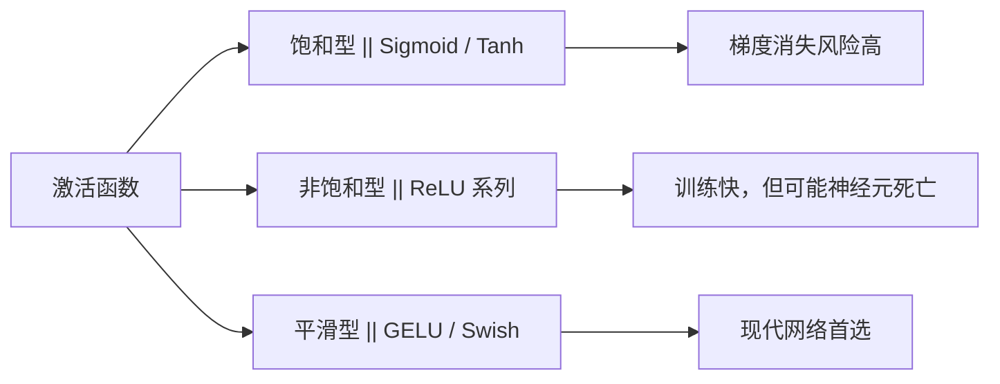

# 激活函数、批量归一化与参数初始化

## 1. 激活函数全景

激活函数的核心作用：**引入非线性**，让网络能拟合复杂函数。



### 1.1 各激活函数对比

| 函数         | 公式                              | 导数范围      | 优点             | 缺点        |
| ---------- | ------------------------------- | --------- | -------------- | --------- |
| Sigmoid    | $\frac{1}{1+e^{-z}}$            | (0, 0.25] | 输出概率           | 梯度消失，非零中心 |
| Tanh       | $\frac{e^z-e^{-z}}{e^z+e^{-z}}$ | (0, 1]    | 零中心化           | 仍有梯度消失    |
| ReLU       | $\max(0,z)$                     | {0, 1}    | 计算快，无梯度消失      | 神经元死亡[^1] |
| Leaky ReLU | $\max(0.01z, z)$                | {0.01, 1} | 解决死亡问题         | 超参数 α 需调  |
| GELU[^2]   | $z\cdot\Phi(z)$                 | 平滑近似      | Transformer 标配 | 计算略慢      |

```python
import micropip
await micropip.install(["numpy", "matplotlib"])
import numpy as np
import matplotlib.pyplot as plt

z = np.linspace(-4, 4, 200)

# 各激活函数
funcs = {
    'Sigmoid': 1 / (1 + np.exp(-z)),
    'Tanh': np.tanh(z),
    'ReLU': np.maximum(0, z),
    'Leaky ReLU': np.where(z > 0, z, 0.01 * z),
    'GELU': z * 0.5 * (1 + np.tanh(np.sqrt(2/np.pi) * (z + 0.044715 * z**3))),
}

plt.figure(figsize=(10, 4))
for name, y in funcs.items():
    plt.plot(z, y, label=name)
plt.axhline(0, color='k', linewidth=0.5)
plt.axvline(0, color='k', linewidth=0.5)
plt.ylim(-2, 3)
plt.legend()
plt.title('激活函数对比')
plt.grid(True, alpha=0.3)
plt.tight_layout()
plt.show()
```

---

## 2. 批量归一化（Batch Normalization）

### 2.1 为什么需要 BatchNorm？

> **类比**：每层网络的输入分布会随着前一层参数更新而不断漂移，就像流水线上的零件规格一直在变——BatchNorm 就是在每道工序前加一个"质检校准"，把输入强制拉回标准规格。

这种分布漂移被称为**内部协变量偏移**[^3]（Internal Covariate Shift）。

### 2.2 计算过程

对一个 mini-batch $\{x_1, \ldots, x_m\}$：

$$\mu_B = \frac{1}{m}\sum x_i, \quad \sigma_B^2 = \frac{1}{m}\sum(x_i-\mu_B)^2$$

$$\hat{x}_i = \frac{x_i - \mu_B}{\sqrt{\sigma_B^2 + \epsilon}}, \quad y_i = \gamma\hat{x}_i + \beta$$

- $\gamma, \beta$：可学习参数，恢复网络的表达能力
- $\epsilon$：防止除零的极小值（如 1e-5）

```python
import micropip
await micropip.install("numpy")  # 仅适用于 Obsidian Code Emitter (Pyodide) 环境
import numpy as np

def batch_norm_forward(X, gamma, beta, eps=1e-5):
    """
    X: (batch_size, features)
    gamma, beta: 可学习缩放/平移参数，形状 (features,)
    """
    mu = X.mean(axis=0)                        # 批次均值
    var = X.var(axis=0)                        # 批次方差
    X_norm = (X - mu) / np.sqrt(var + eps)    # 标准化
    out = gamma * X_norm + beta               # 缩放平移
    cache = (X, X_norm, mu, var, gamma, eps)
    return out, cache

# 示例
np.random.seed(0)
X = np.random.randn(32, 16) * 5 + 3          # 均值3，标准差5的输入
gamma = np.ones(16)
beta = np.zeros(16)

out, _ = batch_norm_forward(X, gamma, beta)
print(f"输入: 均值={X.mean():.2f}, 标准差={X.std():.2f}")
print(f"输出: 均值={out.mean():.4f}, 标准差={out.std():.4f}")
```

> **注意**：推理[^5]时不能用当前 batch 的统计量，而要用训练时积累的**滑动平均**[^6]均值和方差。

### 2.3 BatchNorm 的额外好处

- 轻微正则化效果（减少对 Dropout 的依赖）
- 允许使用更大的学习率，加速收敛
- 降低对权重初始化的敏感性

---

## 3. 权重初始化策略

### 3.1 为什么初始化很重要？

- **全零初始化**：所有神经元梯度相同，网络退化为单神经元（对称性问题[^4]）
- **过大初始化**：激活值饱和，梯度消失
- **过小初始化**：信号逐层衰减，同样导致梯度消失

### 3.2 主流初始化方法

| 方法 | 适用激活函数 | 标准差公式 |
|------|------------|----------|
| Xavier / Glorot | Sigmoid / Tanh | $\sqrt{\frac{2}{n_{in}+n_{out}}}$ |
| He 初始化 | ReLU 系列 | $\sqrt{\frac{2}{n_{in}}}$ |
| LeCun 初始化 | SELU | $\sqrt{\frac{1}{n_{in}}}$ |

```python
import micropip
await micropip.install("numpy")
import numpy as np

def xavier_init(n_in, n_out):
    std = np.sqrt(2.0 / (n_in + n_out))
    return np.random.randn(n_in, n_out) * std

def he_init(n_in, n_out):
    std = np.sqrt(2.0 / n_in)
    return np.random.randn(n_in, n_out) * std

# 模拟10层网络，观察激活值方差变化
def simulate_forward(init_fn, activation, n_layers=10, n=256):
    x = np.random.randn(128, n)  # 输入
    for _ in range(n_layers):
        W = init_fn(n, n)
        x = activation(x @ W)
    return x

relu = lambda x: np.maximum(0, x)

x_xavier = simulate_forward(xavier_init, relu)
x_he = simulate_forward(he_init, relu)

print(f"Xavier + ReLU: 第10层激活方差 = {x_xavier.var():.4f}")
print(f"He     + ReLU: 第10层激活方差 = {x_he.var():.4f}")
# He 初始化能保持方差稳定，Xavier 在 ReLU 下会逐层衰减
```

---

## 相关笔记

- [梯度消失问题](./01_梯度消失问题.md) — BatchNorm 和 He 初始化解决梯度消失的背景
- [什么是神经网络](../06_Neural_Network/01_什么是神经网络.md) — 激活函数基础

[^1]: **神经元死亡（Dying ReLU）**：当某神经元的输入持续为负，ReLU 输出恒为 0，梯度也恒为 0，该神经元永远无法更新。Leaky ReLU 给负区间保留一个小斜率（0.01）来避免这个问题。
[^2]: **GELU（高斯误差线性单元）**：$z \cdot \Phi(z)$，其中 $\Phi$ 是标准正态分布的累积分布函数。相比 ReLU 更平滑，在 BERT、GPT 等 Transformer 模型中广泛使用。
[^3]: **内部协变量偏移**：深层网络训练时，每层的输入分布会随前层参数更新而持续变化，导致后层需要不断适应新的输入分布，减慢训练速度。BatchNorm 通过强制归一化来稳定这个分布。
[^4]: **对称性问题**：若所有权重初始化为相同值，每个神经元的前向输出和反向梯度完全相同，网络无法学习不同特征，等价于只有一个神经元。随机初始化打破对称性，让每个神经元走向不同的特征方向。

[^5]: **推理**: 可以理解为模型正式上线, 面对用户的单个查询时, 不使用单个数据的均值和方差, 使用历史维护的均值和方差
[^6]: **滑动平均（Running Average）**：训练过程中对每个 batch 的均值和方差做指数加权平均，持续更新一个全局估计值。公式为 $\mu_{running} = 0.9 \cdot \mu_{running} + 0.1 \cdot \mu_{batch}$。推理时直接使用这个全局值，不依赖当前输入的 batch 统计量。
