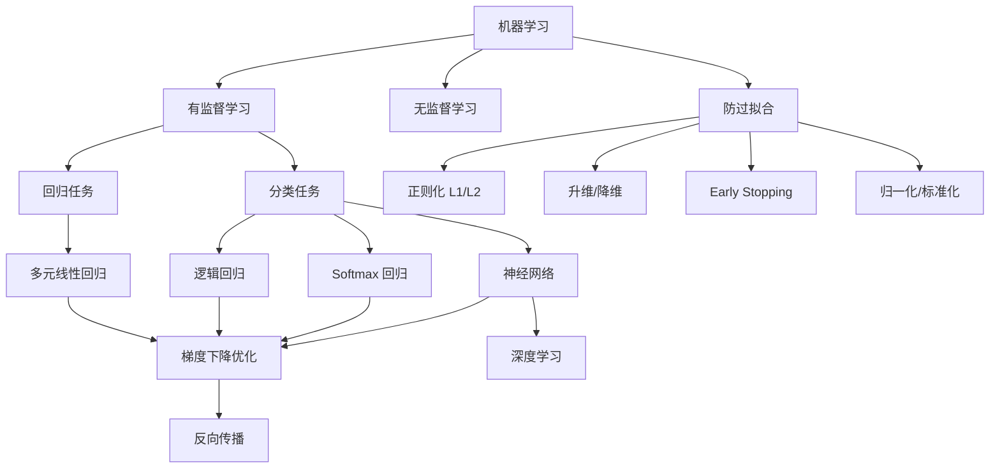
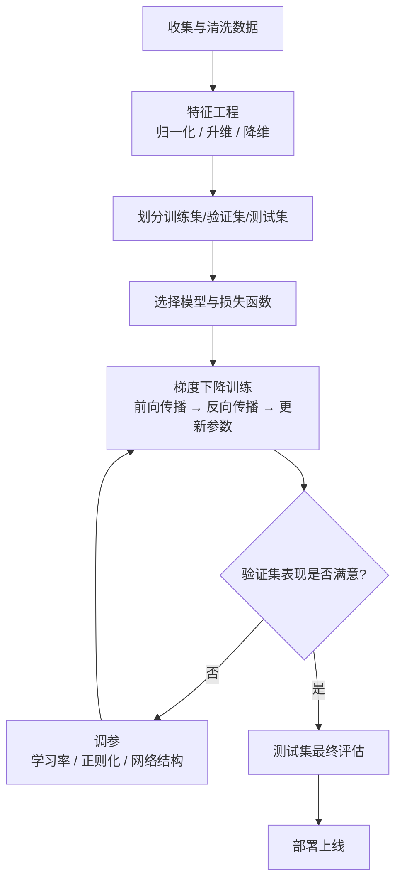

# 机器学习知识总结

## 1. 全局知识图谱

---

## 2. 核心知识点速查

### 模型选择

| 场景 | 推荐模型 | 理由 |
|------|---------|------|
| 结构化数据，小数据集 | 线性/逻辑回归、XGBoost | 可解释，不易过拟合 |
| 二分类 | 逻辑回归 / SVM | 简单高效 |
| 多分类 | Softmax 回归 / 神经网络 | 天然支持多类 |
| 图像/语音/文本 | 深度神经网络 | 自动特征提取 |

### 损失函数速查

| 任务 | 损失函数 | 公式要点 |
|------|---------|---------|
| 回归 | MSE | $(y - \hat{y})^2$ 的均值 |
| 二分类 | 二元交叉熵 | $-[y\log\hat{y} + (1-y)\log(1-\hat{y})]$ |
| 多分类 | 多类交叉熵 | $-\sum_k y_k \log\hat{y}_k$ |

### 防过拟合工具箱

| 问题 | 工具 | 作用 |
|------|------|------|
| 模型太复杂 | L1/L2 正则化 | 惩罚大权重 |
| 特征太多 | 降维（PCA）/ 特征选择 | 减少冗余 |
| 训练轮次过多 | Early Stopping | 在验证集最优处停止 |
| 特征量纲不一 | 标准化/归一化 | 加速梯度下降收敛 |

---

## 3. 训练流水线 Checklist

---

## 4. 常见坑与解决方案

| 现象 | 原因 | 解决方案 |
|------|------|---------|
| 训练损失不下降 | 学习率太小 / 梯度消失 | 调大学习率；换 ReLU；用 BatchNorm |
| 训练损失震荡/发散 | 学习率太大 | 调小学习率；用学习率调度器 |
| 训练好验证差 | 过拟合 | 正则化；Dropout；增加数据 |
| 训练验证都差 | 欠拟合 | 增加模型复杂度；升维；训练更久 |
| 梯度消失 | 深层网络 + Sigmoid | 换 ReLU；残差连接；BatchNorm |

---

## 5. 学习路径建议

> 每一步都要动手写代码，不要只看理论。从零实现一遍梯度下降和反向传播，比看十遍教程更有效。

---

## 6. 笔记导航

| 笔记                                                         | 核心内容                    |
| ---------------------------------------------------------- | ----------------------- |
| [ML 概览](../01_Overview/01_机器学习与深度学习概览.md)               | AI/ML/DL 三者关系           |
| [有监督学习](../02_Supervised_Learning/01_有监督学习_回归与分类.md)       | 回归 vs 分类，评估指标           |
| [多元线性回归](../02_Supervised_Learning/02_多元线性回归算法.md)         | 正规方程，梯度下降求解             |
| [梯度下降](../03_Training_and_Optimization/01_梯度下降法与模型训练.md)              | BGD/SGD/Mini-batch，Adam |
| [升维降维与惩罚项](../04_Feature_Engineering/01_升维降维与Early_Stopping.md) | PCA，Early Stopping      |
| [算法流派](../03_Training_and_Optimization/02_ML训练流水线与算法流派.md)            | 谁能用梯度下降                 |
| [逻辑回归与 Softmax](../02_Supervised_Learning/03_逻辑回归与Softmax回归.md) | 分类模型，交叉熵                |
| [正则化与归一化](../05_Regularization_and_Generalization/01_正则化与归一化.md)              | L1/L2，Z-Score           |
| [什么是神经网络](../06_Neural_Network/01_什么是神经网络.md)              | 结构，激活函数，前向传播            |
| [反向传播](../06_Neural_Network/02_神经网络反向传播.md)                | 链式法则，梯度计算               |
