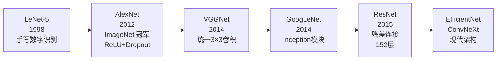
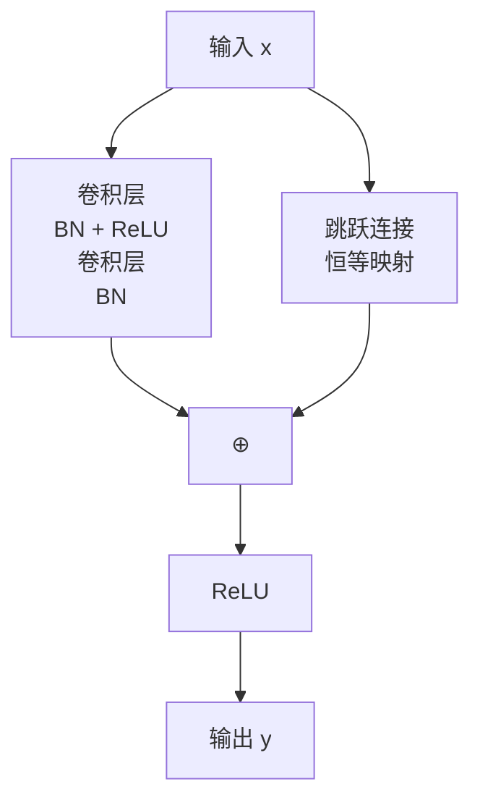

---
title: 经典 CNN 模型与残差网络
published: 2026-04-21
description: LeNet 到 ResNet 的演进历史与残差连接核心原理
tags: [深度学习, CNN, ResNet, 计算机视觉]
category: Deep Learning
draft: false
---

# 经典 CNN 模型与残差网络

## 1. CNN 发展历程



---

## 2. AlexNet：深度学习复兴的起点

2012 年 **ImageNet**[^3] 竞赛，AlexNet 以大幅领先的成绩震惊学界，开启深度学习时代。

**关键创新**：
- 首次大规模使用 **ReLU** 激活函数（替代 Sigmoid）
- 使用 **Dropout**[^1] 防止过拟合
- GPU 并行训练

---

## 3. VGGNet：简洁即美

> **核心思想**：用多个 **3×3 小卷积核**堆叠替代大卷积核。两个 3×3 卷积的感受野等于一个 5×5，但参数更少、非线性更强。

| 配置 | 参数量 | Top-5 错误率[^2] |
|------|--------|------------|
| VGG-16 | 138M | 7.3% |
| VGG-19 | 144M | 7.3% |

---

## 3.5 GoogLeNet：多尺度并行

GoogLeNet（2014）引入了 **Inception 模块**，核心思想是在同一层中同时使用 1×1、3×3、5×5 三种卷积核并行提取不同尺度的特征，再将结果在通道维度拼接。其中 1×1 卷积还承担降维作用，大幅减少计算量。这种"宽而非深"的设计让网络在保持较低参数量的同时获得了丰富的多尺度表示能力。

---

## 4. ResNet：残差连接解决深度瓶颈

### 4.1 问题：深层网络退化

更深的网络理论上应该更强——更多层意味着更强的表达能力，能学习更复杂的特征。但实验发现，56 层网络的训练误差竟然比 20 层更高，这不是过拟合[^4]，而是**优化困难**：梯度消失使得深层网络难以训练。

### 4.2 残差块

$$\mathbf{y} = F(\mathbf{x}, W) + \mathbf{x}$$



**为什么有效**：
- 网络只需学习**残差** $F(x) = H(x) - x$，而非完整映射 $H(x)$
- 跳跃连接为梯度提供"高速公路"，梯度可直接传回早期层
- 即使 $F(x)$ 退化为零，网络至少保持恒等映射，不会变差

```python
import micropip
await micropip.install("torch")
import torch
import torch.nn as nn

class ResidualBlock(nn.Module):
    def __init__(self, channels):
        super().__init__()
        self.block = nn.Sequential(
            nn.Conv2d(channels, channels, 3, padding=1, bias=False),
            nn.BatchNorm2d(channels),
            nn.ReLU(inplace=True),
            nn.Conv2d(channels, channels, 3, padding=1, bias=False),
            nn.BatchNorm2d(channels),
        )
        self.relu = nn.ReLU(inplace=True)

    def forward(self, x):
        return self.relu(self.block(x) + x)   # 残差连接

block = ResidualBlock(64)
x = torch.randn(2, 64, 32, 32)
print("输出形状:", block(x).shape)             # (2, 64, 32, 32) 形状不变
```

---

## 5. 各模型对比

| 模型 | 年份 | 深度 | 参数量 | 特点 |
|------|------|------|--------|------|
| LeNet-5 | 1998 | 7 | 60K | 开山之作 |
| AlexNet | 2012 | 8 | 60M | ReLU、Dropout、GPU |
| VGG-16 | 2014 | 16 | 138M | 统一小卷积核 |
| ResNet-50 | 2015 | 50 | 25M | 残差连接，参数反而少 |
| ResNet-152 | 2015 | 152 | 60M | 极深网络首次可训练 |

> ResNet-50 参数量仅 25M，却比 VGG-16（138M）更深、更准——残差连接让参数利用率大幅提升。

此后的现代架构在残差思想基础上继续演进：**EfficientNet**（2019）通过复合缩放同时调整网络的深度、宽度与分辨率，以更少参数达到更高精度；**ConvNeXt**（2022）则借鉴 Transformer 设计理念对纯卷积网络进行现代化改造，在多项视觉任务上与 Vision Transformer 持平。

## 相关笔记

- [图像识别与卷积神经网络](./01_图像识别与卷积神经网络.md)
- [梯度消失问题](../07_Deep_Learning_Foundations/01_梯度消失问题.md)

[^1]: **Dropout**：训练时随机将一部分神经元的输出置为零（如 50%），强迫网络不依赖某几个特定神经元，从而提升泛化能力。推理时关闭 Dropout，所有神经元参与计算。
[^2]: **Top-5 错误率**：模型输出概率最高的 5 个预测中，没有包含正确答案的比例。ImageNet 有 1000 个类别，Top-5 比 Top-1 更宽松，是早期评估图像分类模型的常用指标。
[^3]: **ImageNet**：包含超过 120 万张图片、1000 个类别的大规模图像数据集。每年举办的 ILSVRC 竞赛（ImageNet Large Scale Visual Recognition Challenge）是推动深度学习发展的重要里程碑。
[^4]: **过拟合**：模型在训练集上表现很好，但在测试集上表现差——即模型"死记硬背"了训练数据而没有学到通用规律。深层网络退化是训练误差本身就高，与过拟合不同。
[^5]: **恒等映射**：输出等于输入的函数，即 $f(x) = x$。残差连接中的跳跃连接就是一个恒等映射，直接把输入加到输出上，不做任何变换。

