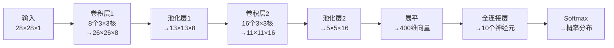

# CNN 完整过程实例解析

> 本篇以"识别手写数字 **8**"为贯穿始终的例子，把 CNN 的每一步都拆开来看。

---

## 0. 任务定义

**输入**：一张 28×28 的灰度图片（手写数字）
**输出**：0～9 中概率最高的那个数字
**网络结构**：输入 → 卷积层1 → 池化层1 → 卷积层2 → 池化层2 → 展平 → 全连接层 → Softmax 输出



---

## 1. 输入层：图像是什么？

一张 28×28 的灰度图片，本质上是一个 **28×28 的数字矩阵**，每个格子的值是 0～255 的像素亮度（0=黑，255=白）。

```
0   0   0   0   0  ...
0  12  89 200 210  ...
0  45 230 255 240  ...
0   0  78 220 255  ...
...
```

> 送入网络前通常归一化到 0～1（除以 255），让训练更稳定。

---

## 2. 卷积层1：提取边缘特征

### 发生了什么？

用 **8 个 3×3 的卷积核**在图片上滑动，每个卷积核负责检测一种低级特征（横边缘、竖边缘、斜线……）。

### 具体过程

以"检测竖边缘"的卷积核为例：

```
卷积核（竖边缘检测器）：
-1  0  1
-2  0  2
-1  0  1
```

把这个 3×3 的小窗口对准图片左上角，做**逐元素相乘再求和**：

```
图片区域：          卷积核：           结果：
 0   0  12    ×   -1  0  1    →  (-1×0)+(0×0)+(1×12)
 0  12  89        -2  0  2       +(-2×0)+(0×12)+(2×89)
 0  45 230        -1  0  1       +(-1×0)+(0×45)+(1×230)
                               = 0 + 178 + 230 = 408
```

然后窗口向右移动 1 格，重复计算……扫完整张图后，得到一张 **26×26 的特征图**（28-3+1=26）。

8 个卷积核 → 输出 **8 张特征图**，叠在一起就是 26×26×8 的张量。

> **直觉**：特征图上数值大的地方，说明该位置存在卷积核所检测的那种模式。数字"8"的轮廓处，竖边缘检测器会产生高响应。

### 加 ReLU 激活

卷积后立刻接 ReLU：把所有负值变成 0。

```
ReLU(-50) = 0    （无该特征）
ReLU(408) = 408  （有该特征）
```

负值没有意义（"反向边缘"不是我们关心的），ReLU 让特征图只保留正响应。

---

## 3. 池化层1：缩小尺寸，保留主要特征

### 发生了什么？

用 **2×2 最大池化**，步长 2，把 26×26 缩小为 **13×13**（每 4 个格子取最大值）。

```
原始特征图（4×4 局部）：    池化后（2×2）：
 1   3   2   4              6   8
 5   6   7   8      →
 9   2   3   1              9   7
 4   5   6   7
```

### 为什么要池化？

1. **降低计算量**：尺寸减半，后续计算量减为 1/4
2. **平移不变性**：数字"8"稍微偏左或偏右，池化后的特征几乎不变——模型不会因为位置微小变化而认不出来

---

## 4. 卷积层2：提取更复杂的特征

第二个卷积层的输入是 13×13×8（8 张特征图），用 **16 个 3×3 卷积核**处理。

此时每个卷积核同时作用于 8 个通道，相当于在"已经检测到边缘"的基础上，进一步组合出**形状、曲线、局部结构**（比如"圆弧"、"交叉点"）。

输出：11×11×16（13-3+1=11，16 个卷积核）

> **层次化理解**：
> - 卷积层1 → 检测像素级的边缘
> - 卷积层2 → 在边缘的基础上检测形状部件
> - 更深的层 → 检测"整个数字的结构"

---

## 5. 池化层2：再次缩小

2×2 最大池化，11×11 → **5×5**（取整：(11-2)/2+1=5）

输出：5×5×16

---

## 6. 展平（Flatten）：从图像到向量

全连接层只接受一维向量，所以把 5×5×16 的三维张量**拉成一条线**：

$$5 \times 5 \times 16 = 400 \text{ 个数字}$$

```
[特征图] 5×5×16  →  [向量] [0.2, 0.8, 0.1, 0.5, ..., 0.3]  (400维)
```

这 400 个数字，每一个都代表"图片中某个位置存在某种特征的强度"。

---

## 7. 全连接层：综合判断

全连接层把 400 维向量映射到 **10 个输出**（对应 0～9 十个类别）。

每个输出神经元都与 400 个输入相连，学习"哪些特征组合在一起代表数字几"：

```
输出神经元"8" = w₁×特征₁ + w₂×特征₂ + ... + w₄₀₀×特征₄₀₀ + b
```

> 类比：全连接层就像一个"综合评委"——它看到所有特征后，综合打分，判断最像哪个数字。

---

## 8. Softmax：输出概率

全连接层输出 10 个原始分数（logits），Softmax 把它们转换为**概率分布**（加起来等于 1）：

```
原始分数：  [-2.1,  0.3,  0.1, -1.5,  0.2, -0.8,  0.4, -1.2,  3.8, -0.6]
             0     1     2     3     4     5     6     7     8     9

Softmax后：  [0.01, 0.02, 0.02, 0.01, 0.02, 0.01, 0.02, 0.01, 0.86, 0.02]
```

数字"8"对应的神经元得分最高（3.8），Softmax 后概率为 **86%**。

**预测结果：8** ✓

---

## 9. 训练时发生了什么？（反向传播简述）

上面描述的是**推理（预测）**过程。训练时，网络还不知道卷积核该长什么样，需要通过数据学习：

1. **前向传播**：输入图片，得到预测概率（如上）
2. **计算损失**：用交叉熵衡量预测与真实标签的差距
   - 真实标签是"8"，但网络预测"8"只有 20%（初始随机权重），损失很大
3. **反向传播**：从损失出发，计算每个参数对损失的梯度
4. **更新参数**：沿梯度反方向调整卷积核的权重
5. **重复**：对数万张图片重复以上步骤，卷积核逐渐学会检测有用的特征

经过训练，第一层卷积核自动学出边缘检测器，第二层学出形状检测器——**不需要人工设计，完全从数据中涌现**。

---

## 10. 完整数据流总结

| 步骤 | 操作 | 输入尺寸 | 输出尺寸 | 作用 |
|------|------|---------|---------|------|
| 输入 | 归一化 | 28×28×1 | 28×28×1 | 像素值 0～1 |
| 卷积层1 | 8个3×3核 + ReLU | 28×28×1 | 26×26×8 | 提取边缘 |
| 池化层1 | 2×2 最大池化 | 26×26×8 | 13×13×8 | 降采样 |
| 卷积层2 | 16个3×3核 + ReLU | 13×13×8 | 11×11×16 | 提取形状 |
| 池化层2 | 2×2 最大池化 | 11×11×16 | 5×5×16 | 降采样 |
| 展平 | Flatten | 5×5×16 | 400 | 转为向量 |
| 全连接 | 线性变换 | 400 | 10 | 综合判断 |
| 输出 | Softmax | 10 | 10（概率） | 归一化为概率 |

---

## 相关笔记

- [图像识别与卷积神经网络](./01_图像识别与卷积神经网络.md)
- [经典 CNN 模型与残差网络](./02_经典CNN模型与残差网络.md)
