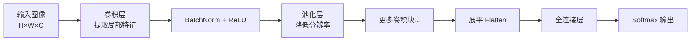
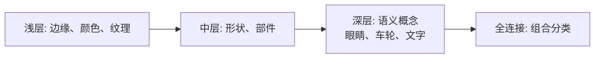

# 图像识别与卷积神经网络

## 1. 为什么全连接网络不适合图像？

> **类比**：用全连接网络处理一张 224×224 的彩色图片，输入维度是 224×224×3 = **150,528**。第一层若有 1000 个神经元，仅这一层就有 1.5 亿个参数——参数爆炸，且完全忽略了像素的空间关系。

CNN 的核心思想：**局部感知 + 权重共享**，用少量参数高效提取空间特征。

- **局部感知**[^3]：每个神经元只连接输入的一小块区域（感受野），而非全部像素
- **权重共享**[^4]：同一个卷积核在整张图上滑动时使用相同的参数，大幅减少参数量

---

## 2. 卷积操作

### 2.1 什么是卷积？

> **类比**：用一个小手电筒（卷积核）在图片上滑动扫描，每次只照亮一小块区域，记录这块区域的"特征强度"，最终形成一张特征图。

$$\text{Output}[i,j] = \sum_{m}\sum_{n} \text{Input}[i+m, j+n] \cdot \text{Kernel}[m,n]$$

```python
import micropip
await micropip.install("numpy")  # 仅适用于 Obsidian Code Emitter (Pyodide) 环境
import numpy as np

def conv2d(input_map, kernel, stride=1, padding=0):
    if padding > 0:
        input_map = np.pad(input_map, padding, mode='constant')
    H, W = input_map.shape
    kH, kW = kernel.shape
    out_H = (H - kH) // stride + 1
    out_W = (W - kW) // stride + 1
    output = np.zeros((out_H, out_W))
    for i in range(out_H):
        for j in range(out_W):
            output[i, j] = np.sum(input_map[i*stride:i*stride+kH, j*stride:j*stride+kW] * kernel)
    return output

image = np.array([[0,0,0,0,0],[0,1,1,1,0],[0,1,1,1,0],[0,1,1,1,0],[0,0,0,0,0]], dtype=float)
# Sobel 垂直边缘检测核
kernel = np.array([[-1,0,1],[-2,0,2],[-1,0,1]], dtype=float)
print("特征图:\n", conv2d(image, kernel))
```

### 2.2 关键超参数

| 参数          | 作用        | 输出尺寸                               |
| ----------- | --------- | ---------------------------------- |
| 卷积核大小 k     | 感受野[^1]大小 | —                                  |
| 步长 stride   | 控制输出分辨率   | $\lfloor\frac{H-k+2p}{s}\rfloor+1$ |
| 填充 padding  | 保留边缘信息    | 见下方说明                              |
| 通道数 filters | 学习多少种特征   | = filter 数量                        |

**Same Padding**：设置 padding 使输出尺寸等于输入尺寸，即 $H_{out} = H_{in}$，此时所需 padding = $\lfloor k/2 \rfloor$。

**具体示例**：输入图像 7×7，卷积核 3×3，stride=1，padding=0：

$$H_{out} = \lfloor\frac{7-3+0}{1}\rfloor+1 = 5 \quad \Rightarrow \text{输出 5×5}$$

- **stride=2** 时：$\lfloor\frac{7-3}{2}\rfloor+1=3$，输出缩小为 3×3（分辨率减半）
- **padding=1** 时：$\lfloor\frac{7-3+2}{1}\rfloor+1=7$，输出保持 7×7（same padding）

> padding 的作用：不加 padding 时，边缘像素只被卷积核扫描一次，而中心像素被扫描多次——边缘信息被"忽视"。加 padding 后边缘像素也能被充分利用。

---

## 3. CNN 完整结构



每个阶段的作用：

| 阶段 | 输入 | 输出 | 作用 |
|------|------|------|------|
| 卷积层 | H×W×C | H'×W'×F | 用 F 个卷积核提取 F 种局部特征 |
| BatchNorm+ReLU | H'×W'×F | H'×W'×F | 稳定训练，引入非线性 |
| 池化层 | H'×W'×F | H'/2×W'/2×F | 缩小空间尺寸，保留主要特征 |
| Flatten | H''×W''×F | H''×W''×F（一维） | 将空间特征展平为向量 |
| 全连接层 | 一维向量 | 类别数 | 综合所有特征做分类决策 |

> - **特征图（Feature Map）**[^5]：卷积核扫描输入后输出的二维矩阵，每张特征图代表一种被检测到的模式（如横边缘、竖边缘）
> - **Flatten**[^6]：将三维特征图（H×W×C）拉平为一维向量，以便输入全连接层
> - **通道（Channel）**：彩色图像有 RGB 3 个通道；卷积后每个 filter 产生一个输出通道，多个 filter 叠加形成多通道特征图

### 3.1 池化层

- **最大池化**：取窗口内最大值，保留最显著特征
- **平均池化**：取窗口内平均值，更平滑

```python
import micropip
await micropip.install("numpy")  # 仅适用于 Obsidian Code Emitter (Pyodide) 环境
import numpy as np

def max_pool2d(x, pool_size=2, stride=2):
    H, W = x.shape
    out_H = (H - pool_size) // stride + 1
    out_W = (W - pool_size) // stride + 1
    out = np.zeros((out_H, out_W))
    for i in range(out_H):
        for j in range(out_W):
            out[i,j] = np.max(x[i*stride:i*stride+pool_size, j*stride:j*stride+pool_size])
    return out

x = np.array([[1,3,2,4],[5,6,7,8],[9,2,3,1],[4,5,6,7]], dtype=float)
print("原始:\n", x)
print("Max Pool 2×2:\n", max_pool2d(x))
```

---

## 4. 特征层次化提取



---

## 5. 转置卷积（上采样）

转置卷积（又称反卷积）是卷积的逆操作，用于将小尺寸特征图放大回原始分辨率。它通过在输入特征图的像素之间插入零值并进行卷积，实现空间尺寸的扩大。转置卷积常用于语义分割（如 U-Net 的解码器路径）和生成模型（如 GAN 的生成器），使网络能够从压缩的特征表示重建出高分辨率输出。

---

## 相关笔记

- [经典 CNN 模型与残差网络](./02_经典CNN模型与残差网络.md)
- [CNN 完整过程实例解析](./03_CNN完整过程实例解析.md)
- [激活函数与 BatchNorm](../08_Deep_Learning_Foundations/02_激活函数_批量归一化与参数初始化.md)

[^1]: **感受野**：某个神经元能"看到"的输入图像区域大小。层数越深、卷积核越大，感受野越大，能捕捉更全局的特征。
[^2]: **池化层**：对特征图进行下采样，减少空间分辨率。好处是降低计算量、增加平移不变性（物体稍微移动，识别结果不变）。
[^3]: **局部感知**：与全连接层不同，卷积层的每个神经元只与输入的局部区域相连。这符合图像的统计特性——相邻像素相关性强，远距离像素相关性弱。
[^4]: **权重共享**：同一个卷积核的参数在整张图上复用。一个 3×3 的卷积核只有 9 个参数，却能处理任意大小的图像。这也赋予了 CNN 平移等变性——物体移动后，特征图也相应平移，但特征本身不变。
[^5]: **特征图（Feature Map）**：卷积核与输入做滑动点积后得到的输出矩阵。一个卷积层有多少个 filter，就输出多少张特征图，每张对应一种被检测的视觉模式。
[^6]: **Flatten**：将卷积层输出的三维张量（高×宽×通道）按行展开为一维向量。这是从"空间特征提取"过渡到"分类决策"的桥梁。
