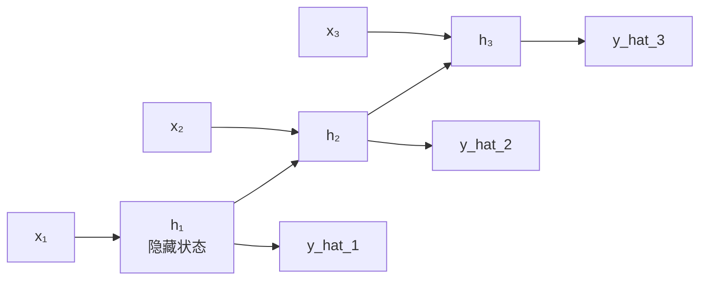

---
title: NLP任务与循环神经网络
published: 2026-04-21
description: NLP 核心任务概览与 RNN 序列建模原理详解
tags: [深度学习, NLP, RNN, 序列模型]
category: Deep Learning
draft: false
---

# NLP 任务与循环神经网络

## 1. NLP 核心任务

| 任务 | 输入→输出 | 典型应用 |
|------|---------|---------|
| 文本分类 | 序列→类别 | 情感分析、垃圾邮件 |
| 序列标注[^3] | 序列→序列（等长） | 命名实体识别[^4]、词性标注[^5] |
| 序列生成 | 序列→序列（变长） | 机器翻译、摘要生成 |
| 语言模型[^6] | 前缀→下一个词 | GPT、文本补全 |

---

## 1.5 词的向量化：词嵌入

RNN 的输入必须是向量，但词语本身是离散符号，需要先将其映射为稠密的实数向量（词嵌入）。One-hot 编码维度等于词表大小，不仅维度爆炸，还无法表达词与词之间的语义相似性。Word2Vec、GloVe 等方法通过大规模语料训练，有时候感兴趣的可以一起看一下这个东西将语义相近的词映射到相近的向量空间，使"国王"与"王后"的向量距离远近于"国王"与"苹果"。现代做法是在模型中加入可训练的 Embedding 层，词向量随整个模型端到端联合训练，无需单独预训练。

---

## 2. 为什么需要 RNN？

> **类比**：阅读句子"我昨天去了银行**取钱**"，理解"银行"的含义需要结合后面的"取钱"——这需要记忆上下文。全连接网络每次只看固定长度的输入，无法处理变长序列和长程依赖。

**RNN 的核心**：引入**隐藏状态** $h_t$，在每个时间步同时接收当前输入和上一步的记忆。

---

## 3. RNN 结构

$$h_t = \tanh(W_h h_{t-1} + W_x x_t + b)$$
$$\hat{y}_t = \text{softmax}(W_y h_t + b_y)$$



- **参数共享**：所有时间步共用同一组 $W_h, W_x$，参数量与序列长度无关（对比全连接网络：处理长度100的序列需要100倍参数）
- **隐藏状态**：充当"记忆"，将历史信息传递给下一步

```python
import micropip
await micropip.install("numpy")  # 仅适用于 Obsidian Code Emitter (Pyodide) 环境
import numpy as np

def rnn_step(x_t, h_prev, Wx, Wh, b):
    """单步 RNN 计算"""
    return np.tanh(x_t @ Wx + h_prev @ Wh + b)

# 参数
input_size, hidden_size = 4, 8
Wx = np.random.randn(input_size, hidden_size) * 0.01
Wh = np.random.randn(hidden_size, hidden_size) * 0.01
b  = np.zeros(hidden_size)

# 模拟长度为5的序列
h = np.zeros(hidden_size)
for t in range(5):
    x_t = np.random.randn(input_size)
    h = rnn_step(x_t, h, Wx, Wh, b)

print("最终隐藏状态形状:", h.shape)
```

---

## 4. RNN 的局限

| 问题 | 描述 |
|------|------|
| 梯度消失[^1] | 长序列中早期信息难以传递到后期 |
| 梯度爆炸[^2] | 梯度随时间步指数增长，训练不稳定 |
| 无法并行 | 必须按时间步顺序计算，训练慢 |

> 梯度消失导致 RNN 实际上只能记住最近几步的信息，对长程依赖（如段落级别的上下文）无能为力。这正是 LSTM 诞生的动机。

## 5. 双向 RNN（BiRNN）

标准 RNN 只从左到右处理序列，每个位置只能看到前文。双向 RNN 同时运行两个方向的 RNN——一个从左到右，一个从右到左——再将两个方向的隐藏状态拼接，使每个位置都能同时感知前文和后文的完整上下文。这对文本分类、命名实体识别（NER）等需要全局语义的任务效果显著。但由于生成时未来的词尚不存在，BiRNN 不适用于文本生成任务。

## 相关笔记

- [RNN 完整过程实例解析](./03_RNN完整过程实例解析.md)
- [梯度消失与 LSTM](./02_梯度消失与长短时记忆网络.md)
- [编码器解码器与注意力机制](../10_Attention_and_Transformer/01_编码器解码器与注意力机制.md)

[^1]: **RNN 中的梯度消失**：反向传播时梯度需要沿时间步传递，每步都要乘以 $W_h^T$ 和激活函数导数。若这些值小于1，经过几十步后梯度趋近于零，早期时间步的参数无法更新。
[^2]: **梯度爆炸**：与梯度消失相反，若 $W_h$ 的特征值大于1，梯度会指数增长。工程上用**梯度裁剪**（Gradient Clipping）解决：当梯度范数超过阈值时，等比例缩小。详见 [梯度消失与长短时记忆网络 §1.5](./02_梯度消失与长短时记忆网络.md)。
[^3]: **序列标注**：对输入序列中的每个元素分别打上标签，输入和输出长度相同。例如对句子中每个词标注其词性（名词/动词/形容词等）。
[^4]: **命名实体识别（NER）**：识别文本中具有特定意义的实体，如人名、地名、机构名、日期等。例如"苹果公司在库比蒂诺成立"→ [苹果公司:机构] 在 [库比蒂诺:地点] 成立。
[^5]: **词性标注（POS Tagging）**：为句子中每个词标注其语法角色，如名词(N)、动词(V)、形容词(Adj)等。是许多 NLP 下游任务的基础预处理步骤。
[^6]: **语言模型**：给定前面的词序列，预测下一个词的概率分布的模型。GPT 系列就是自回归语言模型——每次生成一个词，再把它加入上下文继续预测下一个词。

