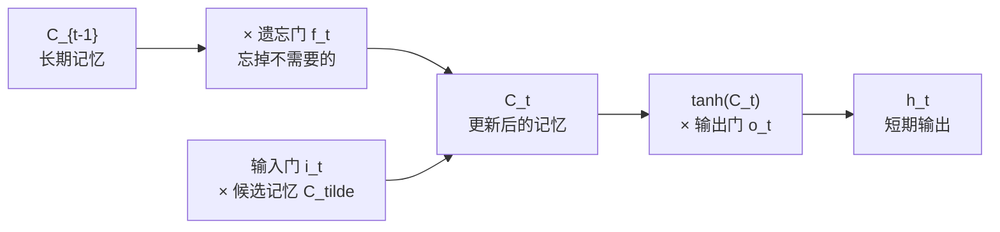

# 梯度消失与长短时记忆网络

## 1. RNN 的梯度消失回顾

RNN 反向传播时，梯度需要沿时间步传递：

$$\frac{\partial L}{\partial h_0} = \frac{\partial L}{\partial h_T} \prod_{t=1}^{T} \frac{\partial h_t}{\partial h_{t-1}}$$

每步都要乘以 $W_h^T \cdot \text{diag}(\tanh'(z_t))$。由于 $\tanh'$ 最大值为 1，长序列下梯度指数衰减，早期时间步几乎得不到更新。

---

## 1.5 梯度爆炸：与梯度消失相反的危机

梯度消失是梯度太小，梯度爆炸则是梯度**太大**。当 $W_h$ 的特征值大于 1 时，每步相乘后梯度指数级增长：

$$\frac{\partial L}{\partial h_0} \sim \lambda^T \quad (\lambda > 1 \Rightarrow \text{梯度爆炸})$$

**危害**：参数更新幅度极大，loss 剧烈震荡甚至变成 `NaN`，训练直接崩溃。

**解决方案：梯度裁剪（Gradient Clipping）**

当梯度的范数超过阈值 $\theta$ 时，等比例缩小：

$$\mathbf{g} \leftarrow \frac{\theta}{\|\mathbf{g}\|} \mathbf{g} \quad \text{当 } \|\mathbf{g}\| > \theta$$

> 类比：给油门加一个限速器——踩再猛也不会超速，但方向不变。

| | 梯度消失 | 梯度爆炸 |
|---|---|---|
| 原因 | $\|\lambda\| < 1$，梯度指数衰减 | $\|\lambda\| > 1$，梯度指数增长 |
| 症状 | 早期层参数不更新，模型学不到长程依赖 | loss 震荡或 NaN，训练崩溃 |
| 解决 | LSTM/GRU 门控机制 | 梯度裁剪 |

---

## 2. LSTM：用"门"控制记忆

> **类比**：LSTM 就像一个有三道闸门的水库——**遗忘门**决定放掉多少旧水，**输入门**决定注入多少新水，**输出门**决定放出多少水供下游使用。水库里的水就是**细胞状态** $C_t$，是跨时间步传递长期记忆的"主干道"。

### 2.1 LSTM 四个核心计算

$$f_t = \sigma(W_f [h_{t-1}, x_t] + b_f) \quad \text{（遗忘门）}$$
$$i_t = \sigma(W_i [h_{t-1}, x_t] + b_i) \quad \text{（输入门）}$$
$$\tilde{C}_t = \tanh(W_C [h_{t-1}, x_t] + b_C) \quad \text{（候选记忆）}$$
$$o_t = \sigma(W_o [h_{t-1}, x_t] + b_o) \quad \text{（输出门）}$$

**细胞状态更新**：

$$C_t = f_t \odot C_{t-1} + i_t \odot \tilde{C}_t$$
$$h_t = o_t \odot \tanh(C_t)$$

其中 $\odot$[^2] 表示逐元素乘法（Hadamard 积），$\tilde{C}_t$[^3] 为候选记忆。
*核心数据*[^4]
*三个“阀门”*[^5]
*数学符号与参数*[^6]



### 2.2 为什么 LSTM 能缓解梯度消失？

细胞状态 $C_t$ 的更新是**加法**而非乘法：

$$C_t = f_t \odot C_{t-1} + i_t \odot \tilde{C}_t$$

梯度通过加法路径传回时，关键梯度项为：

$$\frac{\partial C_t}{\partial C_{t-1}} = f_t$$

只要遗忘门 $f_t$ 接近 1（网络选择"记住"），梯度就能无衰减地传回早期时间步，从而保持梯度流动。

---

## 3. 代码实现

```python
import micropip
await micropip.install("numpy")  # 仅适用于 Obsidian Code Emitter (Pyodide) 环境
import numpy as np

def sigmoid(z): return 1 / (1 + np.exp(-z))

def lstm_step(x_t, h_prev, C_prev, params):
    Wf, Wi, WC, Wo, bf, bi, bC, bo = params
    concat = np.concatenate([h_prev, x_t])  # 拼接隐藏状态和输入

    f = sigmoid(Wf @ concat + bf)           # 遗忘门
    i = sigmoid(Wi @ concat + bi)           # 输入门
    C_tilde = np.tanh(WC @ concat + bC)     # 候选记忆
    o = sigmoid(Wo @ concat + bo)           # 输出门

    C = f * C_prev + i * C_tilde            # 更新细胞状态
    h = o * np.tanh(C)                      # 更新隐藏状态
    return h, C

# 初始化参数
hidden, input_size = 16, 8
concat_size = hidden + input_size
params = [
    np.random.randn(hidden, concat_size) * 0.01,  # Wf
    np.random.randn(hidden, concat_size) * 0.01,  # Wi
    np.random.randn(hidden, concat_size) * 0.01,  # WC
    np.random.randn(hidden, concat_size) * 0.01,  # Wo
    np.zeros(hidden), np.zeros(hidden),            # bf, bi
    np.zeros(hidden), np.zeros(hidden),            # bC, bo
]

h, C = np.zeros(hidden), np.zeros(hidden)
for t in range(10):  # 序列长度10
    x_t = np.random.randn(input_size)
    h, C = lstm_step(x_t, h, C, params)

print("最终隐藏状态:", h.shape)
print("最终细胞状态:", C.shape)
```

---

## 4. LSTM vs GRU

GRU[^1] 是 LSTM 的简化版，将遗忘门和输入门合并为**更新门**，参数更少，训练更快。

| 对比项 | LSTM | GRU |
|--------|------|-----|
| 门数量 | 3（遗忘、输入、输出） | 2（更新、重置） |
| 参数量 | 较多 | 较少（约 LSTM 的 3/4） |
| 性能 | 长序列略优 | 短序列相当甚至更好 |
| 计算速度 | 较慢 | 较快 |

> 实践中两者差异不大，优先尝试 GRU（更快），若效果不足再换 LSTM。

### GRU 核心公式

$$z_t = \sigma(W_z [h_{t-1}, x_t] + b_z) \quad \text{（更新门）}$$
$$r_t = \sigma(W_r [h_{t-1}, x_t] + b_r) \quad \text{（重置门）}$$
$$\tilde{h}_t = \tanh(W_h [r_t \odot h_{t-1}, x_t] + b_h) \quad \text{（候选隐藏状态）}$$
$$h_t = (1 - z_t) \odot h_{t-1} + z_t \odot \tilde{h}_t$$

更新门 $z_t$ 同时控制"遗忘多少旧状态"和"写入多少新状态"，相当于 LSTM 遗忘门和输入门的合并。

## 相关笔记

- [LSTM 门控机制实例解析](./04_LSTM门控机制实例解析.md)
- [NLP 任务与 RNN](./01_序列建模与循环神经网络.md)
- [编码器解码器与注意力机制](../10_Attention_and_Transformer/01_编码器解码器与注意力机制.md)

[^1]: **GRU（门控循环单元）**：2014年提出的 LSTM 简化版。取消了独立的细胞状态 $C_t$，只保留隐藏状态 $h_t$，用更新门控制保留多少历史信息，用重置门控制如何融合新输入。参数更少，在许多任务上与 LSTM 效果相当。
[^2]: **$\odot$（逐元素乘法）**：两个形状相同的向量/矩阵对应位置相乘，结果形状不变。例如 $[1,2,3] \odot [4,5,6] = [4,10,18]$。区别于矩阵乘法 $@$（改变形状）。
[^3]: **候选记忆 $\tilde{C}_t$**：由当前输入 $x_t$ 和上一步隐藏状态 $h_{t-1}$ 计算出的"备选新记忆"。之所以叫"候选"，是因为它不会直接写入细胞状态，而是由输入门 $i_t$ 决定写入多少——$i_t$ 接近 0 则忽略，接近 1 则完全采纳。

[^4]: - $x_t$：**当前时刻的输入**（比如句子中的第 $t$ 个单词）。
	    
	- $h_{t-1}$：**上一步的短期记忆**（隐藏状态）。前一个时刻传过来的局部信息。
	    
	- $C_{t-1}$：**上一步的长期记忆**（细胞状态）。也就是那条贯穿全局的“主干道”。
	    
	- $h_t$：**当前步算出的短期记忆**（准备传给下一个时刻，也是当前层的输出）。
	    
	- $C_t$：**当前步更新后的长期记忆**（准备传给下一个时刻）。
	    
	- $\tilde{C}_t$：**候选记忆**。也就是当前这一步_准备_写入长期记忆的新知识。

[^5]: - $f_t$：**遗忘门 (Forget Gate)**。决定旧的长期记忆 $C_{t-1}$ 有多少应该被**扔掉**。
	    
	- $i_t$：**输入门 (Input Gate)**。决定候选的新知识 $\tilde{C}_t$ 有多少应该被**写进**长期记忆。
	    
	- $o_t$：**输出门 (Output Gate)**。决定更新后的长期记忆 $C_t$ 中，有多少内容应该被**提取出来**，作为当前的短期记忆 $h_t$ 输出。

[^6]: - $W_f, W_i, W_C, W_o$：**权重矩阵**（网络需要学习的参数）。
	    
	- $b_f, b_i, b_C, b_o$：**偏置项**（网络需要学习的门槛参数）。
	    
	- $[h_{t-1}, x_t]$：**拼接 (Concatenate)**。把旧的短期记忆和新的输入绑在一起，拼成一个更长的大向量。
	    
	- $\sigma$：**Sigmoid 激活函数**。把算出来的数值强行压缩到 **$0 \sim 1$ 之间**，完美模拟“阀门”的开闭状态（0 = 关死，1 = 全开）。
	    
	- $\tanh$：**双曲正切函数**。把数值压缩到 **$-1 \sim 1$ 之间**，用于生成包含正负方向的新信息。
	    
	- $\odot$：**按元素相乘 (Element-wise multiplication)**。就像两个矩阵对应位置的数字相乘，起到了“过滤”的作用。
