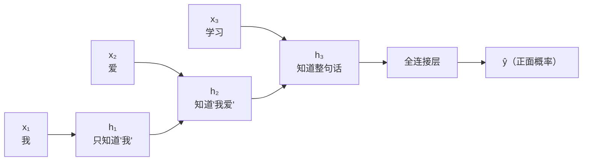
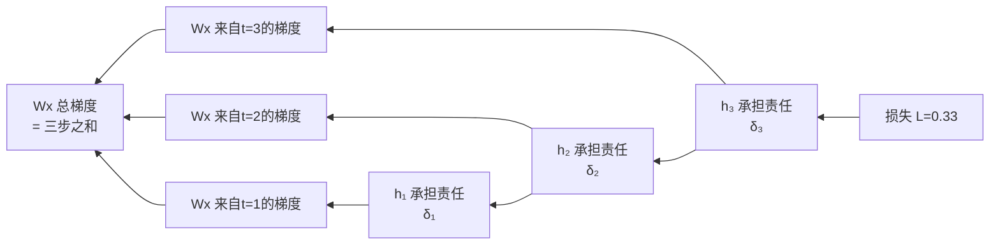
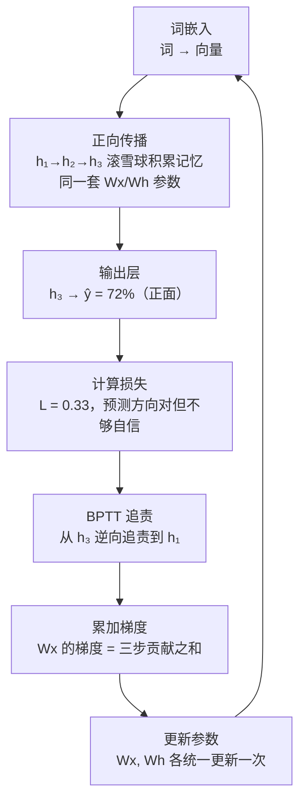

---
title: RNN 完整过程实例解析
published: 2026-04-21
description: 以情感分析为例，逐步拆解 RNN 正向传播、参数共享、隐藏状态传递与反向传播全过程
tags: [深度学习, RNN, NLP, 实例解析]
category: Deep Learning
draft: false
---

# RNN 完整过程实例解析

> 本篇以"判断句子情感（正面/负面）"为例，把 RNN 的每一步都拆开来看。重点不是数字，而是**每一步发生了什么、记忆如何积累**。

---

## 0. 任务定义

**输入**：句子"我 爱 学习"（3 个词）
**输出**：正面（1）或负面（0）
**网络**：单层 RNN，最后一步的隐藏状态接全连接层做分类



> 注意图中 h₁→h₂→h₃ 的标注：隐藏状态就像一个**滚雪球**，每读一个词就把新信息滚进去，越滚越大，最终 h₃ 压缩了整句话的语义。

---

## 1. 输入准备：词 → 向量

RNN 不能直接处理文字，每个词先通过词嵌入转换为向量。我们用 **2 维**向量简化（实际中通常 128～512 维）：

```
我   → x₁ = [0.9,  0.1]   （主语，情感中性）
爱   → x₂ = [0.2,  0.8]   （情感词，情感强）
学习 → x₃ = [0.5,  0.6]   （动作词，略带正面）
```

> 可以把向量的两个维度粗略理解为：**维度1 ≈ 主语/动作信息，维度2 ≈ 情感强度**（这只是帮助理解的比喻，实际含义由训练决定）。

---

## 2. 正向传播：记忆如何一步步积累

### 核心公式

$$h_t = \tanh\bigl(W_x \cdot x_t + W_h \cdot h_{t-1} + b\bigr)$$

用一句话理解：**新记忆 = tanh（当前词的信息 + 上一步的记忆）**

- $W_x \cdot x_t$：从当前词提取信息
- $W_h \cdot h_{t-1}$：把上一步的记忆带过来
- $\tanh$：把结果压缩到 -1～1，防止数值爆炸

> **参数共享**：$W_x$、$W_h$、$b$ 在读"我"、"爱"、"学习"时**用的是完全同一套参数**。就像同一个人读每个词，不是换三个人分别读。

---

### 第 1 步：读"我"（t=1）

**初始状态**：$h_0 = [0.0,\ 0.0]$（什么都不知道）

$$h_1 = \tanh(W_x \cdot x_1 + W_h \cdot h_0 + b)$$

由于 $h_0$ 全零，$W_h \cdot h_0$ 贡献为零，**第一步完全由当前词决定**：

$$h_1 \approx \tanh(W_x \cdot [0.9,\ 0.1]) = [0.42,\ 0.10]$$

**记忆状态可视化：**

```
读完"我"后，h₁ = [0.42, 0.10]

维度1（主语/动作）: ████░░░░░░  42%  ← "我"激活了主语信息
维度2（情感强度）: █░░░░░░░░░  10%  ← 情感几乎空白，"我"是中性词
```

此刻 RNN 只知道"有一个主语"，对情感一无所知。

---

### 第 2 步：读"爱"（t=2）

$$h_2 = \tanh(W_x \cdot x_2 + W_h \cdot h_1 + b)$$

这一步有两个来源：
- $W_x \cdot x_2$：从"爱"这个词提取情感信息
- $W_h \cdot h_1$：把上一步"知道有主语"的记忆带过来

$$h_2 \approx [0.72,\ 0.22]$$

**记忆状态可视化：**

```
读完"爱"后，h₂ = [0.72, 0.22]

维度1（主语/动作）: ███████░░░  72%  ↑ 从42%升到72%（"爱"也是动作词）
维度2（情感强度）: ██░░░░░░░░  22%  ↑ 从10%升到22%（情感开始激活！）
```

$h_2$ 同时包含了"我"和"爱"的信息——**这就是隐藏状态作为记忆的体现**。

---

### 第 3 步：读"学习"（t=3）

$$h_3 = \tanh(W_x \cdot x_3 + W_h \cdot h_2 + b)$$

$$h_3 \approx [0.71,\ 0.73]$$

**记忆状态可视化：**

```
读完"学习"后，h₃ = [0.71, 0.73]

维度1（主语/动作）: ███████░░░  71%  → 基本稳定
维度2（情感强度）: ███████░░░  73%  ↑↑ 大幅上升！（"学习"强化了正面情感）
```

**三步记忆演变对比：**

```
        维度1  维度2
h₁ "我"  42%   10%   ░░ 情感空白
h₂ "爱"  72%   22%   ▒▒ 情感萌芽
h₃"学习" 71%   73%   ██ 情感成熟
```

$h_3$ 压缩了"我爱学习"的全部语义，**情感维度从 10% 飙升到 73%**，正面情感信号强烈。

---

## 3. 输出层：做出判断

用全连接层把 $h_3 = [0.71,\ 0.73]$ 映射为情感概率：

$$\hat{y} = \sigma(W_y \cdot h_3 + b_y) \approx 0.72$$

**预测：正面情感，概率 72%** ✓

> 直觉：$h_3$ 的情感维度（73%）很高，全连接层"看到"这个信号后，判断为正面情感。

---

## 4. 计算损失

真实标签 $y = 1$（正面），预测 $\hat{y} = 0.72$，用二元交叉熵：

$$L = -\log(0.72) \approx 0.33$$

损失 0.33，说明预测方向正确但还不够自信（理想情况是 $\hat{y} \to 1.0$，损失 $\to 0$）。

---

## 5. 反向传播：追责与学习（BPTT）

RNN 的反向传播叫 **BPTT（Backpropagation Through Time）**。

### 5.1 用"追责"理解 BPTT

> 类比：老师批完试卷（计算损失 0.33），发现答得不够好，开始追责：
> - 先找最后一步 h₃："你输出的情感信号不够强，扣分"
> - h₃ 把责任往前推给 h₂："我的问题有一部分是你传给我的记忆不够好"
> - h₂ 再往前推给 h₁："我的问题有一部分来自你"
> - 每一步都记录自己该承担多少责任（梯度）
> - 最后把所有步骤的责任汇总，统一调整参数



### 5.2 参数共享在反向传播中的体现

因为 $W_x$ 在 3 步都用了同一套参数，它的梯度是**三步贡献的累加**：

$$\frac{\partial L}{\partial W_x} = \underbrace{\delta_1 \otimes x_1}_{t=1\text{ 的贡献}} + \underbrace{\delta_2 \otimes x_2}_{t=2\text{ 的贡献}} + \underbrace{\delta_3 \otimes x_3}_{t=3\text{ 的贡献}}$$

> 类比：同一个人读了 3 个词，每个词都给了他一些反馈，他把所有反馈加在一起，**统一调整一次**阅读策略。不是读一个词就调整一次。

### 5.3 参数更新

$$W_x \leftarrow W_x - \eta \cdot \frac{\partial L}{\partial W_x}, \qquad W_h \leftarrow W_h - \eta \cdot \frac{\partial L}{\partial W_h}$$

$\eta$ 是学习率（如 0.01）。经过成千上万句话的训练，$W_x$ 和 $W_h$ 逐渐学会：
- 遇到"爱"、"喜欢"这类词，情感维度大幅激活
- 遇到"不"、"但"这类词，情感维度反转

---

## 6. 为什么会梯度消失？

从 $h_3$ 追责到 $h_1$ 需要经过两次"传递"，每次传递都要乘以一个小于 1 的系数：

```
δ₃ = -0.17（h₃ 的责任）
δ₂ = δ₃ × Wh × tanh'  ≈ -0.17 × 0.8 = -0.14   （衰减了）
δ₁ = δ₂ × Wh × tanh'  ≈ -0.14 × 0.8 = -0.11   （再次衰减）
```

序列越长，早期时间步的梯度越小，最终趋近于零——**早期的词对参数更新几乎没有贡献**，这就是梯度消失。

> 对于"我爱学习"这种短句（3步）影响不大；但对于"在很久很久以前……最终他感到快乐"这种长句（50步），"很久很久以前"的信息几乎无法传到最后，RNN 就"忘了"开头说了什么。

---

## 7. 完整流程总结



| 概念 | 直觉理解 |
|------|---------|
| 隐藏状态 $h_t$ | 滚雪球：每步把新词信息滚进去，越来越大 |
| 参数共享 | 同一个人读每个词，不是换人 |
| BPTT | 追责：从最后一步往前追，每步承担一部分责任 |
| 梯度消失 | 责任传递时逐步衰减，早期词几乎不被追责 |

---

## 相关笔记

- [序列建模与循环神经网络](./01_序列建模与循环神经网络.md)
- [梯度消失与长短时记忆网络](./02_梯度消失与长短时记忆网络.md)

