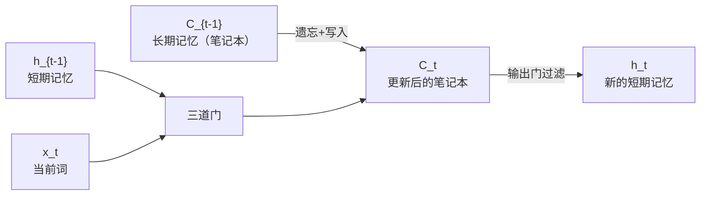
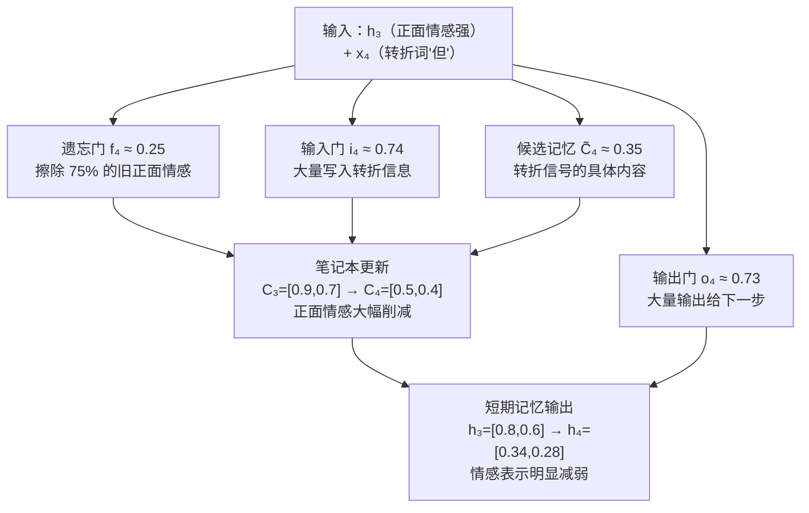

---
title: LSTM 门控机制实例解析
published: 2026-04-21
description: 以"记住/忘记上下文"为例，直观理解 LSTM 四个核心计算与三道门的完整过程
tags: [深度学习, LSTM, RNN, 实例解析]
category: Deep Learning
draft: false
---

# LSTM 门控机制实例解析

> 本篇以"阅读句子，决定记住什么、忘记什么"为场景，重点不是数字，而是**每道门在做什么决策、细胞状态如何变化**。

---

## 0. LSTM 的两条信息流

LSTM 比 RNN 多了一条"高速公路"：

| 符号 | 名称 | 类比 | 特点 |
|------|------|------|------|
| $C_t$ | 细胞状态 | 笔记本 | 长期记忆，可以跨很多步保留信息 |
| $h_t$ | 隐藏状态 | 工作记忆 | 短期输出，传给下一步和输出层 |



> RNN 只有 $h_t$ 一条流，长序列中早期信息容易被"冲淡"。LSTM 的 $C_t$ 是加法更新，信息可以原封不动地传很远。

---

## 1. 场景设定

**句子**："她 喜欢 猫 **但** 她 不 喜欢 狗"

我们聚焦在读到第 4 个词 **"但"** 的这一步（t=4）。

读到"但"之前，LSTM 已经积累了"喜欢猫"的正面情感：

```
进入 t=4 时的状态：

h₃（短期记忆）：
  维度1（情感极性）: ████████░░  80%  ← 正面情感很强
  维度2（情感强度）: ██████░░░░  60%  ← 强度中等偏高

C₃（长期记忆/笔记本）：
  维度1（情感极性）: █████████░  90%  ← 笔记本里写着"正面"
  维度2（情感强度）: ███████░░░  70%  ← 强度记录较高

当前输入 x₄（"但"的词向量）：
  维度1（转折信号）: █░░░░░░░░░  10%  ← 低正面，暗示转折
  维度2（转折强度）: █████████░  90%  ← 转折信号很强
```

**LSTM 需要做的事**：读到"但"后，把笔记本里的正面情感**擦掉大半**，准备接收后面的负面信息。

---

## 2. 四个核心计算

所有门的输入都是 $[h_{t-1},\ x_t]$（短期记忆 + 当前词拼接），用各自独立的权重矩阵计算。

---

### 第一道门：遗忘门 $f_t$——"该擦掉笔记本的哪些内容？"

$$f_t = \sigma(W_f \cdot [h_{t-1}, x_t] + b_f)$$

- 输出范围：**0～1**（$\sigma$ 函数保证）
- $f_t = 0$：完全擦除；$f_t = 1$：完全保留
- 直觉：$W_f$ 的参数经过训练后，会在看到"但/然而/不过"等转折词时，输出接近 0 的值

**读到"但"时，遗忘门的决策：**

```
f₄ ≈ [0.24, 0.28]

遗忘门决策可视化：
  维度1：保留 24%，擦除 76%  ██░░░░░░░░  → 大幅擦除正面情感极性
  维度2：保留 28%，擦除 72%  ██░░░░░░░░  → 大幅擦除情感强度记录
```

> 遗忘门"看到"了转折词 + 之前的正面情感，判断：**这些正面记忆大部分不再有用，擦掉。**

---

### 第二道门：输入门 $i_t$——"该往笔记本写多少新内容？"

$$i_t = \sigma(W_i \cdot [h_{t-1}, x_t] + b_i)$$

- 输出范围：**0～1**
- $i_t = 0$：不写入；$i_t = 1$：全量写入
- 与候选记忆 $\tilde{C}_t$ 配合：$i_t$ 是**阀门**，$\tilde{C}_t$ 是**水**

**读到"但"时，输入门的决策：**

```
i₄ ≈ [0.74, 0.73]

输入门决策可视化：
  维度1：写入 74%  ███████░░░  → 大量写入新信息
  维度2：写入 73%  ███████░░░  → 大量写入新信息
```

> 输入门"看到"了转折词，判断：**有重要的新信息（转折关系）需要大量写入。**

---

### 候选记忆 $\tilde{C}_t$——"准备写入的新内容是什么？"

$$\tilde{C}_t = \tanh(W_C \cdot [h_{t-1}, x_t] + b_C)$$

- 输出范围：**-1～1**（用 $\tanh$ 而非 $\sigma$，因为记忆内容可以是负面的）
- 这只是"草稿"，实际写入多少由输入门 $i_t$ 决定

```
C̃₄ ≈ [0.39, 0.30]

候选记忆内容（草稿）：
  维度1：+0.39  ← 转折信号（正值，但比之前的正面情感弱）
  维度2：+0.30  ← 转折强度记录
```

---

### 细胞状态更新——"更新笔记本"

$$C_t = f_t \odot C_{t-1} + i_t \odot \tilde{C}_t$$

**先擦旧内容，再写新内容：**

```
擦除旧记忆：f₄ ⊙ C₃
  = [0.24, 0.28] ⊙ [0.90, 0.70]
  = [0.21, 0.19]   ← 旧的正面情感只剩两成

写入新信息：i₄ ⊙ C̃₄
  = [0.74, 0.73] ⊙ [0.39, 0.30]
  = [0.29, 0.22]   ← 转折信息大量写入

更新后：C₄ = [0.21+0.29, 0.19+0.22] = [0.50, 0.41]
```

**笔记本变化可视化：**

```
        维度1（情感极性）  维度2（情感强度）
C₃      █████████░  90%   ███████░░░  70%   ← 读"但"之前：正面情感强
C₄      █████░░░░░  50%   ████░░░░░░  41%   ← 读"但"之后：情感大幅减弱
变化     ↓ -40%            ↓ -29%
```

> 笔记本里的正面情感被大幅削减，转折信息写入——LSTM **感知到了语义的转折**。

---

### 第三道门：输出门 $o_t$——"现在该输出笔记本的哪些内容？"

$$o_t = \sigma(W_o \cdot [h_{t-1}, x_t] + b_o)$$
$$h_t = o_t \odot \tanh(C_t)$$

- 笔记本（$C_t$）里记了很多，但当前步不一定全部需要
- 输出门决定"翻开哪几页"给下一步用

```
o₄ ≈ [0.74, 0.72]   ← 输出门开度较大，大量输出

h₄ = o₄ ⊙ tanh(C₄)
   = [0.74, 0.72] ⊙ tanh([0.50, 0.41])
   = [0.74, 0.72] ⊙ [0.46, 0.39]
   = [0.34, 0.28]
```

**短期记忆变化：**

```
        维度1（情感极性）  维度2（情感强度）
h₃      ████████░░  80%   ██████░░░░  60%   ← 读"但"之前：正面情感强
h₄      ███░░░░░░░  34%   ██░░░░░░░░  28%   ← 读"但"之后：情感明显减弱
变化     ↓ -46%            ↓ -32%
```

> $h_4$ 将传给下一步（读"她"），携带着"刚经历了转折"的信息，为后续的"不喜欢狗"做好铺垫。

---

## 3. 三道门协作全景



**三道门的分工：**

```
遗忘门：负责"清理"  → 看到转折词，把旧的正面情感擦掉大半
输入门：负责"写入"  → 把转折关系这个新信息大量写进笔记本
输出门：负责"读取"  → 决定把笔记本里的哪些内容传给下一步
```

---

## 4. 为什么这样设计？

| 设计 | 原因 |
|------|------|
| 遗忘门和输入门用 $\sigma$（0～1） | 做"比例控制"，0=完全不要，1=全要 |
| 候选记忆用 $\tanh$（-1～1） | 记忆内容可以是负面的（如负面情感），需要负值 |
| 细胞状态用**加法**更新 | 加法的梯度为 1，不会衰减，解决梯度消失 |
| 两套状态（$C_t$ 和 $h_t$） | $C_t$ 专注长期记忆，$h_t$ 专注当前输出，分工明确 |

---

## 相关笔记

- [梯度消失与长短时记忆网络](./02_梯度消失与长短时记忆网络.md)
- [RNN 完整过程实例解析](./03_RNN完整过程实例解析.md)
- [序列建模与循环神经网络](./01_序列建模与循环神经网络.md)

