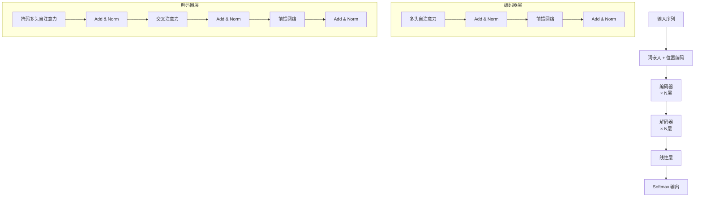

# 浅看 Transformer 架构

## 1. 为什么需要 Transformer？

RNN/LSTM 的两大痛点：
- **无法并行**：必须按时间步顺序计算
- **长程依赖仍然困难**：即使 LSTM 也难以捕捉跨越数百词的依赖

Transformer 用 **Self-Attention 完全替代循环结构**，实现全序列并行计算。

---

## 2. 整体架构



---

## 3. 多头注意力（Multi-Head Attention）

> **类比**：用多个不同角度的"摄像头"同时观察序列，每个摄像头关注不同类型的关系（语法、语义、指代等），最后把所有视角合并。

$$\text{MultiHead}(Q,K,V) = \text{Concat}(\text{head}_1, \ldots, \text{head}_h) W^O$$

$$\text{head}_i = \text{Attention}(QW_i^Q, KW_i^K, VW_i^V)$$

```python
import micropip
await micropip.install("numpy")  # 仅适用于 Obsidian Code Emitter (Pyodide) 环境
import numpy as np

def softmax(x):
    e = np.exp(x - x.max(axis=-1, keepdims=True))
    return e / e.sum(axis=-1, keepdims=True)

def multi_head_attention(X, num_heads=4):
    """简化版多头注意力（Q=K=V=X，即 Self-Attention）"""
    seq_len, d_model = X.shape
    d_k = d_model // num_heads
    # 每个头独立的投影矩阵（在循环外初始化，固定不变）
    Wqs = [np.random.randn(d_model, d_k) * 0.01 for _ in range(num_heads)]
    Wks = [np.random.randn(d_model, d_k) * 0.01 for _ in range(num_heads)]
    Wvs = [np.random.randn(d_model, d_k) * 0.01 for _ in range(num_heads)]
    outputs = []

    for h in range(num_heads):
        Q, K, V = X @ Wqs[h], X @ Wks[h], X @ Wvs[h]
        scores = softmax(Q @ K.T / np.sqrt(d_k))
        outputs.append(scores @ V)              # (seq_len, d_k)

    return np.concatenate(outputs, axis=-1)     # (seq_len, d_model)

X = np.random.randn(10, 64)                    # 序列长10，维度64
out = multi_head_attention(X, num_heads=4)
print("输出形状:", out.shape)                   # (10, 64)
```

---

## 4. 位置编码（Positional Encoding）

Self-Attention 本身没有位置感知（对序列顺序不敏感），需要显式注入位置信息。

$$PE_{(pos, 2i)} = \sin\left(\frac{pos}{10000^{2i/d}}\right), \quad PE_{(pos, 2i+1)} = \cos\left(\frac{pos}{10000^{2i/d}}\right)$$

```python
import micropip
await micropip.install("numpy")  # 仅适用于 Obsidian Code Emitter (Pyodide) 环境
import numpy as np

def positional_encoding(seq_len, d_model):
    PE = np.zeros((seq_len, d_model))
    pos = np.arange(seq_len)[:, np.newaxis]         # (seq_len, 1)
    div = np.exp(np.arange(0, d_model, 2) * (-np.log(10000.0) / d_model))
    PE[:, 0::2] = np.sin(pos * div)                 # 偶数维度用 sin
    PE[:, 1::2] = np.cos(pos * div)                 # 奇数维度用 cos
    return PE

pe = positional_encoding(50, 64)
print("位置编码形状:", pe.shape)                    # (50, 64)
```

---

## 5. 前馈网络（FFN）与因果掩码

### 5.1 前馈网络

每个 Transformer 层中，注意力之后接一个两层全连接网络：

$$\text{FFN}(x) = \max(0,\ xW_1 + b_1)W_2 + b_2$$

- 第一层扩展维度（通常 $d_{ff} = 4 \times d_{model}$），第二层压缩回原维度
- 对序列中**每个位置独立**应用，不跨位置交互

### 5.2 因果掩码（Causal Mask）

解码器在生成第 $i$ 个词时，只能看到位置 $1$ 到 $i$ 的词，不能"偷看"后面还未生成的词——否则训练时模型直接复制答案，推理时却没有答案可看，造成训练/推理不一致。

解码器的自注意力需要防止当前位置"看到"未来词，通过在 Softmax 前将未来位置的得分设为 $-\infty$：

$$\text{score}_{ij} = \begin{cases} QK^T_{ij}/\sqrt{d_k} & j \leq i \\ -\infty & j > i \end{cases}$$

```python
import micropip
await micropip.install("numpy")  # 仅适用于 Obsidian Code Emitter (Pyodide) 环境
import numpy as np

def causal_mask(seq_len):
    """上三角为 -inf 的因果掩码"""
    mask = np.triu(np.full((seq_len, seq_len), -np.inf), k=1)
    return mask

seq_len = 5
scores = np.random.randn(seq_len, seq_len)
masked = scores + causal_mask(seq_len)
print("掩码后得分矩阵:\n", np.round(masked, 2))
```

---

## 6. 残差连接与层归一化[^1]

每个子层（注意力、FFN）后都有：

$$\text{output} = \text{LayerNorm}(x + \text{SubLayer}(x))$$

- **残差连接**：防止梯度消失，允许训练极深网络
- **层归一化**：对每个样本的特征维度归一化（区别于 BatchNorm 对批次归一化）

---

## 7. Transformer 家族

| 模型 | 架构 | 预训练任务 | 适用场景 |
|------|------|----------|---------|
| BERT | 仅编码器 | 掩码语言模型 | 文本理解、分类 |
| GPT 系列 | 仅解码器 | 自回归语言模型 | 文本生成 |
| T5 / BART | 编码器+解码器 | 文本到文本 | 翻译、摘要 |
| ViT | 仅编码器 | 图像分类 | 计算机视觉 |

> Transformer 已从 NLP 扩展到视觉、语音、蛋白质结构预测等几乎所有领域，是当前深度学习最核心的架构。

## 相关笔记

- [编码器解码器与注意力机制](./01_编码器解码器与注意力机制.md)
- [梯度消失问题](../07_Deep_Learning_Foundations/01_梯度消失问题.md)

[^1]: **层归一化（Layer Normalization）**：对单个样本的所有特征维度做归一化（均值为0，方差为1）。与 BatchNorm 不同，LayerNorm 不依赖 batch 内其他样本，适合序列长度可变的 NLP 任务，也适合小 batch 或在线推理场景。
