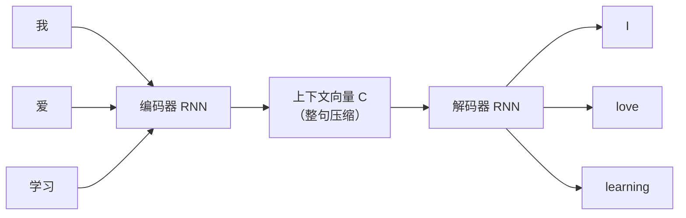

# 编码器解码器与注意力机制

## 1. Seq2Seq[^2] 与编码器-解码器架构

> **类比**：机器翻译就像一个翻译官——先把整句中文"消化理解"（编码器），再用目标语言"重新表达"（解码器）。



**瓶颈问题**：无论输入多长，编码器都要把所有信息压缩进一个固定长度的向量 $C$——长句子信息必然丢失。

---

## 2. 注意力机制（Attention）

> **类比**：翻译"学习"这个词时，翻译官不需要重新读整篇文章，只需把目光集中在"学习"附近——这就是注意力。

### 2.1 计算过程

对解码器在时间步 $t$ 的隐藏状态 $s_t$，计算它与编码器每个位置 $h_i$ 的相关性：

$$e_{ti} = \text{score}(s_t, h_i), \quad \alpha_{ti} = \frac{\exp(e_{ti})}{\sum_j \exp(e_{tj})}$$

$$c_t = \sum_i \alpha_{ti} h_i \quad \text{（加权上下文向量）}$$

- $\alpha_{ti}$：注意力权重，表示解码第 $t$ 步时对编码位置 $i$ 的关注程度
- $c_t$：动态上下文向量，每步不同（解决了固定向量瓶颈）

```python
import micropip
await micropip.install("numpy")  # 仅适用于 Obsidian Code Emitter (Pyodide) 环境
import numpy as np

def attention(query, keys, values):
    """
    query: 解码器当前状态 (d,)
    keys:  编码器所有隐藏状态 (T, d)
    values: 同 keys（简化版，keys=values）
    """
    # 计算相似度得分（点积）
    scores = keys @ query                          # (T,)
    # Softmax 归一化得到注意力权重
    weights = np.exp(scores - scores.max())
    weights /= weights.sum()                       # (T,)
    # 加权求和得到上下文向量
    context = weights @ values                     # (d,)
    return context, weights

# 示例：5个编码位置，隐藏维度8
T, d = 5, 8
keys = np.random.randn(T, d)
query = np.random.randn(d)
context, weights = attention(query, keys, keys)

print("注意力权重:", np.round(weights, 3))         # 和为1
print("上下文向量形状:", context.shape)
```

### 2.2 两种常见打分函数

Bahdanau（加性注意力）用一个小型神经网络计算 score，即 $\text{score}(s, h) = v^\top \tanh(W_1 s + W_2 h)$。Luong（点积注意力）直接用向量点积计算 score，即 $\text{score}(s, h) = s^\top h$，计算更快。Transformer 采用的缩放点积注意力是 Luong 的变体，额外除以 $\sqrt{d_k}$ 以稳定梯度。

---

## 3. Self-Attention（自注意力）

普通 Attention 解决了 Seq2Seq 的固定向量瓶颈，但仍依赖 RNN——无法并行、长程依赖仍然困难。Self-Attention 的改进是：**不再需要 RNN**，序列中每个位置直接对自身序列内所有位置计算注意力，一次性捕捉全局依赖。

### 3.1 Q、K、V 三元组[^1]

$$\text{Attention}(Q, K, V) = \text{softmax}\left(\frac{QK^T}{\sqrt{d_k}}\right)V$$

```python
import micropip
await micropip.install("numpy")  # 仅适用于 Obsidian Code Emitter (Pyodide) 环境
import numpy as np

def scaled_dot_product_attention(Q, K, V):
    """
    Q, K, V: (seq_len, d_k)
    """
    d_k = Q.shape[-1]
    scores = Q @ K.T / np.sqrt(d_k)               # 缩放防止梯度消失
    weights = np.exp(scores - scores.max(axis=-1, keepdims=True))
    weights /= weights.sum(axis=-1, keepdims=True) # softmax
    return weights @ V, weights

seq_len, d_k = 6, 32
Q = np.random.randn(seq_len, d_k)
K = np.random.randn(seq_len, d_k)
V = np.random.randn(seq_len, d_k)

output, attn_weights = scaled_dot_product_attention(Q, K, V)
print("输出形状:", output.shape)                   # (6, 32)
print("注意力矩阵形状:", attn_weights.shape)       # (6, 6)
```

> **为什么除以 $\sqrt{d_k}$**：当 $d_k$ 较大时，点积结果方差大，Softmax 会进入饱和区[^4]导致梯度消失。除以 $\sqrt{d_k}$ 将方差稳定在 1 附近。

## 相关笔记

- [浅看 Transformer 架构](./02_浅看Transformer架构.md)
- [NLP 任务与 RNN](../10_Sequence_Models_and_NLP/01_NLP任务与循环神经网络.md)

[^1]: **Q、K、V（Query、Key、Value）**：类比图书馆检索——Query 是你的检索词，Key 是每本书的索引标签，Value 是书的实际内容。注意力机制用 Query 和每个 Key 的相似度决定从哪些 Value 中取多少信息。
[^2]: **Seq2Seq（Sequence to Sequence）**：将一个序列映射到另一个序列的模型框架，输入输出长度可以不同。典型应用是机器翻译（中文句子→英文句子）和文本摘要（长文→短摘要）。
[^3]: **长程依赖**：序列中相距很远的两个元素之间的关联关系。例如"那只在花园里玩耍的猫**它**很可爱"中，"它"指代"猫"，两者相距多个词。RNN 难以捕捉这种依赖，Self-Attention 可以直接建立任意两个位置之间的联系。
[^4]: **饱和区**：激活函数（如 Sigmoid、Softmax）在输入值极大或极小时，输出趋于常数，导数趋近于零的区域。进入饱和区后梯度几乎为零，参数无法更新。除以 $\sqrt{d_k}$ 是为了防止点积值过大而落入 Softmax 的饱和区。
