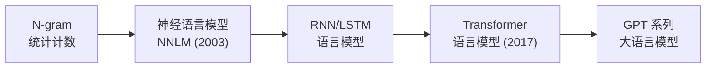
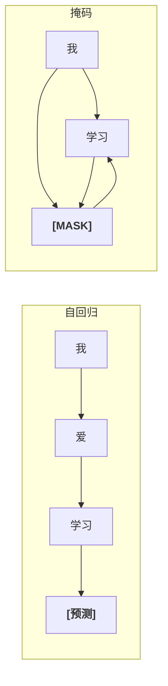
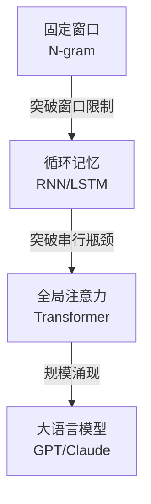

---
title: 什么是语言模型
published: 2026-04-22
description: 从 N-gram 到神经语言模型，理解 Transformer 要解决的核心问题
tags: [Transformer, 语言模型, NLP, 自回归]
category: Transformer
draft: false
---

# 什么是语言模型

## 1. 语言模型的本质

> **类比**：你手机输入法的"联想词"就是一个语言模型——输入"今天天气"，它预测下一个词最可能是"真好"而不是"椅子"。语言模型的核心任务就是：**给定前面的词，预测下一个词的概率分布**。

形式化定义：给定一个词序列 $w_1, w_2, \dots, w_{t-1}$，语言模型计算下一个词 $w_t$ 的条件概率：

$$P(w_t \mid w_1, w_2, \dots, w_{t-1})$$

一个句子的联合概率可以用链式法则分解：

$$P(w_1, w_2, \dots, w_T) = \prod_{t=1}^{T} P(w_t \mid w_1, \dots, w_{t-1})$$

> [!info] 为什么语言模型如此重要？
> 语言模型不只是"猜下一个词"——它是**几乎所有现代 NLP 任务的基础**。机器翻译、文本摘要、对话生成、代码补全……本质上都是在做某种形式的"序列预测"。GPT 系列就是一个超大规模的语言模型。

---

## 2. 语言模型的演化

### 2.1 N-gram 语言模型（统计时代）

**核心思想**：用"数数"来估计概率。假设下一个词只依赖前 $n-1$ 个词（马尔可夫假设）。

$$P(w_t \mid w_1, \dots, w_{t-1}) \approx P(w_t \mid w_{t-n+1}, \dots, w_{t-1})$$

以 Bigram（$n=2$）为例，"天气 → 真好" 的概率 = 语料中"天气真好"的出现次数 ÷ "天气"的出现次数。

| 模型 | 上下文窗口 | 示例 |
|------|-----------|------|
| Unigram | 0（独立） | $P(\text{真好})$ |
| Bigram | 1 个前词 | $P(\text{真好} \mid \text{天气})$ |
| Trigram | 2 个前词 | $P(\text{真好} \mid \text{今天}, \text{天气})$ |

> [!warning] N-gram 的致命缺陷
> - **数据稀疏**：$n$ 稍大，大部分 N-gram 组合在语料中出现次数为 0，概率直接变零
> - **无法捕捉长程依赖**：窗口固定，"十个词以前"的上下文完全丢失
> - **无语义理解**："国王"和"君主"被当作完全不同的符号

### 2.2 神经语言模型（表示学习时代）

Bengio 在 2003 年提出 NNLM[^1]，用神经网络替代统计计数：

1. 将每个词映射为稠密向量（词嵌入）
2. 用前 $n-1$ 个词的向量拼接后送入隐藏层
3. 输出层用 Softmax 预测下一个词的概率

**革命性突破**：词嵌入让语义相似的词拥有相近的向量表示，"国王"和"君主"终于不再是陌生人。

### 2.3 RNN/LSTM 语言模型

用循环结构替代固定窗口，理论上能"记住"任意长的历史：

$$h_t = f(W_h h_{t-1} + W_x x_t + b)$$

每个时间步的隐藏状态 $h_t$ 压缩了从 $w_1$ 到 $w_t$ 的所有历史信息。

> [!tip] 进步与瓶颈
> - **进步**：终于突破了固定窗口，能处理变长序列
> - **瓶颈**：[[02_梯度消失与长短时记忆网络|梯度消失]]导致"记不住太久以前"；**串行计算**无法利用 GPU 并行，训练慢

### 2.4 Transformer 语言模型（注意力时代）

2017 年 Google 发表 *"Attention Is All You Need"*[^2]，用 Self-Attention 完全替代循环结构：

- **任意两个位置直接建立联系**，彻底解决长程依赖
- **全序列并行计算**，训练速度质变
- 成为 GPT、BERT、T5 等大模型的统一基座

---

## 3. 自回归 vs 掩码语言模型

| | 自回归 (Autoregressive) | 掩码 (Masked) |
|---|---|---|
| 代表模型 | GPT 系列 | BERT |
| 预测目标 | 给定前文，预测下一个词 | 随机遮住部分词，预测被遮的词 |
| 注意力方向 | 单向（只看左边） | 双向（左右都看） |
| 擅长任务 | 文本生成、对话、代码补全 | 文本理解、分类、问答 |
| 类比 | 写作文：一个字一个字往下写 | 完形填空：根据上下文猜空格 |

---

## 4. 评估语言模型：困惑度 (Perplexity)

困惑度衡量模型对测试数据的"惊讶程度"——值越低，模型越好。

$$\text{PPL} = \exp\left(-\frac{1}{T}\sum_{t=1}^{T} \log P(w_t \mid w_{<t})\right)$$

> **类比**：困惑度可以理解为"模型在每个位置平均需要从几个词里猜"。PPL=10 意味着模型每一步相当于在 10 个等概率选项中选，PPL=2 则相当于抛硬币——显然后者更"确信"。

| 模型 | 典型 PPL（PTB 数据集） |
|------|---------------------|
| Trigram | ~150 |
| LSTM | ~60 |
| Transformer-base | ~25 |
| GPT-3 | <15 |

---

## 5. 从语言模型到 Transformer

语言模型的演化揭示了一个清晰的趋势：

Transformer 之所以能成为统一架构，正是因为它同时解决了前人的两大瓶颈：**长程依赖**和**并行效率**。接下来我们将拆解它的每一个组件。

## 相关笔记

- [Transformer 整体架构](./02_Transformer整体架构.md) — 下一篇：从全局视角看 Transformer
- [[01_序列建模与循环神经网络]] — RNN/LSTM 基础回顾
- [[02_浅看Transformer架构]] — ML 系列中的 Transformer 概览

[^1]: **NNLM (Neural Network Language Model)**：Bengio 等人 2003 年在论文 *"A Neural Probabilistic Language Model"* 中提出。首次将词嵌入与神经网络结合来做语言建模，奠定了神经 NLP 的基础。
[^2]: **Attention Is All You Need**：Vaswani 等人 2017 年发表于 NeurIPS，提出 Transformer 架构。论文标题本身就在宣告：不需要 RNN、不需要 CNN，只靠注意力机制就够了。

