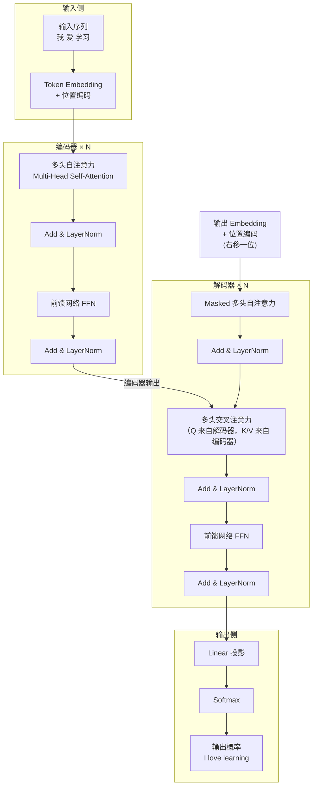
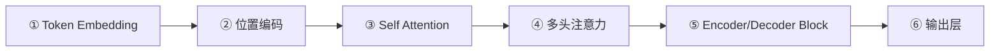
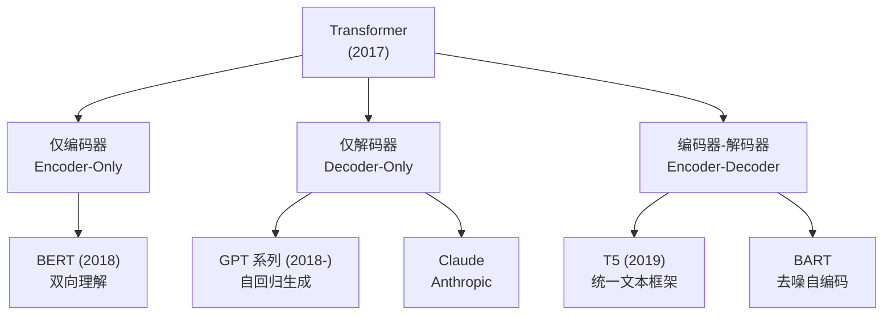

# Transformer 整体架构

## 1. 诞生背景

> **一句话总结**：RNN 太慢（串行），CNN 看不远（局部窗口），于是 Google 在 2017 年提出了一个只用注意力机制的模型——Transformer，一次看完整个序列，还能并行计算。

| 痛点 | RNN/LSTM | CNN | Transformer |
|------|----------|-----|-------------|
| 长程依赖 | 梯度消失，实际 ~100 步 | 受限于卷积核大小 | 任意两个位置直接连接 |
| 并行能力 | 必须逐步串行 | 可并行 | 可并行 |
| 计算复杂度 | $O(T \cdot d^2)$ 串行 | $O(T \cdot k \cdot d^2)$ | $O(T^2 \cdot d)$ 并行 |

---

## 2. 全局架构图



> [!info] 架构核心要点
> - **编码器**：把输入序列编码成"语义记忆"，每一层都通过自注意力让所有位置互相交流
> - **解码器**：基于编码器的"记忆"，自回归地生成输出序列，每一步只能看到已生成的部分
> - **N 层堆叠**：原论文使用 $N=6$，每层结构相同但参数独立

---

## 3. 六大核心组件

Transformer 由以下六个模块搭建而成，后续章节将逐一深入：



| # | 组件 | 作用 | 详细笔记 |
|---|------|------|---------|
| ① | Token Embedding | 将离散词 ID 映射为稠密向量 | [Token Embedding](../02_Input_Representation/01_Token Embedding.md) |
| ② | 位置编码 | 注入序列顺序信息 | [位置编码](../02_Input_Representation/02_位置编码.md) |
| ③ | Self-Attention | 计算序列中任意两个位置的关联度 | [理解 Self Attention](../03_Attention/01_理解Self Attention.md) |
| ④ | 多头注意力 | 从多个角度并行提取特征 | [多头注意力](../03_Attention/03_多头注意力.md) |
| ⑤ | Encoder/Decoder Block | 注意力 + FFN + 残差 + 归一化 | [Encoder Block](../04_Architecture/01_Encoder Block.md) |
| ⑥ | 输出层 | Linear + Softmax → 词概率 | [终端输出](../04_Architecture/03_终端输出.md) |

---

## 4. 数据流全链路追踪

以机器翻译任务 "我 爱 学习" → "I love learning" 为例，追踪一个完整的前向传播：

### 4.1 编码阶段

```
输入: ["我", "爱", "学习"]
  ↓ Token Embedding
[0.12, -0.34, ...] × 3 个向量, 每个 d_model=512 维
  ↓ + Positional Encoding
[0.12+sin, -0.34+cos, ...] 注入位置信息
  ↓ Encoder Layer ×6
每层: Multi-Head Self-Attention → Add&Norm → FFN → Add&Norm
  ↓
编码器输出: 3 个 512 维向量（蕴含整句语义）
```

### 4.2 解码阶段（自回归生成）

```
第 1 步: 输入 <BOS>
  ↓ Masked Self-Attention（只看自己）
  ↓ Cross-Attention（关注编码器输出中的 "我""爱""学习"）
  ↓ FFN → Linear → Softmax
  → 预测 "I"

第 2 步: 输入 <BOS>, "I"
  ↓ Masked Self-Attention（看 <BOS> 和 "I"）
  ↓ Cross-Attention（再次关注编码器输出）
  → 预测 "love"

第 3 步: 输入 <BOS>, "I", "love"
  → 预测 "learning"

第 4 步: 输入 <BOS>, "I", "love", "learning"
  → 预测 <EOS>  停止
```

> [!tip] 训练 vs 推理的关键区别
> - **训练时**：使用 **Teacher Forcing**——解码器的输入是真实目标序列（右移一位），所有位置可以并行计算
> - **推理时**：必须自回归——每次只能生成一个词，用上一步的输出作为下一步的输入

---

## 5. 超参数速查

原论文 *Attention Is All You Need* 中 base/big 两种配置：

| 超参数 | base | big |
|--------|------|-----|
| $d_{model}$（模型维度） | 512 | 1024 |
| $N$（层数） | 6 | 6 |
| $h$（注意力头数） | 8 | 16 |
| $d_k = d_v = d_{model}/h$ | 64 | 64 |
| $d_{ff}$（FFN 隐藏层） | 2048 | 4096 |
| 参数量 | ~65M | ~213M |

> [!warning] 注意区分三种注意力
> Transformer 中有**三种**注意力，它们用的是同一套 Scaled Dot-Product 公式，区别在于 Q/K/V 的来源：
> 1. **编码器自注意力**：Q、K、V 全部来自编码器输入
> 2. **解码器 Masked 自注意力**：Q、K、V 全部来自解码器输入，加因果掩码
> 3. **交叉注意力**：Q 来自解码器，K/V 来自编码器输出

---

## 6. Transformer 家族分支



当前大语言模型主流路线是 **Decoder-Only**（GPT、Claude、LLaMA），因为自回归生成天然适合对话、写作等开放式任务。

## 相关笔记

- [什么是语言模型](./01_什么是语言模型.md) — 上一篇：理解 Transformer 要解决的问题
- [Token Embedding](../02_Input_Representation/01_Token Embedding.md) — 下一篇：输入如何进入模型
- [浅看 Transformer 架构](../../Machine-learning/notes/10_Attention_and_Transformer/02_浅看Transformer架构.md) — ML 系列中的概览版（更简洁）

[^1]: **Teacher Forcing**：训练时将真实标签（而非模型自己的预测）作为解码器的输入。好处是训练稳定、收敛快；缺点是训练和推理存在分布偏移（Exposure Bias），模型推理时遇到自己的错误预测可能会"滚雪球"。
