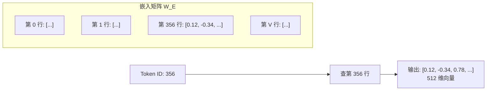

---
title: Token Embedding
published: 2026-04-22
description: 分词策略与词嵌入矩阵：文本如何变成向量
tags: [Transformer, Embedding, 分词, BPE]
category: Transformer
draft: false
---

# Token Embedding

## 1. 为什么需要 Embedding？

> **类比**：计算机不认识汉字，就像一个只懂数学的外星人。Embedding 就是给每个词发一张"身份证"——一串浮点数组成的向量，既能被计算机运算，又能表达词与词之间的语义关系。

神经网络只能处理数值，而自然语言是离散符号。我们需要两步转换：


---

## 2. 分词策略

### 2.1 为什么不按"字"或"词"切？

| 策略 | 示例 | 问题 |
|------|------|------|
| 按字符 | `我/爱/学/习` | 序列过长，每个字符缺乏语义 |
| 按词 | `我/爱/学习` | 词表爆炸（几十万词），低频词无法覆盖 |
| **子词 (Subword)** | `我/爱/学习` 或 `un/believ/able` | 词表可控（3~5 万），兼顾语义与覆盖率 |

现代模型几乎都使用**子词分词**，核心思想：高频词保持完整，低频词拆成更小的有意义片段。

### 2.2 BPE (Byte Pair Encoding)[^1]

GPT 系列使用的分词算法。步骤：

1. 初始词表 = 所有单个字符
2. 统计相邻字符对的出现频次
3. 合并频次最高的字符对，加入词表
4. 重复 2-3 直到词表达到目标大小

```
初始:  l o w e r       # 5个字符
第1轮: lo w e r        # "l"+"o" 合并 → "lo"
第2轮: low e r         # "lo"+"w" 合并 → "low"
第3轮: lowe r          # "ow"+"e" 合并？不，"low"+"e" → "lowe"
第4轮: lower           # "lowe"+"r" → "lower"
```

### 2.3 其他分词方法

| 算法 | 使用模型 | 特点 |
|------|---------|------|
| BPE | GPT 系列 | 基于频率合并，简单高效 |
| WordPiece | BERT | 基于似然度选择合并，效果略优 |
| SentencePiece[^2] | T5, LLaMA | 语言无关，直接处理原始文本（含空格） |
| Unigram | XLNet | 从大词表出发做减法，概率模型驱动 |

> [!tip] 实际使用中
> 你几乎不需要自己实现分词，直接使用模型配套的 tokenizer 即可。但理解分词原理能帮你理解为什么：
> - 同一个词在不同上下文中可能被分成不同的 token
> - 模型的"上下文长度"是以 token 而非汉字/单词计数的
> - 中文通常比英文消耗更多 token

---

## 3. Embedding 查表

分词后，每个 token 得到一个整数 ID。Embedding 层本质是一个**查表操作**：

$$\mathbf{e}_i = \mathbf{W}_E[i]$$

其中 $\mathbf{W}_E \in \mathbb{R}^{V \times d_{model}}$ 是可训练的嵌入矩阵：
- $V$：词表大小（通常 32K~256K）
- $d_{model}$：嵌入维度（通常 512 或更大）



> [!info] Embedding 不是 One-Hot
> One-Hot 编码一个 32K 词表需要 32K 维向量，且无法表达语义相似性。Embedding 用 512 维就够了，而且训练后"国王"和"王后"的向量会自动靠近。

---

## 4. 代码示例

```python
import subprocess
subprocess.check_call(["pip", "install", "numpy"])
import numpy as np

# ========== 模拟 Embedding 查表 ==========
vocab_size = 10000   # 词表大小
d_model = 512        # 嵌入维度

# 初始化嵌入矩阵（实际训练中会随模型一起学习）
np.random.seed(42)
W_E = np.random.randn(vocab_size, d_model) * 0.01

# 假设输入 token IDs
token_ids = [356, 127, 8942]  # "我", "爱", "学习"

# Embedding 查表：就是矩阵的行索引
embeddings = W_E[token_ids]  # shape: (3, 512)

print(f"输入 token IDs: {token_ids}")
print(f"Embedding 形状: {embeddings.shape}")
print(f"第一个 token 的前 8 维: {embeddings[0, :8].round(4)}")

# ========== 缩放因子 ==========
# 原论文在 Embedding 后乘以 sqrt(d_model)，防止值太小被位置编码淹没
scale = np.sqrt(d_model)
scaled_embeddings = embeddings * scale
print(f"\n缩放因子 sqrt({d_model}) = {scale:.2f}")
print(f"缩放后前 8 维: {scaled_embeddings[0, :8].round(4)}")
```

> [!warning] 原论文的缩放细节
> Transformer 原论文在 Embedding 后乘以 $\sqrt{d_{model}}$。原因是：Embedding 向量的初始值通常很小（方差约 1），而位置编码的值域在 $[-1, 1]$，如果不缩放，位置编码会"淹没"语义信息。

---

## 5. Embedding 的几个工业细节

### 5.1 权重共享 (Weight Tying)

很多模型（如 GPT-2、T5）让输入 Embedding 矩阵和输出线性层共享权重：

$$\text{logits} = \mathbf{h} \cdot \mathbf{W}_E^T$$

好处：减少参数量（词表 × 维度 的参数只存一份），且实验表明效果持平或更好。

### 5.2 维度选择

| 模型 | $d_{model}$ | 词表大小 |
|------|------------|---------|
| Transformer base | 512 | 37K |
| GPT-2 small | 768 | 50,257 |
| GPT-3 175B | 12,288 | 50,257 |
| LLaMA-7B | 4,096 | 32,000 |

维度越大，表达能力越强，但计算成本也越高。实际选择取决于模型整体规模的平衡。

## 相关笔记

- [位置编码](./02_位置编码.md) — 下一篇：Embedding 之后如何注入位置信息
- [Transformer 整体架构](../01_Foundation/02_Transformer整体架构.md) — Token Embedding 在全局中的位置

[^1]: **BPE (Byte Pair Encoding)**：最初是一种数据压缩算法，2015 年被 Sennrich 等人引入 NLP 做子词分词。核心是贪心地反复合并最高频的相邻字符对，直到词表达到目标大小。
[^2]: **SentencePiece**：Google 开源的分词工具，直接在原始文本（包括空格）上训练，不需要预分词，因此对中文、日文等无空格分词的语言特别友好。

