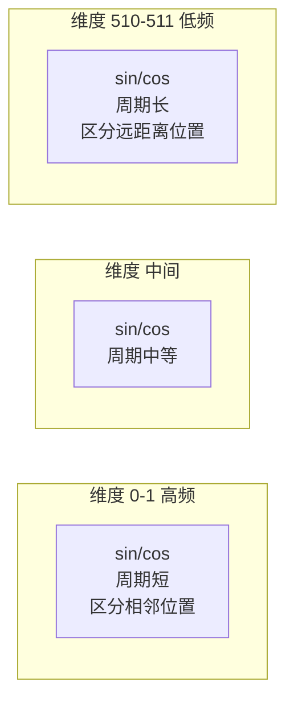
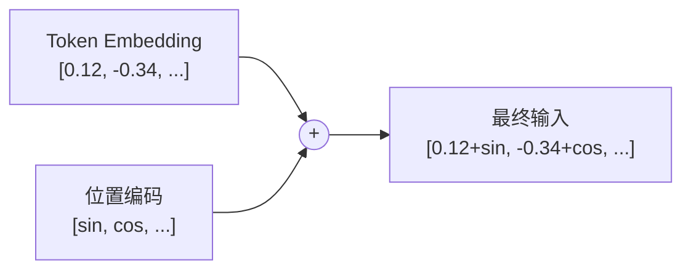

---
title: 位置编码
published: 2026-04-22
description: 为什么 Transformer 需要位置编码，正弦编码推导与现代方案
tags: [Transformer, Positional Encoding, RoPE, 位置编码]
category: Transformer
draft: false
---

# 位置编码 (Positional Encoding)

## 1. 为什么需要位置编码？

> **类比**：Self-Attention 就像一群人围坐圆桌讨论——每个人都能听到所有人说话，但**没人知道座位顺序**。位置编码就是给每把椅子贴上座位号，让模型知道"谁先说、谁后说"。

RNN 天然按时间步处理序列，位置信息隐含在计算顺序中。但 Transformer 的 Self-Attention 对输入做的是**集合运算**——打乱词序，注意力得分完全不变：

$$\text{Attention}(\{q_1, q_2, q_3\}) = \text{Attention}(\{q_3, q_1, q_2\})$$

这意味着 "我爱你" 和 "你爱我" 对模型来说是一样的——显然不行。必须在输入中**显式注入位置信息**。

---

## 2. 正弦位置编码（原论文方案）

原论文使用固定的正弦/余弦函数生成位置编码：

$$PE_{(pos, 2i)} = \sin\left(\frac{pos}{10000^{2i/d_{model}}}\right)$$

$$PE_{(pos, 2i+1)} = \cos\left(\frac{pos}{10000^{2i/d_{model}}}\right)$$

其中：
- $pos$：词在序列中的位置（0, 1, 2, ...）
- $i$：维度索引（0, 1, ..., $d_{model}/2 - 1$）
- $d_{model}$：嵌入维度

### 2.1 直觉理解

> **类比**：想象一排不同频率的钟摆。低频钟摆（大 $i$）转动很慢，区分远距离位置；高频钟摆（小 $i$）转动很快，区分相邻位置。每个位置对应一组唯一的钟摆角度组合——就像二进制计数器的各个位。



### 2.2 为什么选正弦函数？

三个关键优势：

1. **唯一性**：不同位置的编码向量不同
2. **有界性**：值域固定在 $[-1, 1]$，不会因位置增大而爆炸
3. **相对位置可线性表达**：$PE_{pos+k}$ 可以表示为 $PE_{pos}$ 的线性变换——模型可以学会关注"相隔 $k$ 步"的关系

$$\begin{bmatrix} PE_{(pos+k, 2i)} \\ PE_{(pos+k, 2i+1)} \end{bmatrix} = \begin{bmatrix} \cos(k\omega_i) & \sin(k\omega_i) \\ -\sin(k\omega_i) & \cos(k\omega_i) \end{bmatrix} \begin{bmatrix} PE_{(pos, 2i)} \\ PE_{(pos, 2i+1)} \end{bmatrix}$$

> [!info] 这是一个旋转矩阵
> 位置 $pos+k$ 的编码 = 位置 $pos$ 的编码做了一个角度为 $k\omega_i$ 的旋转。这个性质让模型很容易学会"两个词相隔多远"。

---

## 3. 位置编码如何融入模型

位置编码与 Token Embedding **逐元素相加**（不是拼接）：

$$\mathbf{x}_i = \text{TokenEmbed}(w_i) \cdot \sqrt{d_{model}} + PE(i)$$



> [!warning] 为什么是加法不是拼接？
> 拼接会使维度翻倍，增加后续所有层的计算量。加法保持维度不变，实验证明效果相当。原论文中 Token Embedding 乘以 $\sqrt{d_{model}}$ 正是为了让语义信号和位置信号处于相近的数量级。

---

## 4. 代码实现

```python
import subprocess
subprocess.check_call(["pip", "install", "numpy"])
import numpy as np

def sinusoidal_position_encoding(max_len, d_model):
    """生成正弦位置编码矩阵

    Args:
        max_len: 最大序列长度
        d_model: 模型维度（必须是偶数）

    Returns:
        PE 矩阵, shape: (max_len, d_model)
    """
    pe = np.zeros((max_len, d_model))
    position = np.arange(max_len)[:, np.newaxis]           # (max_len, 1)
    div_term = 10000 ** (np.arange(0, d_model, 2) / d_model)  # (d_model/2,)

    pe[:, 0::2] = np.sin(position / div_term)  # 偶数维度用 sin
    pe[:, 1::2] = np.cos(position / div_term)  # 奇数维度用 cos

    return pe

# ========== 生成并观察 ==========
pe = sinusoidal_position_encoding(max_len=50, d_model=512)
print(f"位置编码矩阵形状: {pe.shape}")
print(f"\n位置 0 的前 8 维: {pe[0, :8].round(4)}")
print(f"位置 1 的前 8 维: {pe[1, :8].round(4)}")
print(f"位置 49 的前 8 维: {pe[49, :8].round(4)}")

# ========== 验证：不同位置的编码确实不同 ==========
# 计算位置 0 和位置 1 的余弦相似度
cos_sim_01 = np.dot(pe[0], pe[1]) / (np.linalg.norm(pe[0]) * np.linalg.norm(pe[1]))
cos_sim_049 = np.dot(pe[0], pe[49]) / (np.linalg.norm(pe[0]) * np.linalg.norm(pe[49]))
print(f"\n位置 0 vs 1 余弦相似度: {cos_sim_01:.4f}（相邻，较高）")
print(f"位置 0 vs 49 余弦相似度: {cos_sim_049:.4f}（远距离，较低）")
```

---

## 5. 现代位置编码方案

原论文的正弦编码是"绝对位置编码"。近年来的研究发展出了更强的方案：

### 5.1 可学习位置编码 (Learned PE)

直接将位置编码作为可训练参数：

$$PE = \text{nn.Embedding}(\text{max\_len}, d_{model})$$

- **优点**：模型自己学习最优编码
- **缺点**：无法泛化到训练时未见过的长度
- **使用者**：GPT-2、BERT

### 5.2 RoPE (Rotary Position Embedding)[^1]

将位置信息编码为**旋转角度**，直接作用在 Q、K 向量上：

$$\tilde{q}_m = R(\theta_m) \cdot q_m, \quad \tilde{k}_n = R(\theta_n) \cdot k_n$$

注意力分数 $\tilde{q}_m^T \tilde{k}_n$ 天然只依赖相对位置 $m-n$。

- **优点**：优雅地编码相对位置，可外推到更长序列
- **使用者**：LLaMA、Qwen、ChatGLM

### 5.3 ALiBi (Attention with Linear Biases)[^2]

不修改 Embedding，而是在注意力分数上直接减去一个与距离成正比的偏置：

$$\text{score}(i, j) = q_i^T k_j - m \cdot |i - j|$$

- **优点**：实现极简，长度外推能力强
- **使用者**：BLOOM、MPT

### 5.4 方案对比

| 方案 | 类型 | 长度外推 | 实现复杂度 |
|------|------|---------|-----------|
| 正弦编码 | 绝对，固定 | 理论可以，实际有限 | 低 |
| 可学习 PE | 绝对，可训练 | 不能 | 低 |
| RoPE | 相对，嵌入旋转 | 较好 | 中 |
| ALiBi | 相对，注意力偏置 | 好 | 低 |

---

## 相关笔记

- [Token Embedding](./01_Token_Embedding.md) — 上一篇：分词与词嵌入
- [理解 Self Attention](../03_Attention/01_理解Self_Attention.md) — 下一篇：位置编码注入后的核心计算

[^1]: **RoPE (Rotary Position Embedding)**：Su 等人 2021 年提出。核心思想是将位置编码从"加法"变为"旋转"——对 Q 和 K 向量的每对维度施加一个与位置相关的二维旋转，使得内积天然只反映相对位置差。被 LLaMA、Qwen 等主流开源模型广泛采用。
[^2]: **ALiBi (Attention with Linear Biases)**：Press 等人 2022 年提出。完全不修改嵌入层，而是在计算注意力分数时减去一个与距离成线性关系的惩罚值，距离越远惩罚越大。实现只需一行代码改动，长度外推效果却非常好。


