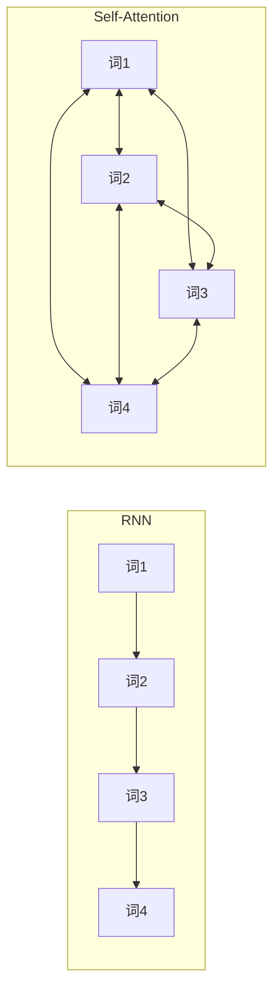
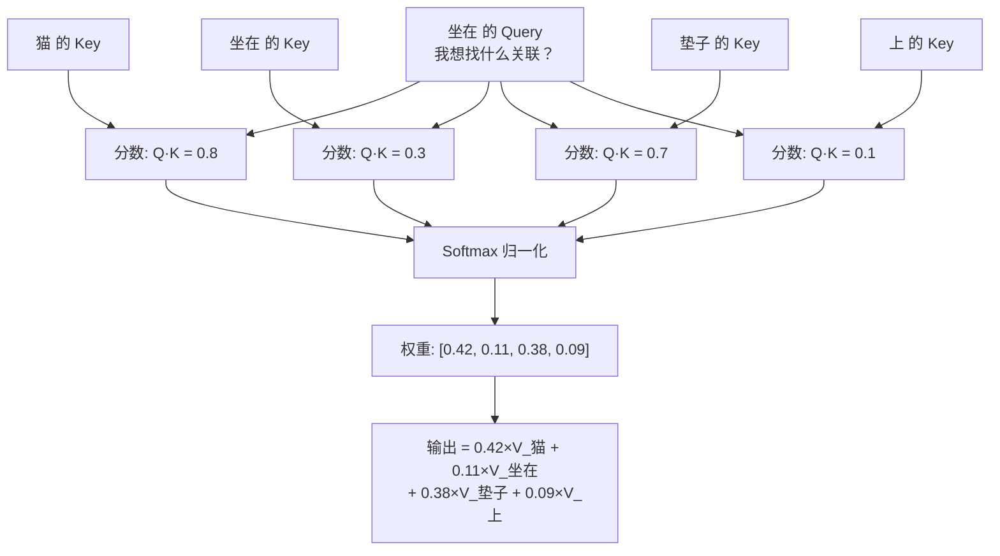

# 理解 Self Attention

## 1. 核心直觉

> **类比**：想象你在做开卷考试。面对一道题（Query），你翻开书本，扫描每一页的标题（Key），找到最相关的几页，然后认真阅读那几页的内容（Value）来作答。Self-Attention 就是让序列中的**每个词都做一次这样的开卷检索**。

传统方式处理序列的局限：



| | RNN | Self-Attention |
|---|---|---|
| 词1 看到词4 | 经过 3 步传递，信息层层衰减 | **直接建立连接**，一步到位 |
| 并行性 | 必须串行 | 所有位置同时计算 |
| 复杂度 | $O(T)$ 步串行 | $O(T^2)$ 但可并行 |

---

## 2. Q、K、V 是什么？

Self-Attention 的核心是三组向量：**Query（查询）**、**Key（键）**、**Value（值）**。

> **类比**：把每个词想象成图书馆里的一本书。
> - **Query (Q)**："我想找什么？"——当前词的"提问"
> - **Key (K)**："我的标签是什么？"——每个词的"索引标签"
> - **Value (V)**："我的内容是什么？"——每个词的"实际信息"
>
> 每个词用自己的 Q 去和所有词的 K 做匹配，匹配度高的词的 V 会被重点"采纳"。

### 三组向量的生成

Q、K、V 都是从同一个输入通过**不同的线性变换**得到的：

$$Q = X \cdot W_Q, \quad K = X \cdot W_K, \quad V = X \cdot W_V$$

- $X \in \mathbb{R}^{T \times d_{model}}$：输入序列（$T$ 个词，每个 $d_{model}$ 维）
- $W_Q, W_K, W_V \in \mathbb{R}^{d_{model} \times d_k}$：**可学习**的投影矩阵

> [!info] 为什么要投影三次？
> 如果 Q = K = V = X（不做变换），所有词只能按"原始相似度"交互，表达能力有限。三个独立的投影矩阵让模型学会**用不同的视角提问、被检索和提供信息**。就像同一个人在不同场合扮演不同角色。

---

## 3. 注意力的计算流程

以句子 "猫 坐在 垫子 上" 为例，看"坐在"这个词如何通过 Self-Attention 聚合信息：



**关键洞察**："坐在"通过注意力发现——**"猫"和"垫子"是最重要的上下文**（谁坐？坐哪？），自动给它们分配了最高权重。这个权重分配是**学出来的**，不是人为设定的。

---

## 4. Self-Attention vs 传统注意力

[ML 系列中的注意力机制](../../Machine-learning/notes/10_Attention_and_Transformer/01_编码器解码器与注意力机制.md)讲的是 **Cross-Attention**（编码器→解码器），Self-Attention 是它的特殊形式：

| | Cross-Attention | Self-Attention |
|---|---|---|
| Q 来源 | 解码器 | 自己 |
| K, V 来源 | 编码器 | 自己 |
| 作用 | 解码器关注编码器的输出 | 序列内部的自我交互 |
| 类比 | 翻译时参考原文 | 理解一句话时词与词互相关联 |

---

## 5. 为什么 Self-Attention 这么强？

### 5.1 长程依赖

句子："那只昨天在公园里追蝴蝶的**猫**今天又跑出去了，**它**真调皮。"

- RNN：要经过 ~15 个时间步才能把"猫"的信息传到"它"，梯度早就消失了
- Self-Attention："它"的 Q 直接和"猫"的 K 做点积，**一步到位**

### 5.2 可解释性

注意力权重矩阵可以可视化，直观看到模型在"关注什么"：

```
         猫  坐在  垫子  上
猫     [0.2, 0.1, 0.6, 0.1]   ← 猫关注垫子（在哪？）
坐在   [0.4, 0.1, 0.4, 0.1]   ← 坐在关注猫和垫子（谁？在哪？）
垫子   [0.1, 0.3, 0.2, 0.4]   ← 垫子关注上（什么方位？）
上     [0.1, 0.5, 0.3, 0.1]   ← 上关注坐在（什么动作？）
```

### 5.3 并行计算

所有位置的 Q×K 可以用一次矩阵乘法完成，GPU 并行效率极高。这也是 Transformer 能训练超大模型的关键原因。

> [!tip] 直觉总结
> Self-Attention = **每个词都在问："在这个上下文中，其他所有词对我来说有多重要？"** 然后按重要程度加权收集信息。

---

## 相关笔记

- [Self Attention 计算](./02_Self Attention计算.md) — 下一篇：数学公式与数值推导
- [多头注意力](./03_多头注意力.md) — 从单头到多头的扩展
- [位置编码](../02_Input_Representation/02_位置编码.md) — Self-Attention 本身不含位置信息，需要位置编码补充
