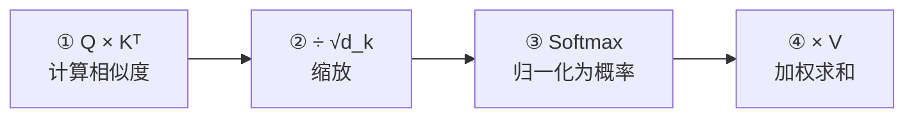

---
title: Self Attention 计算
published: 2026-04-22
description: Scaled Dot-Product Attention 的完整数学推导、数值实例与代码实现
tags: [Transformer, Self Attention, Scaled Dot-Product, 注意力计算]
category: Transformer
draft: false
---

# Self Attention 计算

## 1. Scaled Dot-Product Attention 公式

$$\text{Attention}(Q, K, V) = \text{softmax}\left(\frac{QK^T}{\sqrt{d_k}}\right) V$$

四步拆解：



---

## 2. 逐步数值实例

以 3 个词、$d_k = 4$ 为例，手动走完全过程。

### Step 0：输入

假设经过线性投影后，Q、K、V 矩阵为：

$$Q = \begin{bmatrix} 1 & 0 & 1 & 0 \\ 0 & 1 & 0 & 1 \\ 1 & 1 & 0 & 0 \end{bmatrix}, \quad K = \begin{bmatrix} 0 & 1 & 1 & 0 \\ 1 & 0 & 0 & 1 \\ 1 & 1 & 0 & 0 \end{bmatrix}, \quad V = \begin{bmatrix} 1 & 2 & 3 & 4 \\ 5 & 6 & 7 & 8 \\ 9 & 10 & 11 & 12 \end{bmatrix}$$

### Step 1：计算 $QK^T$（相似度矩阵）

$$QK^T = \begin{bmatrix} 1 & 0 & 1 & 0 \\ 0 & 1 & 0 & 1 \\ 1 & 1 & 0 & 0 \end{bmatrix} \begin{bmatrix} 0 & 1 & 1 \\ 1 & 0 & 1 \\ 1 & 0 & 0 \\ 0 & 1 & 0 \end{bmatrix} = \begin{bmatrix} 1 & 1 & 1 \\ 1 & 1 & 1 \\ 1 & 1 & 2 \end{bmatrix}$$

矩阵中第 $i$ 行第 $j$ 列 = 词 $i$ 的 Q 与词 $j$ 的 K 的点积 = 它们的**相关度**。

### Step 2：缩放 $\div \sqrt{d_k}$

$$\frac{QK^T}{\sqrt{4}} = \frac{1}{2}\begin{bmatrix} 1 & 1 & 1 \\ 1 & 1 & 1 \\ 1 & 1 & 2 \end{bmatrix} = \begin{bmatrix} 0.5 & 0.5 & 0.5 \\ 0.5 & 0.5 & 0.5 \\ 0.5 & 0.5 & 1.0 \end{bmatrix}$$

> [!warning] 为什么要除以 $\sqrt{d_k}$？
> 当 $d_k$ 较大时，Q 和 K 的点积结果方差约为 $d_k$，值会很大。大值送入 Softmax 后会产生接近 one-hot 的分布（一个接近 1，其余接近 0），梯度几乎为零——训练卡住。除以 $\sqrt{d_k}$ 将方差稳定在 1 附近。
>
> 数学证明：若 $q_i, k_j \sim \mathcal{N}(0, 1)$，则 $q^T k = \sum_{i=1}^{d_k} q_i k_i$ 的方差 = $d_k$，除以 $\sqrt{d_k}$ 后方差 = 1。

### Step 3：Softmax 归一化

对每一**行**做 Softmax（每个词对所有词的注意力权重归一化为概率分布）：

$$\text{softmax}(\begin{bmatrix} 0.5 & 0.5 & 0.5 \end{bmatrix}) = \begin{bmatrix} 0.333 & 0.333 & 0.333 \end{bmatrix}$$

$$\text{softmax}(\begin{bmatrix} 0.5 & 0.5 & 1.0 \end{bmatrix}) = \begin{bmatrix} 0.262 & 0.262 & 0.476 \end{bmatrix}$$

完整的注意力权重矩阵 $A$：

$$A = \begin{bmatrix} 0.333 & 0.333 & 0.333 \\ 0.333 & 0.333 & 0.333 \\ 0.262 & 0.262 & 0.476 \end{bmatrix}$$

### Step 4：加权求和 $A \times V$

$$\text{Output} = A \cdot V = \begin{bmatrix} 0.333 & 0.333 & 0.333 \\ 0.333 & 0.333 & 0.333 \\ 0.262 & 0.262 & 0.476 \end{bmatrix} \begin{bmatrix} 1 & 2 & 3 & 4 \\ 5 & 6 & 7 & 8 \\ 9 & 10 & 11 & 12 \end{bmatrix}$$

$$= \begin{bmatrix} 5.0 & 6.0 & 7.0 & 8.0 \\ 5.0 & 6.0 & 7.0 & 8.0 \\ 5.86 & 6.86 & 7.86 & 8.86 \end{bmatrix}$$

**解读**：词 1 和词 2 均匀关注所有词（权重相等），词 3 更偏向自己（权重 0.476 > 0.262）。

---

## 3. 矩阵维度全链路

```
输入 X:      (T, d_model)    例如 (3, 512)
    ↓ × W_Q
Q:           (T, d_k)        例如 (3, 64)
    ↓ × W_K
K:           (T, d_k)        例如 (3, 64)
    ↓ × W_V
V:           (T, d_v)        例如 (3, 64)

Q × K^T:    (T, T)           例如 (3, 3) —— 注意力分数矩阵
÷ √d_k → Softmax:
A:           (T, T)           注意力权重矩阵

A × V:      (T, d_v)         例如 (3, 64) —— 输出
```

> [!info] 计算复杂度
> $QK^T$ 的矩阵乘法复杂度为 $O(T^2 \cdot d_k)$。当序列长度 $T$ 很大时，这是 Transformer 的主要瓶颈。这也是为什么 LLM 的上下文窗口有限制（如 4K、8K、128K），以及为什么有很多研究致力于"高效注意力"（Flash Attention、稀疏注意力等）。

---

## 4. 完整代码实现

```python
import subprocess
subprocess.check_call(["pip", "install", "numpy"])
import numpy as np

def softmax(x, axis=-1):
    """数值稳定的 Softmax"""
    e_x = np.exp(x - np.max(x, axis=axis, keepdims=True))
    return e_x / np.sum(e_x, axis=axis, keepdims=True)

def scaled_dot_product_attention(Q, K, V, mask=None):
    """Scaled Dot-Product Attention

    Args:
        Q: (T_q, d_k)
        K: (T_k, d_k)
        V: (T_k, d_v)
        mask: (T_q, T_k) 可选掩码矩阵

    Returns:
        output: (T_q, d_v) 注意力输出
        weights: (T_q, T_k) 注意力权重（可视化用）
    """
    d_k = Q.shape[-1]

    # Step 1: Q × K^T
    scores = Q @ K.T  # (T_q, T_k)

    # Step 2: 缩放
    scores = scores / np.sqrt(d_k)

    # 可选: 掩码（将被掩盖位置设为 -inf，Softmax 后变 0）
    if mask is not None:
        scores = np.where(mask == 0, -1e9, scores)

    # Step 3: Softmax
    weights = softmax(scores, axis=-1)  # (T_q, T_k)

    # Step 4: 加权求和
    output = weights @ V  # (T_q, d_v)

    return output, weights

# ========== 用文中的例子验证 ==========
Q = np.array([[1,0,1,0], [0,1,0,1], [1,1,0,0]], dtype=float)
K = np.array([[0,1,1,0], [1,0,0,1], [1,1,0,0]], dtype=float)
V = np.array([[1,2,3,4], [5,6,7,8], [9,10,11,12]], dtype=float)

output, weights = scaled_dot_product_attention(Q, K, V)

print("注意力权重矩阵:")
print(weights.round(3))
print("\n输出:")
print(output.round(2))
```

---

## 5. 注意力可视化

注意力权重矩阵 $A$ 是理解模型行为的利器。每一行是一个词的"注意力分布"：

```
         猫    坐在   垫子    上
猫     [0.10  0.05  0.80  0.05]   ← 猫最关注"垫子"
坐在   [0.40  0.05  0.45  0.10]   ← 坐在关注"猫"和"垫子"
垫子   [0.05  0.10  0.15  0.70]   ← 垫子最关注"上"
上     [0.08  0.72  0.15  0.05]   ← 上最关注"坐在"
```

> [!tip] 实际使用
> 在 PyTorch 中训练后，可以导出 `weights` 矩阵用 `matplotlib.imshow` 或 `seaborn.heatmap` 可视化。这在调试模型（看它是否学到了合理的语义关联）和论文展示中非常常用。

## 相关笔记

- [理解 Self Attention](./01_理解Self_Attention.md) — 上一篇：直觉与概念
- [多头注意力](./03_多头注意力.md) — 下一篇：从单头扩展到多头


