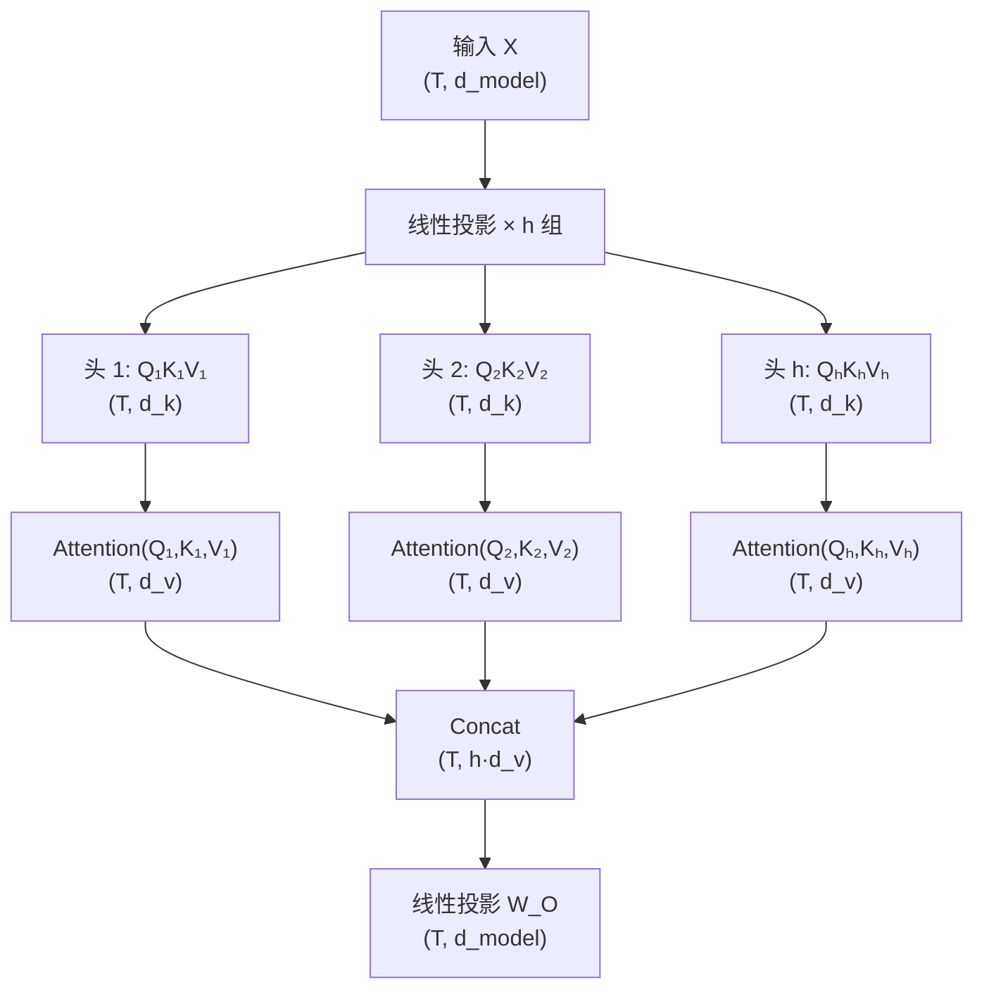
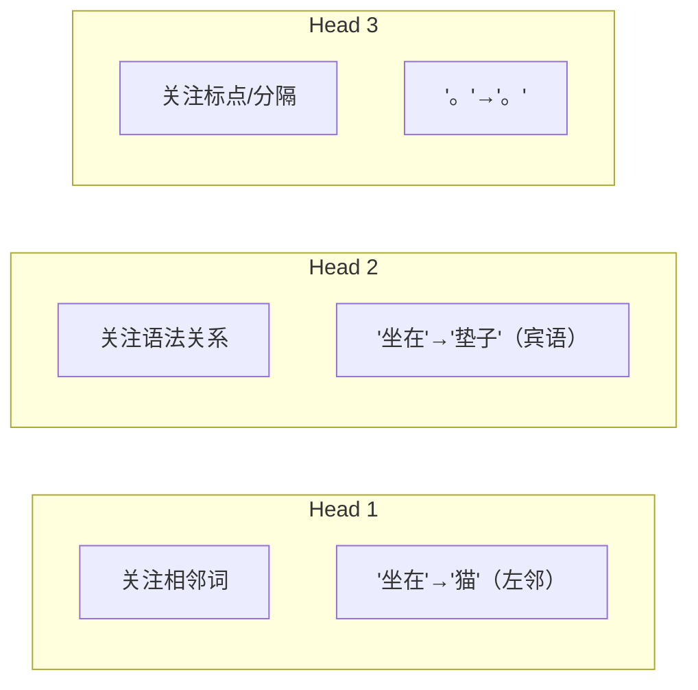

# 多头注意力 (Multi-Head Attention)

## 1. 为什么需要多头？

> **类比**：分析一篇文章时，一个人可能关注语法结构，另一个关注情感色彩，第三个关注事实关系。**多头注意力就是让模型同时从多个角度分析同一句话**，每个"头"学习捕捉不同类型的关系。

单头注意力只有一组 $W_Q, W_K, W_V$，只能学到**一种**关注模式。实际上，词与词之间存在多种关系：

| 关系类型 | 示例 |
|---------|------|
| 语法关系 | "猫"→"坐在"（主语→谓语） |
| 指代关系 | "它"→"猫"（代词→指代对象） |
| 修饰关系 | "美丽的"→"花园"（形容词→名词） |
| 语义关系 | "国王"→"王后"（同领域词） |

一个头很难同时捕捉所有这些关系——多头让每个头**专注于一种模式**。

---

## 2. 计算流程



### 公式

$$\text{MultiHead}(Q, K, V) = \text{Concat}(\text{head}_1, \dots, \text{head}_h) \cdot W_O$$

其中每个头：

$$\text{head}_i = \text{Attention}(X W_{Q_i},\; X W_{K_i},\; X W_{V_i})$$

---

## 3. 参数量分析

原论文中 $d_{model} = 512$，$h = 8$ 个头：

$$d_k = d_v = \frac{d_{model}}{h} = \frac{512}{8} = 64$$

| 参数矩阵 | 形状 | 数量 | 参数量 |
|---------|------|------|--------|
| $W_{Q_i}$ | $(512, 64)$ | 8 个 | $8 \times 512 \times 64 = 262,144$ |
| $W_{K_i}$ | $(512, 64)$ | 8 个 | $262,144$ |
| $W_{V_i}$ | $(512, 64)$ | 8 个 | $262,144$ |
| $W_O$ | $(512, 512)$ | 1 个 | $262,144$ |
| **合计** | | | **1,048,576 ≈ 1M** |

> [!info] 巧妙的设计
> 每个头的维度 $d_k = d_{model}/h$，总参数量 = $4 \times d_{model}^2$，**和用单个大头 $d_k = d_{model}$ 完全一样**！多头注意力不增加计算量，但表达能力更强——这是一笔"免费的午餐"。

---

## 4. 实际中怎么高效计算？

实际实现中**不会**真的创建 $h$ 组独立的投影矩阵，而是用一个大矩阵一次投影，再 reshape 拆分：

```python
# 伪代码：高效的多头注意力
Q = X @ W_Q  # (T, d_model) → (T, d_model)
Q = Q.reshape(T, h, d_k).transpose(0, 1)  # → (h, T, d_k)
# K, V 同理

# 所有头并行计算注意力
attn_output = scaled_dot_product_attention(Q, K, V)  # (h, T, d_v)

# 拼接并投影回 d_model
output = attn_output.transpose(0, 1).reshape(T, d_model) @ W_O
```

---

## 5. 代码实现

```python
import subprocess
subprocess.check_call(["pip", "install", "numpy"])
import numpy as np

def softmax(x, axis=-1):
    e_x = np.exp(x - np.max(x, axis=axis, keepdims=True))
    return e_x / np.sum(e_x, axis=axis, keepdims=True)

def multi_head_attention(X, W_Q, W_K, W_V, W_O, h, mask=None):
    """Multi-Head Attention (纯 NumPy 实现)

    Args:
        X: (T, d_model) 输入
        W_Q, W_K, W_V: (d_model, d_model) 投影矩阵
        W_O: (d_model, d_model) 输出投影
        h: 头数
        mask: (T, T) 可选掩码

    Returns:
        output: (T, d_model)
    """
    T, d_model = X.shape
    d_k = d_model // h

    # 投影
    Q = X @ W_Q  # (T, d_model)
    K = X @ W_K
    V = X @ W_V

    # 拆分成 h 个头: (T, d_model) → (h, T, d_k)
    Q = Q.reshape(T, h, d_k).transpose(1, 0, 2)  # (h, T, d_k)
    K = K.reshape(T, h, d_k).transpose(1, 0, 2)
    V = V.reshape(T, h, d_k).transpose(1, 0, 2)

    # 每个头独立计算注意力
    scores = Q @ K.transpose(0, 2, 1) / np.sqrt(d_k)  # (h, T, T)
    if mask is not None:
        scores = np.where(mask == 0, -1e9, scores)
    weights = softmax(scores, axis=-1)
    attn_out = weights @ V  # (h, T, d_k)

    # 拼接: (h, T, d_k) → (T, d_model)
    concat = attn_out.transpose(1, 0, 2).reshape(T, d_model)

    # 输出投影
    output = concat @ W_O  # (T, d_model)

    return output, weights

# ========== 测试 ==========
np.random.seed(42)
T, d_model, h = 4, 8, 2  # 4个词, 8维, 2个头

X = np.random.randn(T, d_model)
W_Q = np.random.randn(d_model, d_model) * 0.1
W_K = np.random.randn(d_model, d_model) * 0.1
W_V = np.random.randn(d_model, d_model) * 0.1
W_O = np.random.randn(d_model, d_model) * 0.1

output, weights = multi_head_attention(X, W_Q, W_K, W_V, W_O, h)

print(f"输入形状: {X.shape}")
print(f"输出形状: {output.shape}")
print(f"\n头 1 的注意力权重:\n{weights[0].round(3)}")
print(f"\n头 2 的注意力权重:\n{weights[1].round(3)}")
print("\n观察：两个头学到了不同的注意力模式")
```

---

## 6. 不同头学到了什么？

研究发现，多头注意力中的不同头确实会专注于不同类型的模式：



> [!tip] 注意力头的冗余性
> 并非所有头都同样重要。研究（Michel et al., 2019）发现，在训练好的模型中修剪掉 20-40% 的头，性能下降很小。这说明存在一定冗余，但"冗余"本身也是一种鲁棒性保障。

## 相关笔记

- [Self Attention 计算](./02_Self Attention计算.md) — 上一篇：单头注意力的数学细节
- [Encoder Block](../04_Architecture/01_Encoder Block.md) — 下一篇：多头注意力如何嵌入完整的编码器块
