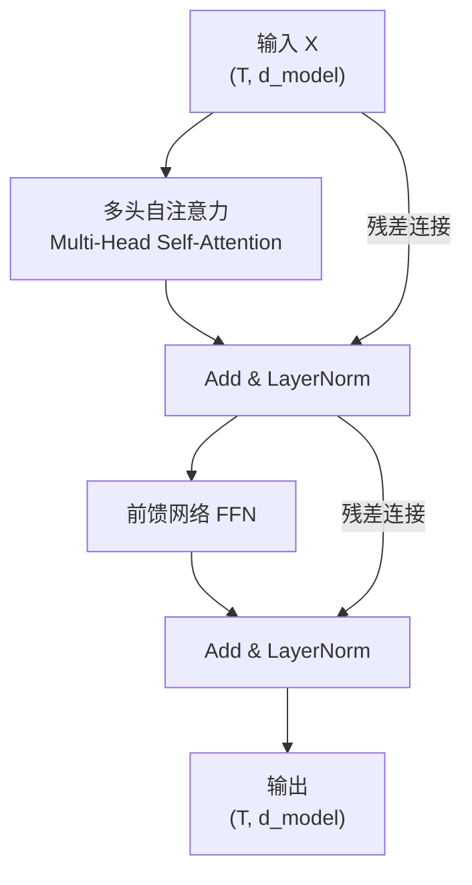
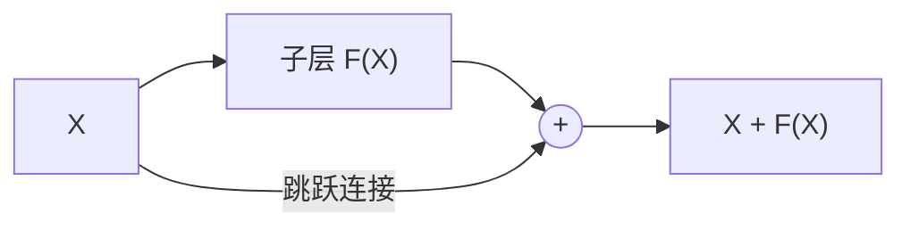
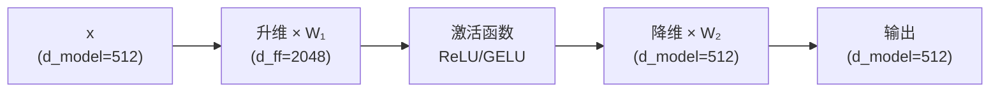

---
title: Encoder Block
published: 2026-04-22
description: Transformer 编码器块的完整结构：多头注意力 + FFN + 残差连接 + LayerNorm
tags: [Transformer, Encoder, FFN, LayerNorm, 残差连接]
category: Transformer
draft: false
---

# Encoder Block

## 1. 整体结构

> **类比**：一个 Encoder Block 就像一个"理解加工站"。输入的原料（词向量）先在"讨论室"（多头自注意力）里互相交流，再送到"加工间"（前馈网络）做独立精加工。每一步都有"质检员"（LayerNorm）和"保底机制"（残差连接）。



公式表示：

$$\text{SubLayer}_1: \quad \hat{X} = \text{LayerNorm}(X + \text{MultiHead}(X, X, X))$$

$$\text{SubLayer}_2: \quad \text{Output} = \text{LayerNorm}(\hat{X} + \text{FFN}(\hat{X}))$$

---

## 2. 残差连接 (Residual Connection)

> **类比**：考试时老师说"在原文基础上添加你的批注"，而不是"重写一篇"。残差连接让每一层只需要学习"增量修改"而非完整的重新表示。

$$\text{output} = X + F(X)$$

- $X$：原始输入（"原文"）
- $F(X)$：子层的输出（"批注"）
- $X + F(X)$：在原文上叠加批注



> [!info] 为什么残差连接如此重要？
> 没有残差连接，6 层 Encoder 堆叠后，梯度需要穿过所有层才能回传到底层——深层网络的[[01_梯度消失问题|梯度消失]]问题会非常严重。残差连接提供了一条"梯度高速公路"，让梯度可以直接跳到任意层，训练变得稳定。

---

## 3. Layer Normalization[^1]

对单个样本的**所有特征维度**做归一化：

$$\text{LN}(x) = \gamma \cdot \frac{x - \mu}{\sqrt{\sigma^2 + \epsilon}} + \beta$$

- $\mu, \sigma^2$：在 $d_{model}$ 维度上计算的均值和方差
- $\gamma, \beta$：可学习的缩放和偏移参数
- $\epsilon$：防除零的小常数（通常 $10^{-6}$）

### LayerNorm vs BatchNorm

| | BatchNorm | LayerNorm |
|---|---|---|
| 归一化维度 | 跨样本（batch 维度） | 跨特征（feature 维度） |
| 依赖 batch 大小 | 是 | 否 |
| 适合变长序列 | 否（不同样本长度不同） | **是** |
| 使用场景 | CNN | **Transformer、RNN** |

> [!tip] Pre-Norm vs Post-Norm
> 原论文使用 **Post-Norm**（先子层再 LN），但后来实践发现 **Pre-Norm**（先 LN 再子层）训练更稳定，是目前主流做法：
> - Post-Norm：$\text{LN}(X + F(X))$（原论文）
> - Pre-Norm：$X + F(\text{LN}(X))$（GPT-2、LLaMA 等）

---

## 4. 前馈网络 (FFN)

每个位置**独立**通过一个两层全连接网络：

$$\text{FFN}(x) = \text{Act}(x W_1 + b_1) W_2 + b_2$$

- $W_1 \in \mathbb{R}^{d_{model} \times d_{ff}}$：升维（$512 \to 2048$）
- $W_2 \in \mathbb{R}^{d_{ff} \times d_{model}}$：降回（$2048 \to 512$）
- $\text{Act}$：激活函数（原论文用 ReLU，现代模型用 GELU/SiLU）



> [!info] 为什么要升维再降维？
> 先升到高维空间做非线性变换（增强表达能力），再投影回低维保持维度一致。这个"瓶颈"结构让 FFN 成为 Transformer 中参数量最大的部分——约占每层参数的 2/3。

### 现代变体：GLU 系列

LLaMA 等现代模型使用 **SwiGLU**（Swish-Gated Linear Unit）替代简单的 ReLU FFN：

$$\text{SwiGLU}(x) = (\text{Swish}(x W_1) \odot (x W_3)) W_2$$

多了一个门控分支 $W_3$，实验表明效果更好。

---

## 5. 完整 Encoder Block 代码

```python
import subprocess
subprocess.check_call(["pip", "install", "numpy"])
import numpy as np

def softmax(x, axis=-1):
    e_x = np.exp(x - np.max(x, axis=axis, keepdims=True))
    return e_x / np.sum(e_x, axis=axis, keepdims=True)

def layer_norm(x, gamma, beta, eps=1e-6):
    """Layer Normalization"""
    mean = x.mean(axis=-1, keepdims=True)
    var = x.var(axis=-1, keepdims=True)
    return gamma * (x - mean) / np.sqrt(var + eps) + beta

def multi_head_attn(X, WQ, WK, WV, WO, h):
    """简化版多头注意力"""
    T, d = X.shape
    dk = d // h
    Q = (X @ WQ).reshape(T, h, dk).transpose(1, 0, 2)
    K = (X @ WK).reshape(T, h, dk).transpose(1, 0, 2)
    V = (X @ WV).reshape(T, h, dk).transpose(1, 0, 2)
    scores = Q @ K.transpose(0, 2, 1) / np.sqrt(dk)
    A = softmax(scores)
    out = (A @ V).transpose(1, 0, 2).reshape(T, d)
    return out @ WO

def ffn(x, W1, b1, W2, b2):
    """前馈网络 (ReLU 激活)"""
    return np.maximum(0, x @ W1 + b1) @ W2 + b2

def encoder_block(X, params):
    """一个完整的 Encoder Block (Post-Norm)"""
    # 子层 1: 多头自注意力 + 残差 + LayerNorm
    attn_out = multi_head_attn(X, params['WQ'], params['WK'],
                                params['WV'], params['WO'], params['h'])
    X1 = layer_norm(X + attn_out, params['g1'], params['b1'])

    # 子层 2: FFN + 残差 + LayerNorm
    ffn_out = ffn(X1, params['W1'], params['bf1'], params['W2'], params['bf2'])
    X2 = layer_norm(X1 + ffn_out, params['g2'], params['b2'])

    return X2

# ========== 测试 ==========
np.random.seed(42)
T, d_model, d_ff, h = 4, 8, 32, 2

params = {
    'WQ': np.random.randn(d_model, d_model) * 0.1,
    'WK': np.random.randn(d_model, d_model) * 0.1,
    'WV': np.random.randn(d_model, d_model) * 0.1,
    'WO': np.random.randn(d_model, d_model) * 0.1,
    'h': h,
    'g1': np.ones(d_model), 'b1': np.zeros(d_model),
    'g2': np.ones(d_model), 'b2': np.zeros(d_model),
    'W1': np.random.randn(d_model, d_ff) * 0.1,
    'bf1': np.zeros(d_ff),
    'W2': np.random.randn(d_ff, d_model) * 0.1,
    'bf2': np.zeros(d_model),
}

X = np.random.randn(T, d_model)
output = encoder_block(X, params)
print(f"输入形状: {X.shape}")
print(f"输出形状: {output.shape}")
print(f"输入输出维度相同: {X.shape == output.shape}")
```

---

## 6. 堆叠 N 层

原论文堆叠 $N=6$ 个 Encoder Block。每层结构相同但**参数独立**：

```
Layer 1: MHA₁ → Add&Norm → FFN₁ → Add&Norm
Layer 2: MHA₂ → Add&Norm → FFN₂ → Add&Norm
  ...
Layer 6: MHA₆ → Add&Norm → FFN₆ → Add&Norm
```

> [!info] 不同层学到什么？
> 研究发现，浅层倾向于学习局部特征（语法、短语），深层倾向于学习全局特征（语义、推理）。这与 CNN 中"浅层学边缘、深层学物体"的规律类似。

## 相关笔记

- [多头注意力](../03_Attention/03_多头注意力.md) — Encoder Block 的核心子组件
- [Masked Self Attention](./02_Masked_Self_Attention.md) — 下一篇：解码器中的因果掩码

[^1]: **Layer Normalization**：Ba et al., 2016 年提出。与 Batch Normalization 不同，LayerNorm 对每个样本独立做归一化，不依赖 mini-batch 中的其他样本，因此天然适合变长序列和小 batch 场景。


