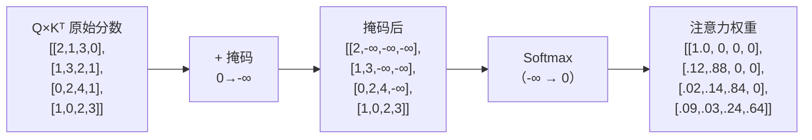
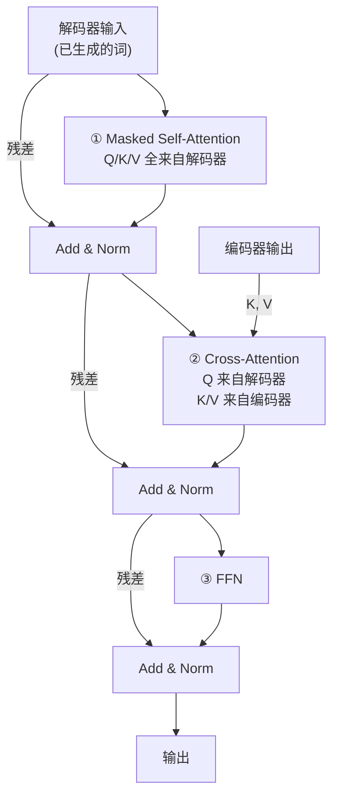
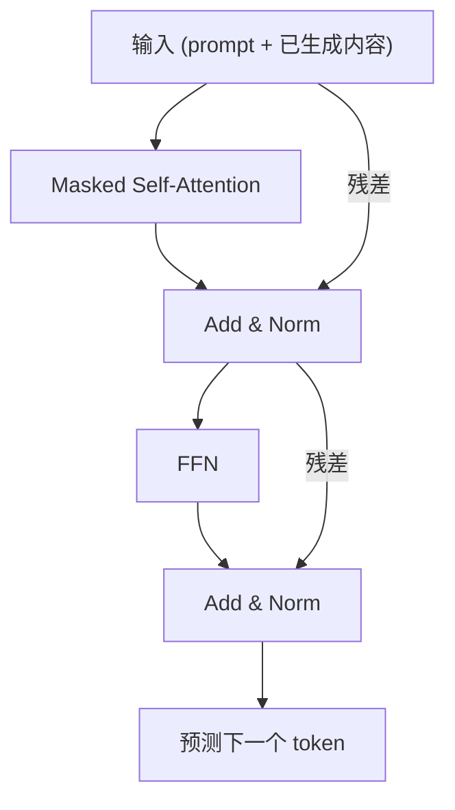

# Masked Self Attention

## 1. 为什么解码器需要掩码？

> **类比**：写作文考试时不能偷看后面的答案——你只能根据已经写出的内容来决定下一个字。Masked Self Attention 就是给模型戴上"眼罩"，确保它预测第 $t$ 个词时**只能看到前 $t-1$ 个词**。

在**训练时**，解码器的输入是完整的目标序列（通过 Teacher Forcing），所有位置可以并行计算。如果不加掩码，位置 $t$ 的注意力可以"偷看"位置 $t+1, t+2, \dots$ 的信息——这违反了自回归生成的因果性。

---

## 2. 因果掩码 (Causal Mask)

掩码是一个下三角矩阵，在 $QK^T$ 的结果上施加：

$$\text{Mask} = \begin{bmatrix} 1 & 0 & 0 & 0 \\ 1 & 1 & 0 & 0 \\ 1 & 1 & 1 & 0 \\ 1 & 1 & 1 & 1 \end{bmatrix}$$

- **1**：允许关注（保持原始分数）
- **0**：禁止关注（设为 $-\infty$，Softmax 后变为 0）

### 应用过程



**效果**：第 1 个词只能看自己，第 2 个词看前 2 个，第 3 个看前 3 个……每个位置的"视野"严格向左。

---

## 3. 代码实现

```python
import subprocess
subprocess.check_call(["pip", "install", "numpy"])
import numpy as np

def softmax(x, axis=-1):
    e_x = np.exp(x - np.max(x, axis=axis, keepdims=True))
    return e_x / np.sum(e_x, axis=axis, keepdims=True)

def create_causal_mask(T):
    """生成因果掩码（下三角矩阵）"""
    return np.tril(np.ones((T, T)))

def masked_self_attention(Q, K, V):
    """带因果掩码的 Scaled Dot-Product Attention"""
    T, d_k = Q.shape
    scores = Q @ K.T / np.sqrt(d_k)

    # 应用因果掩码
    mask = create_causal_mask(T)
    scores = np.where(mask == 0, -1e9, scores)

    weights = softmax(scores, axis=-1)
    output = weights @ V
    return output, weights

# ========== 测试 ==========
np.random.seed(42)
T, d_k = 4, 8
Q = np.random.randn(T, d_k)
K = np.random.randn(T, d_k)
V = np.random.randn(T, d_k)

output, weights = masked_self_attention(Q, K, V)

print("因果掩码:")
print(create_causal_mask(T).astype(int))
print("\n注意力权重（上三角为 0）:")
print(weights.round(3))
print("\n验证：每行上三角确实为 0")
```

---

## 4. 解码器的三种注意力

一个完整的 Decoder Block 包含**三个子层**，其中两个使用注意力：



| 注意力类型 | Q 来源 | K, V 来源 | 掩码 | 作用 |
|-----------|--------|----------|------|------|
| Masked Self-Attention | 解码器 | 解码器 | 因果掩码 | 已生成序列内部的自我理解 |
| Cross-Attention | 解码器 | **编码器** | 无 | 从源语句中提取相关信息 |

### Cross-Attention 的直觉

> **类比**：翻译"学习"这个词时，翻译官（解码器）用自己当前的理解（Q）去"查阅"原文的每个词（K），找到最相关的部分（V）来辅助翻译。

$$\text{CrossAttn}(Q_{dec}, K_{enc}, V_{enc}) = \text{softmax}\left(\frac{Q_{dec} K_{enc}^T}{\sqrt{d_k}}\right) V_{enc}$$

---

## 5. 训练 vs 推理的掩码差异

| | 训练 | 推理 |
|---|---|---|
| 解码器输入 | 完整目标序列（右移一位） | 逐步生成的部分序列 |
| 掩码必要性 | **必须**——防止偷看未来 | 天然满足——未来词还不存在 |
| 并行性 | 所有位置同时计算 | 逐词串行生成 |

> [!warning] 训练时掩码是性能关键
> 如果训练时不加因果掩码，模型会"作弊"——直接复制未来词，看似 loss 极低，实际推理时完全不能用。这是 Transformer 训练中最容易犯的错误之一。

---

## 6. Decoder-Only 架构的简化

GPT、Claude、LLaMA 等现代大模型使用 **Decoder-Only** 架构，去掉了编码器和交叉注意力，只保留 Masked Self-Attention + FFN：



> [!info] 为什么 Decoder-Only 成为主流？
> 1. 架构更简单，超参更少，更容易 scale up
> 2. 统一框架：把"理解"和"生成"合二为一（prompt 部分做理解，续写部分做生成）
> 3. 实验表明在大规模数据上，Decoder-Only 在生成任务上始终优于 Encoder-Decoder

## 相关笔记

- [Encoder Block](./01_Encoder Block.md) — 上一篇：编码器的完整结构
- [终端输出](./03_终端输出.md) — 下一篇：解码器输出后的处理
- [理解 Self Attention](../03_Attention/01_理解Self Attention.md) — Self-Attention 基础
