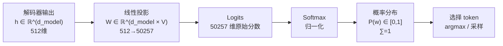
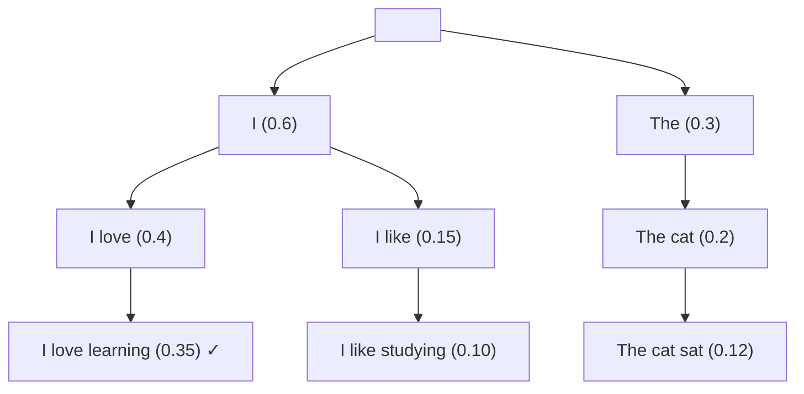
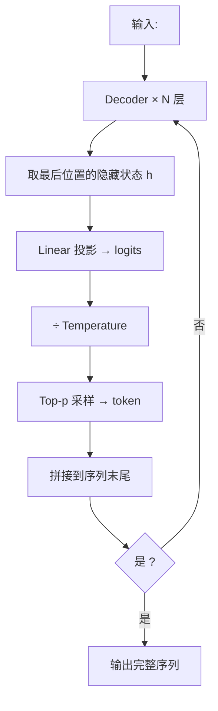

---
title: 终端输出
published: 2026-04-22
description: Transformer 输出层的 Linear 投影、Softmax 与解码策略
tags: [Transformer, Softmax, 解码策略, Beam Search, Top-k]
category: Transformer
draft: false
---

# 终端输出

## 1. 从隐藏状态到词概率

> **类比**：解码器最后一层输出了一个 512 维的"语义浓缩向量"。终端输出层的工作就是把这个向量"翻译"成"词表中每个词的概率"——就像把一道复杂计算的结果翻译成一个明确的答案。



### 两步计算

**Step 1: 线性投影**

$$\text{logits} = h \cdot W^T + b \quad \in \mathbb{R}^{V}$$

- $h \in \mathbb{R}^{d_{model}}$：解码器最后一层的输出
- $W \in \mathbb{R}^{V \times d_{model}}$：投影矩阵（$V$ = 词表大小）
- 输出：每个词的"原始得分"（logits）

**Step 2: Softmax**

$$P(w_i) = \frac{e^{z_i}}{\sum_{j=1}^{V} e^{z_j}}$$

将 logits 归一化为概率分布，所有词的概率之和为 1。

> [!info] 权重共享
> 许多模型（GPT-2、T5 等）让输出投影矩阵 $W$ 和输入 [[01_Token_Embedding|Embedding 矩阵]] $W_E$ 共享权重（Weight Tying），即 $W = W_E$。这不仅减少参数量，还在语义上合理——一个词的"输出表示"和"输入表示"应该是一致的。

---

## 2. Temperature：控制随机性

在 Softmax 之前引入温度参数 $\tau$：

$$P(w_i) = \frac{e^{z_i / \tau}}{\sum_j e^{z_j / \tau}}$$

| $\tau$ 值 | 效果 | 适用场景 |
|-----------|------|---------|
| $\tau \to 0$ | 接近 argmax，最确定的答案 | 事实性问答、代码生成 |
| $\tau = 1$ | 原始分布 | 默认 |
| $\tau > 1$ | 分布更平坦，更随机 | 创意写作、头脑风暴 |

> **类比**：温度就像"选择困难症"的调节旋钮。温度低 = 果断（永远选最可能的），温度高 = 犹豫（给小概率词更多机会）。

---

## 3. 解码策略

生成文本时，如何从概率分布中选词？这直接决定了输出质量。

### 3.1 贪心解码 (Greedy Decoding)

每步选概率最高的词：$w_t = \arg\max P(w \mid w_{<t})$

- **优点**：简单、确定性
- **缺点**：容易陷入局部最优，生成重复无聊的文本

### 3.2 Beam Search[^1]

同时维护 $B$ 个候选序列（beam），每步扩展所有可能，保留总概率最高的 $B$ 个：



- **优点**：比贪心更全局，适合翻译、摘要
- **缺点**：仍然偏向高概率序列，创造性不足

### 3.3 Top-k 采样

只从概率最高的 $k$ 个词中采样：

```
原始分布: [猫:0.4, 狗:0.3, 鱼:0.15, 桌:0.08, 云:0.07]
Top-3:     [猫:0.47, 狗:0.35, 鱼:0.18]  ← 重新归一化后采样
```

### 3.4 Top-p (Nucleus) 采样[^2]

动态选择最小的词集合，使累积概率 ≥ $p$：

```
原始分布: [猫:0.4, 狗:0.3, 鱼:0.15, 桌:0.08, 云:0.07]
p=0.85:   [猫:0.4, 狗:0.3, 鱼:0.15] → 累积=0.85 → 从这3个中采样
```

- **优点**：词集大小随分布自适应——模型确信时只选少数词，不确定时选更多

### 3.5 策略对比

| 策略 | 确定性 | 多样性 | 适用场景 |
|------|--------|--------|---------|
| Greedy | 最高 | 最低 | 调试、确定性输出 |
| Beam Search | 高 | 低 | 机器翻译、摘要 |
| Top-k | 中 | 中 | 对话、故事 |
| Top-p | 中 | 中-高 | **通用推荐**（ChatGPT 默认） |
| Temperature | 可调 | 可调 | 与上述策略组合使用 |

> [!tip] 实践建议
> 现代 LLM 通常组合使用：**Top-p + Temperature**。例如 ChatGPT 默认 $p=1, \tau=1$，用户可以通过 API 参数 `temperature` 和 `top_p` 调节。

---

## 4. 代码实现

```python
import subprocess
subprocess.check_call(["pip", "install", "numpy"])
import numpy as np

def softmax(x):
    e_x = np.exp(x - np.max(x))
    return e_x / np.sum(e_x)

def greedy_decode(logits):
    """贪心解码：选概率最高的"""
    return np.argmax(logits)

def top_k_sample(logits, k=5, temperature=1.0):
    """Top-k 采样"""
    logits = logits / temperature
    top_k_idx = np.argsort(logits)[-k:]             # 取最大的 k 个
    top_k_logits = logits[top_k_idx]
    probs = softmax(top_k_logits)                    # 重新归一化
    chosen = np.random.choice(top_k_idx, p=probs)
    return chosen

def top_p_sample(logits, p=0.9, temperature=1.0):
    """Top-p (Nucleus) 采样"""
    logits = logits / temperature
    probs = softmax(logits)
    sorted_idx = np.argsort(probs)[::-1]             # 按概率降序排列
    sorted_probs = probs[sorted_idx]
    cumsum = np.cumsum(sorted_probs)
    cutoff = np.searchsorted(cumsum, p) + 1           # 找到累积概率>=p 的截断点
    selected_idx = sorted_idx[:cutoff]
    selected_probs = probs[selected_idx]
    selected_probs /= selected_probs.sum()            # 重新归一化
    chosen = np.random.choice(selected_idx, p=selected_probs)
    return chosen

# ========== 测试 ==========
np.random.seed(42)
vocab = ["猫", "狗", "鱼", "桌", "云", "天", "地", "人", "山", "水"]
logits = np.array([2.5, 2.0, 1.2, 0.3, 0.1, -0.5, -0.8, -1.0, -1.5, -2.0])

print("词表:", vocab)
print("概率:", softmax(logits).round(3))
print(f"\n贪心: {vocab[greedy_decode(logits)]}")

# 多次采样看分布
top_k_results = [vocab[top_k_sample(logits, k=3)] for _ in range(10)]
top_p_results = [vocab[top_p_sample(logits, p=0.85)] for _ in range(10)]
print(f"Top-3 采样 (10次): {top_k_results}")
print(f"Top-p=0.85 采样 (10次): {top_p_results}")
```

---

## 5. 完整生成流程



## 相关笔记

- [Masked Self Attention](./02_Masked_Self_Attention.md) — 上一篇：解码器的因果掩码
- [Transformer 总结与训练](../05_Training_and_Implementation/01_Transformer总结与训练.md) — 下一篇：训练策略

[^1]: **Beam Search**：一种启发式搜索算法。通过维护 $B$（beam width）个最优候选序列，在搜索空间和计算效率之间取得平衡。$B=1$ 退化为贪心搜索，$B=\infty$ 理论上等价于穷举。
[^2]: **Nucleus Sampling (Top-p)**：Holtzman et al., 2020 年提出。核心洞察是固定 $k$ 不够灵活——有时模型很确信（只需 2-3 个候选），有时很犹豫（需要 20+ 个候选）。Top-p 根据累积概率动态确定候选集大小，更符合直觉。


