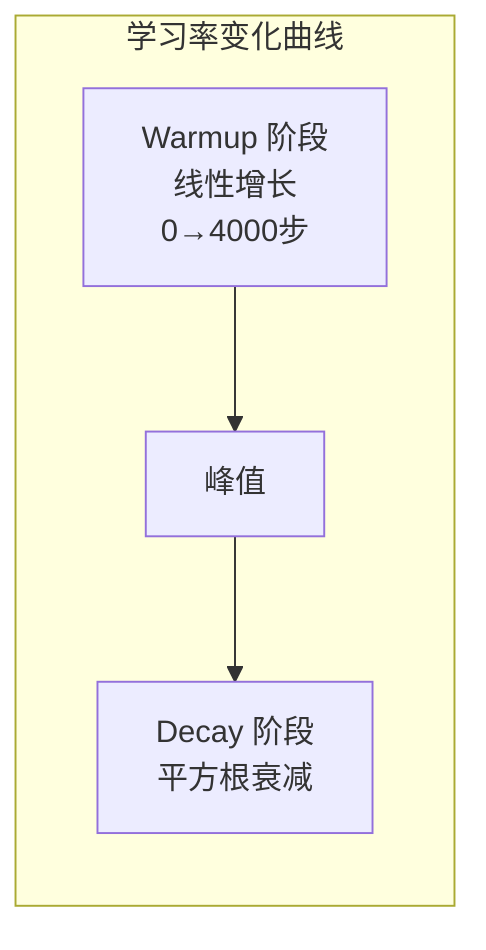
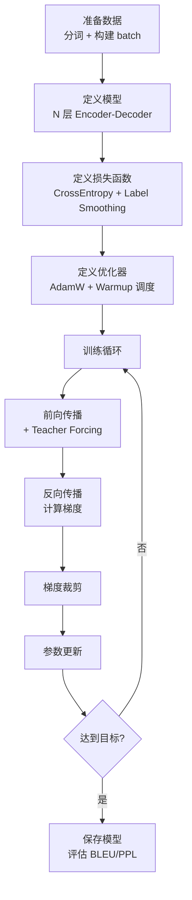

# Transformer 总结与训练

## 1. 全链路回顾

经过前四章的拆解，我们已经看过了 Transformer 的每一个零件。现在把它们组装回来，做一次完整的端到端梳理。

```mermaid
graph TD
    subgraph 输入管线
        A1["原始文本"] --> A2["分词 Tokenizer"]
        A2 --> A3["Token ID 序列"]
        A3 --> A4["Embedding 查表<br/>× √d_model"]
        A4 --> A5["+ 位置编码"]
    end

    subgraph 编码器 ×N
        A5 --> E1["Multi-Head Self-Attention"]
        E1 --> E2["Add & LayerNorm"]
        E2 --> E3["FFN"]
        E3 --> E4["Add & LayerNorm"]
    end

    subgraph 解码器 ×N
        E4 -->|"K, V"| D2
        D0["目标序列（右移）"] --> D0a["Embedding + 位置编码"]
        D0a --> D1["Masked Self-Attention"]
        D1 --> D1a["Add & LayerNorm"]
        D1a --> D2["Cross-Attention"]
        D2 --> D2a["Add & LayerNorm"]
        D2a --> D3["FFN"]
        D3 --> D4["Add & LayerNorm"]
    end

    subgraph 输出
        D4 --> O1["Linear 投影"]
        O1 --> O2["Softmax"]
        O2 --> O3["预测下一个 token"]
    end
```

### 各组件速查表

| 组件 | 作用 | 关键公式 | 详细笔记 |
|------|------|---------|---------|
| Token Embedding | 词 ID → 稠密向量 | $e = W_E[id]$ | [Token Embedding](../02_Input_Representation/01_Token Embedding.md) |
| 位置编码 | 注入序列顺序 | $PE = \sin/\cos$ | [位置编码](../02_Input_Representation/02_位置编码.md) |
| Self-Attention | 序列内自我关联 | $\text{softmax}(QK^T/\sqrt{d_k})V$ | [Self Attention 计算](../03_Attention/02_Self Attention计算.md) |
| 多头注意力 | 多角度并行关注 | $\text{Concat}(\text{head}_i)W_O$ | [多头注意力](../03_Attention/03_多头注意力.md) |
| FFN | 逐位置非线性变换 | $\text{ReLU}(xW_1)W_2$ | [Encoder Block](../04_Architecture/01_Encoder Block.md) |
| 因果掩码 | 防止看到未来 | 下三角掩码矩阵 | [Masked Self Attention](../04_Architecture/02_Masked Self Attention.md) |
| 输出层 | 隐藏状态 → 词概率 | $\text{softmax}(hW^T)$ | [终端输出](../04_Architecture/03_终端输出.md) |

---

## 2. 训练目标

### 2.1 交叉熵损失

Transformer 的训练目标是最小化**交叉熵损失**——让模型预测的概率分布尽量接近真实的 one-hot 分布：

$$\mathcal{L} = -\frac{1}{T}\sum_{t=1}^{T} \log P(w_t^* \mid w_{<t})$$

- $w_t^*$：位置 $t$ 的真实目标词
- $P(w_t^* \mid w_{<t})$：模型给出的概率

> **类比**：模型在每个位置做一道"选择题"，答案是词表中的某个词。交叉熵损失 = "答错的程度"，越小越好。

### 2.2 Teacher Forcing

训练时，解码器的输入不是模型自己上一步的预测，而是**真实的目标序列**（右移一位）：

```
目标序列: <BOS> I love learning <EOS>
解码器输入: <BOS> I love learning      ← 右移
解码器目标:  I   love learning <EOS>   ← 需要预测的
```

| | Teacher Forcing | 自回归 |
|---|---|---|
| 解码器输入 | 真实目标 | 自己上一步的预测 |
| 用于 | 训练 | 推理 |
| 优点 | 训练稳定、收敛快 | 真实使用场景 |
| 缺点 | 训练/推理分布不一致[^1] | 错误会滚雪球 |

> [!warning] Exposure Bias
> Teacher Forcing 导致模型训练时总是看到"正确的"前文，推理时却要面对自己可能出错的前文。一旦某步预测错了，后续全部偏离。缓解方法包括 Scheduled Sampling（训练中逐步增加使用自己预测的比例）。

---

## 3. 学习率策略：Warmup + Decay

原论文使用了一个经典的学习率调度策略：

$$lr = d_{model}^{-0.5} \cdot \min(step^{-0.5},\; step \cdot warmup\_steps^{-1.5})$$



### 为什么需要 Warmup？

> **类比**：刚开始训练时，模型参数是随机的，梯度方向不可靠。如果一上来就用大学习率，模型会"乱跑"。Warmup 就像汽车先怠速热车，等引擎稳定了再加速。

| 阶段 | 步数 | 学习率变化 | 原因 |
|------|------|-----------|------|
| Warmup | 0 → 4000 | 线性增长 | 参数未稳定，小步试探 |
| Decay | 4000 → ∞ | 逐步衰减 | 精细调整，避免震荡 |

```python
import subprocess
subprocess.check_call(["pip", "install", "numpy"])
import numpy as np

def transformer_lr(step, d_model=512, warmup_steps=4000):
    """原论文的学习率调度"""
    step = max(step, 1)  # 避免除零
    return d_model ** (-0.5) * min(step ** (-0.5), step * warmup_steps ** (-1.5))

# 打印关键节点的学习率
for step in [1, 1000, 4000, 10000, 50000, 100000]:
    lr = transformer_lr(step)
    print(f"Step {step:>6d}: lr = {lr:.6f}")
```

---

## 4. Label Smoothing

不使用硬 one-hot 目标（真实词=1，其他=0），而是给真实词分配 $1-\epsilon$，剩余概率均匀分配给其他词：

$$y_i = \begin{cases} 1 - \epsilon + \epsilon/V & \text{if } i = \text{target} \\ \epsilon / V & \text{otherwise} \end{cases}$$

原论文使用 $\epsilon = 0.1$。

> [!info] 为什么要 Label Smoothing？
> 硬 one-hot 让模型拼命把正确答案的概率推向 1.0，导致输出过度自信、泛化能力差。Label Smoothing 相当于告诉模型"正确答案大概率是这个，但也别太绝对"，实验表明能提升 BLEU 分数约 0.5-1.0。

---

## 5. 其他训练技巧

### 5.1 Dropout

原论文在以下位置使用 Dropout（$p=0.1$）：
- 每个子层的输出（残差连接之前）
- Attention 权重矩阵
- Embedding 之后

### 5.2 梯度裁剪 (Gradient Clipping)

限制梯度范数不超过阈值，防止梯度爆炸：

$$g \leftarrow \frac{g}{\max(1,\; \|g\| / \text{max\_norm})}$$

### 5.3 优化器：Adam

原论文使用 Adam 优化器，参数 $\beta_1=0.9, \beta_2=0.98, \epsilon=10^{-9}$。

现代大模型通常使用 **AdamW**（Adam with Weight Decay），将权重衰减从梯度更新中解耦。

---

## 6. 训练流水线总结



### 原论文训练配置

| 配置项 | 值 |
|--------|-----|
| 数据集 | WMT 2014 英德翻译（450 万句对） |
| batch 大小 | ~25,000 tokens |
| 训练步数 | 100,000 步（base）/ 300,000 步（big） |
| 训练时间 | 3.5 天 / 8×P100 GPU（base） |
| Warmup 步数 | 4,000 |
| Dropout | 0.1（base）/ 0.3（big） |
| Label Smoothing | $\epsilon = 0.1$ |

> [!tip] 现代大模型训练规模
> GPT-3 (175B) 训练使用了约 3000 亿 token，耗时数周在数千张 GPU 上。LLaMA-2 (70B) 训练使用了 2 万亿 token。训练成本从原论文的几天、几张卡，膨胀到了数百万美元量级——但核心架构和训练技巧本质上没有变。

## 相关笔记

- [终端输出](../04_Architecture/03_终端输出.md) — 上一篇：解码策略
- [Transformer 代码实现](./02_Transformer代码实现.md) — 下一篇：从零实现完整 Transformer
- [什么是语言模型](../01_Foundation/01_什么是语言模型.md) — 回顾：训练的最终目标

[^1]: **Exposure Bias（曝光偏差）**：训练时模型只见过真实数据，推理时却要面对自己的预测（可能有错）。这种训练/推理分布的不一致会导致错误累积。Scheduled Sampling、Minimum Risk Training 等技术试图缓解这个问题。
