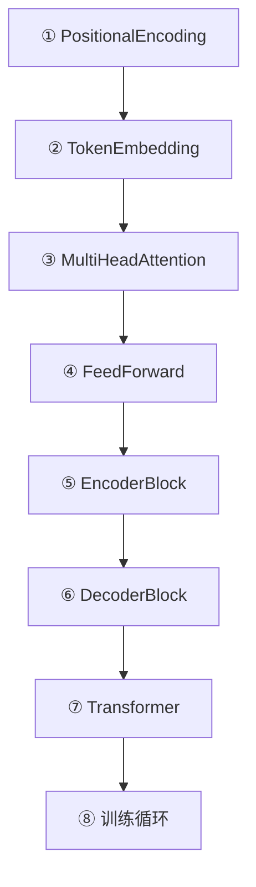

---
title: Transformer 代码实现
published: 2026-04-22
description: 从零用 PyTorch 实现完整的 Transformer 模型
tags: [Transformer, PyTorch, 代码实现, 从零实现]
category: Transformer
draft: false
---

# Transformer 代码实现

> 本篇从零实现一个完整的 Transformer，涵盖前四章的所有组件。每个模块都配有注释，对应前文讲解的概念。

## 1. 实现路线图



---

## 2. 完整代码

```python
import subprocess
subprocess.check_call(["pip", "install", "torch", "numpy"])

import torch
import torch.nn as nn
import torch.nn.functional as F
import numpy as np
import math

# ============================================================
# ① 位置编码 (对应 02_位置编码.md)
# ============================================================
class PositionalEncoding(nn.Module):
    """正弦位置编码，注入序列顺序信息"""

    def __init__(self, d_model, max_len=5000, dropout=0.1):
        super().__init__()
        self.dropout = nn.Dropout(dropout)

        pe = torch.zeros(max_len, d_model)             # (max_len, d_model)
        position = torch.arange(max_len).unsqueeze(1).float()  # (max_len, 1)
        # div_term: 10000^(2i/d_model)，用 exp+log 计算避免大数
        div_term = torch.exp(
            torch.arange(0, d_model, 2).float() * (-math.log(10000.0) / d_model)
        )
        pe[:, 0::2] = torch.sin(position * div_term)   # 偶数维度
        pe[:, 1::2] = torch.cos(position * div_term)   # 奇数维度
        pe = pe.unsqueeze(0)                            # (1, max_len, d_model)
        self.register_buffer('pe', pe)                  # 不参与梯度更新

    def forward(self, x):
        # x: (batch, seq_len, d_model)
        x = x + self.pe[:, :x.size(1)]
        return self.dropout(x)


# ============================================================
# ② Token Embedding (对应 01_Token Embedding.md)
# ============================================================
class TokenEmbedding(nn.Module):
    """Token Embedding + 缩放"""

    def __init__(self, vocab_size, d_model):
        super().__init__()
        self.embedding = nn.Embedding(vocab_size, d_model)
        self.d_model = d_model

    def forward(self, x):
        # 乘以 sqrt(d_model) 防止位置编码淹没语义信息
        return self.embedding(x) * math.sqrt(self.d_model)


# ============================================================
# ③ 多头注意力 (对应 03_多头注意力.md)
# ============================================================
class MultiHeadAttention(nn.Module):
    """Multi-Head Attention: 从多个角度并行关注"""

    def __init__(self, d_model, n_heads, dropout=0.1):
        super().__init__()
        assert d_model % n_heads == 0, "d_model 必须能被 n_heads 整除"

        self.d_model = d_model
        self.n_heads = n_heads
        self.d_k = d_model // n_heads  # 每个头的维度

        # 一次性投影 Q, K, V（高效实现）
        self.W_Q = nn.Linear(d_model, d_model)
        self.W_K = nn.Linear(d_model, d_model)
        self.W_V = nn.Linear(d_model, d_model)
        self.W_O = nn.Linear(d_model, d_model)  # 输出投影

        self.dropout = nn.Dropout(dropout)

    def forward(self, Q, K, V, mask=None):
        batch_size = Q.size(0)

        # 线性投影后拆分成多头: (batch, seq, d_model) → (batch, n_heads, seq, d_k)
        Q = self.W_Q(Q).view(batch_size, -1, self.n_heads, self.d_k).transpose(1, 2)
        K = self.W_K(K).view(batch_size, -1, self.n_heads, self.d_k).transpose(1, 2)
        V = self.W_V(V).view(batch_size, -1, self.n_heads, self.d_k).transpose(1, 2)

        # Scaled Dot-Product Attention
        scores = torch.matmul(Q, K.transpose(-2, -1)) / math.sqrt(self.d_k)

        if mask is not None:
            scores = scores.masked_fill(mask == 0, -1e9)

        attn_weights = self.dropout(F.softmax(scores, dim=-1))
        attn_output = torch.matmul(attn_weights, V)

        # 拼接所有头: (batch, n_heads, seq, d_k) → (batch, seq, d_model)
        attn_output = attn_output.transpose(1, 2).contiguous().view(
            batch_size, -1, self.d_model
        )
        return self.W_O(attn_output)


# ============================================================
# ④ 前馈网络 (对应 01_Encoder Block.md §4)
# ============================================================
class FeedForward(nn.Module):
    """Position-wise Feed-Forward Network: 升维 → 激活 → 降维"""

    def __init__(self, d_model, d_ff, dropout=0.1):
        super().__init__()
        self.fc1 = nn.Linear(d_model, d_ff)
        self.fc2 = nn.Linear(d_ff, d_model)
        self.dropout = nn.Dropout(dropout)

    def forward(self, x):
        return self.fc2(self.dropout(F.relu(self.fc1(x))))


# ============================================================
# ⑤ Encoder Block (对应 01_Encoder Block.md)
# ============================================================
class EncoderBlock(nn.Module):
    """编码器块: Self-Attention → Add&Norm → FFN → Add&Norm"""

    def __init__(self, d_model, n_heads, d_ff, dropout=0.1):
        super().__init__()
        self.self_attn = MultiHeadAttention(d_model, n_heads, dropout)
        self.ffn = FeedForward(d_model, d_ff, dropout)
        self.norm1 = nn.LayerNorm(d_model)
        self.norm2 = nn.LayerNorm(d_model)
        self.dropout1 = nn.Dropout(dropout)
        self.dropout2 = nn.Dropout(dropout)

    def forward(self, x, src_mask=None):
        # 子层 1: 多头自注意力 + 残差 + LayerNorm
        attn_out = self.self_attn(x, x, x, src_mask)
        x = self.norm1(x + self.dropout1(attn_out))
        # 子层 2: FFN + 残差 + LayerNorm
        ffn_out = self.ffn(x)
        x = self.norm2(x + self.dropout2(ffn_out))
        return x


# ============================================================
# ⑥ Decoder Block (对应 02_Masked Self Attention.md)
# ============================================================
class DecoderBlock(nn.Module):
    """解码器块: Masked Self-Attn → Cross-Attn → FFN，各带残差+Norm"""

    def __init__(self, d_model, n_heads, d_ff, dropout=0.1):
        super().__init__()
        self.masked_attn = MultiHeadAttention(d_model, n_heads, dropout)
        self.cross_attn = MultiHeadAttention(d_model, n_heads, dropout)
        self.ffn = FeedForward(d_model, d_ff, dropout)
        self.norm1 = nn.LayerNorm(d_model)
        self.norm2 = nn.LayerNorm(d_model)
        self.norm3 = nn.LayerNorm(d_model)
        self.dropout1 = nn.Dropout(dropout)
        self.dropout2 = nn.Dropout(dropout)
        self.dropout3 = nn.Dropout(dropout)

    def forward(self, x, enc_output, tgt_mask=None, src_mask=None):
        # 子层 1: Masked Self-Attention（因果掩码，防止看到未来）
        attn_out = self.masked_attn(x, x, x, tgt_mask)
        x = self.norm1(x + self.dropout1(attn_out))
        # 子层 2: Cross-Attention（Q 来自解码器，K/V 来自编码器）
        cross_out = self.cross_attn(x, enc_output, enc_output, src_mask)
        x = self.norm2(x + self.dropout2(cross_out))
        # 子层 3: FFN
        ffn_out = self.ffn(x)
        x = self.norm3(x + self.dropout3(ffn_out))
        return x


# ============================================================
# ⑦ 完整 Transformer (对应 02_Transformer整体架构.md)
# ============================================================
class Transformer(nn.Module):
    """完整的 Encoder-Decoder Transformer"""

    def __init__(self, src_vocab, tgt_vocab, d_model=512, n_heads=8,
                 n_layers=6, d_ff=2048, max_len=5000, dropout=0.1):
        super().__init__()

        # Embedding + 位置编码
        self.src_embed = TokenEmbedding(src_vocab, d_model)
        self.tgt_embed = TokenEmbedding(tgt_vocab, d_model)
        self.pos_enc = PositionalEncoding(d_model, max_len, dropout)

        # 编码器和解码器堆叠 N 层
        self.encoder_layers = nn.ModuleList([
            EncoderBlock(d_model, n_heads, d_ff, dropout) for _ in range(n_layers)
        ])
        self.decoder_layers = nn.ModuleList([
            DecoderBlock(d_model, n_heads, d_ff, dropout) for _ in range(n_layers)
        ])

        # 输出投影层 (对应 03_终端输出.md)
        self.output_proj = nn.Linear(d_model, tgt_vocab)

    def encode(self, src, src_mask=None):
        """编码器前向传播"""
        x = self.pos_enc(self.src_embed(src))
        for layer in self.encoder_layers:
            x = layer(x, src_mask)
        return x

    def decode(self, tgt, enc_output, tgt_mask=None, src_mask=None):
        """解码器前向传播"""
        x = self.pos_enc(self.tgt_embed(tgt))
        for layer in self.decoder_layers:
            x = layer(x, enc_output, tgt_mask, src_mask)
        return x

    def forward(self, src, tgt, src_mask=None, tgt_mask=None):
        enc_output = self.encode(src, src_mask)
        dec_output = self.decode(tgt, enc_output, tgt_mask, src_mask)
        logits = self.output_proj(dec_output)  # (batch, tgt_len, tgt_vocab)
        return logits


# ============================================================
# 工具函数：生成掩码
# ============================================================
def generate_causal_mask(size):
    """生成因果掩码（下三角矩阵）"""
    mask = torch.tril(torch.ones(size, size)).unsqueeze(0).unsqueeze(0)
    return mask  # (1, 1, size, size)


# ============================================================
# ⑧ 测试：前向传播验证
# ============================================================
if __name__ == "__main__":
    # 超参数（缩小版，方便测试）
    src_vocab = 1000
    tgt_vocab = 1000
    d_model = 64
    n_heads = 4
    n_layers = 2
    d_ff = 256
    batch_size = 2
    src_len = 10
    tgt_len = 8

    # 创建模型
    model = Transformer(src_vocab, tgt_vocab, d_model, n_heads, n_layers, d_ff)

    # 随机输入
    src = torch.randint(0, src_vocab, (batch_size, src_len))
    tgt = torch.randint(0, tgt_vocab, (batch_size, tgt_len))
    tgt_mask = generate_causal_mask(tgt_len)

    # 前向传播
    logits = model(src, tgt, tgt_mask=tgt_mask)

    print(f"源序列形状:   {src.shape}")      # (2, 10)
    print(f"目标序列形状: {tgt.shape}")       # (2, 8)
    print(f"输出 logits:  {logits.shape}")   # (2, 8, 1000)
    print(f"模型参数量:   {sum(p.numel() for p in model.parameters()):,}")

    # 验证输出是有效的概率分布
    probs = F.softmax(logits[0, 0], dim=-1)
    print(f"\n第一个样本第一个位置的概率和: {probs.sum().item():.4f}")
    print(f"Top-5 预测: {torch.topk(probs, 5).indices.tolist()}")
```

---

## 3. 代码结构与前文对应

```
Transformer
├── TokenEmbedding        ← 02 章 01_Token Embedding.md
├── PositionalEncoding     ← 02 章 02_位置编码.md
├── EncoderBlock ×N
│   ├── MultiHeadAttention ← 03 章 03_多头注意力.md
│   │   └── ScaledDotProduct ← 03 章 02_Self Attention计算.md
│   ├── Add & LayerNorm    ← 04 章 01_Encoder Block.md §2-3
│   └── FeedForward        ← 04 章 01_Encoder Block.md §4
├── DecoderBlock ×N
│   ├── Masked MHA         ← 04 章 02_Masked Self Attention.md
│   ├── Cross MHA          ← 04 章 02_Masked Self Attention.md §4
│   ├── Add & LayerNorm
│   └── FeedForward
└── output_proj (Linear)   ← 04 章 03_终端输出.md
```

---

## 4. 训练循环示例

```python
# 接上面的代码，展示训练循环核心逻辑（伪代码）

# 优化器 + 损失函数
optimizer = torch.optim.Adam(model.parameters(), lr=1e-4, betas=(0.9, 0.98), eps=1e-9)
criterion = nn.CrossEntropyLoss(ignore_index=0, label_smoothing=0.1)

# 单步训练
model.train()
optimizer.zero_grad()

# 前向传播
logits = model(src, tgt[:, :-1], tgt_mask=generate_causal_mask(tgt_len - 1))
# logits: (batch, tgt_len-1, vocab_size)

# 计算损失（展平后计算交叉熵）
target = tgt[:, 1:]  # 右移一位作为目标
loss = criterion(logits.reshape(-1, tgt_vocab), target.reshape(-1))

# 反向传播
loss.backward()

# 梯度裁剪
torch.nn.utils.clip_grad_norm_(model.parameters(), max_norm=1.0)

# 参数更新
optimizer.step()

print(f"Loss: {loss.item():.4f}")
```

> [!tip] 从这个基础出发
> 这份代码是"教学版"——结构清晰但未做工程优化。实际生产中还需要：
> - **Flash Attention**：融合 kernel，显存和速度大幅优化
> - **混合精度训练** (FP16/BF16)：减少显存，加速计算
> - **分布式训练** (DDP/FSDP)：多卡/多机并行
> - **KV Cache**：推理时缓存已计算的 K/V，避免重复计算

## 相关笔记

- [Transformer 总结与训练](./01_Transformer总结与训练.md) — 上一篇：训练策略与技巧
- [Transformer 整体架构](../01_Foundation/02_Transformer整体架构.md) — 回顾：架构全局图

